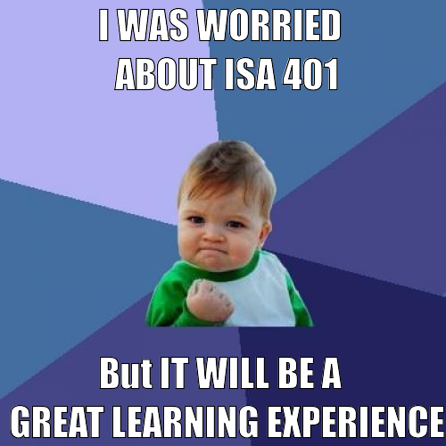
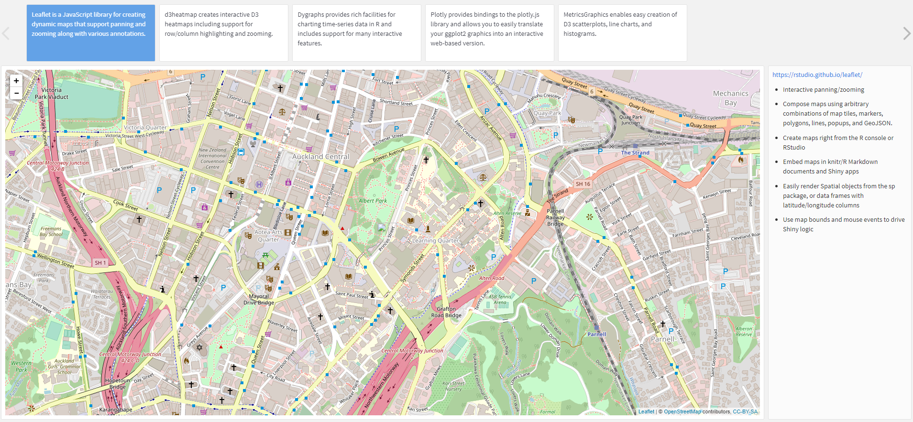
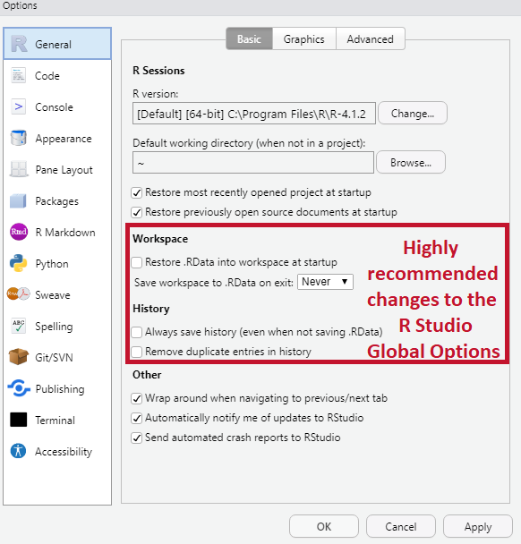
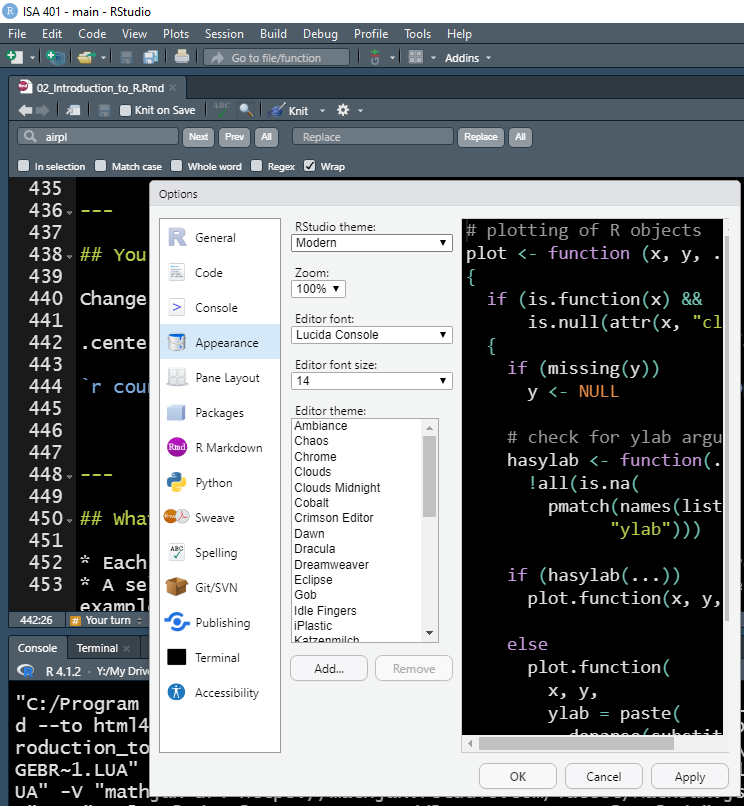
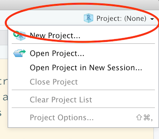
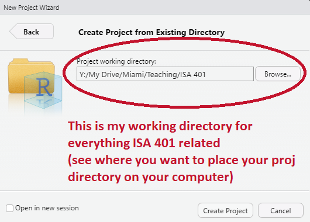
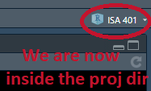
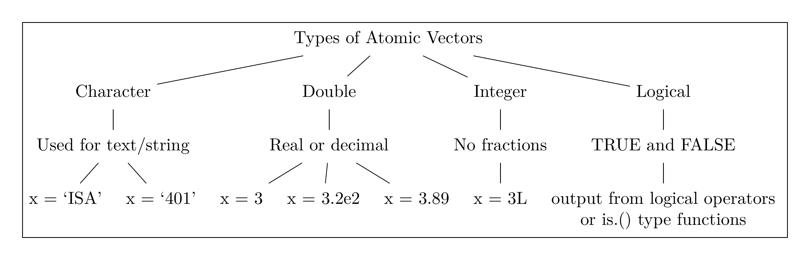
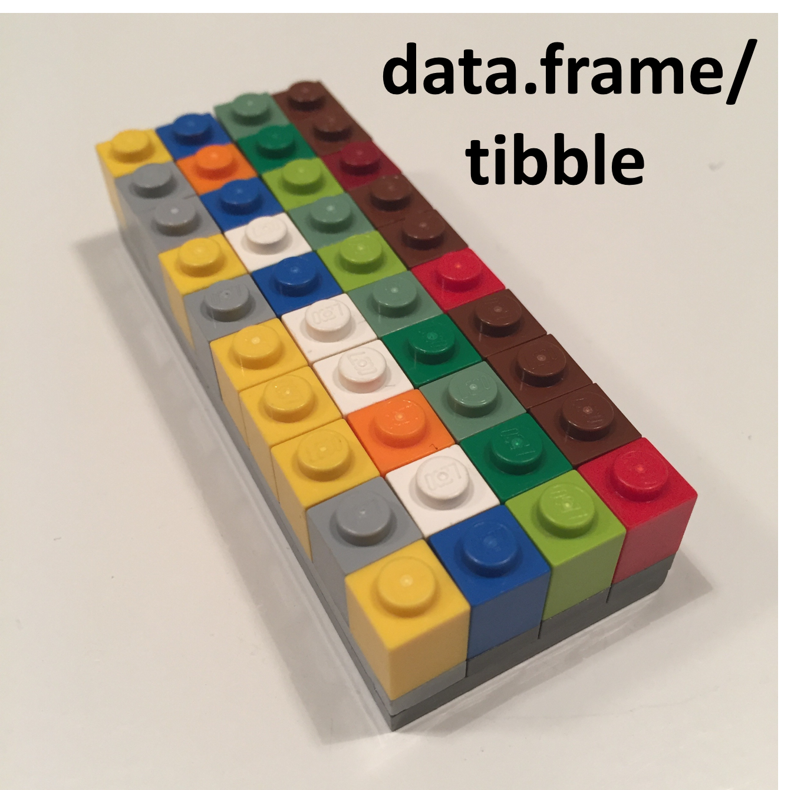

```{r setup, include=FALSE}
knitr::opts_chunk$set(cache = TRUE,
                      echo = TRUE,
                      warning = FALSE,
                      message = FALSE,
                      progress = FALSE, 
                      verbose = FALSE,
                      dev = 'png',
                      fig.height = 2.5,
                      dpi = 300,
                      fig.align = 'center')

options(htmltools.dir.version = FALSE)

miamired = '#C3142D'

if(require(pacman)==FALSE) install.packages("pacman")
if(require(devtools)==FALSE) install.packages("devtools")
if(require(countdown)==FALSE) devtools::install_github("gadenbuie/countdown")
if(require(xaringanExtra)==FALSE) devtools::install_github("gadenbuie/xaringanExtra")
if(require(urbnmapr)==FALSE) devtools::install_github('UrbanInstitute/urbnmapr')
if(require(memer)==FALSE) devtools::install_github("sctyner/memer")

pacman::p_load(tidyverse, magrittr, lubridate, janitor, # data analysis pkgs
               memer, # memes
               scales, # for the comma function
               gifski, av, # for animations
               fontawesome, RefManageR, xaringanExtra, countdown) # for slides

BibOptions(check.entries = FALSE, bib.style = "authoryear", 
           style = "markdown", dashed = TRUE)

bib = ReadBib("refs.bib") 
```

```{r xaringan-themer, include=FALSE, warning=FALSE}
if(require(xaringanthemer) == FALSE) install.packages("xaringanthemer")
library(xaringanthemer)

style_mono_accent(base_color = "#84d6d3",
                  base_font_size = "20px")

xaringanExtra::use_xaringan_extra(c("tile_view", "animate_css", "tachyons", "panelset", "broadcast", "share_again", "search", "fit_screen", "editable", 
                                    "clipable"))

```


# Quick Refresher from Last Class

`r emo::ji("check")` Describe course objectives & structure  

`r emo::ji("check")` Define data visualization & describe its main goals  

`r emo::ji("x")` Describe the BI methodology and major concepts  


---


# Learning Objectives for Today's Class

- Describe why we are using `r fa(name = "r-project")` in this course?  

- Understand the syntax, data structures and functions. 

- Utilize the project workflow in `r fa(name = "r-project")` and create your first R script. 


---
class: inverse, center, middle

# `r fontawesome::fa("r-project")`


---

# Pedagogy Behind Using `r fontawesome::fa("r-project")` in this Course [1]

```{r prog_lang, eval=FALSE}
crashes = 
  # reading the data directly from the source
  read_csv("https://data.cincinnati-oh.gov/api/views/rvmt-pkmq/rows.csv?accessType=DOWNLOAD") %>% 
  # changing all variable names to snake_case
  clean_names() %>% 
  # selecting variables of interest
  select(address_x, latitude_x, longitude_x, cpd_neighborhood, datecrashreported, instanceid, typeofperson, weather) %>%
  # engineering some features from the data
  mutate(
    datetime = parse_date_time(datecrashreported, orders = "'%m/%d/%Y %I:%M:%S %p", tz =  'America/New_York'),
    hour = hour(datetime),
    date = as_date(datetime)   )
```

### The Beauty of Programming Languages 

- Programming languages are **languages**.  

- **It's just text** -- which gives you access to **two extremely powerful techniques**!!!  

.footnote[
<html>
<hr>
</html> 

**Source:** Content in "The Beauty of Programming Languages" is from [Hadley Wickham's You Can't Do Data Science in a GUI](https://speakerdeck.com/hadley/you-cant-do-data-science-in-a-gui?slide=14)
]


---

# Pedagogy Behind Using `r fontawesome::fa("r-project")` in this Course [2]


### The Beauty of Programming Languages (Continued)

- .large[`Ctrl` + `C` `r fontawesome::fa("copy", fill = miamired)`] 

- .large[`Ctrl` + `V`] `r fontawesome::fa("paste", fill = miamired)`

- In addition, programming languages are generally  

  + Readable (IMO way easier than trying to figure what someone did in an `r fontawesome::fa("file-excel", fill = 'green')`)  
  
  + Open (so you can `r fontawesome::fa("google", fill = miamired)` it)  
  
  + Reusable and reproducible (so you can reuse your code for similar problems and other people can get the same results as you easily)  
  
  + Diffable (version control is extremely powerful)  
  
.footnote[
<html>
<hr>
</html> 

**Source:** The bullets in "The Beauty of Programming Languages" are based on [Hadley Wickham's You Can't Do Data Science in a GUI](https://speakerdeck.com/hadley/you-cant-do-data-science-in-a-gui?slide=17)
]


---

# Pedagogy Behind Using `r fontawesome::fa("r-project")` in this Course [3]

### Why `r fontawesome::fa("r-project")` Specifically?

- It is a general-purpose programming language, which originated for statistical analysis.  

- As of `r Sys.Date() %>% format(format = '%b %d, %Y')`, there are `r available.packages() %>% nrow() %>% comma()` packages on [CRAN](https://cran.r-project.org/) (not including those on `r fontawesome::fa("github")`).   

- The `tidyverse` group of packages have simplified the workflow for data analytics/science.   

---


.left-column[
## What `r fontawesome::fa("r-project")` can do?
### **fun stuff**
]
.right-column[
### `r emo::ji("package")` {memer} for generating memes in `r fontawesome::fa("r-project")`
```{r memer1, eval=FALSE}
meme_get("SuccessKid") %>% 
  meme_text_top("I WAS WORRIED \n ABOUT ISA 401") %>% 
  meme_text_bottom("But IT WILL BE A \n GREAT LEARNING EXPERIENCE")
```
]

```{r memer2, echo=FALSE, out.width='37%'}

```


---

.left-column[
## What `r fontawesome::fa("r-project")` can do?
### **data analytics**
]
.right-column[
### `r emo::ji("package")` {tidyverse} for simplying the analytics workflow

.center[

[](https://tidyverse.org)
<i class="fas fa-equals"></i>
[](https://readr.tidyverse.org)
[](https://tidyr.tidyverse.org)
[](https://dplyr.tidyverse.org)
[](https://ggplot2.tidyverse.org)
[](https://purrr.tidyverse.org)
]

]

.footnote[
<html>
<hr>
</html> 

**Source:** Slide is based on [Earo Wang's STAT 220 Slides](https://stats220.earo.me/01-intro.html#12)
]


---

.left-column[
## What `r fontawesome::fa("r-project")` can do?
### **communication**
]
.right-column[
### R Markdown

.center[
[](https://rmarkdown.rstudio.com)
[](https://bookdown.org/yihui/blogdown/)
[](http://bookdown.org)
[](http://slides.yihui.org/xaringan/)
]

* [{rmarkdown}](https://rmarkdown.rstudio.com) for reproducible analysis (e.g., see [Analysis of COVID-19 Cases](https://fmegahed.github.io/covid_analysis_final.html), [Fatigue Analysis](https://fmegahed.github.io/fatigue_case_jqt.html), and [ISA Overview](https://fmegahed.github.io/isa_overview.html))
* [{blogdown}](https://bookdown.org/yihui/blogdown/) for blogs
* [{bookdown}](http://bookdown.org) for books
* [{xaringan}](http://slides.yihui.org/xaringan/) for slides (401 slides!)

<hr>

**R Markdown documents are fully reproducible: weaving narrative text and code together.**
]

.footnote[
<html>
<hr>
</html> 

**Source:** Slide based on [Earo Wang's STAT 220 Slides](https://stats220.earo.me/01-intro.html#13)
]

???

* Rmd ecosystem
* will boost your productivity

---

.left-column[
## What `r fontawesome::fa("r-project")` can do?
### **communication**
]
.right-column[
### `r emo::ji("package")` {flexdashboard} for creating Quick Dashboards

* [flexdashboard](https://pkgs.rstudio.com/flexdashboard/) is an `r fontawesome::fa("r-project")` package that makes it easy to build interactive web apps straight from R Markdown.

.center[
[](https://beta.rstudioconnect.com/jjallaire/htmlwidgets-showcase-storyboard/htmlwidgets-showcase-storyboard.html)
]
]


---

# How to Learn `r fontawesome::fa("r-project")` (Any Programming Language)

<html>
<center>
<iframe src="https://giphy.com/embed/xonOzxf2M8hNu" width="480" height="270" frameBorder="0" class="giphy-embed" allowFullScreen></iframe><p>
</center>
</html>

* `r emo::ji("speaking_head")` **Get hands dirty**`r emo::ji("bangbang")`  

* `r emo::ji("open_book")` Documentation! Documentation! Documentation!  

* `r emo::ji("search")` (Not surprisingly) Learn to Google: what that error message means (I `r fontawesome::fa("google")` a lot `r emo::ji("laugh")`)

.footnote[
<html>

<hr>

</html>

**Source:** Slide is based on [Kia Ora's How I Learn a Technology](https://stats220.earo.me/01-intro.html#7).
]

---

class: inverse center middle

# The RStudio Interface, Setup and a Project-Oriented Workflow for your Analysis

---


> .font150[If R were an airplane, RStudio would be the airport, providing many, many supporting services that make it easier for you, the pilot, to take off and go to awesome places. Sure, you can fly an airplane without an airport, but having those runways and supporting infrastructure is a game-changer.] <br> -- [Julie Lowndes](http://jules32.github.io/resources/RStudio_intro/)

???

Hope you've downloaded r and rstudio

---

## RStudio interface

.center[]

.footnote[
<html>
<hr>
</html>
image credit: Stuart Lee]

???

live

---

## Setting up RStudio (do this once)

.pull-left[
Go to **Tools** > **Global Options**:
.center[]
]
.pull-right[
<br>
<br>
<br>
<br>
Uncheck `Workspace` and `History`, which helps to keep `r fontawesome::fa("r-project")` working environment fresh and clean every time you switch between projects.
]

---

# Your Turn

> Over the next 2 minutes, change the RStudio appearance up to your taste

.center[]

`r countdown(minutes = 2, seconds = 0, top = 0, font_size = "2em")`


---

## What is a project?

* Each university course is a project, and get your work organised.
* A self-contained project is a folder that contains all relevant files, for example my `ISA 401/` `r emo::ji("folder")` includes:
   + `Spring2022.Rproj`
   + `Lectures/`  
     +  `01_Introduction/`  
          *  `01-introduction.Rmd`, `figures/`, `data/`, etc.   
     +  `02_Introduction_to_R/`  
          *  `01-Introduction_to_R.Rmd`, `figures/`, `data/`, etc. 
* All working files are **relative** to the **project root** (i.e. `isa401/`).
* The project should just work on a different computer.

---

## `r emo::ji("stop_sign")` STOP DOING THIS!

If this is not your first `fontawesome::fa("r-proj")`, you have probably seen some variation of the following as your first couple of lines in a `fontawesome::fa("r-proj")` script file: 

```{r jenny, eval=FALSE}
setwd("C:\Users\jenny\path\that\only\I\have")
rm(list = ls())
```

[Jenny Bryan](https://jennybryan.org) (an RStudio software engineer and a highly respected `#rstats` developer ) will [set your computer on fire `r emo::ji("fire")`](https://www.tidyverse.org/blog/2017/12/workflow-vs-script/) if you have these lines in your script file.

<br>

--

**Main reason:** .black[.bold[If you are using an .Rproj and did setup the global options as illustrated earlier, you no longer need these steps for any of your code (as long as you see the project icon on the top-right of your screen).]]  

<br> 

.black[.bold[For a more detailed discussion, please read her blog post on [workflow vs script](https://www.tidyverse.org/blog/2017/12/workflow-vs-script/).]] 


---

## Create an RStudio project `.Rproj` for Our Course

`r countdown(minutes = 2, seconds = 0, top = 0, font_size = "2em")`

.pull-left-2[
1. Click the **Project** icon on the top right corner 
<br>
<br>
<br>
<br>
2. **New Directory**/**Existing Directory** > **New Project** > **Create Project**
<br>
<br>
<br>
3. Open the project
]
.pull-right-2[
.center[]
.center[]
.center[]
]


---
class: inverse, center, middle

# `r fontawesome::fa("r-project")` 101: Operators


---

# Assignment

`r fontawesome::fa("r-project")` has three assignment operators: <-, =, and ->,  which can be used as follows.  

```{r assignment_operators}
x1 <- 5

x2 = 5

5 -> x3

print(paste0("The values of x1, x2, and x3 are ", x1, ", ", x2, ", and ", x3, " respectively"))
```

The operator <- can be written using the shortcut `Alt` + `-` on a Windows machine. If we focus on the first two operators, you would notice that the assignment consists of three parts:  

  - The left-hand side: **variable names** (`x1` or `x2`), 
  - The assignment operator: `<-` (or alternatively `=`), and 
  - The right-hand side: **values** (``r x1``)


---

# Retrieval 

We can retrieve/call the object using its name as follows:
```{r ret1}
x1

x3
```


---

# Retrieval: Three Common Errors

**Case issue:** object names in `r fontawesome::fa("r-project")` are **case sensitive**. 
```{r ret2, error=TRUE, message=TRUE, warning=TRUE}
X1 # should be x1 instead of X1 (see last slide)
```

--

**Typo:** A spelling error of some sort
```{r ret3, error=TRUE, message=TRUE, warning=TRUE}
y3 # should be x3 instead of y3 (see last slide)
```

--

**Object not saved:** e.g., you clicked **Enter** instead of **Ctrl + Enter** when running your code
```{r ret4, error=TRUE, message=TRUE, warning=TRUE}
rm(x2) # removing x2 from the global environment to mimic error
x2 # x2 is not in the global environment (see environment)
```


---

# Arthimetic Operators

While we will not specifically talk about doing math in R, the operators below are good to know.

```{r a_operators, echo=FALSE}
pacman::p_load(rvest)
web <- "https://www.statmethods.net/management/operators.html"
web %>%  read_html() %>% html_nodes("table") %>%
  .[[1]] %>% html_table(header = TRUE) -> math_table

math_table %>% knitr::kable()

```

.footnote[
<html>
<hr>
</html>
**Source:** The above table is scraped from [Quick-R: Operators](https://www.statmethods.net/management/operators.html).
]


---

# Logical Operators

Logical operators are operators that return `TRUE` and `FALSE` values.

```{r l_operators, echo=FALSE}
web %>%  read_html() %>% html_nodes("table") %>%
  .[[2]] %>% html_table(header = TRUE) -> logical_table

logical_table %>% knitr::kable()

```

.footnote[
<html>
<hr>
</html>
**Source:** The above table is also scraped from [Quick-R: Operators](https://www.statmethods.net/management/operators.html).
]


---
class: inverse, center, middle

# `r fontawesome::fa("r-project")` 101: Syntax, Data Types, Data Structures and Functions

---

# Coding Style

> .font150[Good coding style is like correct punctuation: you can manage without it, butitsuremakesthingseasiertoread.
 <br> -- [The tidyverse style guide](https://style.tidyverse.org)]

### `r fontawesome::fa("r-project")` style guide

.pull-left[
 `r emo::ji("check")` `snake_case`

]
.pull-right[
`r emo::ji("x")` `camelCase` (Javascript)

`r emo::ji("x")` `PascalCase` (Python)
]


.footnote[
<html>
<hr>
</html> 

**Source:** Slide is based on [Earo Wang's STAT 220 Slides](https://stats220.earo.me/01-intro.html#34)
]

---

# `r fontawesome::fa("r-project")` is a Vector Language: Sample Output

Learning from a **sample of ten obs. from the standard normal distribution** (i.e., $x \sim \mathcal{N}(0, \, 1)$)
```{r vec_lang1}
x_vec = rnorm(n=10, mean = 0, sd = 1) # generating std normal dist data

x_vec > 0 # finding which elements in x are larger than 0

sum(x_vec > 0) # summing the number of elements (i.e., how many are > 0)
```

--

If we focus on the obtained outputs, we can see that **both** are vectors:  
  - `x_vec > 0` returns a vector of size 10 (TRUE/FALSE for each element)  
  - `sum(x_vec > 0)` returns a vector of size 1

**There are no scalars in R `r emo::ji('shocked')`!!!**


---

# `r fontawesome::fa("r-project")` is a Vector Language: Types and Attributes

.pull-left[
- **Vectors** come in **two flavors**, which differ by their **elements' types:** 
    * **atomic vectors --** all elements **must have the same type** 
    * **lists --** elements **can** be different
- Vector have two important **attributes:**  
  * **Dimension** turns vectors into matrices and arrays, checked using `dim(object_name)`. 
  * The **class** attribute powers the S3 object system, checked using `class(object_name)`.
]


.pull-right[
.center[]

```{r attributes}
class(x_vec)
```
]

.footnote[
<html>
<hr>
</html>
**Source:** The content and image are from [Hadley Wickham's Advanced R: Chapter 3 on Vectors](https://adv-r.hadley.nz/vectors-chap.html)
]

---

# `r fontawesome::fa("r-project")` is a Vector Language: Atomic Vectors


.pull-left[
.center[]
]

.pull-right[
```{r dim_x}
dim(x_vec) 
```

**Atomic vectors have a dim of NULL, which distinguishes it from 1D arrays `r emo::ji('shocked')`!!!**
]

.footnote[
<html>
<hr>
</html>
**Source:** The image is from [Hadley Wickham's Advanced R: Chapter 3 on Vectors](https://adv-r.hadley.nz/vectors-chap.html)
]


---

# Data Types: A Visual Introduction [1]

.center[]

- To check the **type of** an object in `r fontawesome::fa("r-project")`, you can use the function `typeof`:

```{r type_of}
typeof(x_vec)
```

.footnote[
<html>
<hr>
</html>
**Source:** The image is from [Hadley Wickham's Advanced R: Chapter 3 on Vectors](https://adv-r.hadley.nz/vectors-chap.html)
]

---

# Data Types: A Visual Introduction [2]

```{r run_latex_file, echo=FALSE, cache=TRUE, results='hide'}
tinytex::xelatex('figures/four_popular_data_types.tex')
pdftools::pdf_convert('figures/four_popular_data_types.pdf', dpi = 600,
                      filenames = 'figures/four_popular_data_types.png')
```

```{r read_types_chart, echo=FALSE, out.width='100%', fig.alt="The four data types that we will utilize the most in our course.", fig.align='center', fig.cap='The four data types that we will utilize the most in our course.'}

```

---

# Data Types: A Visual Introduction [3]

```{r legos_viz, fig.align='center', out.width='100%', fig.cap='A visual representation of different types of atomic vectors', fig.alt='A visual representation of different types of atomic vectors', echo=FALSE}

knitr::include_graphics('figures/legos-jbryan-types.png')

```


.footnote[
<html>
<hr>
</html>
**Source:** The images are from the excellent [lego-rstats GitHub Repository by Jenny Bryan](https://github.com/jennybc/lego-rstats#readme)
]


---

# Data Types: Formal Definitions

Each of the four primary types has a special syntax to create an individual value:

- Logicals can be written in full (`TRUE` or `FALSE`), or abbreviated (`T` or `F`).

- Doubles can be specified in decimal (`0.1234`), scientific (`1.23e4`), or hexadecimal (`0xcafe`) form.   
    * There are three special values unique to doubles: `Inf`, `-Inf`, and `NaN` (not a number).   
    * These are special values defined by the floating point standard.

- Integers are written similarly to doubles but must be followed by `L`(`1234L`, `1e4L`, or `0xcafeL`), and can not contain fractional values.  

- Strings are surrounded by `"` (e.g., `"hi"`) or `'` (e.g., `'bye'`). Special characters are escaped with `\` see `?Quotes` for full details.

.footnote[
<html>
<hr>
</html>
**Source:** The content of this slide is verbatim from [Hadley Wickham's Advanced R: Chapter 3 on Vectors](https://adv-r.hadley.nz/vectors-chap.html#scalars)
]


---

# Data Structures: Atomic Vector (1D)

```{r legos_viz2, fig.align='center', out.width='100%', fig.cap='Keeping the  visual representation of different types of atomic vectors in your head!!', fig.alt='A visual representation of different types of atomic vectors', echo=FALSE}

knitr::include_graphics('figures/legos-jbryan-types.png')

```

```{r atomic_departments}
dept = c('ACC', 'ECO', 'FIN', 'ISA', 'MGMT')
nfaculty = c(18L, 19L, 14L, 25L, 22L)

```


.footnote[
<html>
<hr>
</html>
**Source:** The images are from the excellent [lego-rstats GitHub Repository by Jenny Bryan](https://github.com/jennybc/lego-rstats#readme)
]


---

# Data Structures: 1D `r emo::ji("arrow_right")` 2D [Visually]


.center[]

.footnote[
<html>
<hr>
</html>
**Source:** The images are from the excellent [lego-rstats GitHub Repository by Jenny Bryan](https://github.com/jennybc/lego-rstats#readme)  
]


---

# Data Structures: 1D `r emo::ji("arrow_right")` 2D [In Code]

```{r tibbles}
library(tibble)

fsb_tbl <- tibble(
  department = dept, 
  count = nfaculty, 
  percentage = count / sum(count))
fsb_tbl
```


---


# Data Structures: Lists [1]

An object contains elements of **different data types**.

.center[]

.footnote[
<html>
<hr>
</html>
**Source:** The image is adapted from the excellent [lego-rstats GitHub Repository by Jenny Bryan](https://github.com/jennybc/lego-rstats/blob/master/lego-rstats_014.jpg)
]

---

# Data Structures: Lists [2]

.center[]

```{r list1a, results='hide'}
lst <- list( # list constructor/creator
  1:3, # atomic double/numeric vector  of length = 3 #<< 
  "a", # atomic character vector of length = 1 (aka scalar) #<< 
  c(TRUE, FALSE, TRUE), # atomic logical vector of length = 3 #<< 
  c(2.3, 5.9) # atomic double/numeric vector of length =3 #<< 
)
lst # printing the list
```

```{r list1b, echo=FALSE}
paste(lst, sep = "\n")
```

.footnote[
<html>
<hr>
</html>
**Source:** Image is from [Hadley Wickham's Advanced R: Chapter 3 on Vectors](https://adv-r.hadley.nz/vectors-chap.html#lists)
]


---

# Data Structures: Lists [3]

.pull-left[
### data type
```{r lists-type}
typeof(lst) # primitive type
```
### data class
```{r lists-cls}
class(lst) # type + attributes
```
]
.pull-right[
### data structure
```{r lists-str, results='hold'}
str(lst)
# sublists can be of diff lengths and types
```
]


.footnote[
<html>
<hr>
</html> 

**Source:** Slide is based on [Earo Wang's STAT 220 Slides](https://stats220.earo.me/02-import-export.html#6).
]


---

# Data Structures: Lists [3]

A list can contain other lists, i.e. **recursive**

```{r rec_list}
# a named list
str(
  list(first_el = lst, second_el = iris) #<<
  )
```


---

# Data Structures: Lists [4]

.pull-left[
Subset by `[]`
```{r lst-sub}
lst[1]
```
]
.pull-right[
Subset by `[[]]`
```{r lst-sub2}
lst[[1]]
```
]

.center[]

.footnote[
<html>
<hr>
</html>
**Sources:** The slide is based on [Earo Wang's STAT 220 slides](https://stats220.earo.me/02-import-export.html#10) and image is from [Hadley Wickham's Tweet on Indexing lists in R](https://twitter.com/hadleywickham/status/643381054758363136?lang=en).
]


---

# Data Structures: Matrices

A matrix is a **2D data structure** made of **one/homogeneous data type.**


.pull-left[
### A 2 $\times$ 2 numeric matrix
```{r num_matrix1}
x_mat = matrix( sample(1:10, size = 4), nrow = 2, ncol = 2 ) 
str(x_mat) # its structure?
```

```{r num_matrix2, results='hold'}
x_mat # printing it nicely
print('-----------------')
x_mat[1, 2] # subsetting #<< 
```


]

--

.pull-right[
### A 3 $\times$ 4 character matrix
```{r char_matrix1}
x_char = matrix(
  sample(letters, size = 12), nrow = 3, ncol =4)
x_char
```


```{r char_matrix2}
x_char[1:2, 2:3] # subsetting #<< 
```
]


---

# Data Structures: Data Frames [1]

.center[]

> .font150[If you do data analysis in R, you’re going to be using data frames. A data frame is a named list of vectors with attributes for `(column)` `names`, `row.names`, and its class, “data.frame”.  -- [Hadley Wickham](https://adv-r.hadley.nz/vectors-chap.html#list-array)]

.footnote[
<html>
<hr>
</html>
**Source:** Image is from [Hadley Wickham's Advanced R: Chapter 3 on Vectors](https://adv-r.hadley.nz/vectors-chap.html#list-array)
]


---

# Data Structures: Data Frames [2]

```{r df1}
df1 <- data.frame(x = 1:3, y = letters[1:3])

typeof(df1) # showing that its a special case of a list

attributes(df1) # but also is of class data.frame
```

In contrast to a regular list, a data frame has **an additional constraint: the length of each of its vectors must be the same.** This gives data frames their **rectangular structure.**

.footnote[
<html>
<hr>
</html>
**Source:** Content is from [Hadley Wickham's Advanced R: Chapter 3 on Vectors](https://adv-r.hadley.nz/vectors-chap.html#list-array)
]


---

# Data Structures: Data Frames [3]

As noted in the creation of `df1`, columns in a data frame can be of different types. Hence, it is more widely used in data analysis than matrices.

.center[]

.footnote[
<html>
<hr>
</html>
**Source:** The image is adapted from the excellent [lego-rstats GitHub Repository by Jenny Bryan](https://github.com/jennybc/lego-rstats/blob/master/lego-rstats_014.jpg)
]


---

# Data Structures: So What is a Tibble Anyway?

> Tibble is a **modern reimagining of the data frame**. Tibbles are designed to be (as much as possible) **drop-in replacements for data frames** that fix those frustrations. A concise, and fun, way to summarise the main differences is that tibbles are **lazy and surly: they do less and complain more**. -- [Hadley Wickham](https://adv-r.hadley.nz/vectors-chap.html#list-array)

.pull-left[[](https://adv-r.hadley.nz)]

To learn more about the basics of tibble, please consult the reference below: 
* [Data frames and tibbles (Click and read from 3.6 up to and including 3.6.5)](https://adv-r.hadley.nz/vectors-chap.html#list-array)

---

# Functions

A function call consists of the **function name** followed by one or more **argument** within parentheses.

```{r function-mean}
temp_high_forecast = c(37, 37, 26, 22, 37, 27, 29, 40)
mean(x = temp_high_forecast)
```

* function name: `mean()`, a built-in R function to compute mean of a vector
* argument: the first argument (LHS `x`) to specify the data (RHS `temp_high_forecast`)

.footnote[
<html>
<hr>
</html> 

**Source:** Slide is based on [Earo Wang's STAT 220 Slides](https://stats220.earo.me/01-intro.html#41)
]


---

# Function Help Page

Check the function's help page with `?mean`

### Class Activity 

> _Please take 2 minutes to investigate the help page for `mean` in R Studio._

```r
mean(x = temp_high_forecast, trim = 0, na.rm = FALSE, ...)
```

* Read **Usage** section
  + What arguments have default values?
* Read **Arguments** section
  + What does `trim` do?
* Run **Example** code

`r countdown::countdown(minutes = 2, font_size = "48px", top = 0)`

.footnote[
<html>
<hr>
</html> 

**Source:** Slide is based on [Earo Wang's STAT 220 Slides](https://stats220.earo.me/01-intro.html#42)
]

---

# Function Arguments

.pull-left[
### Match by **positions**
```{r function-args-pos}
mean(temp_high_forecast, 0.1, TRUE)
```
]

.pull-right[
### Match by **names**
```{r function-args-names}
mean(x = temp_high_forecast, trim = 0.1, na.rm = TRUE)
```
]


.footnote[
<html>
<hr>
</html> 

**Source:** Slide is based on [Earo Wang's STAT 220 Slides](https://stats220.earo.me/01-intro.html#43)
]


---

# Use Functions from Packages

.pull-left[
```{r cummean}
library(dplyr)
cummean(temp_high_forecast)

first(temp_high_forecast)

last(temp_high_forecast)
```
]
.pull-right[
<br>
<br>
<br>
<br>
.center[

]
]


.footnote[
<html>
<hr>
</html> 

**Source:** Slide is based on [Earo Wang's STAT 220 Slides](https://stats220.earo.me/01-intro.html#44)
]


---

# Write Your Own Functions

```{r own_functions}
# function_name <- function(arguments) {
#   function_body
# }
my_mean <- function(x, na.rm = FALSE) {
  summation <- sum(x, na.rm = na.rm)
  summation / length(x)
}

my_mean(temp_high_forecast)
```

.footnote[
<html>
<hr>
</html> 

**Source:** Slide is based on [Earo Wang's STAT 220 Slides](https://stats220.earo.me/01-intro.html#45)
]

---
class: inverse, center, middle

# Demo


---

# Your First R Script File

Refer to our in class code.


---
class: inverse, center, middle

# Recap

---

# Summary of Main Points

By now, you should be able to do the following:  

- Describe why we are using `r fa(name = "r-project")` in this course?  

- Understand the syntax, data structures and functions. 

- Utilize the project workflow in `r fa(name = "r-project")` and create your first R script. 

