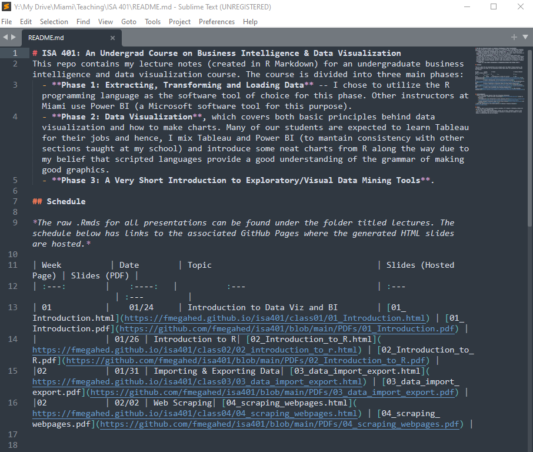
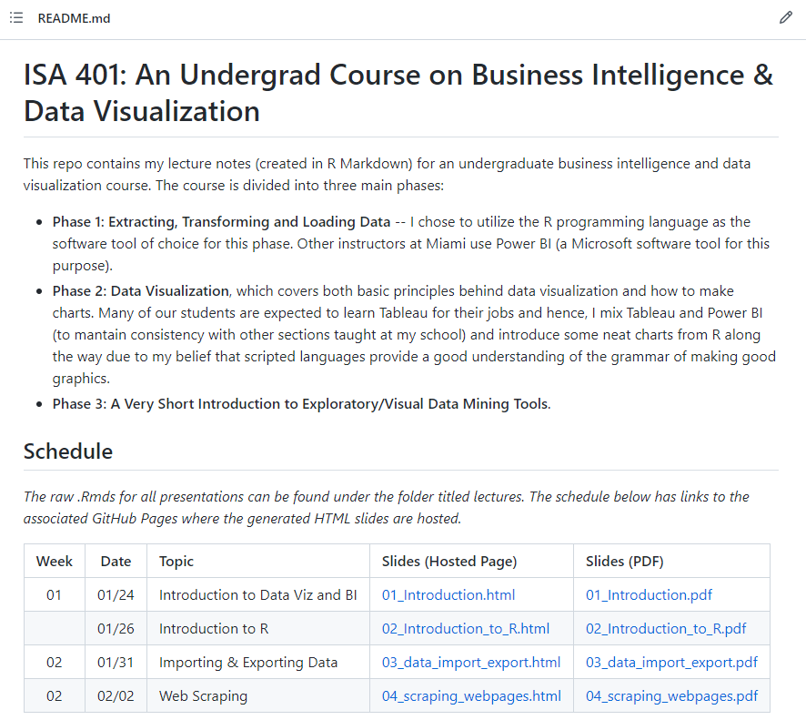
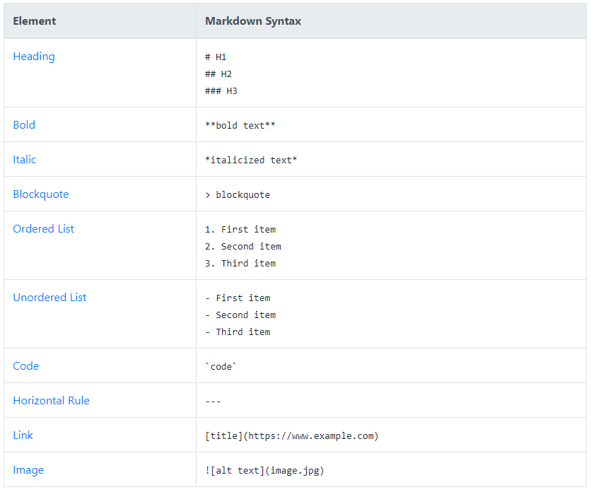
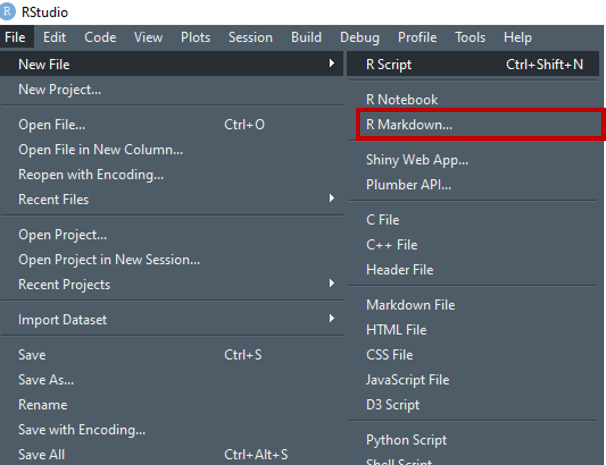
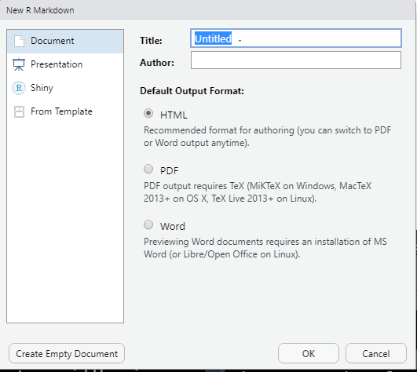
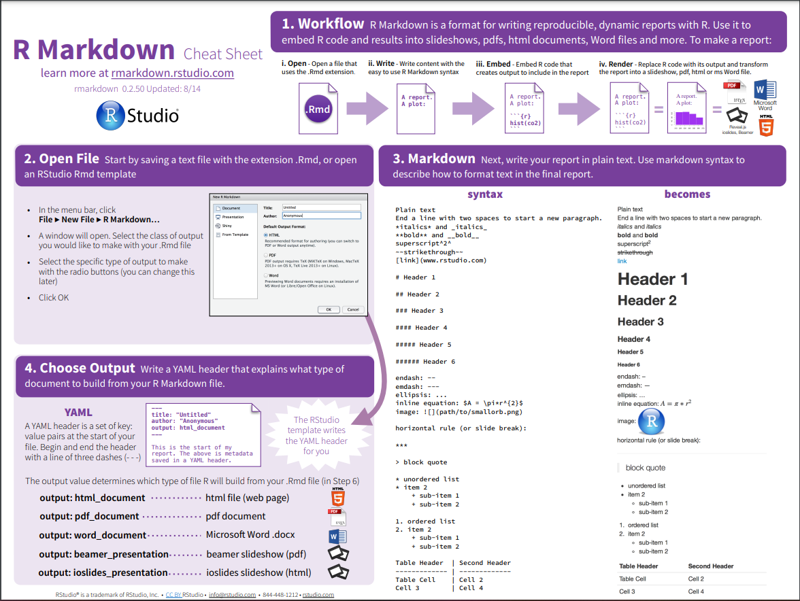
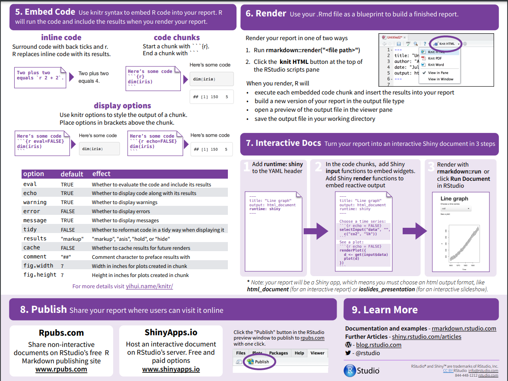

```{r setup, include=FALSE}
knitr::opts_chunk$set(cache = TRUE,
                      echo = TRUE,
                      warning = FALSE,
                      message = FALSE,
                      progress = FALSE, 
                      verbose = FALSE,
                      dev = 'png',
                      fig.height = 2.5,
                      dpi = 300,
                      fig.align = 'center')

options(htmltools.dir.version = FALSE)

miamired = '#C3142D'

if(require(pacman)==FALSE) install.packages("pacman")
if(require(devtools)==FALSE) install.packages("devtools")

if(require(countdown)==FALSE) devtools::install_github("gadenbuie/countdown")
if(require(xaringanExtra)==FALSE) devtools::install_github("gadenbuie/xaringanExtra")


pacman::p_load(tidyverse, magrittr, lubridate, janitor, # data analysis pkgs
               rvest, # for scraping
               fontawesome, RefManageR, xaringanExtra, countdown) # for slides

BibOptions(check.entries = FALSE, bib.style = "authoryear", 
           style = "markdown", dashed = TRUE)

bib = ReadBib("refs.bib") 
```

```{r xaringan-themer, include=FALSE, warning=FALSE}
if(require(xaringanthemer) == FALSE) install.packages("xaringanthemer")
library(xaringanthemer)

style_mono_accent(base_color = "#84d6d3",
                  base_font_size = "20px")

xaringanExtra::use_xaringan_extra(c("tile_view", "animate_css", "tachyons", "panelset", "broadcast", "share_again", "search", "fit_screen", "editable", 
                                    "clipable"))
```


# Quick Refresher from Last Week

`r emo::ji("check")` Subset data in `r fontawesome::fa(name = 'r-project', fill = miamired)`.   

`r emo::ji("check")` Read text-files, binary files (e.g., Excel, SAS, SPSS, Stata, etc), json files, etc. 

`r emo::ji("check")` Export data from `r fontawesome::fa(name = 'r-project', fill = miamired)`. 

`r emo::ji("check")` Understand when can we scrape data (i.e., `robots.txt`)  

`r emo::ji("check")` Scrape a webpage Using `r fontawesome::fa("r-project", fill = miamired)`  

`r emo::ji("check")` Utilize loops or `purr::map` to download data from multiple webpages.  


---

# Learning Objectives for Today's Lab

- Perform an extensive web scrape  

- Create reproducible reports/analyses using R Markdown


---
class: inverse, center, middle

# .large[.large[.large[`r fontawesome::fa("r-project")`]]] + .large[.large[.large[`r fontawesome::fa("markdown")`]]]


---

# Markdown `r fontawesome::fa("r-project")` `.md`

* A **markup language** to add formatting elements to plain-text documents, contrasting to **WYSIWYG**

.pull-left[.center[

]]

.pull-right[
.center[

]
]


---

#`r fontawesome::fa("r-project")` `.md` Basic Syntax

.center[

]


.footnote[
<html>
<hr>
</html>

**Note:** The table is captured from [markdown cheatsheet](https://www.markdownguide.org/cheat-sheet/). More details can be found at [markdown syntax](https://www.markdownguide.org/basic-syntax/).
]

---

class: inverse

background-image: url(https://raw.githubusercontent.com/allisonhorst/stats-illustrations/master/rstats-blanks/rmarkdown_wizards_blank.png)
background-size: 100% 100%


---
# Create R Markdown `.Rmd`

.pull-left[
.center[

<br><br>
]
]
.pull-right[
````markdown
---
title: "ISA 401: R Markdown Demo"
author: "Fadel Megahed"
date: "`r format(lubridate::today(), format = '%B %d, %Y')`"
output: html_document
---

`r ''````{r setup, include = FALSE}
library(knitr)
opts_chunk$set(echo = TRUE)
```

## R Markdown

You can embed an R code chunk like this:

`r ''````{r yelp_reviews, message = FALSE}
library(tidyverse)
patterson_reviews <- read_rds("https://tinyurl.com/5d66ah47")
patterson_reviews
```

See <http://rmarkdown.rstudio.com>.
````
]


---

# R Markdown Cheatsheet [1]

.center[

]

---

# R Markdown Cheatsheet [2]

.center[

]


---

# Demo

In class, we will do a live demo of some of the basic functionalities and settings of R Markdown.


---
class: inverse, center, middle

# `r emo::ji("coder")` Lab 01

---

# Lab 01 (Group Assignment 03 Questions)

> **In your pre-assigned group**, please submit the **HTML knitted** from the [Markdown template titled 05_web_scraping_lab_template.Rmd on Canvas](https://miamioh.instructure.com/courses/167290/assignments/2030670#:~:text=Your%20submission%20should%20be%20the%20HTML%20knitted%20from%20the%20following%20Markdown%20template%3A%2005_web_scraping_lab_template.Rmd)

> **This submission is due Friday February 11, 2022 at 11:59 PM.** 

.panelset[

.panel[.panel-name[Q1]

.small[
- Click on [Found and Impounded Property Listing](https://docs.google.com/spreadsheets/d/e/2PACX-1vQ3uk9AJOMODxS9fUgX_4vnEMj-Di7ulkTXWzPUmaHvHbaII63xmKmRu3VaBvOXrwQhtkOUlL9fxLMB/pubhtml?gid=1104208671&single=true) on the [Property - Lost, Found, Impounded Page](https://www.miamioh.edu/police/services/propertylostfoundimpounded/index.html)

- Go to the Google Doc containing a table of lost and found items. 

- **Please scrape the table and print it out.**

]
]


.panel[.panel-name[Q2]

.small[
- Currently, the Farmer School of Business has seven academic departments (i.e., [Accountancy](https://www.miamioh.edu/fsb/academics/accountancy/about/faculty-staff/index.html), [Economics](https://www.miamioh.edu/fsb/academics/economics/about/faculty-staff/index.html), [Entrepreneurship](https://www.miamioh.edu/fsb/academics/entrepreneurship/about/faculty-staff/index.html), [Finance](https://www.miamioh.edu/fsb/academics/finance/about/faculty-staff/index.html), [Information Systems & Analytics](https://www.miamioh.edu/fsb/academics/isa/about/faculty-staff/index.html), [Marketing](https://www.miamioh.edu/fsb/academics/marketing/about/faculty-staff/index.html), and [Management](https://www.miamioh.edu/fsb/academics/management/about/faculty-staff/index.html).  

- Using the code chunk below, please write code that will produce and print a **single tibble containing information on ALL departments and the following variables:** (a) department name, (b) faculty/staff's name, (c) faculty/staff's position, and (d) faculty/staff's website.
]

]


.panel[.panel-name[Q3]

.small[
- The most popular listings on Netflix are rated and reviews on [ImDb](https://www.imdb.com/search/title/?companies=co0144901). Based on this webpage and its following pages, please create a **tibble** that contains the following: *title*, *years*, *age classification*, *duration*, *genres*, *IMDb Rating*, *1-2 sentence summary*, *stars*, and *votes*. 

- **Your tibble should contain a variable for the 9 items above for each of the 50 titles found on the page.** 
]
]


.panel[.panel-name[Q4]

.small[
- Expand on the previous example to capture the top **300** titles on Netflix (i.e., the information across six pages).
]
]

.panel[.panel-name[Q5]

.small[
- In assignment 02, I shared with you an RDS file containing four variables and all the reviews that were performed on [Patterson Cafe on Yelp](https://www.yelp.com/biz/pattersons-cafe-oxford). Use what you have learned in class to potentially recreate the same results.
]
]


]


---
class: inverse, center, middle

# Recap


---

# Summary of Main Points

By now, you should be able to do the following:

- Perform an extensive web scrape  

- Create reproducible reports/analyses using R Markdown


---

# Supplementary Reading on R Markdown

.pull-left[
.center[[](https://r4ds.had.co.nz)]
]
.pull-right[
* [R Markdown](https://r4ds.had.co.nz/r-markdown.html)
* [R Markdown formats](https://r4ds.had.co.nz/r-markdown-formats.html)
* [R Markdown cheat sheet](https://www.rstudio.com/wp-content/uploads/2016/03/rmarkdown-cheatsheet-2.0.pdf?_ga=2.253787336.159731575.1620189500-118347454.1620189500)
* [R Markdown reference guide](https://www.rstudio.com/wp-content/uploads/2015/03/rmarkdown-reference.pdf?_ga=2.253787336.159731575.1620189500-118347454.1620189500)
]


---

# Supplementary Reading on Web Scraping

.pull-left[
.center[
```{r paper_1, echo=FALSE, out.height="320px"}
knitr::include_graphics("figures/web_scrape_in_data_science.PNG", dpi = NA)
```
]
* [PDF of Published Paper](https://www.tandfonline.com/doi/pdf/10.1080/10691898.2020.1787116)
* [ePub of Published Paper](https://www.tandfonline.com/doi/epub/10.1080/10691898.2020.1787116?needAccess=true)
]
.pull-right[
.center[]
* [Selector Gadget](https://rvest.tidyverse.org/articles/articles/selectorgadget.html)  
* [Getting Started with rvest](https://rvest.tidyverse.org/articles/articles/selectorgadget.html)  

* [Practical Web Scraping in R](https://www.r-bloggers.com/2019/04/practical-introduction-to-web-scraping-in-r/)
]


