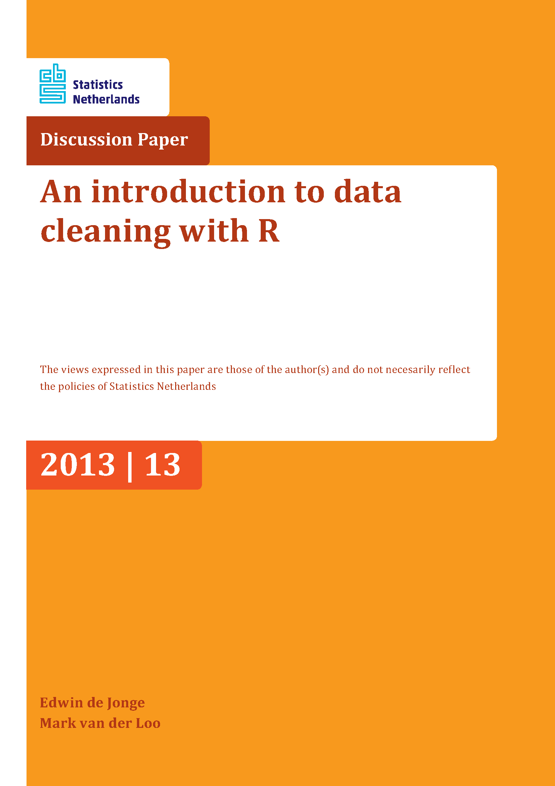

```{r setup, include=FALSE}
knitr::opts_chunk$set(cache = TRUE,
                      echo = TRUE,
                      warning = FALSE,
                      message = FALSE,
                      progress = FALSE, 
                      verbose = FALSE,
                      dev = 'png',
                      fig.height = 2.5,
                      dpi = 300,
                      fig.align = 'center')

options(htmltools.dir.version = FALSE)

miamired = '#C3142D'

if(require(pacman)==FALSE) install.packages("pacman")
if(require(devtools)==FALSE) install.packages("devtools")

if(require(countdown)==FALSE) devtools::install_github("gadenbuie/countdown")
if(require(xaringanExtra)==FALSE) devtools::install_github("gadenbuie/xaringanExtra")


pacman::p_load(tidyverse, magrittr, lubridate, janitor, # data analysis pkgs
               httr, jsonlite, tidycensus, # for APIs
               fontawesome, RefManageR, xaringanExtra, countdown) # for slides

BibOptions(check.entries = FALSE, bib.style = "authoryear", 
           style = "markdown", dashed = TRUE)

bib = ReadBib("refs.bib") 
```

```{r xaringan-themer, include=FALSE, warning=FALSE}
if(require(xaringanthemer) == FALSE) install.packages("xaringanthemer")
library(xaringanthemer)

style_mono_accent(base_color = "#84d6d3",
                  base_font_size = "20px")

xaringanExtra::use_xaringan_extra(c("tile_view", "animate_css", "tachyons", "panelset", "broadcast", "share_again", "search", "fit_screen", "editable", 
                                    "clipable"))
```


# Quick Refresher from Last Class


`r emo::ji("check")` Converting tidy data to technically correct data  

`r emo::ji("check")` Examining the consistency of data 


---

# Learning Objectives for Today's Class

- Correct errors (with transformation rules, deductive correction and deterministic imputation)  

- Describe different scenarios for missing data  

- Apply some basic imputation techniques for missing data (e.g., mean/median/mode, kNN, etc)


---
class: center, inverse, middle

# Error Correction <br>(i.e., Correcting Inconsistencies in the Data)


---

# Correction

> Correction methods aim to fix inconsistent observations by **altering invalid values in a record based on information from valid values**. Depending on the method this is either a **single-step procedure** or a **two-step procedure** where first, an error localization method is used to empty certain fields, followed by an imputation step. --- [De Jonge and Van Der Loo (2013)](https://cran.r-project.org/doc/contrib/de_Jonge+van_der_Loo-Introduction_to_data_cleaning_with_R.pdf)


---

# Simple Transformation Rules

In practice, data cleaning procedures involve a lot of **ad-hoc transformations**. This may lead to long scripts where one selects parts of the data, changes some variables, selects another part, changes some more variables, etc. 

- When such scripts are neatly written and commented, they can almost be **treated as a log of the actions** performed by the analyst. 

- However, as scripts get longer it is **better to store the transformation rules separately and log which rule is executed on what record**.

One approach to **do** this in R is through the [deducorrect package](https://cran.r-project.org/web/packages/deducorrect/deducorrect.pdf).

```{r functions_determinstic_correction, echo=FALSE}
library(gt)
tidyr <- tribble(
  ~ type, ~ `package_name`, ~ `fun()`, ~ `description`, 
  "**rules**", "deducorrect", "correctionRules()", "Rules for determinstic correction",
  "**correction**", "deducorrect", "correctWithRules()", "Apply simple replacement rules to a data.frame."
  
)

tidyr %>% 
  gt() %>% 
  fmt_markdown(everything()) %>% 
  cols_label(
    `type` = md("`type`"),
    `package_name` = md("`package`"),
    `fun()` = md("`function()`"),
    `description` = md("`description`"),
  ) %>% 
  as_raw_html()

```


---

# Simple Transformation Rules: Example

.pull-left[
```{r rules_det_correction}
pacman::p_load(tidyverse, deducorrect)

people = tibble(
  name = c('Tom Cruise', 'Serena Williams', 'Taylor Swift', 'Ariana Grande', 'The Rock'),
  height = c(172, 1.75, 69.3, 154, 6.25),
  unit = c('cm', 'm', 'inch', 'cm', 'ft')
)

u <- correctionRules(expression(
  ## 1-------
  if(unit == "cm") height <- height/100,
  ## 2-------
  if(unit == "inch") height <- height/39.37,
  ## 3-------
  if(unit == "ft") height <- height/3.28,
  ## 4-------
  unit <- "m"
))


```
Note that the rules **can also be stored in a txt file**.

]


.pull-right[
```{r rules_det_correction2}
people_corrected = correctWithRules( #<<
  rules = u, dat = people) #<<

people_corrected$corrected

people_corrected$corrections
```
]


---

# Deductive Correction

When the data you are analyzing is generated by people rather than machines or measurement devices, certain typical human-generated errors are likely to occur. Examples include: (a) **typing errors** in numbers, (b) **rounding errors** in numbers, and (c) **sign errors**.

These errors can be accounted for through the [deducorrect package](https://cran.r-project.org/web/packages/deducorrect/deducorrect.pdf).

```{r functions_dedu_correction, echo=FALSE}
library(gt)
tidyr <- tribble(
  ~ type, ~ `package_name`, ~ `fun()`, ~ `description`, 
  "**rule def**", "editrules", "editmatrix()", "A set of comparison operators representing a linear system of (in)equations. The function editmatrix generates an editmatrix from a character vector, or an expression vector.",
  "**typos**", "deducorrect", "correctTypos()", "Tries to detect and repair records that violate linear equality constraints by correcting simple typos",
  "**rounding**", "deducorrect", "correctRounding()", "Tries to detect and repair records that violate linear (in)equality constraints by correcting possible rounding errors",
  "**sign**", "deducorrect", "correctSigns()", "Correct sign errors and value interchanges in data records."
  
)

tidyr %>% 
  gt() %>% 
  fmt_markdown(everything()) %>% 
  cols_label(
    `type` = md("`type`"),
    `package_name` = md("`package`"),
    `fun()` = md("`function()`"),
    `description` = md("`description`"),
  ) %>% 
  as_raw_html()

```

---

# Deductive Correction: Correct Typos

```{r typos}
e <- editmatrix("x + y == z") # defining the rules
d <- data.frame(x = 123, y = 132, z = 246) # creating the data frame
cor <- correctTypos(e, d) # attempting to correct Typos #<< 
cor$corrected # new values for the data.frame
cor$corrections # the log of what has changed
```


---

# Deductive Correction: Correct Rounding Errors

```{r rounding}
e <- editmatrix("x + y == z") # defining the rules
d <- data.frame(x = 101, y = 100, z = 200) # creating the data frame
cor <- correctRounding(e, d) # attempting to correct Rounding #<< 
cor$corrected # new values for the data.frame (may not be unique)
cor$corrections # the log of what has changed
```


---

# Deductive Correction: Correct Sign Errors

```{r signs}
e <- editmatrix("x + y == z") # defining the rules
d <- data.frame(x = -100, y = 100, z = 200) # creating the data frame
cor <- correctSigns(e, d) # attempting to correct the sign #<< 
cor$corrected # new values for the data.frame
cor$corrections # the log of what has changed
```

---

# Non-Graded Activity

`r countdown(minutes = 3, seconds = 0, top = 0, font_size = "2em")`

.panelset[

.panel[.panel-name[Activity]


> _Over the next 3 minutes, please examine the following:_ 

- Which of the aforementioned `correct...()` functions can be used to correct the following situation?  
  1. `correctWithRules()` 
  2. `correctTypos()` 
  3. `correctSigns()`  
  4. `correctRounding()`

```{r correction_example}
d <- data.frame(x = 173, y = 200, z = 379) # creating the data frame
```

]

.panel[.panel-name[Your Solution]

.can-edit.key-activity1[

Please insert your solution below.

.............................. 

Why did you pick your answer?

.............................. 
]
]
]


---
class: center, inverse, middle

# Missing Data Handling <br>(Complete Cases, Col. Deletion, & Imputation)

---

# Types of Missing Data: MCAR

Missing data are typically grouped into three categories:  

- **Missing completely at random (MCAR):** When data are MCAR, the fact that the data are missing is independent of the observed and unobserved data. For example,  
  * If we were to perform annual health checks for all FSB students, some of you may have missing lab values because a batch of lab samples was processed improperly.  
  * Here, the missing data **reduce the analyzable population of the study and consequently, the statistical power, but do not introduce bias:** when data are MCAR, the **remaining data can be considered a simple random sample of the full data set** of interest. 
  * Hence, the `NA` data can be simply be handled by removing such observations. In R, the `na.omit()` can be used without the need for introducing any packages. We refer to this `NA` handling approach as **complete case analysis**.
  

.footnote[
<html>
<hr>
</html>

**Source:** Mack C, Su Z, Westreich D. Managing Missing Data in Patient Registries: Addendum to Registries for Evaluating Patient Outcomes: A User’s Guide, Third Edition [Internet]. Rockville (MD): Agency for Healthcare Research and Quality (US); 2018 Feb. Types of Missing Data. Available from: <https://www.ncbi.nlm.nih.gov/books/NBK493614/>
]


---

# Types of Missing Data: MAR

- **Missing at random (MAR):** When data are MAR, the fact that the **data are missing is systematically related to the observed but not the unobserved data**. For example,   
  * A dataset examining depression may encounter data that are MAR if male participants are less likely to complete a survey about depression severity than female participants.   
  * That is, if the probability of survey completion is related to their `sex` (which is fully observed) but **not the severity of their depression**, then the data may be regarded as MAR. 
  * Approaches to Handle `NAs` for MAR Data:    
      + Complete case analyses of MAR data may or may not result in bias.  
      + Impute (i.e., guess) the missing values based on a proper accounting of the known factors (e.g., their sex)


.footnote[
<html>
<hr>
</html>

**Source:** Mack C, Su Z, Westreich D. Managing Missing Data in Patient Registries: Addendum to Registries for Evaluating Patient Outcomes: A User’s Guide, Third Edition [Internet]. Rockville (MD): Agency for Healthcare Research and Quality (US); 2018 Feb. Types of Missing Data. Available from: <https://www.ncbi.nlm.nih.gov/books/NBK493614/>
]

---

# Types of Missing Data: MNAR

- **Missing not at random (MNAR):** When data are MNAR, the fact that the data are missing is **systematically related to the unobserved data**, that is, the missingness is related to events or factors which are not measured by the researcher. To extend the previous example,   
  * the depression registry may encounter data that are MNAR if participants with severe depression are more likely to refuse to complete the survey about depression severity.  
  * Approaches to Handle `NAs` for MAR Data:    
      + Complete case analyses of MAR data may or may not result in bias.  
      + Imputation approaches **may not be suitable since the missigness pattern is due to the impact of unobserved auxiliary variables**. 

.footnote[
<html>
<hr>
</html>

**Source:** Mack C, Su Z, Westreich D. Managing Missing Data in Patient Registries: Addendum to Registries for Evaluating Patient Outcomes: A User’s Guide, Third Edition [Internet]. Rockville (MD): Agency for Healthcare Research and Quality (US); 2018 Feb. Types of Missing Data. Available from: <https://www.ncbi.nlm.nih.gov/books/NBK493614/>
]


---

# The Bike Sharing Dataset

```{r bike_share_1}
pacman::p_load(lubridate, tidyverse, visdat)

bike_tbl = read_csv('../../Data/bike_sharing_data.csv') %>% 
  # making their column names tidy
  janitor::clean_names() %>% 
  # creating date, hours, and day of the week variables
  mutate(datetime = mdy_hm(datetime), date = as_date(datetime), 
         hours = hour(datetime), day_of_week =  wday(date)) %>%
  # moving them to the front
  relocate(date, day_of_week, hours) %>% 
  select(-c(datetime)) %>% 
  # converting int columns to factors
  mutate_at(.vars = vars(hours, season, holiday, workingday, weather),
                       .funs = as.character) %>% 
  mutate_at(.vars = vars(hours, season, holiday, workingday, weather),
                       .funs = as.factor) 
```


---

# Bike Sharing Data: Viz Missing [1]

```{r bike_share_2}
vis_dat(bike_tbl) # function from visdat #<<
```


---

# Bike Sharing Data: Viz Missing [2]

```{r bike_share_3}
vis_miss(bike_tbl) # function from visdat #<<
```


---

# Bike Sharing Data: Missing Relationships [1]

```{r bike_share_4, out.height=600, results='asis'}
bike_tbl_grouped = bike_tbl %>% 
  group_by(day_of_week) %>% # group_by from dplyr #>>
  summarise(nmissing = is.na(sources) %>% sum) # summarise from dplyr #>> 

bike_tbl_grouped %>% DT::datatable(
  fillContainer = FALSE, options = list(pageLength = 4), height = 600)
```

---

# Bike Sharing Data: Missing Relationships [2]

```{r bike_share_5}
bike_tbl_grouped = bike_tbl %>% 
  group_by(day_of_week, hours) %>% # group_by from dplyr #>>
  summarise(nmissing = is.na(sources) %>% sum) # summarise from dplyr #>> 

bike_tbl_grouped %>% DT::datatable(
  fillContainer = FALSE, options = list(pageLength = 4), height = 600)
```


---

# Some Useful Imputation Functions

```{r functions_imputation, echo=FALSE}
library(gt)
tidyr <- tribble(
  ~ type, ~ `package_name`, ~ `fun()`, ~ `description`, 
  "**identify NA cells", 'base', 'is.na()', 'returns logicals T/F for each NA cell',
  "**identify NA in each col**", 'base & purrr', 'purrr::map_df(.x = df, .f= is.na) %>% colSums()', 'returns total NA per column',
  "**rule-based deductions**", "deducorrect", "
deduImpute()", "Based on observed values and edit rules, impute as many variables deductively as possible.",
  "**replace NAs**", "tidyr", "replace_na(list(x = 0, y = 'unknown'))", "Replace/Impute NA with pre-configured values <br> (e.g., mean, median, VIM::maxCat(), etc.)",
"**across column imputations**", "VIM", "kNN()", "k-nearest neighbours for imputation",
"**across column imputations**", "VIM", "rangerImpute()", "use of random forests for imputation",
"**multiple imputation**", "mice", "mice()", " multivariate imputation by chained equations"
  
)

tidyr %>% 
  gt() %>% 
  fmt_markdown(everything()) %>% 
  cols_label(
    `type` = md("`type`"),
    `package_name` = md("`package`"),
    `fun()` = md("`function()`"),
    `description` = md("`description`"),
  ) %>% 
  as_raw_html()

```

---

# A Simple Demo Using a Modified Iris Dataset

Please refer to our inclass demo for more details.


---

class: center, inverse, middle

# Recap

---

# Summary of Main Points

By now, you should be able to do the following:  

- Correct errors (with transformation rules, deductive correction and deterministic imputation)  

- Describe different scenarios for missing data  

- Apply some basic imputation techniques for missing data (e.g., mean/median/mode, kNN, etc)

---


# Supplementary Reading


.center[[](https://cran.r-project.org/doc/contrib/de_Jonge+van_der_Loo-Introduction_to_data_cleaning_with_R.pdf)]
* [From technically correct to consistent data](https://cran.r-project.org/doc/contrib/de_Jonge+van_der_Loo-Introduction_to_data_cleaning_with_R.pdf)

