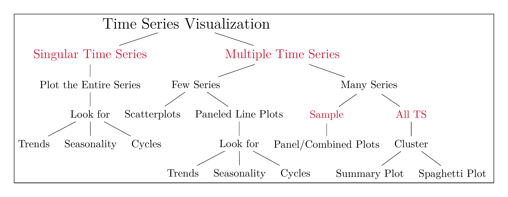
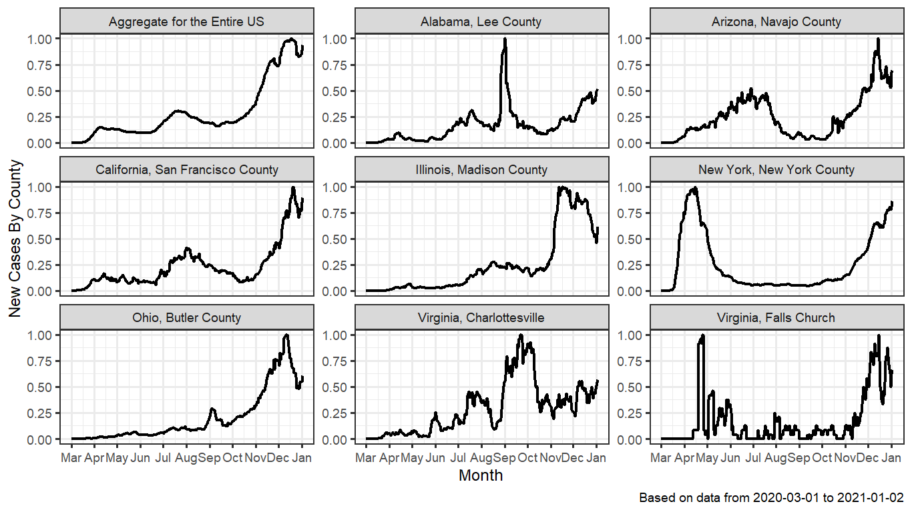
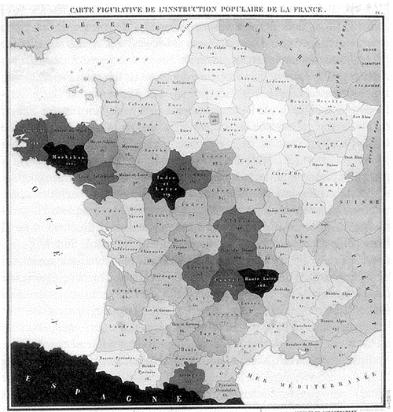
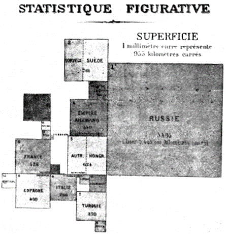
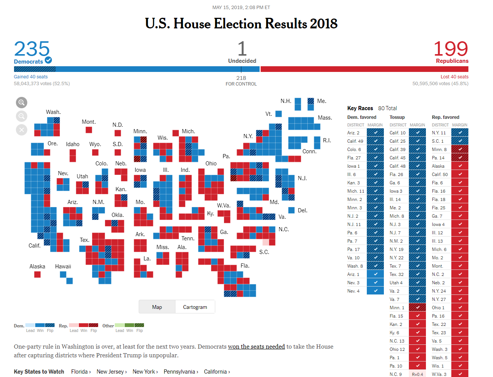
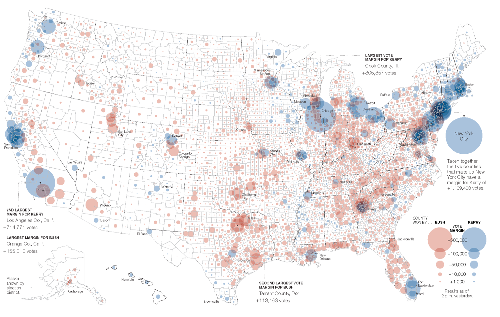
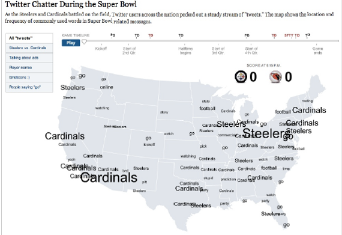
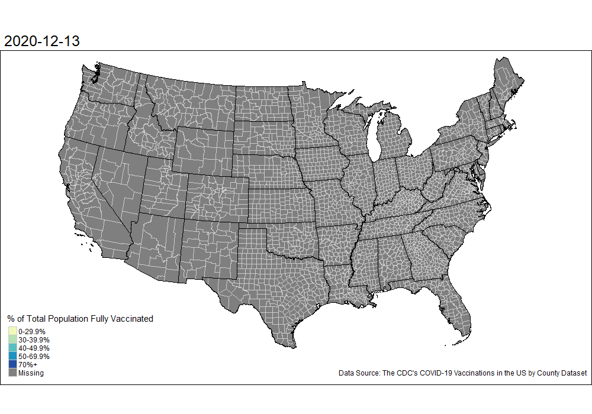

```{r setup, include=FALSE}
knitr::opts_chunk$set(cache = TRUE,
                      echo = TRUE,
                      warning = FALSE,
                      message = FALSE,
                      progress = FALSE, 
                      verbose = FALSE,
                      dev = 'png',
                      fig.height = 2.5,
                      dpi = 300,
                      fig.align = 'center')

options(htmltools.dir.version = FALSE)

miamired = '#C3142D'

if(require(pacman)==FALSE) install.packages("pacman")
if(require(devtools)==FALSE) install.packages("devtools")

if(require(countdown)==FALSE) devtools::install_github("gadenbuie/countdown")
if(require(xaringanExtra)==FALSE) devtools::install_github("gadenbuie/xaringanExtra")


pacman::p_load(tidyverse, magrittr, lubridate, janitor, # data analysis pkgs
               DT, # for nicely printed output
               tidyquant, rvest, GGally,
               geojsonio, leaflet,
               fontawesome, RefManageR, xaringanExtra, countdown) # for slides

BibOptions(check.entries = FALSE, bib.style = "authoryear", 
           style = "markdown", dashed = TRUE)

bib = ReadBib("refs.bib") 
```

```{r xaringan-themer, include=FALSE, warning=FALSE}
if(require(xaringanthemer) == FALSE) install.packages("xaringanthemer")
library(xaringanthemer)

style_mono_accent(base_color = "#84d6d3",
                  base_font_size = "20px")

xaringanExtra::use_xaringan_extra(c("tile_view", "animate_css", "tachyons", "panelset", "broadcast", "share_again", "search", "fit_screen", "editable", 
                                    "clipable"))
```


# Learning Objectives for Today's Class

- Understand main goals behind visualizing time-series data  

- Explain the different types of charts for univariate and multivariate time-series  

- Explain the different types of spatial plots  

- Select suitable spatial graphs for different scenarios  

- Understand how spatiotemporal plots can help in storytelling (what makes BI special)

---
class: inverse, center, middle

# Types of Data Over Time

---

# Cross Sectional Data


**Cross Sectional Data:** Measurements on multiple units, recorded in a single time period.

**Example 1:** H1B 2020-2022 Data for Senior Data Scientists at Netflix

```{r netflixSalaries, results='asis', echo=FALSE}

read_html("https://h1bdata.info/index.php?em=Netflix+Inc&job=Senior+Data+Scientist&city=LOS+GATOS&year=All+Years") %>%
  html_node("#myTable") %>% 
  html_table() -> netflixSalaries

netflixSalaries = netflixSalaries %>% select(1:6)
netflixSalaries$`START DATE` = mdy(netflixSalaries$`START DATE`)
netflixSalaries %<>% na.omit() 

netflixSalaries = netflixSalaries %>%  
  filter(`START DATE` >= '2020-01-01') %>% 
  select(`START DATE`, `JOB TITLE`, `BASE SALARY`, LOCATION)
netflixSalaries$`START DATE` = as.character(netflixSalaries$`START DATE`)

DT::datatable(netflixSalaries,  options = list(pageLength = 5, dom = 'tip'))
```

.footnote[
<html>
<hr>
</html>

Data scraped from <https://h1bdata.info/index.php?em=Netflix+Inc&job=Senior+Data+Scientist&city=LOS+GATOS&year=All+Years> on `r Sys.Date() |> format('%B %d, %Y')` using the [rvest](https://cran.r-project.org/web/packages/rvest/rvest.pdf) `r fontawesome::fa('box', 'gold')`. The printing was limited to those individuals who started on/after January 01, 2020, with the filters specified in the URL.
]

---
count:: false
# Cross Sectional Data


**Cross Sectional Data:** Measurements on multiple units, recorded in a single time period.

**Example 2:** NBA 2021-2022 Leaders - Top Players in PTS/Game

```{r nba, echo = FALSE}
nbaPerGame = 
  read_html("https://www.basketball-reference.com/leagues/NBA_2022_per_game.html") %>% 
  html_node("#per_game_stats") %>% html_table() %>% filter(!PTS %in% "PTS")

nbaPerGame$PTS = as.numeric(nbaPerGame$PTS)
nbaPerGame %>% arrange(desc(PTS)) %>% 
  select(Player, Pos, Age, Tm, G, FG, `FG%`, `eFG%`, PTS)  -> nbaPerGame

DT::datatable(nbaPerGame,
              extensions = "FixedColumns",
              options = list(pageLength = 5, dom = 'tip',
                             scrollX = TRUE,
              fixedColumns = list(leftColumns = 2)),
              )
```

.footnote[
<html>
<hr>
</html>

**Source:** Data scraped from  <https://www.basketball-reference.com/leagues/NBA_2022_per_game.html}{Basketball-Reference> on `r Sys.Date() |> format('%B %d, %Y')` using the [rvest](https://cran.r-project.org/web/packages/rvest/rvest.pdf) `r fontawesome::fa('box', 'gold')`. The printing was limited to the selected variables.
]

---

# Time Series Data

**Time Series Data:** Comparable measurements recorded on a single (or a few) variables over time (usually a long period of time).

**Example 2:** Stock prices of U.S. Airlines

```{r timeseries2, echo=FALSE, out.height='400px'}
if(require(pacman)==FALSE) install.packages("pacman")
pacman::p_load(tidyquant, tidyverse, scales)
airlines = tq_get(c('DAL', 'UAL', 'AAL', 'LUV'),
              from = "2020-01-01")
airlines %>% ggplot(aes(x = date, y = adjusted, group = symbol)) +
  geom_line() + 
  labs(y = "Adjusted Closing Price", x = "Date") +
  facet_wrap(~ symbol, ncol = 2, scale = "free_y") +
  scale_x_date(breaks = pretty_breaks(n=8)) +
  theme_bw()
```

---

# Panel Data


**Panel Data:** Cross sectional measurements (usually many variables) repeated over time (usually over a few time periods).

**Example:** World Bank's Data

```{r wb, results='asis', echo=FALSE}
pacman::p_load(wbstats)
macroData = wb_data(
  country = c('CN','EG','US'),
  indicator = c('NY.GDP.MKTP.KD.ZG', 'SP.DYN.LE00.IN', 
                'SH.DYN.NMRT', 'SH.HIV.INCD.ZS', 'SH.MED.BEDS.ZS', 
                'SH.MED.PHYS.ZS', 'SH.PRV.SMOK', 'SH.STA.TRAF.P5'),
  mrv = 3, return_wide = TRUE, gapfill = TRUE) %>% 
  select(-c(iso2c, country)) |> 
  mutate_at(.vars = 3:10, ~round(., digits = 1))

datatable(macroData,  
          extensions = "FixedColumns",
          options = list(pageLength = 5, dom = 'tip', scrollX='500px',
                                     fixedColumns = list(leftColumns = 3)) ) 
```

.footnote[
<html>
<hr>
</html>

**Source:** Data queried from the [World Bank Data](https://datacatalog.worldbank.org/) using the [wbstats](https://cran.r-project.org/web/packages/wbstats/wbstats.pdf) `r fontawesome::fa('box', 'gold')` in R. The printed results show a snapshot of 7 variables (out of a much larger panel dataset). You can think of panel data as a cross-sectional dataset with a longitudinal/time component.
]

---
class: inverse, center, middle

# Components of a Time Series

---

# Trend 

A **trend** is an increasing or decreasing pattern over time.

```{r trendUP, echo=FALSE}
pacman::p_load(tidyquant, tidyverse)
netflix = tq_get(c('NFLX'), from = "2020-04-01", to = "2021-08-25")
netflix %>% ggplot(aes(x = date, y = adjusted)) +
  geom_line() + 
  labs(y = "Adjusted Closing Price", x = "2020--2021", 
       title = "Increasing Trend", 
       subtitle = "The meteoric rise of $NFLX from 2020-04-01 to 2021-08-25") +
  theme_bw()
```

---
count:false
# Trend

A **trend** is an increasing or decreasing pattern over time.

```{r trendDown, echo=FALSE}
pacman::p_load(tidyquant, tidyverse)
delta = tq_get(c('DAL'), from = "2020-02-03", to = "2020-04-30")
delta %>% ggplot(aes(x = date, y = adjusted)) +
  geom_line() + 
  labs(y = "Adjusted Closing Price", x = "2020", 
       title = "Decreasing Trend", 
       subtitle = "The decline in $DAL from 2020-02-03 to 2020-04-30") +
  theme_bw()
```

---

# Seasonality

**Seasonality** refers to the property of a time series that displays REGULAR patterns that repeat at a constant frequency (*m*).

```{r airpassengers, echo=FALSE}
pacman::p_load(ggfortify)
data("AirPassengers")
autoplot(AirPassengers) + 
  labs(x=NULL, title = "Seasonality with a Multiplicative Trend", 
       subtitle = "Non-linear trend & seasonal component grows over time",
       caption = 'AirPassengers R Dataset -- Source: Box, G. E. P., Jenkins, G. M. and \n Reinsel, G. C. (1976) Time Series Analysis, Forecasting and Control.') +
  theme_bw()
```

---

# Cycle 

**Cyclical fluctuations** are somewhat irregular (unknown duration).

```{r autoSales, echo=FALSE}
autoSales = tq_get(x = 'TOTALSA', from = '1960-01-01', get = 'economic.data')

autoSales %>%
  ggplot( aes(x = date, y = price) ) +
  geom_line() + 
  labs(x=NULL,
       title = "The cyclical nature of auto sales",
       caption = paste0('U.S. Bureau of Economic Analysis, Total Vehicle Sales [TOTALSA], retrieved from FRED, Federal Reserve Bank of St. Louis \n https://fred.stlouisfed.org/series/TOTALSA, on ', format(Sys.Date(), '%B %d, %Y') )) +
  theme_bw()
```

---
class: inverse, center, middle
# The Goals Behind Visualizing (Time Series) Data

---

# Exploratory vs Confirmatory Viz Goals

> _Visualizations can be used to explore data, to confirm a hypothesis, or to manipulate
a viewer. . . In exploratory visualization the user does not necessarily
know what he is looking for. This creates a dynamic scenario in which interaction
is critical. . . In a confirmatory visualization, the user has a
hypothesis that needs to be tested. This scenario is more stable and predictable.
System parameters are often predetermined._ -- [(Grinstein and Ward 2001, 22)](https://www.google.com/books/edition/Information_Visualization_in_Data_Mining/rYFvnyPRwkgC?hl=en&gbpv=1&dq=Grinstein%2C%20Georges%20G%2C%20and%20Matthew%20O%20Ward.%202001.%20%E2%80%9CIntroduction%20to%20Data%20Visualization.%E2%80%9D%20In%20Information%20Visualization%20in%20Data%20Mining%20and%20Knowledge%20Discovery%2C%20edited%20by%20Usama%20Fayyad%2C%20Georges%20G%20Grinstein%2C%20and%20Andreas%20Wierse%2C%2021%E2%80%9345.%20San%20Francisco%2C%20CA%3A%20Morg&pg=PA22&printsec=frontcover)

---

# A Structured Approach for Time Series Viz

```{r run_latex_file, echo=FALSE, cache=TRUE, results='hide'}
tinytex::xelatex('figures/ts_plots_flow_chart.tex')
Sys.sleep(10)
pdftools::pdf_convert('figures/ts_plots_flow_chart.pdf', dpi = 600,
                      filenames = 'figures/ts_plots_flow_chart.png')
Sys.sleep(10)
```


```{r read_chart, echo=FALSE, out.width='100%', fig.alt="A Potential Framework for Time Series Visualization", fig.align='center', fig.cap='A Potential Framework for Time Series Visualization'}

```

.footnote[
<html>
<hr>
</html>

This is my best attempt to improve on the general advice provided in the previous slide. Many of the suggestions, presented in this flow chart, stem from my past and current research/consulting collaborations. They are by no means a comprehensive list of everything that you can do.
]

---

# Singular TS

```{r tsSingularPlot, echo=FALSE}
retail_sales = tq_get(x = 'RSCCASN', from = '1992-01-01', get = 'economic.data')

retail_sales %>% ggplot(aes(x = date, y = price)) +
  geom_line() + 
  scale_x_date(breaks = pretty_breaks(n=22)) +
  scale_y_continuous(breaks = pretty_breaks(n=8), labels = comma, limits = c(0, 35000)) +
  labs(x = "Date", y = "Retail Sales", 
       title = "Monthly Retail Sales (RSCCASN) in the U.S.") + theme_bw() +
  geom_vline(aes(xintercept = as.numeric(as.Date("2001-03-01")), color = 'Recession 1')) +
  geom_vline(aes(xintercept = as.numeric(as.Date("2001-11-01")), color = 'Recession 1')) +
  geom_vline(aes(xintercept = as.numeric(as.Date("2007-12-01")), color = 'Recession 2')) +
  geom_vline(aes(xintercept = as.numeric(as.Date("2009-06-01")), color = 'Recession 2')) +
  geom_vline(aes(xintercept = as.numeric(as.Date("2020-03-01")), color = 'Recession 3')) +
  geom_vline(aes(xintercept = as.numeric(as.Date("2021-10-01")), color = 'Recession 3')) +
  scale_color_manual(name = 'Recessions', 
                     values = c(`Recession 1` = 'darkorange',
                                `Recession 2` = 'deepskyblue',
                                `Recession 3` = 'darkolivegreen')) +
  theme(legend.position = "top")
```

---

# Looking for Trends

```{r trends, echo=FALSE}
retail_sales %>% ggplot(aes(x = date, y = price)) +
  geom_line() + 
  scale_x_date(breaks = pretty_breaks(n=22)) +
  scale_y_continuous(breaks = pretty_breaks(n=8), labels = comma, limits = c(0, 35000)) +
  labs(x = "Date", y = "Retail Sales", 
       title = "Monthly Retail Sales (RSCCASN) in the U.S.") + theme_bw() +
  geom_smooth(method = "lm") +
  geom_vline(aes(xintercept = as.numeric(as.Date("2001-03-01")), color = 'Recession 1')) +
  geom_vline(aes(xintercept = as.numeric(as.Date("2001-11-01")), color = 'Recession 1')) +
  geom_vline(aes(xintercept = as.numeric(as.Date("2007-12-01")), color = 'Recession 2')) +
  geom_vline(aes(xintercept = as.numeric(as.Date("2009-06-01")), color = 'Recession 2')) +
  geom_vline(aes(xintercept = as.numeric(as.Date("2020-03-01")), color = 'Recession 3')) +
  geom_vline(aes(xintercept = as.numeric(as.Date("2021-10-01")), color = 'Recession 3')) +
  scale_color_manual(name = 'Recessions', 
                     values = c(`Recession 1` = 'darkorange',
                                `Recession 2` = 'deepskyblue',
                                `Recession 3` = 'darkolivegreen')) +
  theme(legend.position = "top")
```


---

# Looking for Seasonality

```{r seasonal1, echo=FALSE}
retail_sales$month = month(retail_sales$date, label = T)
retail_sales$year = year(retail_sales$date) %>% as.character()

retail_sales |>  
  filter(year >= 2015 & year <=2019) |> 
  ggplot(aes(x = month, y = price, color = year, group = year)) +
  geom_line() +
  geom_point() +
  scale_y_continuous(breaks = pretty_breaks(n=8), labels = comma, limits = c(0, 35000)) +
  labs(x = 'Month', y = 'Retail Sales' ) +
  theme_bw(base_size = 8) + theme(legend.position = 'bottom')
```

---

# Multiple TS: Scatterplots

```{r german1, echo=FALSE}
download.file("https://www.wessexlearning.org/pobf2e/dsa/German_forecasts.xlsx",
              destfile = "../../Data/German_forecasts.xlsx", mode = "wb")
dfGerman = readxl::read_excel("../../Data/German_forecasts.xlsx")

dfGerman %>% ggplot(aes(x = Govsurp, y = GDP)) +
  geom_point() + 
  labs(title = "Scatterplot of GDP vs. Government Spending",
       caption = "Data from Muller-Droge et al. (2016)") + theme_bw()
```

---

# Multiple TS: Scatterplot Matrix

```{r german2, echo=FALSE}
dfGerman %>% # object created from the example in the previous slide
  ggpairs(columns = c('GDP', 'GFCF', 'Govsurp', 'Unemp')) + 
  labs(title = "Matrix Plot of GDP, GFCF, Govsurp & Unemp",
       caption = "Data from Muller-Droge et al. (2016)") + theme_bw(base_size = 8)

```

---

# Multiple TS: Panel Plots

```{r panel_plot, echo=FALSE, out.width='100%'}

```

---

# Spaghetti Plots (Often w/ Clustering)

```{r spaghetti_plot, echo=FALSE, out.width='80%'}
knitr::include_graphics('figures/spaghetti-1.png')
```

---

# Summary Plots (Often w/ Clustering)

```{r summary_plot, echo=FALSE, out.width='80%'}
knitr::include_graphics('figures/summaryPlot-1.png')
```

---
class: inverse, center, middle

# Spatial Plots


---

# Choropleth Maps

Maps where areas are **shaded, colored, or patterned** relative to a data attribute value. 

```{r dupin, echo=FALSE, fig.cap="Charles Dupin's Illiteracy in France Choropleth, created in 1826", out.height='40%', out.width='40%'}

```

---
count: false

# Choropleth Maps

Maps where areas are **shaded, colored, or patterned** relative to a data attribute value. 


```{r leaflet, echo=FALSE, cache=TRUE, fig.align='center', fig.cap='Population Density in U.S.'}
states <- geojsonio::geojson_read("https://rstudio.github.io/leaflet/json/us-states.geojson", what = "sp")

bins <- c(0, 10, 20, 50, 100, 200, 500, 1000, Inf)
pal <- colorBin("YlOrRd", domain = states$density, bins = bins)

labels <- sprintf(
  "<strong>%s</strong><br/>%g people / mi<sup>2</sup>",
  states$name, states$density
) %>% lapply(htmltools::HTML)

leaflet(states, width = '100%', height = 400) %>%
  setView(-96, 37.8, 4) %>%
  addProviderTiles("MapBox", options = providerTileOptions(
    id = "mapbox.light",
    accessToken = Sys.getenv('MAPBOX_ACCESS_TOKEN'))) %>%
  addPolygons(
    fillColor = ~pal(density),
    weight = 2,
    opacity = 1,
    color = "white",
    dashArray = "3",
    fillOpacity = 0.7,
    highlightOptions = highlightOptions(
      weight = 5,
      color = "#666",
      dashArray = "",
      fillOpacity = 0.7,
      bringToFront = TRUE),
    label = labels,
    labelOptions = labelOptions(
      style = list("font-weight" = "normal", padding = "3px 8px"),
      textsize = "15px",
      direction = "auto")) %>%
  addLegend(pal = pal, values = ~density, opacity = 0.7, title = NULL,
    position = "bottomright")

```


---

# Cartograms

A cartogram is a map in which **areas are scaled and distorted relative to a data
attribute value**

```{r cart1, echo=FALSE, fig.cap='The First Cartogram – Emile Levasseur, 1868', out.height='40%', out.width='40%'}

```

---
count: false

# Cartograms


A cartogram is a map in which **areas are scaled and distorted relative to a data
attribute value**

```{r cart2, echo=FALSE, fig.cap="The NYT's U.S. House Election Results 2018", out.height='50%', out.width='50%'}

```


---

# Proportional Symbols Map

```{r prop1, echo=FALSE, fig.cap="The NYT's U.S. Coverage of the Bush Vs Kerry Presidential Elections", out.height='70%', out.width='70%'}

```

---
count: false

# Proportional Symbols Map

```{r prop2, echo=FALSE, fig.cap="The NYT's U.S. Coverage of 2009 Super Bowl", out.height='63%', out.width='63%'}

```

---
class: inverse, center, middle

# Spatiotemporal Maps

---

# Spatiotemporal Maps

```{r spatiotemporal1, fig.cap='A visualization of car crashes in the Cincinnati metro area', echo=FALSE}
knitr::include_graphics('figures/crash_anim.gif')
```

---
count: false
# Spatiotemporal Maps

```{r spatiotemporal2, out.height='70%', out.width='70%', echo=FALSE, fig.cap='COVID vaccination rates per county as reported by the CDC'}

```


---
class: inverse, center, middle

# Recap

---

# Summary of Main Points

- Understand main goals behind visualizing time-series data  

- Explain the different types of charts for univariate and multivariate time-series  

- Explain the different types of spatial plots  

- Select suitable spatial graphs for different scenarios  

- Understand how spatiotemporal plots can help in storytelling (what makes BI special)

