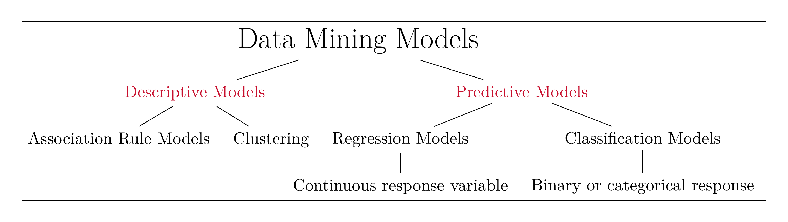
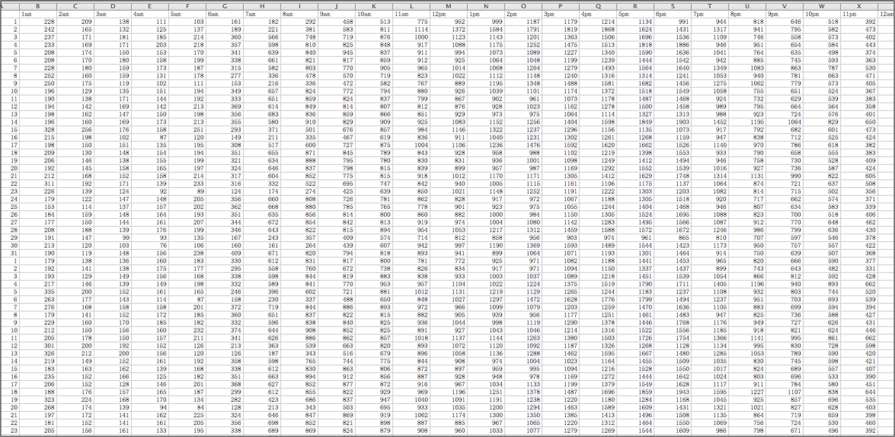
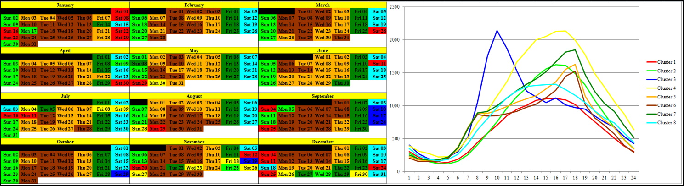
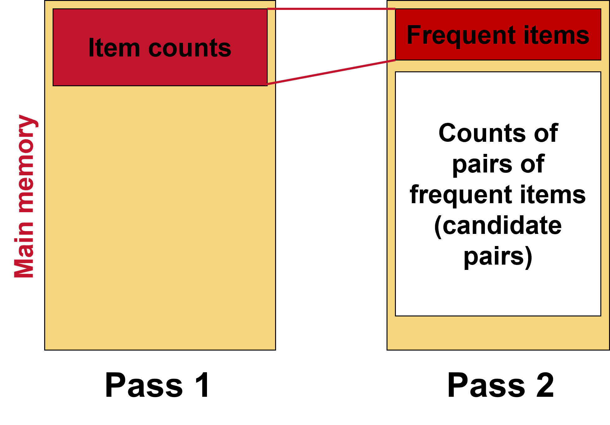

```{r setup, include=FALSE}
knitr::opts_chunk$set(cache = TRUE,
                      echo = TRUE,
                      warning = FALSE,
                      message = FALSE,
                      progress = FALSE, 
                      verbose = FALSE,
                      dev = 'png',
                      fig.height = 3,
                      dpi = 300,
                      fig.align = 'center')

options(htmltools.dir.version = FALSE)

miamired = '#C3142D'

if(require(pacman)==FALSE) install.packages("pacman")
if(require(devtools)==FALSE) install.packages("devtools")

if(require(countdown)==FALSE) devtools::install_github("gadenbuie/countdown")
if(require(xaringanExtra)==FALSE) devtools::install_github("gadenbuie/xaringanExtra")


pacman::p_load(tidyverse, magrittr, lubridate, janitor, # data analysis pkgs
               DT, # for nicely printed output
               tinytex, # to run latex files
               arules, arulesViz,
               fontawesome, RefManageR, xaringanExtra, countdown) # for slides

BibOptions(check.entries = FALSE, bib.style = "authoryear", 
           style = "markdown", dashed = TRUE)

bib = ReadBib("refs.bib") 
```

```{r xaringan-themer, include=FALSE, warning=FALSE}
if(require(xaringanthemer) == FALSE) install.packages("xaringanthemer")
library(xaringanthemer)

style_mono_accent(base_color = "#84d6d3",
                  base_font_size = "20px")

xaringanExtra::use_xaringan_extra(c("tile_view", "animate_css", "tachyons", "panelset", "broadcast", "share_again", "search", "fit_screen", "editable", 
                                    "clipable"))
```

# A Recap of What we Learned Last Week

- Define a “business report” & its main functions  

- Understand the importance of the right KPIs  

- Automate traditional business reports  

- Dashboards as real-time business reporting tools


---

# Course Objectives Covered so Far

[Y]ou will be re-introduced to **how data should be explored** ... Instead, the focus is on understanding the underlying methodology and mindset of **how data should be approached, handled, explored, and incorporated back into the domain of interest.** ... You are expected to:  

`r fontawesome::fa('check')` .green[.bold[Be capable of extracting, transforming and loading (ETL) data using multiple platforms (e.g. `r fontawesome::fa('r-project', 'green')` & Tableau).]]   

`r fontawesome::fa('check')` .green[.bold[Write basic `r fontawesome::fa('r-project', 'green')` scripts to preprocess and clean the data.]]  

`r fontawesome::fa('check')` .green[.bold[Explore the data using visualization approaches that are based on sound human factors (i.e. account for human cognition and perception of data).]]

`r fontawesome::fa('times-circle')` **Understand how data mining and other analytical tools can capitalize on the insights generated from the data viz process.**  

`r fontawesome::fa('check')` .green[.bold[Create interactive dashboards that can be used for business decision making, reporting and/or performance management.]]

`r fontawesome::fa('times-circle')` **Be able to apply the skills from this class in your future career.**


---


# Learning Objectives for Today's Class

- Describe the goals & functions of data mining  

- Understand the statistical limits on data mining  

- Describe the data mining process  

- What is “frequent itemsets” & the application of this concept  

- Explain how and why “association rules” are constructed  

- Use `r fontawesome::fa('r-project')` to populate both concepts


---
class: inverse, center, middle

# An Overview of Data Mining

---

# What is Data Mining?

- The most common definition of data mining is the discovery of models from data.  

- Discovery of **patterns and models that are:**  
  + **Valid:** hold on new data with some certainty  
  + **Useful:** should be possible to act on the item  
  + **Unexpected:** non-obvious to the system 
  + **Understandable:** humans should be able to interpret the pattern

- Subsidiary Issues:  
  + **Data cleansing:** detection of bogus data  
  + **Data visualization:** something better than MBs of output 
  + **Warehousing** of data (for retrieval)

.footnote[
<html>
<hr>
</html>

**Source:** The slide is adapted from Jure Leskovic, Stanford CS246, Lecture Notes, see <http://cs246.stanford.edu>
]


---

# A Simplistic View of Data Mining Models

```{r run_latex_file, echo=FALSE, cache=TRUE, results='hide'}
tinytex::xelatex('figures/data_mining_models.tex')
Sys.sleep(5)
pdftools::pdf_convert('figures/data_mining_models.pdf', dpi = 600,
                      filenames = 'figures/data_mining_models.png')
Sys.sleep(5)
```

```{r read_dm_chart, echo=FALSE, out.width='100%', fig.alt="An Overview of Data Mining Models", fig.align='center', fig.cap='A simplistic summary of data mining models. Note that, in ISA 401, we will only briefly cover descriptive/exploratory data mining models'}

```

---

# Data Mining is Hard

Data mining is hard since it has the following issues:

- Scalability

- Dimensionality

- Complex and Heterogeneous Data

- Data Quality

- Data Ownership and Distribution

- Privacy Preservation

**Note that I have intentionally not included fitting/training a model since this is relatively easy if you understand the data, engineered/captured the important predictors, and have the data in the "correct" shape/quality.**


---

# Association Rules

.panelset[
.panel[.panel-name[Data]

```{r groceries1, echo=FALSE, results='hide'}
data("Groceries")
```

```{r groceries2, echo=FALSE}
summary(Groceries)
```

]

.panel[.panel-name[Top 5 Rules]

```{r arulesViz1, echo=FALSE, results='hide'}
rules <- apriori(Groceries, parameter=list(support=0.001, confidence=0.5))
```

```{r arulesViz2, echo=FALSE}
inspect( head(rules, n = 5, by ="lift") )
```
]

.panel[
.panel-name[Scatter Plot of all Rules]

```{r rules_scatter, echo=FALSE}
plot(rules, measure = c("support", "lift"), shading = "confidence")
```

]


.panel[
.panel-name[Graph-based Plot of Top 5 Rules]

```{r rules_graph, echo=FALSE, fig.cap='Graph-based visualization with items and rules as vertices.'}
subrules2 <- head(rules, n = 5, by = "lift")
plot(subrules2, method = "graph")
```
]

]

---

# Clustering of Traffic Volume on I-85

`r countdown(minutes = 4, seconds = 0, top = 0, font_size = "2em")`

.panelset[
.panel[.panel-name[Data]
```{r cluster_data, echo=FALSE, out.width='100%'}

```

]


.panel[.panel-name[Calendar Plot of Clustered Data]
```{r calendar_cluster_data, echo=FALSE, out.width='100%'}

```
]

.panel[.panel-name[Insights from Chart?]

**Based on the previous tab, what are 2-3 main insights you have learned about the traffic volume in Montgomery, AL?** Write them down below

.can-edit.key-activity[Edit me and insert your solution here]

]

]


---

# Regression vs Classification

.center[
```{r regvsclass, echo=FALSE, out.width='60%'}
knitr::include_graphics('https://miro.medium.com/max/1400/1*Qn4eJPhkvrEQ62CtmydLZw.png')
```
]

---

# An Overview of Common Data Mining Models

.center[
```{r summary, echo=FALSE, out.width='90%'}
knitr::include_graphics('https://scikit-learn.org/stable/_static/ml_map.png')
```
]


---
class: inverse, center, middle

# Limits on Data Mining


---

# Meaningfulness of Answers from DM Models

- .black[.bold[A big risk when data mining is that you will discover patterns that are meaningless.]]  

- **Bonferroni’s Principle:** (roughly) if you look in more places for interesting patterns than your amount of data will support, you are bound to find.

.center[

]


---

# Rhines Paradox: An Example of Overzealous DM?

- Joseph Rhine was a parapsychologist in the 1950s who hypothesized that some people had **Extra-Sensory Perception**.  

- He devised an experiment where subjects were asked to guess 10 hidden cards .red[red] or .blue[blue].  

- He discovered that almost 1 in 1000 had ESP they were able to get all 10 right!  

- He told these people they had ESP and called them in for another test of the same type.

- Alas, he discovered that almost all of them had lost their ESP. 

- **What did he conclude?**  
  + He concluded that you should not tell people they have ESP; it causes them to lose it.  
  + **Why is this an incorrect conclusion?**
  
  
---

# Ethical Issues with Data Mining

.pull-left[
.center[

]
]

.pull-right[
.center[

]
]


---

# The Blind Use of Algorithms in the News

<iframe src="https://www.politico.eu/article/dutch-scandal-serves-as-a-warning-for-europe-over-risks-of-using-algorithms/" width="1000" height="500"></iframe>


---
class: inverse, center, middle

# The Data Mining Process

---

# Frameworks for Data Mining Projects

.center[
[](https://www.datascience-pm.com/crisp-dm-still-most-popular/)
]


---

# The CRISP-DM Process

.pull-left[

- **You are expected to read the [original CRISP-DM paper](http://www.cs.unibo.it/~danilo.montesi/CBD/Beatriz/10.1.1.198.5133.pdf)**

- Each step has several substeps

- **Most of the project time is typically spent in steps 1-3**
]

.pull-right[
.center[
<a title="Alexander Schröder, CC BY-SA 4.0 &lt;https://creativecommons.org/licenses/by-sa/4.0&gt;, via Wikimedia Commons" href="https://commons.wikimedia.org/wiki/File:CRISP_DM_Data_mining_management_process.jpg"></a>
]
]


---
class: inverse, center, middle

# Frequent Itemsets, Market Basket Analysis and Association Rule Mining

---

# Association Rule Discovery

**Supermarket shelf management – Market-basket model:**

- **Goal:** Identify items that are bought together by sufficiently many customers  

- **Approach:** Process the sales data collected with barcode scanners to find dependencies among items  

- **A classic rule:**  
  + If someone buys diaper and milk, then he/she is likely to buy beer  
  + Don’t be surprised if you find six-packs next to diapers!

.footnote[
<html>
<hr>
</html>
**Source:** J. Leskovec, A. Rajaraman, J. Ullman: Mining of Massive Datasets, http://www.mmds.org

]


---

# The Market-Basket Model

.pull-left[
- A large set of **items**  
  + e.g., things sold in a supermarket

- A large set of **baskets** 

- Each basket is a **small subset of items** 
  + e.g., the things one customer buys on one day

- Want to discover **association rules**  
  + People who bought {x,y,z} tend to buy {v,w} 
    * Amazon!
]

.pull-right[
.center[
**Input:**

<html>
<style type="text/css">
.tg  {border-collapse:collapse;border-spacing:0;}
.tg td{border-color:black;border-style:solid;border-width:1px;font-family:Arial, sans-serif;font-size:14px;
  overflow:hidden;padding:10px 5px;word-break:normal;}
.tg th{border-color:black;border-style:solid;border-width:1px;font-family:Arial, sans-serif;font-size:14px;
  font-weight:normal;overflow:hidden;padding:10px 5px;word-break:normal;}
.tg .tg-v0hj{background-color:#efefef;border-color:inherit;font-weight:bold;text-align:center;vertical-align:top}
.tg .tg-7btt{border-color:inherit;font-weight:bold;text-align:center;vertical-align:top}
.tg .tg-fymr{border-color:inherit;font-weight:bold;text-align:left;vertical-align:top}
</style>
<table class="tg">
<thead>
  <tr>
    <th class="tg-v0hj">Basket #</th>
    <th class="tg-v0hj">Items</th>
  </tr>
</thead>
<tbody>
  <tr>
    <td class="tg-7btt">1</td>
    <td class="tg-fymr"><span style="color:#BEAED4">Bread</span><span style="color:#333">, </span><span style="color:#FE0000">Coke</span><span style="color:#333">, </span><span style="color:#386CB0">Milk</span></td>
  </tr>
  <tr>
    <td class="tg-7btt">2</td>
    <td class="tg-fymr"><span style="color:#FDC086">Beer</span><span style="color:#333">, </span><span style="color:#BEAED4">Bread</span></td>
  </tr>
  <tr>
    <td class="tg-7btt">3</td>
    <td class="tg-fymr"><span style="color:#FDC086">Beer</span>, <span style="color:#F0027F">Coke</span>, <span style="color:#7FC97F">Diaper</span>, <span style="color:#386CB0">Milk</span></td>
  </tr>
  <tr>
    <td class="tg-7btt">4</td>
    <td class="tg-fymr"><span style="color:#FDC086">Beer</span>, <span style="color:#BEAED4">Bread</span>, <span style="color:#7FC97F">Diaper</span>, <span style="color:#386CB0">Milk</span></td>
  </tr>
  <tr>
    <td class="tg-7btt">5</td>
    <td class="tg-fymr"><span style="color:#F0027F">Coke</span>,<span style="color:#7FC97F"> Diaper</span>, <span style="color:#386CB0">Milk</span></td>
  </tr>
</tbody>
</table>
</html>

<br>

**Output:** .black[.bold[Discovered Rules]] 


{<span style="color:#386CB0">Milk</span>} --> {<span style="color:#F0027F">Coke</span>}  
{<span style="color:#7FC97F">Diaper</span>, <span style="color:#386CB0">Milk</span>} --> {<span style="color:#FDC086">Beer</span>}


]
]


.footnote[
<html>
<hr>
</html>
**Source:** J. Leskovec, A. Rajaraman, J. Ullman: Mining of Massive Datasets, <http://www.mmds.org>
]


---

# Definitions: Support & Support Threshold

.pull-left[
- **Simplest question:** Find sets of items that appear together “frequently” in baskets 

- **Support for itemset $I$:** Number of baskets containing all items in $I$  
  + Often expressed as a fraction of the total number of baskets  

- Given a **support threshold $s$**, then sets of items that appear in at least $s$ baskets are called frequent itemsets
]

.pull-right[

.center[
**Input:**

<html>
<style type="text/css">
.tg  {border-collapse:collapse;border-spacing:0;}
.tg td{border-color:black;border-style:solid;border-width:1px;font-family:Arial, sans-serif;font-size:14px;
  overflow:hidden;padding:10px 5px;word-break:normal;}
.tg th{border-color:black;border-style:solid;border-width:1px;font-family:Arial, sans-serif;font-size:14px;
  font-weight:normal;overflow:hidden;padding:10px 5px;word-break:normal;}
.tg .tg-v0hj{background-color:#efefef;border-color:inherit;font-weight:bold;text-align:center;vertical-align:top}
.tg .tg-7btt{border-color:inherit;font-weight:bold;text-align:center;vertical-align:top}
.tg .tg-fymr{border-color:inherit;font-weight:bold;text-align:left;vertical-align:top}
</style>
<table class="tg">
<thead>
  <tr>
    <th class="tg-v0hj">Basket #</th>
    <th class="tg-v0hj">Items</th>
  </tr>
</thead>
<tbody>
  <tr>
    <td class="tg-7btt">1</td>
    <td class="tg-fymr"><span style="color:#BEAED4">Bread</span><span style="color:#333">, </span><span style="color:#FE0000">Coke</span><span style="color:#333">, </span><span style="color:#386CB0">Milk</span></td>
  </tr>
  <tr>
    <td class="tg-7btt">2</td>
    <td class="tg-fymr"><span style="color:#FDC086">Beer</span><span style="color:#333">, </span><span style="color:#BEAED4">Bread</span></td>
  </tr>
  <tr>
    <td class="tg-7btt">3</td>
    <td class="tg-fymr"><span style="color:#FDC086">Beer</span>, <span style="color:#F0027F">Coke</span>, <span style="color:#7FC97F">Diaper</span>, <span style="color:#386CB0">Milk</span></td>
  </tr>
  <tr>
    <td class="tg-7btt">4</td>
    <td class="tg-fymr"><span style="color:#FDC086">Beer</span>, <span style="color:#BEAED4">Bread</span>, <span style="color:#7FC97F">Diaper</span>, <span style="color:#386CB0">Milk</span></td>
  </tr>
  <tr>
    <td class="tg-7btt">5</td>
    <td class="tg-fymr"><span style="color:#F0027F">Coke</span>,<span style="color:#7FC97F"> Diaper</span>, <span style="color:#386CB0">Milk</span></td>
  </tr>
</tbody>
</table>
</html>

<br>


.black[.bold[Support of {<span style="color:#FDC086">Beer</span>, <span style="color:#BEAED4">Bread</span>}:]] = 2

]

]

.footnote[
<html>
<hr>
</html>
**Source:** J. Leskovec, A. Rajaraman, J. Ullman: Mining of Massive Datasets, <http://www.mmds.org>
]


---

# Non-graded Activity: Frequent Itemsets

`r countdown(minutes = 4, seconds = 0, top = 0, font_size = "2em")`

.panelset[
.panel[.panel-name[Activity]

.black[.bold[Items]] = {<span style="color:#386CB0">Milk</span>, <span style="color:#F0027F">Coke</span>, <span style="color:#7FC97F">Pepsi</span>, <span style="color:#FDC086">Beer</span>,  <span style="color:#BEAED4">Juice</span>}


<br>

**With a support threshold of 3 baskets, find all frequent itemsets based on these 8 baskets:**

- $B_1 =$ {<span style="color:#386CB0">Milk</span>, <span style="color:#F0027F">Coke</span>, <span style="color:#FDC086">Beer</span>}   $\qquad \qquad$ $B_2 =$ {<span style="color:#386CB0">Milk</span>, <span style="color:#7FC97F">Pepsi</span>, <span style="color:#BEAED4">Juice</span>}     

- $B_3 =$ {<span style="color:#386CB0">Milk</span>, <span style="color:#FDC086">Beer</span>}   $\qquad \qquad \qquad \quad$ $B_4 =$ {<span style="color:#F0027F">Coke</span>, <span style="color:#BEAED4">Juice</span>}  

- $B_5 =$ {<span style="color:#386CB0">Milk</span>, <span style="color:#7FC97F">Pepsi</span>, <span style="color:#FDC086">Beer</span>}   $\qquad \qquad$ $B_6 =$ {<span style="color:#386CB0">Milk</span>, <span style="color:#F0027F">Coke</span>,  <span style="color:#FDC086">Beer</span>, <span style="color:#BEAED4">Juice</span>} 

- $B_6 =$ {<span style="color:#F0027F">Coke</span>, <span style="color:#FDC086">Beer</span>, <span style="color:#BEAED4">Juice</span>}   $\qquad \qquad$ $B_8 =$ {<span style="color:#F0027F">Coke</span>,  <span style="color:#FDC086">Beer</span>} 
]

.panel[.panel-name[Your Solution]

**Identify all frequent singletons, doubles, triples, etc.**

.can-edit.key-activity2[Edit me and insert your solution here]

]


]


---

# Association Rules

- **Association Rules:** If-then rules about the contents of baskets  

- .orange[{i<sub>1</sub>, i<sub>2</sub>,…,i<sub>k</sub>} &#8594; j]  means: "if a basket contains all of $i_1,…,i_k$ then it is likely to contain $j$"  

- **In practice there are many rules, want to find significant/interesting ones!**  

- **Confidence** of this association rule is the probability of $j$ given $I =$ {$i_1,…,i_k$}

.center[
$conf(I \rightarrow j) = P (j \ | \ I) = \frac{support(I \ \cup \ j)}{support(I)}$
]

- **Not all high-confidence rules are interesting**   
  + The rule .black[.bold[X]] &#8594; .black[.bold[milk]] may have high confidence for many itemsets .black[.bold[X]], because .black[.bold[milk]] is just purchased very often (independent of .black[.bold[X]]) and the confidence will be high
  
- **Lift** of an association rule $I \rightarrow J$ is the ratio between its confidence and the fraction of baskets containing $j$: $\qquad lift(I \rightarrow j) = \frac{conf(I \rightarrow j)}{Pr(j)}$


.footnote[
<html>
<hr>
</html>
**Adaped from** J. Leskovec, A. Rajaraman, J. Ullman: Mining of Massive Datasets, <http://www.mmds.org>
]

---

# Non-Graded Activity: Confidence and Lift

`r countdown(minutes = 4, seconds = 0, top = 0, font_size = "2em")`

.panelset[
.panel[.panel-name[Activity]

- $B_1 =$ {<span style="color:#386CB0">Milk</span>, <span style="color:#F0027F">Coke</span>, <span style="color:#FDC086">Beer</span>}   $\qquad \qquad$ $B_2 =$ {<span style="color:#386CB0">Milk</span>, <span style="color:#7FC97F">Pepsi</span>, <span style="color:#BEAED4">Juice</span>}     

- $B_3 =$ {<span style="color:#386CB0">Milk</span>, <span style="color:#FDC086">Beer</span>}   $\qquad \qquad \qquad \quad$ $B_4 =$ {<span style="color:#F0027F">Coke</span>, <span style="color:#BEAED4">Juice</span>}  

- $B_5 =$ {<span style="color:#386CB0">Milk</span>, <span style="color:#7FC97F">Pepsi</span>, <span style="color:#FDC086">Beer</span>}   $\qquad \qquad$ $B_6 =$ {<span style="color:#386CB0">Milk</span>, <span style="color:#F0027F">Coke</span>,  <span style="color:#FDC086">Beer</span>, <span style="color:#BEAED4">Juice</span>} 

- $B_6 =$ {<span style="color:#F0027F">Coke</span>, <span style="color:#FDC086">Beer</span>, <span style="color:#BEAED4">Juice</span>}   $\qquad \qquad$ $B_8 =$ {<span style="color:#F0027F">Coke</span>,  <span style="color:#FDC086">Beer</span>} 


<br>

**For the association rule:** {<span style="color:#386CB0">Milk</span>, <span style="color:#FDC086">Beer</span>} &#8594; <span style="color:#F0027F">Coke</span>, compute both its confidence and lift.


]

.panel[.panel-name[Your Solution]

**Computing the confidence and lift for the association rule** {<span style="color:#386CB0">Milk</span>, <span style="color:#FDC086">Beer</span>} &#8594; <span style="color:#F0027F">Coke</span>

.can-edit.key-activity3[Edit me and insert your solution here]

]
]


---

# Finding Association Rules

- **Problem:** .black[.bold[Find all association rules with support &ge; s and confidence &ge; c]]  

  + **Note:** Support of an association rule is the support of the set of items on the left side
  
- **Hard part:** .black[.bold[Finding the frequent itemsets!]]    

  + If .red[{i<sub>1</sub>, i<sub>2</sub>,…,i<sub>k</sub>} &#8594; j] has high support and confidence, then:   
  + both .orange[{i<sub>1</sub>, i<sub>2</sub>,… ,i<sub>k</sub>}]  and both .orange[{i<sub>1</sub>, i<sub>2</sub>,…,i<sub>k</sub>, j}] will be “frequent”


---

# Naïve Approach to Counting Frequent Itemsets

- Naïve approach to finding frequent pairs

- **Read file once, counting in main memorythe occurrences of each pair:**  
  + From each basket of $n$ items, generate its $\frac{n(n-1)}{2}$ pairs by two nested loops  
  
- Fails if (#items)^2 exceeds main memory  
  + Remember: #items can be 100K (Wal-Mart) or 10B (Web pages)  
    * Suppose $10^5$ items, counts are 4-byte integers  
    * Number of pairs of items: $\frac{10^5(10^5-1)}{2} = 5*10^9$ 
    * Therefore, $2*10^{10}$ (20 gigabytes) of memory needed


.footnote[
<html>
<hr>
</html>
**Source:** J. Leskovec, A. Rajaraman, J. Ullman: Mining of Massive Datasets, <http://www.mmds.org>
]


---

# A-Priori Algorithm

- A .black[.bold[two-pass]] approach called **A-Priori** limits the need for main memory  

- **Key idea:** .black[.bold[monotonicity]]   

  + If a set of items $I$ appears at least $s$ times, so does every subset $J$ of $I$  

- **Contrapositive for pairs:** If item $i$ does not appear in $s$ baskets, then no pair including $i$ can appear in $s$ baskets

<br>

- **So, how does A-Priori find frequent pairs?**


.footnote[
<html>
<hr>
</html>
**Source:** J. Leskovec, A. Rajaraman, J. Ullman: Mining of Massive Datasets, <http://www.mmds.org>
]


---
count:false

# A-Priori Algorithm

.pull-left[
- **Pass 1:** Read baskets and count in main memory the occurrences of each **individual item**   
  + Requires only memory proportional to #items

- **Items that appear $\ge s$ times are the frequent items**

- **Pass 2:** Read baskets again and count in main memory **only those pairs where both elements are frequent (from Pass 1)** 
]

.pull-right[
.center[

]
]

.footnote[
<html>
<hr>
</html>
**Source:** J. Leskovec, A. Rajaraman, J. Ullman: Mining of Massive Datasets, <http://www.mmds.org>
]


---

# Using `r fontawesome::fa('r-project')` to Mine Association Rules

**In class, we will go through this R code, explaining: (a) what each function is doing, and (b) the outputs from each step.**

.font90[
```{r groceryrules, eval=FALSE}
if(require(pacman)==FALSE) install.packages('pacman')
pacman::p_load(arules, tidyverse)

data('Groceries') # note its class

summary(Groceries)

itemFrequency(Groceries) # returns frequency in alphabetic order
itemFrequency(Groceries) %>% sort(decreasing = T)

itemFrequencyPlot(Groceries, support = 0.1) 
itemFrequencyPlot(Groceries, topN = 20)

# mine association rules with a certain min support and confidence
grocery_rules = apriori(
  Groceries, parameter = list(
    support = 0.01, confidence = 0.5, minlen = 2, maxlen = 5)  )

summary(grocery_rules)
inspect(grocery_rules)

sort(grocery_rules, by ='lift', decreasing = T)[1:3] %>% inspect()
```
]


---
class: inverse, center, middle

# Recap

---

# Summary of Main Points

- Describe the goals & functions of data mining  

- Understand the statistical limits on data mining  

- Describe the data mining process  

- What is “frequent itemsets” & the application of this concept  

- Explain how and why “association rules” are constructed  

- Use `r fontawesome::fa('r-project')` to populate both concepts

