```{r setup, include=FALSE}
knitr::opts_chunk$set(cache = TRUE,
                      echo = TRUE,
                      warning = FALSE,
                      message = FALSE,
                      progress = FALSE, 
                      verbose = FALSE,
                      dev = 'png',
                      fig.height = 2.5,
                      dpi = 300,
                      fig.align = 'center')

options(htmltools.dir.version = FALSE)

miamired = '#C3142D'

if(require(pacman)==FALSE) install.packages("pacman")
if(require(devtools)==FALSE) install.packages("devtools")
if(require(countdown)==FALSE) devtools::install_github("gadenbuie/countdown")
if(require(xaringanExtra)==FALSE) devtools::install_github("gadenbuie/xaringanExtra")
if(require(urbnmapr)==FALSE) devtools::install_github('UrbanInstitute/urbnmapr')

pacman::p_load(tidyverse, magrittr, lubridate, janitor, # data analysis pkgs
               DataExplorer, scales, plotly, calendR, pdftools, # plots
               tmap, sf, urbnmapr, tigris, # maps
               bibliometrix, # for bibliometric analysis of my papers
               gifski, av, # for animations
               emojifont, RefManageR, xaringanExtra, countdown) # for slides

BibOptions(check.entries = FALSE, bib.style = "authoryear", 
           style = "markdown", dashed = TRUE)

bib = ReadBib("refs.bib") 
```

```{r xaringan-themer, include=FALSE, warning=FALSE}
if(require(xaringanthemer) == FALSE) install.packages("xaringanthemer")
library(xaringanthemer)

style_mono_accent(base_color = "#84d6d3",
                  base_font_size = "20px")

xaringanExtra::use_xaringan_extra(c("tile_view", "animate_css", "tachyons", "panelset", "broadcast", "share_again", "scribble", "search", "fit_screen"))

```


# Learning Objectives for Today's Class

- Describe **course objectives** and **structure**.  

- Define **data visualization** and describe its **main goals**.    

- Describe the **BI methodology** and its **major concepts**. 


---
class: inverse, center, middle

# Course Design, Expectations, and Overview

---

# The Analytics Journey: Pre-Analytics [1]

- **Pre-Analytics/Data Management:** where one attempts to **extract** the needed
*data* for analysis.  Data can either be:  
.div[
.pull-left[
## .center[.large[.large[.large[`r emo::ji("canned_food")`]]]]
* Stale, uninteresting, convenient 
* Highly processed and archived
* Example: `iris`, `mtcars`, `titanic`
]
.pull-right[
## .center[.large[.large[.large[`r emo::ji("tomato")`]]]]
* Fresh, interesting, challenging 
* Impactful and sometimes locally collected
* Examples: [Cincinnati Open Data Portal](https://data.cincinnati-oh.gov/), 
[Ohio Data Portal](https://data.ohio.gov/wps/portal/gov/data/), [US Government's Open Data](https://www.data.gov/).
]
]

.footnote[
<html>
<hr>
</html>

**Footnotes:**  
-  While the highly processed data can be useful in learning basic concepts, **real-world (often messy)** data real are much interesting to work with -- **e.g.,  we can make useful & meaningful decision from the data.** In this class, we will learn how to scrape, extract and clean messy data in addition to visualizing clean[ed] data.   

- Source: Slide inspired by [Kia Ora's What I mean by "data"](https://stats220.earo.me/01-intro.html#6). 
]


---

# The Analytics Journey: Pre-Analytics [2]

### Non-Graded Class Activity # 1

`r countdown(minutes = 5, seconds = 0, top = 0, font_size = "2em")`

> _Take 5 minutes to discuss with your partner_

.panelset[

.panel[.panel-name[Activity]

- Go to <https://data.cincinnati-oh.gov/Safety/Traffic-Crash-Reports-CPD-/rvmt-pkmq/data>

- Download the data utilizing the export column and answer the following questions:  

  * How many **observations/rows** and **columns** do we have in the dataset?   
  
  * How many **crashes** are reported in the dataset?
]

.panel[.panel-name[Your Solution] 

- .can-edit.key-activity1[Insert your solution here] 

]

.panel[.panel-name[Fadel's Approach (No Solution Shown)]

```{r activity1-solution, eval=FALSE}
if(require(tidyverse) == FALSE) install.packages("tidyverse")

# Link obtained from site -> Export -> "Right Click on" CSV
crashes = readr::read_csv("https://data.cincinnati-oh.gov/api/views/rvmt-pkmq/rows.csv?accessType=DOWNLOAD")

# Number of rows and columns
nrow(crashes)
ncol(crashes)
# Or alternatively
dim(crashes)

# Total number of crashes
# Will be discussed in class in greater detail
```

]
]

---


# The Analytics Journey: Descriptive [1]

- **Descriptive Analytics:** where one attempts to **understand** the data through **descriptive statistics** and **visualizations**.

### Descriptive Statistics for 2 Categorical Variables
```{r extract_crashes, cache=TRUE, echo=FALSE}
crashes = readr::read_csv("https://data.cincinnati-oh.gov/api/views/rvmt-pkmq/rows.csv?accessType=DOWNLOAD") %>% 
  janitor::clean_names() %>% 
  select(address_x, latitude_x, longitude_x, age, 
         cpd_neighborhood, crashseverity, 
         datecrashreported, dayofweek, gender, injuries, 
         instanceid,
         typeofperson, weather)
```


```{r desc_stats, echo=FALSE}
crashes %<>% 
  mutate(datetime = parse_date_time(datecrashreported, 
                                    orders = "'%m/%d/%Y %I:%M:%S %p",
                                    tz = 'America/New_York',
                                    locale = "English"),
         hour = hour(datetime),
         date = as_date(datetime)
         )

unique_crashes_2021 = 
  crashes %>%
  filter(date >= "2021-01-01" & date <= "2021-12-31") %>% 
  group_by(instanceid) %>% 
  select(-datecrashreported) %>% 
  filter(typeofperson == 'D - DRIVER') %>% 
  select(instanceid, date, dayofweek, hour, weather, 
         address_x, latitude_x, longitude_x) %>%
  unique() %>% 
  mutate(dayofweek = as_factor(dayofweek),
         hour = as_factor(hour),
         weather = as_factor(weather)
         ) %>% 
  ungroup()

unique_crashes_2021 %>% select(dayofweek, weather) %>% 
  map(.f = table)
  
```

---

# The Analytics Journey: Descriptive [2]

- **Descriptive Analytics:** where one attempts to **understand** the data through **descriptive statistics** and **visualizations**.

### A Simple Visualization - A Bar Chart of Crashes Per Day

```{r viz, echo=FALSE, fig.height=2.5}
unique_crashes_2021 %>% 
  select(dayofweek) %>% 
  group_by(dayofweek) %>% 
  count() -> day_of_week_tbl

day_of_week_tbl %>% 
  mutate(
    dayofweek = ordered(dayofweek, 
      levels=c("SUN", "SAT", "FRI", "THU", "WED", "TUES", "MON")
    )
  ) %>% 
  ggplot(aes(x= n, y = dayofweek)) +
  geom_col(fill = miamired) +
  theme_bw(base_size = 12) + 
  labs(x = 'Count/Freq', y = 'Day of the Week',
       title = 'Crashes by Day in Cincinnati in 2021',
       caption = 'Created by: Fadel Megahed | Data source: City of Cincy Open Data Portal (rvmt-pkmq)') 
```

---

# The Analytics Journey: Descriptive [3]

- **Descriptive Analytics:** where one attempts to **understand** the data through **descriptive statistics** and **visualizations**.

```{r viz2a, echo=FALSE, cache=TRUE, fig.height=3.15}
weather_levels = levels(unique_crashes_2021$weather)

daily_crashes_2021 = unique_crashes_2021 %>% 
  mutate(weather = factor(weather, levels = sort(weather_levels))) %>% 
  select(instanceid, date, weather) %>% 
  group_by(date) %>% 
  count()
  
cal = calendR(title = NULL,
              year = 2021,
              special.days = daily_crashes_2021$n,
              orientation = "landscape",
              day.size = 2,
              months.size = 8,
              weeknames.size = 3,
              margin = 0,
              text.size = 8,
              title.size = 14,
              gradient = TRUE,
              low.col = "#FFFFED",
              special.col = miamired,
              legend.pos = 'right',
              legend.title = '# Crashes') + 
  theme(plot.title = element_text(face = 'bold', color =  miamired),
        legend.title = element_text(face = 'bold', size = 9), 
        legend.text = element_text(size = 7),
        plot.caption = element_text(size = 7)) +
  labs(caption = 'Created by: Fadel Megahed | Data source: City of Cincy Open Data Portal (rvmt-pkmq)')

cal

```


---

# The Analytics Journey: Descriptive [4]

- **Descriptive Analytics:** where one attempts to **understand** the data through **descriptive statistics** and **visualizations**.


```{r viz2b, echo=FALSE, eval=FALSE}
cty_sf = get_urbn_map(map = "counties", sf = TRUE) %>% 
  filter(state_name %in% c('Ohio', 'Kentucky', 'Indiana') )

# Getting the states map from the urbnmapr package and excluding non-continental US
states_sf = get_urbn_map(map = "states", sf = TRUE) %>% 
  filter(state_name %in% c('Ohio', 'Kentucky', 'Indiana') )

crashes_sf_2021 = unique_crashes_2021 %>% 
  mutate(weather = factor(weather,
                          levels = sort(weather_levels))) %>% 
  drop_na(longitude_x, latitude_x) %>% 
  filter(latitude_x > 38.5) %>% 
  st_as_sf(coords = c("longitude_x", "latitude_x"), crs = 4326) %>% 
  st_jitter(factor = 0.001)

bbox_new = st_bbox(cty_sf)

xrange = bbox_new$xmax - bbox_new$xmin # range of x values
yrange = bbox_new$ymax - bbox_new$ymin # range of y values
bbox_new[1] = bbox_new[1] - (0.05 * xrange) # xmin - left
bbox_new[3] = bbox_new[3] + (0.05 * xrange) # xmax - right
bbox_new[2] = bbox_new[2] - (0.05 * yrange) # ymin - bottom


tm_base = tm_shape(crashes_sf_2021) + 
  tm_bubbles(size = 0.5, col = 'weather') +
  tm_facets(along='date', free.coords = F) +
  tm_shape(cty_sf, bbox = bbox_new) +
  tm_borders(col = "gray80", lwd = 0.15) +
  tm_shape(states_sf) + 
  tm_borders(col = "black", lwd = 0.5) +
  tm_credits("Created by: Fadel Megahed | Data source: City of Cincy Open Data Portal (rvmt-pkmq) \t")
  

tmap_animation(tm_base, filename = 'figures/crash_anim.gif', fps = 4,
               outer.margins = 0,
               width = 800, height = 400)
```


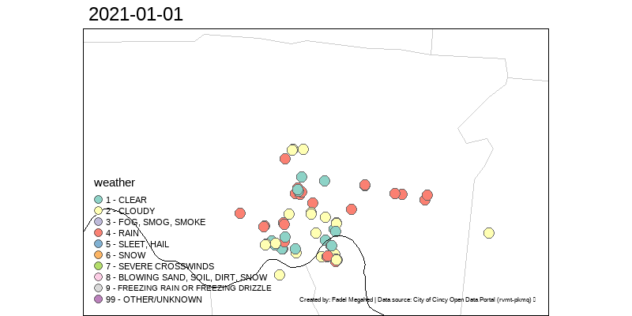


---

# The Analytics Journey: Descriptive [5]

`r countdown(minutes = 3, seconds = 0, top = 0, font_size = "2em")`

.panelset[

.panel[.panel-name[Activity]

- How do the previous two graphs complement each other?

- If you were to pick one of the two charts, which one is more informative?

- You will be asked to write down your answers on <www.menti.com> in the next two panels. 
]

.panel[.panel-name[Q1 Solution] 

<html>
<div style='position: relative; padding-bottom: 56.25%; padding-top: 6px; height: 0; overflow: hidden;'><iframe sandbox='allow-scripts allow-same-origin allow-presentation' allowfullscreen='true' allowtransparency='true' frameborder='0' height='315' src='https://www.mentimeter.com/embed/f00b3517a24d41dfb925639f375501d0/7187998e2fd8' style='position: absolute; top: 0; left: 0; width: 100%; height: 100%;' width='420'></iframe></div>
</html>

]

.panel[.panel-name[Q2 Solution] 

<html>
<div style='position: relative; padding-bottom: 56.25%; padding-top: 6px; height: 0; overflow: hidden;'><iframe sandbox='allow-scripts allow-same-origin allow-presentation' allowfullscreen='true' allowtransparency='true' frameborder='0' height='315' src='https://www.mentimeter.com/embed/9ad9847d9714ef4c50e9e5cd1ab83ad2/b258ac9f6e85' style='position: absolute; top: 0; left: 0; width: 100%; height: 100%;' width='420'></iframe></div>
</html>

]

]


---


--- 

# The Analytics Journey: Predictive [1]

- **Predictive Analytics:** where **statistical** and **machine learning** models are used to help us utilize indepedent variable[s] to predict an outcome variable of choice (which can be binary/dichotomous, multinomial/multi-class, or continous).  

  * From my teaching/research/consulting experience, **many** consider this component to be the `r emo::ji("cake")` aspect of the analytics journey.  
  
  * That being said, your success in this stage is **hinged on having**:  
      + **Correct** `r emo::ji("check")` data, i.e.,   
          - *Do you actually capture the important predictors as potential independent variables?*  
          - *Is your data aggregated to the right level?*  
      + **Cleaned** `r emo::ji("bath")` data, i.e.,   
          - *Is your data tidy?*   
          - *Is your data technically correct?* 
          - *Is your data consistent?* 
          
  * With the above constraints/setup, now you can explore how to model the data using statistical and machine learning models? **Some recommendations:**  
      + Start with the simplest (which is also often the most easy-to-explain) model first.  
      + If you are happy with the predictive performance (i.e., no gains would be of practical benefit), you are done `r emo::ji("clap")`.  
      + If not, `r emo::ji("return")` and try other models. 
      

---

# The Analytics Journey: Predictive [2]

- **Predictive Analytics:** where **statistical** and **machine learning** models are used to help us utilize indepedent variable[s] to predict an outcome variable of choice (which can be binary/dichotomous, multinomial/multi-class, or continous).  **For two transportation safety examples, see:** 

```{r two_papers, echo=FALSE, out.width='50%', fig.show="hold", fig.align='default'}
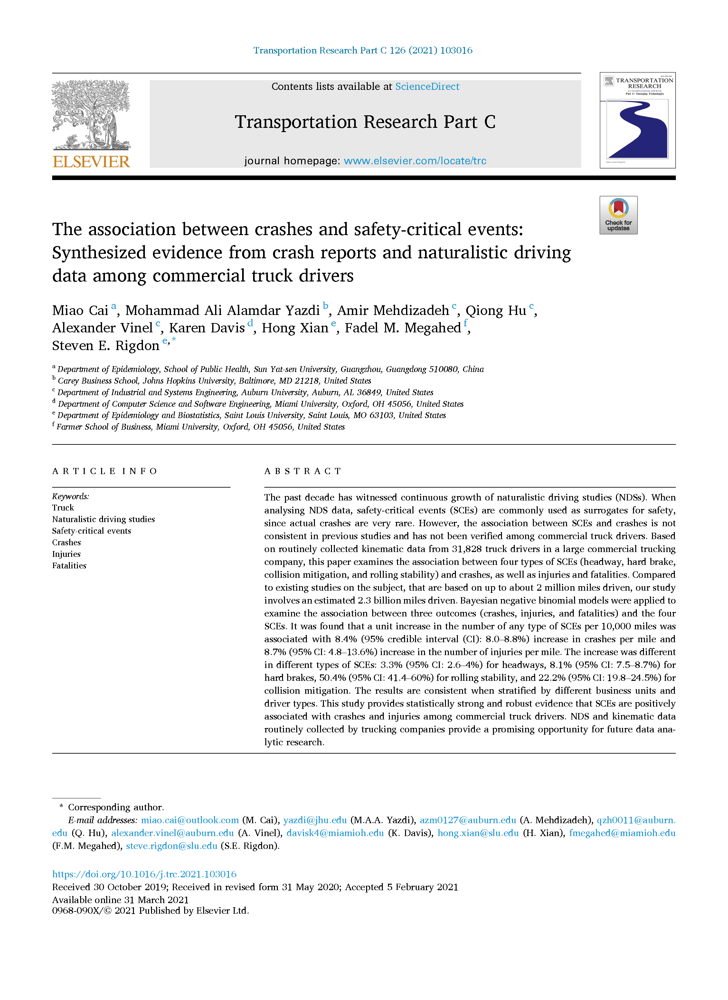
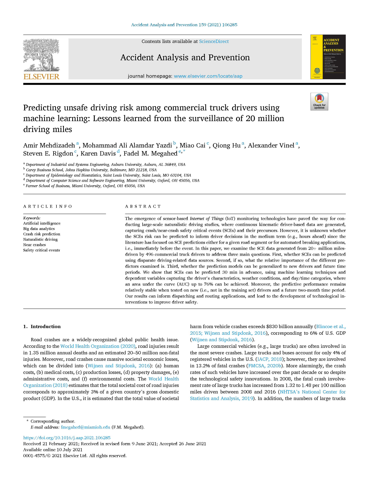
```


---

# The Analytics Journey: Prescriptive [1]

- **Prescriptive Analytics:** where **mathematical models** are used to make recommendations for business actions.  

- Recall that our **overarching goal** behind data/business analytics, is to **make informed decisions based on what we have learned from the data**. Hence, this stage is where we build on what we learned during the *descriptive* and *predictive* stages to make more informed decisions.  

- Now imagine that you are a large trucking company (e.g., Amazon, Fedex, JB Hunt, etc), and you have models that show **both**:   
    * The factors that your on-board sensors capture driving safety critical events that are associated with crashes.  
    * You have a reasonable model that helps you predict the occurrence of safety critical events as a function of:  
        + Driver characteristics  
        + Weather conditions 
        + Traffic conditions  

- **As a business analyst, what two reasonable questions would you attempt to approach/optimize for?**  

---

# The Analytics Journey: Prescriptive [2]

- **Prescriptive Analytics:** where **mathematical models** are used to make recommendations for business actions.  

### Non-Graded Class Activity # 3

`r countdown(minutes = 3, seconds = 0, top = 0, font_size = "2em")`

> _Take 3 minutes to formulate the two best questions with your partner_

.panelset[

.panel[.panel-name[Activity]

**As a business analyst, what two reasonable questions would you attempt to approach/optimize for?**

]

.panel[.panel-name[Your Solution] 

- Insert your solution here, **which you can do by capitalizing on the pencil icon on the top right of the screen**. This will likely only work if you are viewing this file outside of Canvas. 

]

.panel[.panel-name[Our Work in this Area] 

```{r qiong_ksp, echo=FALSE, out.width='450px', fig.alt="k-SP solution to feasible routes between Gary, IN and Nashville, TN", fig.align='center'}
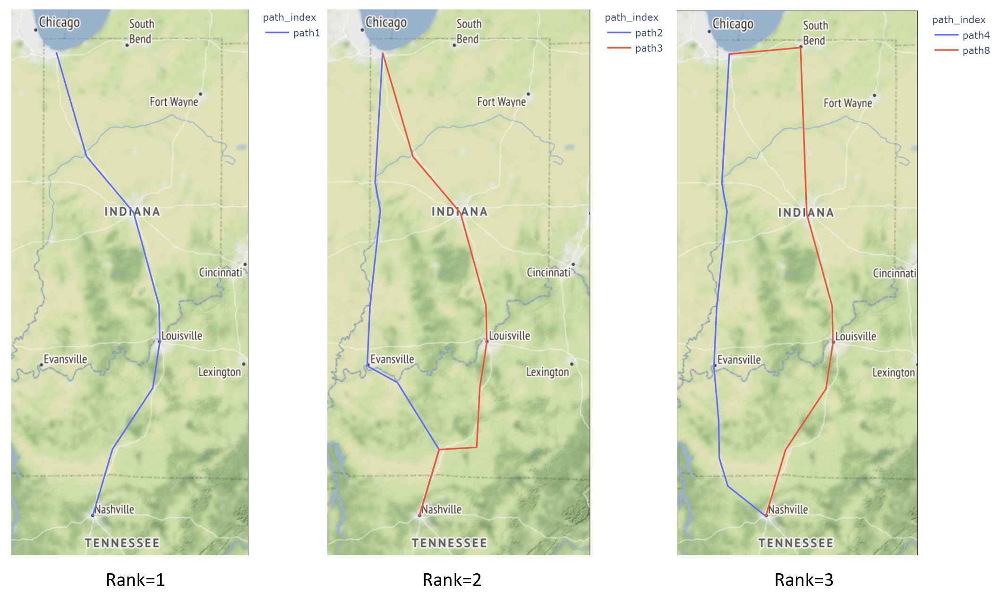
```

]

]


---

# How does our Curriculum at Miami University Prepare you for this Journey?

```{r run_latex_file, echo=FALSE, cache=TRUE, results='hide'}
tinytex::xelatex('figures/ba_flow_chart.tex')
Sys.sleep(30)
pdftools::pdf_convert('figures/ba_flow_chart.pdf', dpi = 600,
                      filenames = 'figures/ba_flow_chart.png')
Sys.sleep(30)
```


```{r read_ba_chart, echo=FALSE, out.width='100%', fig.alt="Fadel's take on our ISA curriculum", fig.align='center', fig.cap='My take on the courses within the business analytics major/minor at Miami University'}
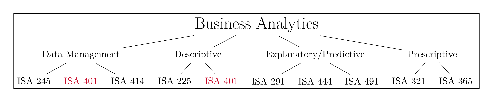
```

---

# ISA 401/501 Course: An Overview

```{r run_latex_file_2, echo=FALSE, cache=TRUE, results='hide'}
tinytex::xelatex('figures/course_overview.tex')
Sys.sleep(20)
pdftools::pdf_convert('figures/course_overview.pdf', dpi = 600,
                      filenames = 'figures/course_overview.png')
Sys.sleep(20)
```


```{r read_course__overview_chart, echo=FALSE, out.width='100%', fig.alt="How the ISA 401/501 course is organized.", fig.align='center', fig.cap='How the ISA 401/501 course is organized.'}
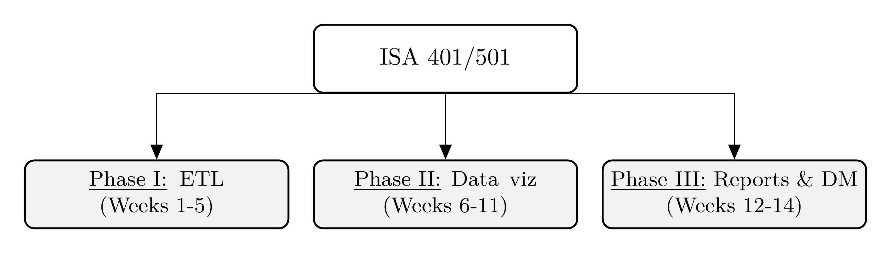 
```

---

# ISA 401/501 Course Objectives

Even though software will be extensively used, this is not a software class. **Instead, the focus is on understanding the underlying methods and mindset of how data should be approached.**  

  - Be capable of extracting, transforming and loading (ETL) data using multiple platforms
(e.g. R, Power BI and/or Tableau).  

- Write basic R scripts to preprocess and clean the data.  

- Explore the data using visualization approaches that are based on sound human factors.  

- Understand how statistical/machine learning can capitalize on the insights generated from the data visualization process.  

- Create interactive dashboards that can be used for business decision making, reporting and/or performance management.

- Be able to apply the skills from this class in your future career.


---

# Should you Care? Indeed [1]

```{r indeed1, echo=FALSE, out.width='50%', fig.cap= 'Entry-Level Data Wrangling Jobs on Indeed.com'}
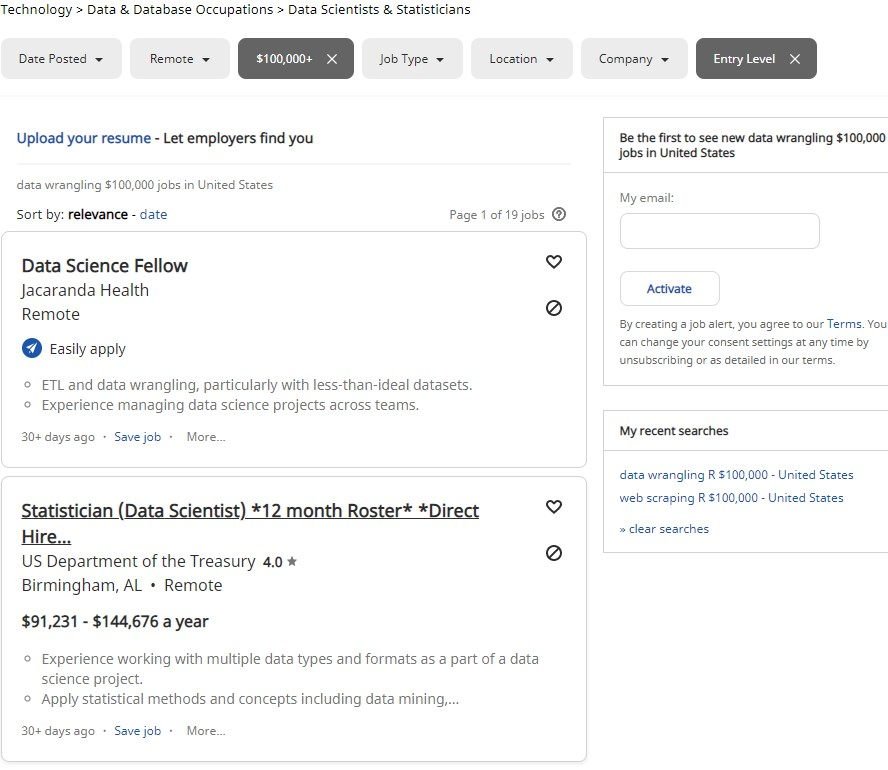
```

---

# Should you Care? Indeed [2]

```{r indeed2, echo=FALSE, out.width='50%', fig.cap= 'Entry-Level Data Visualization Jobs on Indeed.com'}
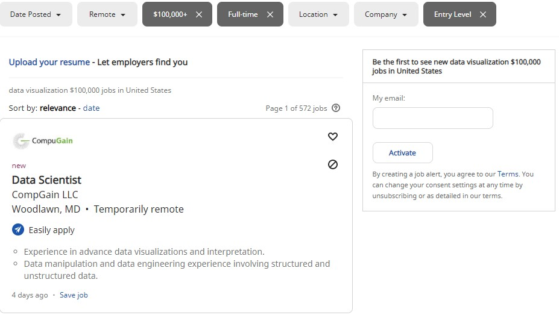
```


---

# Should you Care? Read this Job Ad

When I have designed this course, I have incorporated a lot of feedback from **industry collaborators, peer/leading academic programs, and state-of-the-art-research advancements.** Thus, this is meant to be a hands-on, practically-relevant course.  

### Non-Graded Class Activity # 4

`r countdown(minutes = 4, seconds = 0, top = 0, font_size = "2em")`

> _Take 4 minutes to pinpoint the **skills and qualifications that you have prior to taking this class**, and **document what you will learn in this course to make you more competitive**._  


.panelset[

.panel[.panel-name[Activity]

To demonstrate the practicality of this course, let us consider [this job ad](https://www.indeed.com/viewjob?jk=77f4cf1687882e41&tk=1eff1eg1op7cg800&from=serp&vjs=3).  
- Please open the Data Scientist (6257U) - CED Data Scientist position at UC - Berkeley by clicking [here](https://www.indeed.com/viewjob?jk=77f4cf1687882e41&tk=1eff1eg1op7cg800&from=serp&vjs=3).  

- Compare the **responsibilities** and the **required qualifications** with the course objectives.  

- Read through the required qualifications. 

- **Document what you will learn in this course to make you more competitive.**
]

.panel[.panel-name[Documentation Space]

]
]


---

# Should you Care? Recent Alumni Testimonials

```{r testimonials, echo=FALSE, out.width='100%', fig.fullwidth=TRUE, results='asis'}


cat('<br> <br>')


```


---

# Instructional Approach

```{r run_latex_file_3, echo=FALSE, cache=TRUE, results='hide'}
tinytex::xelatex('figures/instructional_approach.tex')
Sys.sleep(20)
pdftools::pdf_convert('figures/instructional_approach.pdf', dpi = 600,
                      filenames = 'figures/instructional_approach.png')
Sys.sleep(20)
```


```{r read_course_approach, echo=FALSE, out.width='100%', fig.alt="An overview of the instructional approach for ISA 401/501.", fig.align='center', fig.cap='An overview of the instructional approach for ISA 401/501.'}
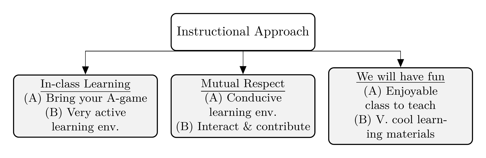 
```

---

# How will I Evaluate your Learning?

```{r run_latex_file_4, echo=FALSE, cache=TRUE, results='hide'}
tinytex::xelatex('figures/evaluation.tex')
Sys.sleep(20)
pdftools::pdf_convert('figures/evaluation.pdf', dpi = 600,
                      filenames = 'figures/evaluation.png')
Sys.sleep(20)
```


```{r read_evaluation, echo=FALSE, out.width='100%', fig.alt="An overview of the evaluation components for ISA 401/501.", fig.align='center', fig.cap='An overview of the evaluation components for ISA 401/501.'}
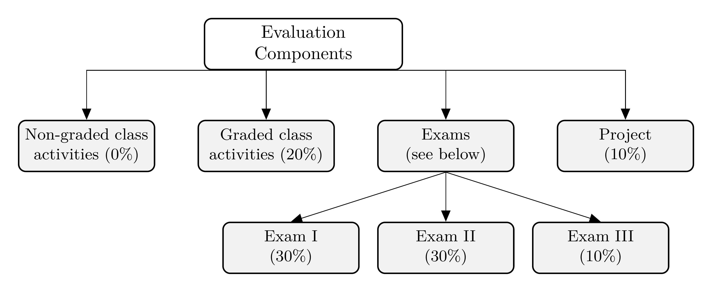 
```

---
class: inverse, center, middle

# Introductions: Getting to Know Each Other

---

# About Me – My route to Miami University

- Application of data-driven decisions (D3) in 3 continents.  

- **Interests:** Applications in logistics, manufacturing, occupational safety & portfolios.  

- **Collaborations with:** Aflac, GE Research, IBM Research, JB Hunt, & Tennibot

```{r my_map, echo=FALSE, out.width='100%', fig.alt="My journey with data driven decisions.", fig.align='center', fig.cap='My journey with data-driven decision making.'}
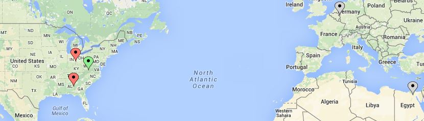 
```

---

# An Overview of My Research Portfolio

```{r research_megahed1, echo=FALSE, cache=TRUE, include=FALSE}
M = convert2df(file = "megahedWoS-1-16-2022.txt")

results = biblioAnalysis(M, sep = ";")

CS = conceptualStructure(M,
                         field="DE_TM",
                         method="MCA", minDegree=2, 
                         clust=4, labelsize=8, documents=45)
```


```{r research_megahed3, echo=FALSE, out.width='100%', fig.alt="My work can be grouped into four different clusters", fig.align='center', fig.cap='My work can be grouped into four different clusters.', dpi=300}
CS$graph_terms 
```


---

# Your Academic/Professional Experience

<html>
<div style='position: relative; padding-bottom: 56.25%; padding-top: 6px; height: 0; overflow: hidden;'><iframe sandbox='allow-scripts allow-same-origin allow-presentation' allowfullscreen='true' allowtransparency='true' frameborder='0' height='315' src='https://www.mentimeter.com/embed/f7eacf99768cd22270c18982864157f2/ea0cb318b3e0' style='position: absolute; top: 0; left: 0; width: 100%; height: 100%;' width='420'></iframe></div>
</html>

---

# Getting to Know Your Learning Objectives

<html>
<div style='position: relative; padding-bottom: 56.25%; padding-top: 6px; height: 0; overflow: hidden;'><iframe sandbox='allow-scripts allow-same-origin allow-presentation' allowfullscreen='true' allowtransparency='true' frameborder='0' height='315' src='https://www.mentimeter.com/embed/3d85154a0564812d34da0bb42e349428/6c73bccc31d3' style='position: absolute; top: 0; left: 0; width: 100%; height: 100%;' width='420'></iframe></div>
</html>

---
class: inverse, center, middle

# So What is Data Visualization?

---

# What is Data Visualization?

Data visualization involves **presenting data in a graphical format**. It is really a process that starts by getting data, creating initial plot(s) and modifying them to answer questions of interest (and possibly making the plot aesthetically pleasing). For example, see [Cedric Scherer's visualization of the UNESCO data on global student to teacher ratios](https://www.cedricscherer.com/2019/05/17/the-evolution-of-a-ggplot-ep.-1/).

```{r data_viz_gif, echo=FALSE, out.width='58%', interval=100, aniopts="controls"}
knitr::include_graphics('https://d33wubrfki0l68.cloudfront.net/1e7033393a2c70dc1255c5d0f1c563e945519251/61035/img/evol-ggplot/evol-ggplot-1.gif')
```

---

# The Goals of Data Visualization

- **Record** information  

- **Analyze** data to support reasoning  

  * Develop and assess hypotheses (EDA)  
  
  * Reveal patterns  
  
  * Discover errors in data  
  
- **Communicate** ideas to others  

  * Infographics  
  
  * Statistic charts  
  
  * Interactive charts 
  
  * Dashboards 
  
- **Interact with the data (which supports all the above)**

---

# Record: My Great Grandparents

```{r egyptian_civ, echo = FALSE, out.width='90%'}

```

---

# Record: A More Modern Example


<html>
<center>
<blockquote class="twitter-tweet"><p lang="en" dir="ltr">I&#39;m a sucker for clean tables. Last week, I used <a href="https://twitter.com/hashtag/RStats?src=hash&amp;ref_src=twsrc%5Etfw">#RStats</a> and gtExtra magic to summarize by Peloton data.<br><br>This week, I couldn&#39;t resist taking reactablefmtr for a test drive too. <a href="https://twitter.com/kc_analytics?ref_src=twsrc%5Etfw">@kc_analytics</a>, this package is beautiful!<br><br>🔗: <a href="https://t.co/9KZHjRsJFM">https://t.co/9KZHjRsJFM</a> <a href="https://t.co/Z18ddDM9SR">pic.twitter.com/Z18ddDM9SR</a></p>&mdash; Tanya Shapiro (@tanya_shapiro) <a href="https://twitter.com/tanya_shapiro/status/1480648097533509640?ref_src=twsrc%5Etfw">January 10, 2022</a></blockquote> <script async src="https://platform.twitter.com/widgets.js" charset="utf-8"></script>
</center>
</html>


---

# Analyze Data

```{r cincy_crashes, echo=FALSE, message=FALSE, fig.height=3.25}
unique_crashes_2021 = 
  crashes %>%
  mutate(datetime = parse_date_time(datecrashreported, 
                                    orders = "'%m/%d/%Y %I:%M:%S %p",
                                    tz = 'America/New_York',
                                    locale = "English"),
         hour = hour(datetime),
         date = as_date(datetime)
  ) %>% 
  filter(date >= "2021-01-01" & date <= "2021-12-31") %>% 
  group_by(instanceid) %>% 
  select(-datecrashreported) %>% 
  filter(typeofperson == 'D - DRIVER') %>% 
  select(instanceid, date, dayofweek, hour, weather, 
         address_x, latitude_x, longitude_x, cpd_neighborhood) %>%
  unique() %>% 
  mutate(month = month(date, label = TRUE)) %>% 
  ungroup()

unique_crashes_2021 %<>% 
  filter(cpd_neighborhood %in% c('C. B. D. / RIVERFRONT',
                                 'WEST PRICE HILL')
         ) %>% 
  select(month, cpd_neighborhood, instanceid) %>% 
  group_by(month, cpd_neighborhood) %>% 
  count()

unique_crashes_2021 %>% 
  ungroup() %>% 
  ggplot(aes(x = month, y = n, group = cpd_neighborhood)) +
  geom_line(color = miamired, size = 1.25) +
  geom_point(color = miamired, size = 2.5) +
  facet_wrap(~ cpd_neighborhood, nrow = 1, ncol = 2) +
  theme_bw(base_size = 12) +
  scale_y_continuous(breaks = pretty_breaks(n = 10), limits = c(0, 200)) +
  labs(x = 'Month', y = 'Crashes per Month', 
       title = 'Crashes Recorded in Two Cincinnati Neighborhoods in 2021',
       caption = 'Created by: Fadel Megahed | Data source: City of Cincy Open Data Portal (rvmt-pkmq)')
```

---

# Reveal Patterns: The 1854 Cholera Outbreak

```{r cholera_outbreak, echo=FALSE, fig.cap='The physician John Snow, dealing with a Cholera outbreak plotted the cases on a map of the city (see schematic above).', out.width='35%'}
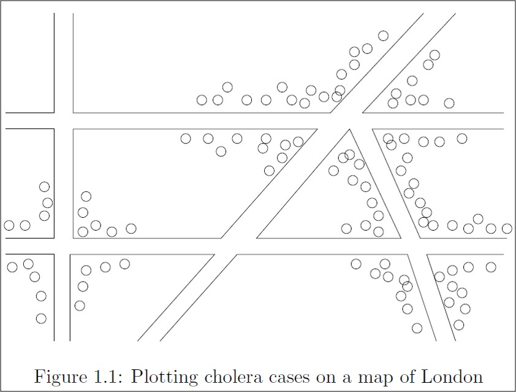
```


.footnote[
<html>
<hr>
</html>

**Credits:**  
- Source: Leskovec, J., Rajaraman, A., & Ullman, J. D. (2020). Mining of Massive Data Sets (Third Edition). Cambridge University Press.  Image is from Chapter 1, which can be accessed [here](http://infolab.stanford.edu/~ullman/mmds/ch1n.pdf).
]

---

# Reveal Patterns: COVID-19 Vaccination Rates

```{r vaccine_rates, echo=FALSE, out.width='70%'}
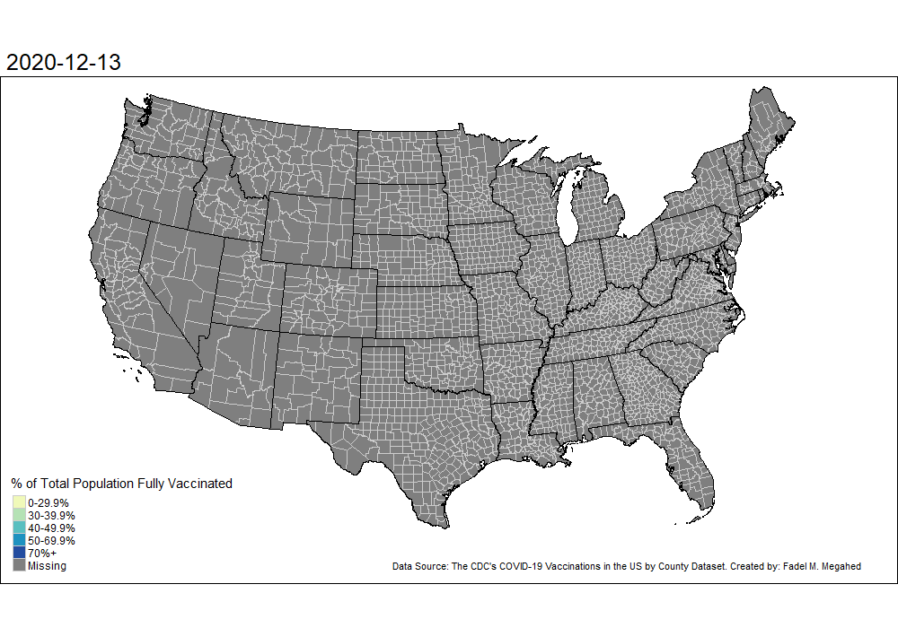
```

---

# Communicate Ideas: C.J Minard 1869

```{r minard, echo=FALSE, out.width='100%'}
knitr::include_graphics("figures/minard.png")
```


---

# Communicate Ideas

`r countdown(minutes = 5, seconds = 0, top = 0, font_size = "2em")`

.panelset[

.panel[.panel-name[Activity]

.pull-left[
### Non-Graded Class Activity #5

> _Take 5 minutes to discuss this visualization from the WA Post with a colleague_

- Who is the target audience?  

- What is the data represented in this visualization? Be Specific.  

- How is the data visually encoded?  

- Do you like/dislike this visualization? Why?  

- Would you do visualization like this for a similar dataset? Why? Why not?
]

.pull-right[
```{r wpost, echo=FALSE, out.width='77%'}

```
]
]

.panel[.panel-name[Your Solution]

]
]


---

# Interact

<html>
<center>
<div style="max-width:854px"><div style="position:relative;height:0;padding-bottom:56.25%"><iframe src="https://embed.ted.com/talks/lang/en/hans_rosling_the_best_stats_you_ve_ever_seen" width="854" height="480" style="position:absolute;left:0;top:0;width:100%;height:100%" frameborder="0" scrolling="no" allowfullscreen></iframe></div></div>
</center>
</html>


---
class: inverse, center, middle

# Business Intelligence: From Visualizations to Dashboards to Insights

---

# What is Business Intelligence?

"... to enable **interactive access (sometimes in real time)** to data, to enable manipulation of data, and to give business managers and analysts the ability to conduct appropriate analysis.
By analyzing ... data, situations, and performances, decision makers get valuable insights that enable them to **make more informed and better decisions** ... BI is based on the **transformation of data to information, then to decisions, and finally to actions.**" 

```{r bin_paper, echo=FALSE, fig.alt="A schematic of an interactive BI tool for stock market prediction", out.width="55%"}
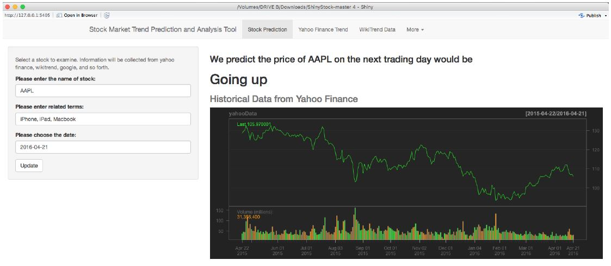
```

.footnote[
<html>
<hr>
</html>

- **Quote** from Sharda, R., Delen, D., & Turban, E. (2013). Business Intelligence: A managerial perspective on analytics. Prentice Hall Press.    

- **Image Credit:** Joint work with Bin Weng.   
]

---

# The BI Process

```{r bi_process, echo=FALSE, fig.alt="A schematic of the different components of the business intelligence (BI) process", out.width="73%"}
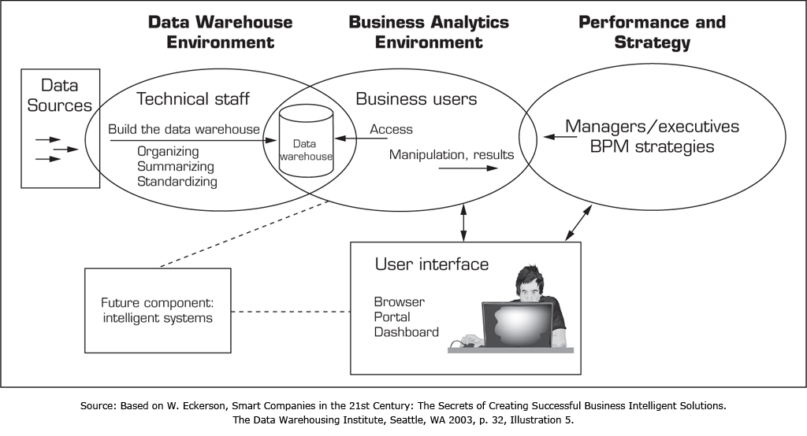
```


.footnote[
<html>
<hr>
</html>

- **Image Credit:** Sharda, R., Delen, D., & Turban, E. (2013). Business Intelligence: A managerial perspective on analytics. Prentice Hall Press.    
]


---
class: inverse, center, middle

# `r fontawesome::fa("r-project")`


---

# Pedagogy Behind Using `r fontawesome::fa("r-project")` in this Course [1]

```{r prog_lang, eval=FALSE}
crashes = 
  # reading the data directly from the source
  read_csv("https://data.cincinnati-oh.gov/api/views/rvmt-pkmq/rows.csv?accessType=DOWNLOAD") %>% 
  # changing all variable names to snake_case
  clean_names() %>% 
  # selecting variables of interest
  select(address_x, latitude_x, longitude_x, cpd_neighborhood, datecrashreported, instanceid, 
         typeofperson, weather) %>%
  # engineering some features from the data
  mutate(
    datetime = parse_date_time(datecrashreported, 
                               orders = "'%m/%d/%Y %I:%M:%S %p", tz =  'America/New_York'),
    hour = hour(datetime),
    date = as_date(datetime)
  )
```

### The Beauty of Programming Languages 

- Programming languages are **languages**.  

- Per [Hadley Wickham](https://speakerdeck.com/hadley/you-cant-do-data-science-in-a-gui?slide=14), **it's just text** -- which gives you access to **two extremely powerful techniques**!!!  


---

# Pedagogy Behind Using `r fontawesome::fa("r-project")` in this Course [2]


### The Beauty of Programming Languages (Continued)

- .large[`Ctrl` + `C` `r fontawesome::fa("copy", fill = miamired)`] 

- .large[`Ctrl` + `V`] `r fontawesome::fa("paste", fill = miamired)`

- In addition, programming languages are generally  

  + Readable (IMO way easier than trying to figure what someone did in an `r fontawesome::fa("file-excel", fill = 'green')`)  
  
  + Open (so you can `r fontawesome::fa("google", fill = miamired)` it)  
  
  + Reusable and reproducible (so you can reuse your code for similar problems and other people can get the same results as you easily)  
  
  + Diffable (version control is extremely powerful)


---

# Pedagogy Behind Using `r fontawesome::fa("r-project")` in this Course [3]

### Why `r fontawesome::fa("r-project")` Specifically?

- It is a general-purpose programming language, which originated for statistical analysis.  

- As of `r Sys.Date() %>% format(format = '%B %d, %Y')`, there are currently `r available.packages() %>% nrow() %>% comma()` packages on [The Comprehensive R Archive Network (CRAN)](https://cran.r-project.org/). Note that this does not capture the large number of packages that are found on GitHub (either because they are still in development or that their owners do not want to place them on CRAN).   

- The `tidyverse` group of packages have simplified the workflow for data analytics/science.  


---

# How to Learn R (Any Programming Language)

<html>
<center>
<iframe src="https://giphy.com/embed/xonOzxf2M8hNu" width="240" height="135" frameBorder="0" class="giphy-embed" allowFullScreen></iframe>
</center>
</html>

* `r emo::ji("speaking_head")` **Get hands dirty**`r emo::ji("bangbang")`  

* `r emo::ji("open_book")` Documentation! Documentation! Documentation!  

* `r emo::ji("search")` (Not surprisingly) Learn to Google: what that error message means (I Google a lot `r emo::ji("laugh")`)

.footnote[
<html>

<hr>

</html>

**Source:** Slide is based on [Kia Ora's How I Learn a Technology](https://stats220.earo.me/01-intro.html#7).
]


---
class: inverse, center, middle

# `r fontawesome::fa("r-project")` 101


---

# Assignment

The first set of operators that you should know about in R is for assignment. `r fontawesome::fa("r-project")` has three assignment operators: <-, =, and ->,  which can be used as follows.  

```{r assignment_operators}
x1 <- 5

x2 = 5

5 -> x3

print(paste0("The values of x1, x2, and x3 are ", x1, ", ", x2, ", and ", x3,
             " respectively"))
```

The operator <- can be written using the shortcut `Alt` + `-` on a Windows machine. If we focus on the first two operators, you would notice that the assignment consists of three parts:  

  - The left-hand side: **variable names** (`x1` or `x2`), 
  - The assignment operator: `<-` (or alternatively `=`), and 
  - The right-hand side: **values** (``r x1``)


---
class: inverse, center, middle

# Recap

---

# Summary of Main Points

By now, you should be able to do the following:  

