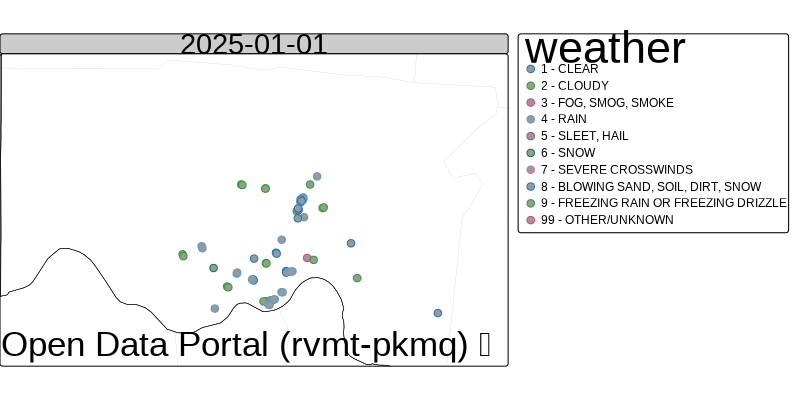
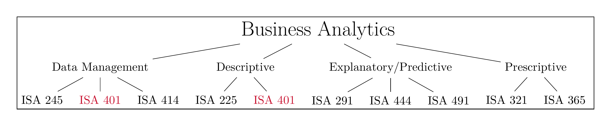
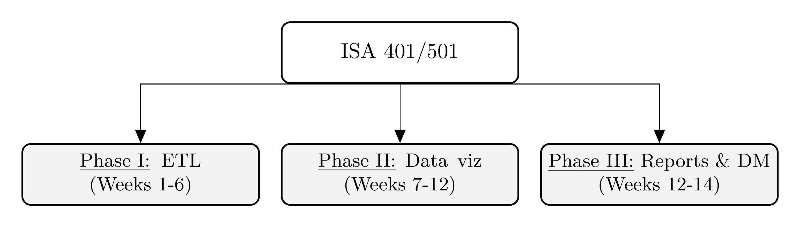
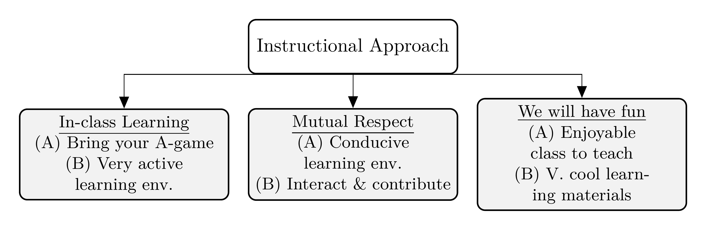
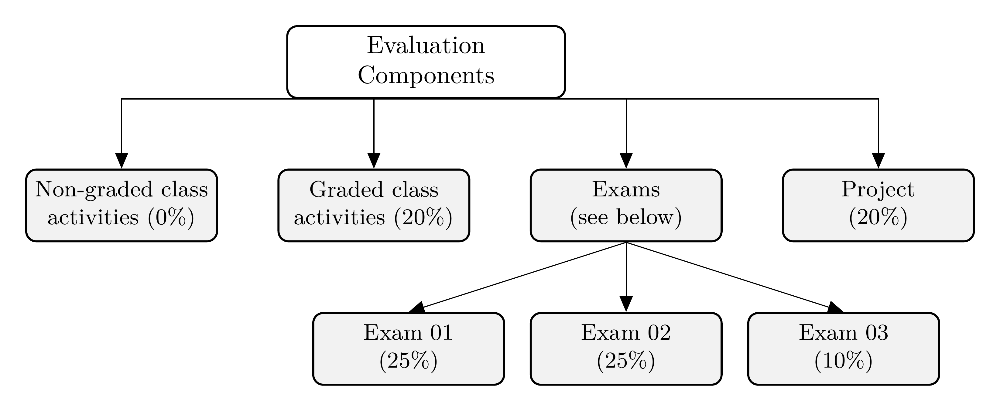
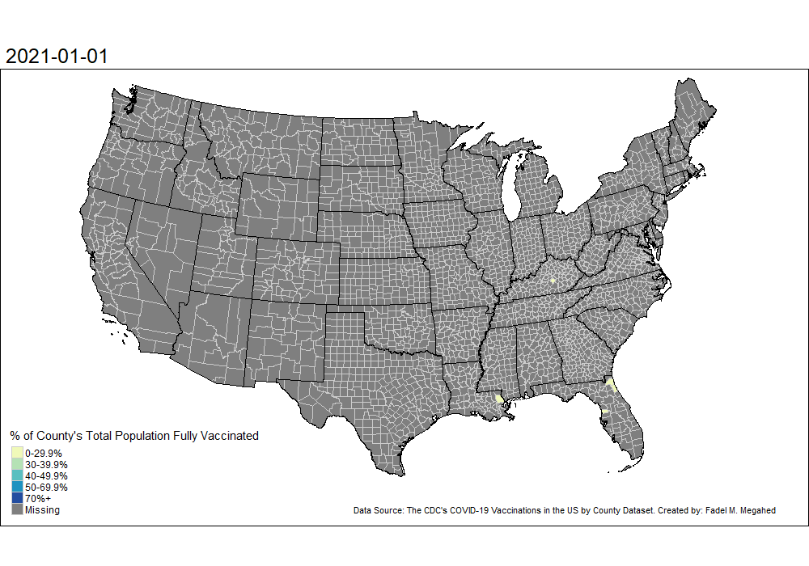
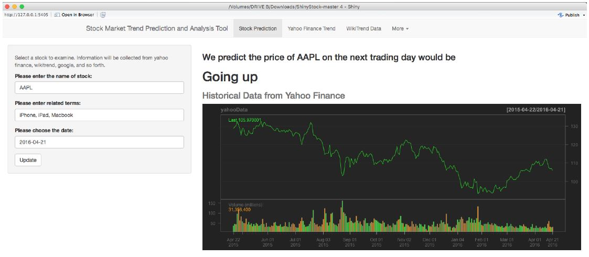
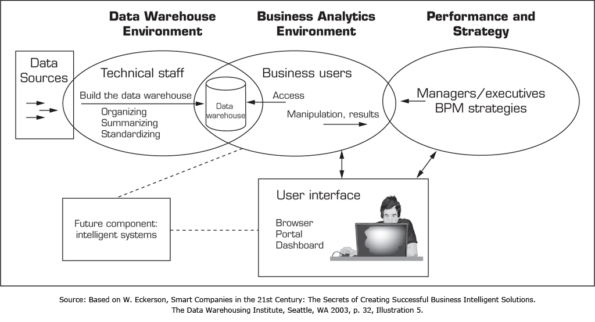

```{r setup, include=FALSE}
knitr::opts_chunk$set(cache = FALSE,
                      echo = TRUE,
                      warning = FALSE,
                      message = FALSE,
                      progress = FALSE, 
                      verbose = FALSE,
                      dev = 'png',
                      fig.height = 3,
                      dpi = 300,
                      fig.align = 'center')

options(htmltools.dir.version = FALSE)


miamired = '#C3142D'

if(require(pacman)==FALSE) install.packages("pacman")
if(require(devtools)==FALSE) install.packages("devtools")
if(require(countdown)==FALSE) devtools::install_github("gadenbuie/countdown")
if(require(xaringanExtra)==FALSE) devtools::install_github("gadenbuie/xaringanExtra")
if(require(urbnmapr)==FALSE) devtools::install_github('UrbanInstitute/urbnmapr')
if(require(emo)==FALSE) devtools::install_github("hadley/emo")

pacman::p_load(tidyverse, magrittr, lubridate, janitor, # data analysis pkgs
               DataExplorer, scales, plotly, calendR, pdftools, # plots
               tmap, sf, urbnmapr, tigris, # maps
               bibliometrix, # for bibliometric analysis of my papers
               gifski, av, gganimate, ggtext, glue, extrafont, # for animations
               emojifont, emo, RefManageR, xaringanExtra, countdown) # for slides
```

```{r xaringan-themer, include=FALSE, warning=FALSE}
if(require(xaringanthemer) == FALSE) install.packages("xaringanthemer")
library(xaringanthemer)

style_mono_accent(base_color = "#84d6d3",
                  base_font_size = "20px")

xaringanExtra::use_xaringan_extra(c("tile_view", "animate_css", "tachyons", "panelset", "broadcast", "share_again", "search", "fit_screen", "editable", "clipboard"))

```


# Learning Objectives for Today's Class

- Describe **course objectives** and **structure**.  

- Define **data visualization** and describe its **main goals**.    

- Describe the **BI methodology** and its **major concepts**. 


---
class: inverse, center, middle

# Course Design, Expectations, and Overview

---

# The Analytics Journey: Pre-Analytics [1]

- **Pre-Analytics/Data Management:** where one attempts to **extract** the needed
*data* for analysis.  Data can either be:  
.div[
.pull-left[
## .center[.large[.large[.large[`r emo::ji("canned_food")`]]]]
* Stale, uninteresting, convenient 
* Highly processed and archived
* Example: `iris`, `mtcars`, `titanic`
]
.pull-right[
## .center[.large[.large[.large[`r emo::ji("tomato")`]]]]
* Fresh, interesting, challenging 
* Impactful
* Examples: [Cincinnati Open Data Portal](https://data.cincinnati-oh.gov/), 
[Ohio Data Portal](https://data.ohio.gov/wps/portal/gov/data/), [US Government's Open Data](https://www.data.gov/).
]
]

.footnote[
<html>
<hr>
</html>

While the highly processed data can be useful in learning basic concepts, **real-world (often messy)** data real are much interesting to work with -- **e.g.,  we can make useful & meaningful decision from the data.** In this class, we will learn how to scrape, extract and clean messy data in addition to visualizing clean[ed] data.   

Source: Slide inspired by [Kia Ora's What I mean by "data"](https://stats220.earo.me/01-intro.html#6). 
]


---

# The Analytics Journey: Pre-Analytics [2]

### Non-Graded Class Activity #1

`r countdown(minutes = 5, seconds = 0, top = 0, font_size = "2em")`

> _Take 5 minutes to discuss with your partner_

.panelset[

.panel[.panel-name[Activity]

- Go to <https://data.cincinnati-oh.gov/Safety/Traffic-Crash-Reports-CPD-/rvmt-pkmq/data>

- Download the data utilizing the export column and answer the following questions:  

  * How many **observations/rows** and **columns** do we have in the dataset?   
  
  * How many **crashes** are reported in the dataset?
]

.panel[.panel-name[Your Solution] 

- .can-edit.key-activity1[Insert your solution here (Use Chrome as your browser to edit this part of the page)] 

]

.panel[.panel-name[Fadel's Approach (No Solution Shown)]

```{r activity1-solution, eval=FALSE}
if(require(tidyverse) == FALSE) install.packages("tidyverse")

# Link obtained from site -> Export -> "Right Click on" CSV
crashes = readr::read_csv("https://data.cincinnati-oh.gov/api/views/rvmt-pkmq/rows.csv?accessType=DOWNLOAD")

# Number of rows and columns
nrow(crashes)
ncol(crashes)
# Or alternatively
dim(crashes)

# Total number of crashes
# Will be discussed in class in greater detail
```

]


]

---


# The Analytics Journey: Descriptive [1]

**Descriptive Analytics:** where one attempts to **understand** the data through **descriptive statistics** and **visualizations**.

### Descriptive Statistics for 2 Categorical Variables
```{r extract_crashes, cache=TRUE, echo=FALSE}
crashes = readr::read_csv("https://data.cincinnati-oh.gov/api/views/rvmt-pkmq/rows.csv?accessType=DOWNLOAD") |> 
  janitor::clean_names() |> 
  dplyr::select(address_x, latitude_x, longitude_x, age, 
         cpd_neighborhood, crashseverity, 
         datecrashreported, dayofweek, gender, injuries, 
         instanceid,
         typeofperson, weather)
```

.small[

```{r desc_stats, echo=FALSE}
crashes %<>% 
  dplyr::mutate(
    datetime = lubridate::parse_date_time(
      datecrashreported, 
      orders = "'%m/%d/%Y %I:%M:%S %p",
      tz = 'America/New_York',
      locale = "English"
    ),
    hour = hour(datetime),
    date = as_date(datetime)
  )

unique_crashes = 
  crashes  |> 
  dplyr::filter(date >= "2024-01-01" & date <= "2024-12-31") |> 
  dplyr::group_by(instanceid) |> 
  dplyr::select(-datecrashreported) |> 
  dplyr::filter(typeofperson == 'D - DRIVER') |> 
  dplyr::select(instanceid, date, dayofweek, hour, weather, 
                address_x, latitude_x, longitude_x) |>
  unique() |> 
  dplyr::mutate(
    dayofweek = forcats::as_factor(dayofweek),
    hour = forcats::as_factor(hour),
    weather = forcats::as_factor(weather)
  ) |> 
  dplyr::ungroup()

unique_crashes |> dplyr::select(dayofweek, weather) |> 
  purrr::map(.f = table)
  
```

]


---

# The Analytics Journey: Descriptive [2]

**Descriptive Analytics:** where one attempts to **understand** the data through **descriptive statistics** and **visualizations**.

### A Simple Visualization - A Bar Chart of Crashes Per Day

```{r viz, echo=FALSE, fig.height=2.25}
unique_crashes |> 
  dplyr::select(dayofweek) |> 
  dplyr::group_by(dayofweek) |> 
  dplyr::count() -> day_of_week_tbl

day_of_week_tbl |> 
  dplyr::mutate(
    dayofweek = ordered(dayofweek, 
      levels=c("SUN", "SAT", "FRI", "THU", "WED", "TUES", "MON")
    )
  ) |> 
  ggplot2::ggplot(ggplot2::aes(x= n, y = dayofweek)) +
  ggplot2::geom_col(fill = miamired) +
  ggplot2::theme_bw(base_size = 12) + 
  ggplot2::labs(x = 'Count/Freq', y = 'Day of the Week',
       title = 'Crashes by Day in Cincinnati in 2024',
       caption = 'Created by: Fadel Megahed | Data source: City of Cincy Open Data Portal (rvmt-pkmq)') 
```

---

# The Analytics Journey: Descriptive [3]

**Descriptive Analytics:** where one attempts to **understand** the data through **descriptive statistics** and **visualizations**.

```{r viz2a, echo=FALSE, cache=TRUE, fig.height=2.85}
weather_levels = levels(unique_crashes$weather)

daily_crashes_2024= unique_crashes |> 
  dplyr::mutate(weather = factor(weather, levels = sort(weather_levels))) |> 
  dplyr::select(instanceid, date, weather) |> 
  dplyr::group_by(date) |> 
  dplyr::count()
  
cal = calendR::calendR(
  title = NULL,
  year = 2024,
  special.days = daily_crashes_2024$n,
  orientation = "landscape",
  day.size = 2,
  months.size = 8,
  weeknames.size = 3,
  margin = 0,
  text.size = 8,
  title.size = 14,
  gradient = TRUE,
  low.col = "#FFFFED",
  special.col = miamired,
  legend.pos = 'right',
  legend.title = '# Crashes') + 
  ggplot2::theme(
    plot.title = ggplot2::element_text(face = 'bold', color =  miamired),
    legend.title = ggplot2::element_text(face = 'bold', size = 9), 
    legend.text = ggplot2::element_text(size = 7),
    plot.caption = ggplot2::element_text(size = 7)
    ) +
  ggplot2::labs(caption = 'Created by: Fadel Megahed | Data source: City of Cincy Open Data Portal (rvmt-pkmq)')

cal

```


---

# The Analytics Journey: Descriptive [4]

**Descriptive Analytics:** where one attempts to **understand** the data through **descriptive statistics** and **visualizations**.


```{r viz2b, echo=FALSE, eval=FALSE}
cty_sf = get_urbn_map(map = "counties", sf = TRUE) |> 
  filter(state_name %in% c('Ohio', 'Kentucky', 'Indiana') )

# Getting the states map from the urbnmapr package and excluding non-continental US
states_sf = get_urbn_map(map = "states", sf = TRUE) |> 
  filter(state_name %in% c('Ohio', 'Kentucky', 'Indiana') )

crashes_sf= unique_crashes |> 
  mutate(weather = factor(weather,
                          levels = sort(weather_levels))) |> 
  drop_na(longitude_x, latitude_x) |> 
  filter(latitude_x > 38.5) |> 
  st_as_sf(coords = c("longitude_x", "latitude_x"), crs = 4326) |> 
  st_jitter(factor = 0.001)

bbox_new = st_bbox(cty_sf)

xrange = bbox_new$xmax - bbox_new$xmin # range of x values
yrange = bbox_new$ymax - bbox_new$ymin # range of y values
bbox_new[1] = bbox_new[1] - (0.05 * xrange) # xmin - left
bbox_new[3] = bbox_new[3] + (0.05 * xrange) # xmax - right
bbox_new[2] = bbox_new[2] - (0.05 * yrange) # ymin - bottom


tm_base = tm_shape(crashes_sf) + 
  tm_bubbles(size = 0.5, col = 'weather') +
  tm_facets(along='date', free.coords = F) +
  tm_shape(cty_sf, bbox = bbox_new) +
  tm_borders(col = "gray80", lwd = 0.15) +
  tm_shape(states_sf) + 
  tm_borders(col = "black", lwd = 0.5) +
  tm_credits("Created by: Fadel Megahed | Data source: City of Cincy Open Data Portal (rvmt-pkmq) \t")
  

tmap_animation(tm_base, filename = '../../figures/crash_anim.gif', fps = 4,
               outer.margins = 0,
               width = 800, height = 400)
```

```{r viz2bprint, fig.height=2.85, echo=FALSE}

```


--- 


---

# The Analytics Journey: Predictive [1]

**Predictive Analytics:** where **statistical** and **machine learning** models are used to help us utilize independent variable[s] to predict an outcome variable of choice.   
  * **Many** consider this component to be the `r emo::ji("cake")` aspect of the analytics journey.  
  
  * IMO, this is not always true, but your success in this stage is **hinged on**:  
      + **Correct** `r emo::ji("check")` data, i.e.,   
          - *Do you actually capture the important predictors?*  
          - *Is your data aggregated to the right level?*  
      + **Cleaned** `r emo::ji("bath")` data, i.e.,   
          - *Is your data tidy?*   
          - *Is your data technically correct?* 
          - *Is your data consistent?*   
          
---

# The Analytics Journey: Predictive [2]

**Predictive Analytics:** where **statistical** and **machine learning** models are used to help us utilize independent variable[s] to predict an outcome variable of choice.   
          
  * With the aforementioned constraints/setup, now you can explore how to model the data using statistical and machine learning models? 
  
  * **Some recommendations:**  
      + Start with the simplest (which is also often the most easy-to-explain) model first.  
      + If you are happy with the predictive performance (i.e., no gains would be of practical benefit), you are done `r emo::ji("clap")`.  
      + If not, `r emo::ji("return")` and try other models. 


---

# The Analytics Journey: Prescriptive

 **Prescriptive Analytics:** where **mathematical models** are used to make recommendations for business actions.  

- Our **overarching goal** behind data/business analytics, is to **make informed decisions based on what we have learned from the data**. Hence, this stage is where we build on what we learned during the *descriptive* and *predictive* stages to make more informed decisions.  

- Imagine that you are a large trucking company (e.g., Amazon, Fedex, JB Hunt), and you have models that show **both**:   
    * Safety critical events that are associated with crashes.  
    * The occurrence of safety critical events can be reasonably predicted as a function of:  (a) driver characteristics, (b) weather conditions, and (c) traffic conditions.  

- **As a business analyst, what two reasonable questions would you attempt to approach/optimize for?**  

---

# How does our Curriculum at Miami University Prepare you for this Journey?

```{r run_latex_file, echo=FALSE, cache=TRUE, results='hide'}
tinytex::xelatex('../../figures/ba_flow_chart.tex')
Sys.sleep(2)
pdftools::pdf_convert('../../figures/ba_flow_chart.pdf', dpi = 600,
                      filenames = '../../figures/ba_flow_chart.png')
Sys.sleep(2)
```


```{r read_ba_chart, echo=FALSE, out.width='100%', fig.alt="Fadel's take on our ISA curriculum", fig.align='center', fig.cap='My take on the courses within the business analytics major/minor at Miami University'}

```

---

# ISA 401 Course: An Overview

```{r run_latex_file_2, echo=FALSE, cache=TRUE, results='hide'}
tinytex::xelatex('../../figures/course_overview.tex')
Sys.sleep(2)
pdftools::pdf_convert('../../figures/course_overview.pdf', dpi = 600,
                      filenames = '../../figures/course_overview.png')
Sys.sleep(2)
```


```{r read_course__overview_chart, echo=FALSE, out.width='100%', fig.alt="How the ISA 401 course is organized.", fig.align='center', fig.cap='How the ISA 401 course is organized.'}
 
```

---

# ISA 401 Course Objectives

Even though software will be extensively used, this is not a software class. **Instead, the focus is on understanding the underlying methods and mindset of how data should be approached.**  

  - Be capable of extracting, transforming and loading (ETL) data using multiple platforms
(e.g. `r icons::icon_style(icons::fontawesome('r-project'), fill = miamired)`, Power BI and/or Tableau).  

- Write basic scripts to preprocess and clean the data.  

- Explore the data using visualization approaches that are based on sound human factors.  

- Understand how statistical/machine learning can capitalize on the insights generated from the data visualization process.  

- Create interactive dashboards that can be used for business decision making, reporting and/or performance management.

- Be able to apply the skills from this class in your future career.

---

# Instructional Approach

```{r run_latex_file_3, echo=FALSE, cache=TRUE, results='hide'}
tinytex::xelatex('../../figures/instructional_approach.tex')
Sys.sleep(20)
pdftools::pdf_convert('../../figures/instructional_approach.pdf', dpi = 600,
                      filenames = '../../figures/instructional_approach.png')
Sys.sleep(20)
```


```{r read_course_approach, echo=FALSE, out.width='100%', fig.alt="An overview of the instructional approach for ISA 401.", fig.align='center', fig.cap='An overview of the instructional approach for ISA 401.'}
 
```

---

# How will I Evaluate your Learning?

```{r run_latex_file_4, echo=FALSE, cache=TRUE, results='hide'}
tinytex::xelatex('../../figures/evaluation.tex')
Sys.sleep(2)
pdftools::pdf_convert('../../figures/evaluation.pdf', dpi = 600,
                      filenames = '../../figures/evaluation.png')
Sys.sleep(2)
```


```{r read_evaluation, echo=FALSE, out.width='100%', fig.alt="An overview of the evaluation components for ISA 401.", fig.align='center', fig.cap='An overview of the evaluation components for ISA 401.'}
 
```

---
class: inverse, center, middle

# Introductions: Getting to Know Each Other

---

# About Me – My route to Miami University

- Application of data-driven decisions (D3) in 3 continents.  

- **Interests:** Applications in logistics, manufacturing, occupational safety & portfolios.  

- **Collaborations with:** Aflac, GE Research, Gore, IBM Research, & Tennibot

```{r my_map, echo=FALSE, out.width='100%', fig.alt="My journey with data driven decisions.", fig.align='center', fig.cap='My journey with data-driven decision making.'}
# animated map based on the excellent blog by: Shannon Pileggi
# https://www.pipinghotdata.com/posts/2021-02-15-gganimating-a-geographic-introduction/

residence = tribble(
  ~city,           ~state,  ~lat,   ~long, ~years, ~description,
  "Cairo",         "Egypt", 30.0444,  31.2357,  20,    "Childhood and <br> Undergrad at the <br> American University in Cairo (AUC)",
  "Aachen",      "Germany", 50.7753,  6.083611,   0.33,    "Undergraduate Research Assistant <br> at RWTH Aachen",
  "Cairo",         "Egypt", 30.0444,  31.2357,  1,    "Finishing up my Undergrad <br> at AUC",
  "Blacksburg", "Virginia", 37.2296, -80.4139,   4,    "MS and PhD in <br> Industrial & Systems Engineering (ISE) <br> Graduate Research Assistant and <br> Instructor",
  "Auburn",    "Alabama", 32.6099,  -85.4808, 4,    "Assistant Professor of <br> Industrial and Systems Engineering <br> Auburn University",
  "Oxford",      "Ohio", 39.5070,  -84.7452,   8,    "Professor of <br> Business Analytics <br> Farmer School of Business <br> Miami University"
) 


residence_connections_prelim <- residence |> 
  mutate(
    # need this to create transition state ----
    city_order = row_number() + 1,
    # where I moved to next, for curved arrows ----
    lat_next = lead(lat),
    long_next = lead(long),
    # label to show in plot, styled using ggtext ---
    label = glue::glue("**{city}, {state}** ({years} yrs)<br>*{description}*"),
    # label of next location ----
    label_next = lead(label)
  ) 


residence_connections <- residence_connections_prelim |>
  # get first row of residence ----
slice(1) |> 
  # manually modify for plotting ----
mutate(
  city_order = 1,
  label_next = label,
  lat_next = lat,
  long_next = long,
) |> 
  # combine with all other residences ----
bind_rows(residence_connections_prelim) |> 
  # last (7th) row irrelevant ----
slice(1:6) |> 
  # keep what we neeed ----
dplyr::select(city_order, lat, long, lat_next, long_next, label_next)


world_map =  ggplot2::map_data("world") |> 
  filter(region != 'Antarctica' &
           lat >0 & lat <70 &
           long <50 & long > -130)

base_map <- ggplot() +
  # plot states ----
geom_polygon(
  data = world_map,
  aes(
    x     = long, 
    y     = lat, 
    group = group
  ),
  fill  = "#F2F2F2",
  color = "white"
) +
  # lines for pins ----
geom_segment(
  data = residence,
  aes(
    x    = long,
    xend = long,
    y    = lat,
    yend = lat + 2
  ),
  color = "#181818",
  size = 1
) +
  # pin heads, a bit above actual location, color with R ladies lighter purple ----
geom_point(
  data = residence,
  aes(
    x = long, 
    y = lat + 0.5
  ),
  size = 1,
  color = "#88398A"
) +
  theme_void()


anim <- base_map +
  # show arrows connecting residences ----
geom_curve(
  # do not include 1st residence in arrows as no arrow is intended ----
  # and inclusion messes up transition ---
  data = residence_connections |> slice(-1),
  # add slight adjustment to arrow positioning ----
  aes(
    y     = lat - 0.1,
    x     = long,
    yend  = lat_next - 0.2,
    xend  = long_next,
    # group is used to create the transition ----
    group = seq_along(city_order)
  ),
  color = "#181818",
  curvature = -0.5,
  arrow = arrow(length = unit(0.02, "npc")),
  size  = 0.2
) +
  # add in labels for pins, with inward positioning ----
# show labels either top left or top right of pin ----
geom_richtext(
  data = residence_connections,
  aes(
    x     = ifelse(long_next < 0, long_next + 1, long_next - 1),
    y     = lat_next + 5,
    label = label_next,
    vjust = "top",
    hjust = ifelse(long_next < -80, 0, 1),
    # group is used to create the transition ----
    group = seq_along(city_order)
  ),
  size = 2,
  label.colour = "white",
  color = "#C3142D"
) +
  # title determined by group value in transition ----
ggtitle("Home {closest_state} of 6") +
  # create animation ----
transition_states(
  city_order,
  transition_length = 2,
  state_length = 5
) +
  # style title ----
theme(
  plot.title = element_text(
    color = "#C3142D",
    family = "Permanent Marker",
    size = 12
  )
)

anim
```

---

# Getting to Know Your Learning Objectives

<html>
<div style='position: relative; padding-bottom: 56.25%; padding-top: 6px; height: 0; overflow: hidden;'><iframe sandbox='allow-scripts allow-same-origin allow-presentation' allowfullscreen='true' allowtransparency='true' frameborder='0' height='315' src='https://www.mentimeter.com/app/presentation/3d85154a0564812d34da0bb42e349428/6c73bccc31d3/embed' style='position: absolute; top: 0; left: 0; width: 100%; height: 100%;' width='420'></iframe></div>
</html>

---
class: inverse, center, middle

# So What is Data Visualization?

---

# What is Data Visualization?

Data visualization involves **presenting data in a graphical format**. It is really a process that starts by getting data, creating initial plot(s) and modifying them to answer questions of interest (and possibly making the plot aesthetically pleasing). For example, see [Cedric Scherer's visualization of the UNESCO data on global student to teacher ratios](https://www.cedricscherer.com/2019/05/17/the-evolution-of-a-ggplot-ep.-1/).

```{r data_viz_gif, echo=FALSE, out.width='58%', interval=100, aniopts="controls"}
knitr::include_graphics('https://d33wubrfki0l68.cloudfront.net/1e7033393a2c70dc1255c5d0f1c563e945519251/61035/img/evol-ggplot/evol-ggplot-1.gif')
```

---

# The Goals of Data Visualization

- **Record** information  

- **Analyze** data to support reasoning  

  * Develop and assess hypotheses (EDA)  
  
  * Reveal patterns  
  
  * Discover errors in data  
  
- **Communicate** ideas to others  

  * Infographics  
  
  * Statistic charts  
  
  * Interactive charts 
  
  * Dashboards 
  
- **Interact with the data (which supports all the above)**

---

# Record Information

```{r peloton_stats, echo=FALSE}
knitr::include_url(url = "https://www.tanyashapiro.com/interactive-visuals/peloton-summary", height = '480px')
```

.footnote[
<html>
<hr>
</html>
  
Source: Tanya Shapiro (2023). Peloton Stats.  The project can be accessed [here](https://www.tanyashapiro.com/interactive-visuals/peloton-summary).
]

---

# Analyze Data

```{r cincy_crashes, echo=FALSE, message=FALSE, fig.height=3.25}
unique_crashes = 
  crashes |>
  mutate(datetime = parse_date_time(datecrashreported, 
                                    orders = "'%m/%d/%Y %I:%M:%S %p",
                                    tz = 'America/New_York',
                                    locale = "English"),
         hour = hour(datetime),
         date = as_date(datetime)
  ) |> 
  filter(date >= "2024-01-01" & date <= "2024-12-31") |> 
  group_by(instanceid) |> 
  select(-datecrashreported) |> 
  filter(typeofperson == 'D - DRIVER') |> 
  select(instanceid, date, dayofweek, hour, weather, 
         address_x, latitude_x, longitude_x, cpd_neighborhood) |>
  unique() |> 
  mutate(month = month(date, label = TRUE)) |> 
  ungroup()

unique_crashes |>  
  filter(cpd_neighborhood %in% c('C. B. D. / RIVERFRONT',
                                 'WEST PRICE HILL')
         ) |> 
  select(month, cpd_neighborhood, instanceid) |> 
  group_by(month, cpd_neighborhood) |> 
  count() -> unique_crashes

unique_crashes |> 
  ungroup() |> 
  ggplot(aes(x = month, y = n, group = cpd_neighborhood)) +
  geom_line(color = miamired, linewidth = 1.25) +
  geom_point(color = miamired, size = 2.5) +
  facet_wrap(~ cpd_neighborhood, nrow = 1, ncol = 2) +
  theme_bw(base_size = 12) +
  scale_y_continuous(breaks = pretty_breaks(n = 10), limits = c(0, 200)) +
  labs(x = 'Month', y = 'Crashes per Month', 
       title = 'Crashes Recorded in Two Cincinnati Neighborhoods in 2024',
       caption = 'Created by: Fadel Megahed | Data source: City of Cincy Open Data Portal (rvmt-pkmq)')
```

---

# Reveal Patterns: The 1854 Cholera Outbreak

```{r cholera_outbreak, echo=FALSE, fig.cap='The physician John Snow, dealing with a Cholera outbreak plotted the cases on a map of the city (see schematic above).', out.width='50%'}
knitr::include_graphics('../../figures/cholera.jpg')
```


.footnote[
<html>
<hr>
</html>
  
Source: Leskovec, J., Rajaraman, A., & Ullman, J. D. (2020). Mining of Massive Data Sets (Third Edition). Cambridge University Press.  Image is from Chapter 1, which can be accessed [here](http://infolab.stanford.edu/~ullman/mmds/ch1n.pdf).
]

---

# Reveal Patterns: COVID-19 Vaccination Rates

```{r vaccine_rates, echo=FALSE, out.width='70%'}

```

---

# Communicate Ideas: C.J Minard 1869

```{r minard, echo=FALSE, out.width='100%'}
knitr::include_graphics("../../figures/minard.png")
```


---

# Communicate Ideas

`r countdown(minutes = 5, seconds = 0, top = 0, font_size = "2em")`

.panelset[

.panel[.panel-name[Activity]

.pull-left[
### Non-Graded Class Activity #2

.small[
- Who is the target audience?  

- What is the data represented in this visualization? Be Specific.  

- How is the data visually encoded?  

- Do you like/dislike this visualization? Why?  

- Would you do visualization like this for a similar dataset? Why? Why not?
]
]

.pull-right[
```{r wpost, echo=FALSE, out.width='77%'}

```
]
]

.panel[.panel-name[Your Solution]

- .can-edit.key-activity5[Insert your solution here (Use Chrome as your browser to edit this part of the page)] 

]
]


---

# Interact: GapMinder/ Hans Rosling Example
<html>
<center>
<div style="max-width:854px"><div style="position:relative;height:0;padding-bottom:56.25%"><iframe src="https://embed.ted.com/talks/lang/en/hans_rosling_the_best_stats_you_ve_ever_seen" width="854" height="480" style="position:absolute;left:0;top:0;width:100%;height:100%" frameborder="0" scrolling="no" allowfullscreen></iframe></div></div>
</center>
</html>


---
class: inverse, center, middle

# Business Intelligence: From Visualizations to Dashboards to Insights

---

# What is Business Intelligence?

> "... to enable **interactive access (sometimes in real time)** to data, to enable manipulation of data, and to give business managers and analysts the ability to conduct appropriate analysis.
By analyzing ... data, situations, and performances, decision makers get valuable insights that enable them to **make more informed and better decisions** ... BI is based on the **transformation of data to information, then to decisions, and finally to actions.**" 

```{r bin_paper, echo=FALSE, fig.alt="A schematic of an interactive BI tool for stock market prediction", out.width="55%"}

```

.footnote[
<html>
<hr>
</html>

**Quote** from Sharda, R., Delen, D., & Turban, E. (2013). Business Intelligence: A managerial perspective on analytics. Prentice Hall Press.    

**Image Credit:** Joint work with Bin Weng.   
]

---

# The BI Process

```{r bi_process, echo=FALSE, fig.alt="A schematic of the different components of the business intelligence (BI) process", out.width="73%"}

```


.footnote[
<html>
<hr>
</html>

**Image Credit:** Sharda, R., Delen, D., & Turban, E. (2013). Business Intelligence: A managerial perspective on analytics. Prentice Hall Press.    
]


---
class: inverse, center, middle

# Recap

---

# Summary of Main Points

By now, you should be able to do the following:  

- Describe **course objectives** and **structure**.  

- Define **data visualization** and describe its **main goals**.    

- Describe the **BI methodology** and its **major concepts**.


---

# 📝 Review and Clarification 📝

1. **Class Notes**: Take some time to revisit your class notes for key insights and concepts.
2. **Zoom Recording**: The recording of today's class will be made available on Canvas approximately 3-4 hours after the session ends.
3. **Questions**: Please don't hesitate to ask for clarification on any topics discussed in class. It's crucial not to let questions accumulate. 


---

# 📖 Required Readings 📖

.font90[
#### 📈 R Prep
- [Workflow: Basics](https://r4ds.had.co.nz/workflow-basics.html)
- [Names and Values](https://adv-r.hadley.nz/names-values.html)
- [Vectors](https://adv-r.hadley.nz/vectors-chap.html)
- [Subsetting](https://adv-r.hadley.nz/subsetting.html)


#### 🤖 LLM: Prep

- [A Very Gentle Introduction to Large Language Models without the Hype](https://mark-riedl.medium.com/a-very-gentle-introduction-to-large-language-models-without-the-hype-5f67941fa59e)
]

---

# 🎯 Assignment 🎯

- Complete [Assignment 01](https://miamioh.instructure.com/courses/240893/quizzes/745692?module_item_id=6164696) on Canvas to reinforce your understanding and application of the topics covered today as well as the assigned readings.
