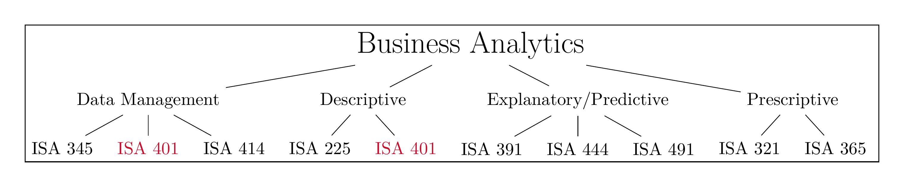
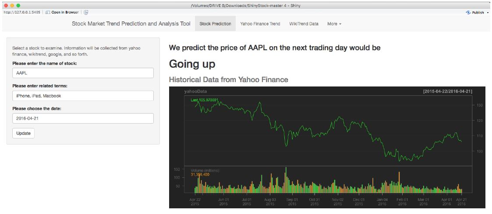
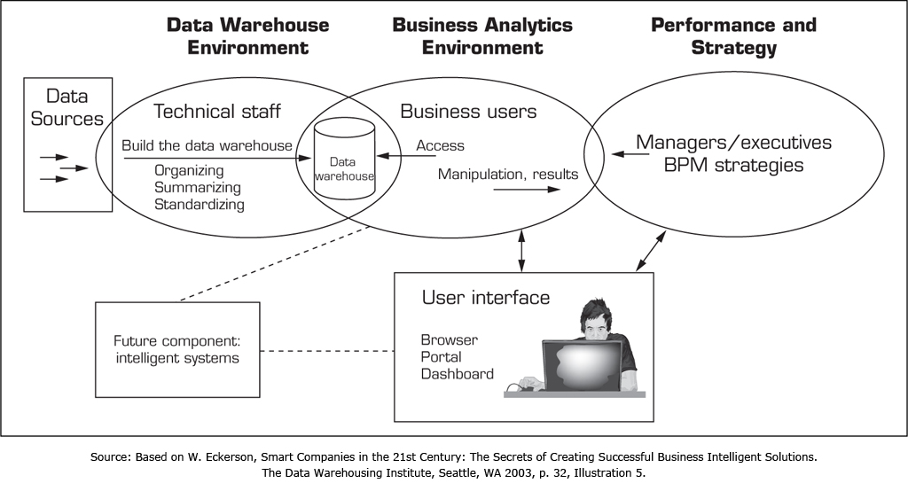
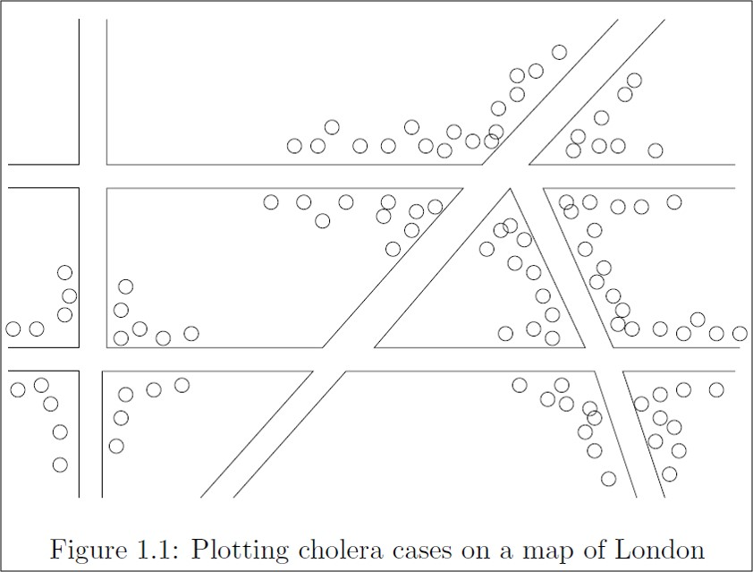
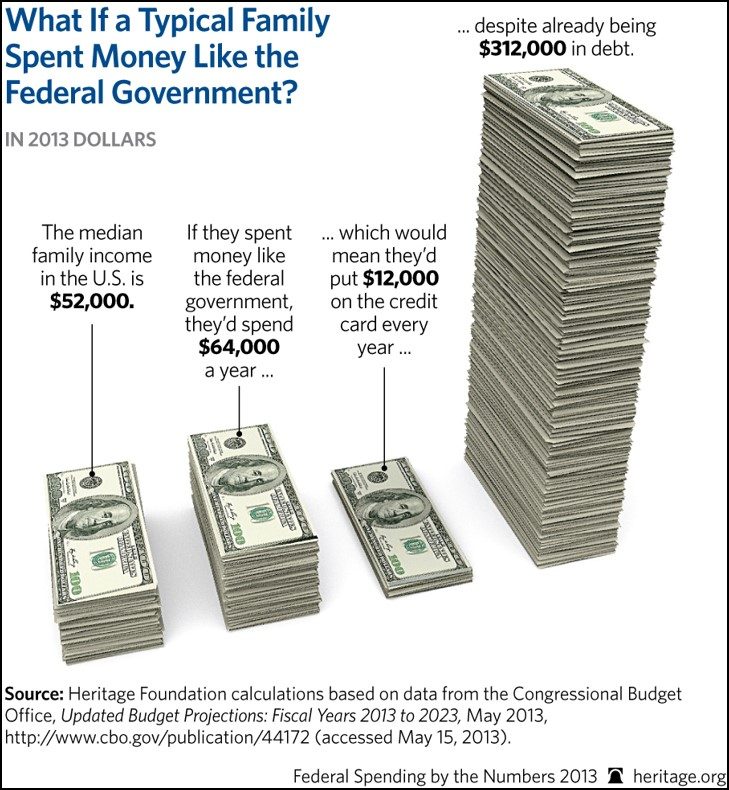

```{r setup, include=FALSE}
knitr::opts_chunk$set(cache = FALSE,
                      echo = TRUE,
                      warning = FALSE,
                      message = FALSE,
                      progress = FALSE,
                      verbose = FALSE,
                      dev = 'png',
                      fig.height = 3,
                      dpi = 300,
                      fig.align = 'center')

options(htmltools.dir.version = FALSE)


miamired = '#C3142D'

if(require(pacman)==FALSE) install.packages("pacman")
if(require(devtools)==FALSE) install.packages("devtools")
if(require(countdown)==FALSE) devtools::install_github("gadenbuie/countdown")
if(require(xaringanExtra)==FALSE) devtools::install_github("gadenbuie/xaringanExtra")
if(require(urbnmapr)==FALSE) devtools::install_github('UrbanInstitute/urbnmapr')
if(require(emo)==FALSE) devtools::install_github("hadley/emo")

pacman::p_load(tidyverse, magrittr, lubridate, janitor, # data analysis pkgs
               DataExplorer, scales, plotly, calendR, pdftools, # plots
               tmap, sf, urbnmapr, tigris, # maps
               bibliometrix, # for bibliometric analysis of my papers
               gifski, av, gganimate, ggtext, glue, extrafont, # for animations
               emojifont, emo, RefManageR, xaringanExtra, countdown) # for slides
```

```{r xaringan-themer, include=FALSE, warning=FALSE}
if(require(xaringanthemer) == FALSE) install.packages("xaringanthemer")
library(xaringanthemer)

style_mono_accent(base_color = "#84d6d3",
                  base_font_size = "20px")

xaringanExtra::use_xaringan_extra(c("tile_view", "animate_css", "tachyons", "panelset", "broadcast", "share_again", "search", "fit_screen", "editable", "clipboard"))

```


# Learning Objectives for Today's Class

- Describe the **analytics journey** and the role of **business intelligence (BI)** within it.

- Differentiate between **structured**, **semi-structured**, and **unstructured** data.

- Map **real-world data sources** to appropriate **data types**.


---

# ChatISA: Free AI Tools for Every ISA Student

<div style="text-align:center; margin-top:6px;">
  <a href="https://chatisa.fsb.miamioh.edu" target="_blank" style="display:inline-block; background:#c3142d; color:white; font-weight:700; font-size:22px; padding:10px 36px; border-radius:8px; text-decoration:none;">ChatISA</a>
  <div style="font-size:14px; margin:6px 0 2px;"><a href="https://chatisa.fsb.miamioh.edu" target="_blank" style="color:#c3142d; font-weight:600;">chatisa.fsb.miamioh.edu</a> <span style="color:#585E60;">&nbsp;&middot;&nbsp; sign in with your Miami account &nbsp;&middot;&nbsp; free for all ISA students</span></div>
  <div style="font-size:22px; color:#c3142d; line-height:1;">&darr;</div>
</div>

<div style="display:flex; gap:12px; margin-top:6px; align-items:stretch;">
  <div style="flex:4; border:1px solid #d1d5db; border-radius:8px; padding:8px 10px; background:#fcfcfc;">
    <div style="font-size:12px; font-weight:700; color:#c3142d; text-transform:uppercase; letter-spacing:0.5px; margin-bottom:6px;">For your coursework</div>
    <div style="display:grid; grid-template-columns:1fr 1fr; gap:6px;">
      <div style="background:#F5F5F5; border:1px solid #e5e7eb; border-radius:6px; padding:7px 9px;">
        <div style="font-weight:700; font-size:13px;">Coding Tutor</div>
        <div style="font-size:11px; color:#585E60;">R &amp; Python help, explained at your level</div>
      </div>
      <div style="background:#F5F5F5; border:1px solid #e5e7eb; border-radius:6px; padding:7px 9px;">
        <div style="font-weight:700; font-size:13px;">Coding Studio</div>
        <div style="font-size:11px; color:#585E60;">Write &amp; run Python, R, and SQL on your data</div>
      </div>
      <div style="background:#F5F5F5; border:1px solid #e5e7eb; border-radius:6px; padding:7px 9px;">
        <div style="font-weight:700; font-size:13px;">Exam Prep</div>
        <div style="font-size:11px; color:#585E60;">Turn course notes into a practice exam</div>
      </div>
      <div style="background:#F5F5F5; border:1px solid #e5e7eb; border-radius:6px; padding:7px 9px;">
        <div style="font-weight:700; font-size:13px;">Project Assistant</div>
        <div style="font-size:11px; color:#585E60;">Plan &amp; pressure-test team projects</div>
      </div>
    </div>
  </div>
  <div style="flex:3; border:1px solid #d1d5db; border-radius:8px; padding:8px 10px; background:#fcfcfc;">
    <div style="font-size:12px; font-weight:700; color:#c3142d; text-transform:uppercase; letter-spacing:0.5px; margin-bottom:6px;">For your job search</div>
    <div style="display:grid; grid-template-columns:1fr; gap:6px;">
      <div style="background:#F5F5F5; border:1px solid #e5e7eb; border-radius:6px; padding:7px 9px;">
        <div style="font-weight:700; font-size:13px;">Job Scout</div>
        <div style="font-size:11px; color:#585E60;">This week's analytics &amp; IS jobs, matched to your courses (powers today's dashboard)</div>
      </div>
      <div style="background:#F5F5F5; border:1px solid #e5e7eb; border-radius:6px; padding:7px 9px;">
        <div style="font-weight:700; font-size:13px;">JobApp Drafter</div>
        <div style="font-size:11px; color:#585E60;">Tailor your resume &amp; cover letter to a job</div>
      </div>
      <div style="background:#F5F5F5; border:1px solid #e5e7eb; border-radius:6px; padding:7px 9px;">
        <div style="font-weight:700; font-size:13px;">Interview Mentor</div>
        <div style="font-size:11px; color:#585E60;">Practice a spoken interview for a target job</div>
      </div>
    </div>
  </div>
  <div style="flex:2.5; border:1px solid #d1d5db; border-radius:8px; padding:8px 10px; background:#fcfcfc;">
    <div style="font-size:12px; font-weight:700; color:#c3142d; text-transform:uppercase; letter-spacing:0.5px; margin-bottom:6px;">General AI</div>
    <div style="display:grid; grid-template-columns:1fr; gap:6px;">
      <div style="background:#F5F5F5; border:1px solid #e5e7eb; border-radius:6px; padding:7px 9px;">
        <div style="font-weight:700; font-size:13px;">Ask Anything</div>
        <div style="font-size:11px; color:#585E60;">Chat with the frontier model of your choice</div>
      </div>
      <div style="background:#F5F5F5; border:1px solid #e5e7eb; border-radius:6px; padding:7px 9px;">
        <div style="font-weight:700; font-size:13px;">AI Comparison</div>
        <div style="font-size:11px; color:#585E60;">Ask several models at once and compare answers</div>
      </div>
    </div>
  </div>
</div>

<div style="text-align:center; font-size:12.5px; color:#585E60; margin-top:12px;">A <b>word of caution:</b> AI answers (ChatGPT, Claude, Gemini, Kimi, ChatISA, etc) can be confidently wrong. The reason you are taking ISA courses is so that <b>you learn how to verify their outputs and assess their choices</b></div>

---

# An Executive Overview of ChatISA (From HW0)

<html>
<center>
<iframe width="854" height="480"
src="https://www.youtube.com/embed/ytI-oJLgFZ4?autoplay=0"
title="ChatISA Highlight Tour"
frameborder="0"
allow="accelerometer; clipboard-write; encrypted-media; gyroscope; picture-in-picture"
allowfullscreen>
</iframe>
</center>
</html>

---

# Claude Opus 5 vs GPT-5.6 Sol

`r countdown(minutes = 3, seconds = 0, top = 0, font_size = "2em")`

.panelset[

.panel[.panel-name[Activity]

1. Sign in at <https://chatisa.fsb.miamioh.edu>.

2. Open **AI Comparison** and start a comparison: **Claude Opus 5** vs. **GPT-5.6 Sol**.

3. Ask both models this one question:

> *I am taking a business intelligence (BI) course. Give me a short definition of business intelligence. Create a flowchart that captures this process.*

4. Read both answers and **pick a winner**.

]

.panel[.panel-name[Class Poll]

<div style="height:400px; margin:0; padding:0; overflow:hidden;">
  <iframe src="https://www.mentimeter.com/app/presentation/alw9uatmyzhfwo98ixk93yyejv2r8tvg/embed"
    frameborder="0" allowfullscreen
    sandbox="allow-scripts allow-same-origin allow-presentation"
    style="width:100%; height:100%; border:0;"></iframe>
</div>


]

.panel[.panel-name[Notes]

- .can-edit.key-chatisa-notes[Edit me to write down what you noticed about the two AI answers (Use Chrome as your browser to edit this part of the page)]

]
]


---
class: inverse, center, middle

# The Analytics Journey

---

# The Analytics Journey: Pre-Analytics [1]

`r countdown(minutes = 8, seconds = 0, top = 0, font_size = "2em")`

> _Work with your partner. Explore the data any way you like, including with ChatISA._

.panelset[

.panel[.panel-name[Activity]

.font90[
- Skim the source: <https://data.cincinnati-oh.gov/Safety/Traffic-Crash-Reports-CPD-/rvmt-pkmq/data>

- Download our 2025 extract from [Canvas](https://miamioh.instructure.com/courses/258169/files/39994966/download?download_frd=1), then answer:

  (a) How many **crashes** are in the dataset?

  (b) How many **variables** does it contain?

  (c) What **dates** does it cover (min and max)?

  (d) Which **day of the week** appears the most in the data? And what does that mean from a **driving-safety** perspective?
]
]

.panel[.panel-name[Your Solution]

- .can-edit.key-activity1[Insert your solution here (Use Chrome as your browser to edit this part of the page)]

]

.panel[.panel-name[Discussion]

- .can-edit.key-activity1debrief[Notes from our class discussion (Use Chrome as your browser to edit this part of the page)]

]

]

---

# The Analytics Journey: Pre-Analytics [2]

- **Pre-Analytics/Data Management:** where one attempts to **extract** the needed
*data* for analysis.  Data can either be:
.div[
.pull-left[
## .center[.large[.large[.large[`r emo::ji("canned_food")`]]]]
* Stale, uninteresting, convenient
* Highly processed and archived
* Example: `iris`, `mtcars`, `titanic`
]
.pull-right[
## .center[.large[.large[.large[`r emo::ji("tomato")`]]]]
* Fresh, interesting, challenging
* Impactful
* Examples: [Cincinnati Open Data Portal](https://data.cincinnati-oh.gov/),
[Ohio Data Portal](https://data.ohio.gov/wps/portal/gov/data/), [US Government's Open Data](https://www.data.gov/).
]
]

.footnote[
<html>
<hr>
</html>

While highly processed data can be useful for learning basic concepts, **real-world (often messy) data are much more interesting to work with** — e.g., we can make useful and meaningful decisions from them, as you just did. In this class, we will learn how to scrape, extract, and clean messy data in addition to visualizing clean[ed] data.

**Source:** Slide inspired by Earo Wang's "What I mean by data" (STATS 220, University of Auckland; site no longer online).
]


---

# The Analytics Journey: Descriptive [1]

```{r extract_crashes, cache=TRUE, echo=FALSE, include=FALSE}
crashes = readr::read_csv('../../data/cincy_2025_crashes.csv') |>
  dplyr::mutate(
    datetime = lubridate::ymd_hms(crashdate),
    date = lubridate::as_date(datetime),
    hour = lubridate::hour(datetime)
  )

# one row per crash; recompute the weekday from the crash date so every
# slide uses the same definition (the raw dayofweek strings use inconsistent
# abbreviations across data vintages, e.g. TUE vs TUES)
unique_crashes = crashes |>
  dplyr::distinct(instanceid, .keep_all = TRUE) |>
  dplyr::filter(!is.na(date)) |>
  dplyr::mutate(
    dayofweek = lubridate::wday(date, label = TRUE, abbr = TRUE, week_start = 1),
    weather = forcats::as_factor(weather)
  )
```

**Descriptive Analytics:** where one attempts to **understand** the data through **descriptive statistics** and **visualizations**.

### Descriptive Statistics for 2 Categorical Variables (one row per *crash*)

.small[

```{r desc_stats, echo=FALSE}
unique_crashes |>
  dplyr::select(dayofweek, weather) |>
  purrr::map(.f = table)
```

]


---

# The Analytics Journey: Descriptive [2]

**Descriptive Analytics:** where one attempts to **understand** the data through **descriptive statistics** and **visualizations**.

### A Simple Visualization - A Bar Chart of Crashes Per Day

```{r viz, echo=FALSE, fig.height=2.25}
unique_crashes |>
  dplyr::count(dayofweek) |>
  ggplot2::ggplot(ggplot2::aes(x = n, y = forcats::fct_rev(dayofweek))) +
  ggplot2::geom_col(fill = miamired) +
  ggplot2::geom_text(ggplot2::aes(label = scales::comma(n)), hjust = -0.15, size = 2.6) +
  ggplot2::scale_x_continuous(expand = ggplot2::expansion(mult = c(0, 0.12)),
                              labels = scales::comma) +
  ggplot2::theme_bw(base_size = 12) +
  ggplot2::labs(x = 'Count/Freq', y = 'Day of the Week',
       title = 'Crashes by Day in Cincinnati in 2025',
       caption = 'Created by: Fadel Megahed | Data source: City of Cincy Open Data Portal (rvmt-pkmq)')
```

---

# The Analytics Journey: Descriptive [3]

**Descriptive Analytics:** where one attempts to **understand** the data through **descriptive statistics** and **visualizations**.

```{r viz2a, echo=FALSE, cache=TRUE, fig.height=2.85}
daily_crashes_2025 = unique_crashes |>
  dplyr::filter(!is.na(date), lubridate::year(date) == 2025) |>
  dplyr::count(date) |>
  tidyr::complete(
    date = seq(as.Date('2025-01-01'), as.Date('2025-12-31'), by = 'day'),
    fill = list(n = 0)
  )

cal = calendR::calendR(
  title = NULL,
  year = 2025,
  special.days = daily_crashes_2025$n,
  orientation = "landscape",
  day.size = 2,
  months.size = 8,
  weeknames.size = 3,
  margin = 0,
  text.size = 8,
  title.size = 14,
  gradient = TRUE,
  low.col = "#FFFFED",
  special.col = miamired,
  legend.pos = 'right',
  legend.title = '# Crashes') +
  ggplot2::theme(
    plot.title = ggplot2::element_text(face = 'bold', color =  miamired),
    legend.title = ggplot2::element_text(face = 'bold', size = 9),
    legend.text = ggplot2::element_text(size = 7),
    plot.caption = ggplot2::element_text(size = 7)
    ) +
  ggplot2::labs(caption = 'Created by: Fadel Megahed | Data source: City of Cincy Open Data Portal (rvmt-pkmq)')

cal

```

---

# The Analytics Journey: Continued

.pull-left[
### Predictive Analytics

## .center["What *will* happen?"]

- **Statistical/ML models** trained on historical data.

- Only as good as the data behind them — start simple.
]

--

.pull-right[
### Prescriptive Analytics

## .center["What *should* we do?"]

- Models that recommend **actions**, not just forecasts.

- e.g., which drivers should a trucking company flag for safety interventions — and at what cost?
]

---


# How does our Curriculum at Miami University Prepare you for this Journey?

```{r run_latex_file, echo=FALSE, cache=TRUE, results='hide'}
tinytex::xelatex('../../figures/ba_flow_chart.tex')
Sys.sleep(2)
pdftools::pdf_convert('../../figures/ba_flow_chart.pdf', dpi = 600,
                      filenames = '../../figures/ba_flow_chart.png')
Sys.sleep(2)
```


```{r read_ba_chart, echo=FALSE, out.width='100%', fig.alt="Fadel's take on our ISA curriculum", fig.align='center', fig.cap='My take on the courses within the business analytics major/minor at Miami University'}

```


---

class: inverse, center, middle

# Business Intelligence: From Data to Decisions

---

# What is Business Intelligence?

> "... to enable **interactive access (sometimes in real time)** to data, to enable manipulation of data, and to give business managers and analysts the ability to conduct appropriate analysis.
By analyzing ... data, situations, and performances, decision makers get valuable insights that enable them to **make more informed and better decisions** ... BI is based on the **transformation of data to information, then to decisions, and finally to actions.**"

```{r bin_paper, echo=FALSE, fig.alt="A schematic of an interactive BI tool for stock market prediction", out.width="55%"}

```

.footnote[
<html>
<hr>
</html>

**Quote** from Sharda, R., Delen, D., & Turban, E. (2013). Business Intelligence: A managerial perspective on analytics. Prentice Hall Press.

**Image Credit:** Joint work with Bin Weng.
]

---

# The BI Process

```{r bi_process, echo=FALSE, fig.alt="A schematic of the different components of the business intelligence (BI) process", out.width="86%"}

```


.footnote[
<html>
<hr>
</html>

**Image Credit:** Sharda, R., Delen, D., & Turban, E. (2013). Business Intelligence: A managerial perspective on analytics. Prentice Hall Press.
]

---

# Job Market Explorer: A BI Dashboard in Action

```{r job_dashboard, echo=FALSE}
knitr::include_url(
  url = "job_market_explorer_standalone.html",
  height = '480px'
)
```

.footnote[
**Data:** 1,437 job postings (full-time, federal, and internships) harvested by **ChatISA Job Scout** from the ActiveJobs and USAJobs APIs. Retrieved August 16, 2026.
]

---

# Regarding the Job-Market Dashboard

`r countdown(minutes = 5, seconds = 0, top = 0, font_size = "2em")`

.panelset[

.panel[.panel-name[Activity]

.small[
Explore the dashboard on your machine (previous slide, or full screen from Canvas). Start in the **Job Explorer** tab and find **one posting you would actually apply to** — internships count! (Notice the *Practice this Interview on ChatISA* button while you are there.) Then answer on Mentimeter. **Write full, specific questions. Think like both a decision-maker and an analyst.**

**Slide 1: Use it**
  - What is *one question you would want this dashboard to answer* to help you make a career decision?


**Slide 2: Challenge it**
  - What is *one question you would ask about the data itself* before trusting the answer?

]


]

.panel[.panel-name[Your Solution]

<div style="height:400px; margin:0; padding:0; overflow:hidden;">
  <iframe
    src="https://www.mentimeter.com/app/presentation/albckjyfoamn1927ubw9urpzik287ya4/embed"
    frameborder="0"
    allowfullscreen
    sandbox="allow-scripts allow-same-origin allow-presentation"
    style="width:100%; height:100%; border:0;">
  </iframe>
</div>

]

.panel[.panel-name[Discussion]

- .can-edit.key-activity3debrief[Notes from our class discussion (Use Chrome as your browser to edit this part of the page)]

]
]


---

# One Job Ad, Three Shapes [1]: Unstructured

<span style="display:inline-block; background:#e2e2f9; color:#3d3d80; font-weight:700; font-size:12px; padding:3px 12px; border-radius:10px; text-transform:uppercase;">Unstructured</span> &nbsp; **Research Data Scientist, Magic Eye** at Google (Mountain View, CA; posted 2026-08-12). This is what a human, or Job Scout, actually reads:

<div style="height:380px; overflow-y:auto; background:#F5F5F5; border:1px solid #d1d5db; border-radius:6px; padding:10px 16px; font-size:12.5px; line-height:1.45; white-space:pre-wrap; font-family: Georgia, serif;">MINIMUM QUALIFICATIONS:

 * Master's degree in Statistics, Data Science, Mathematics, Physics, Economics, Operations Research, Engineering, or a related quantitative field.
 * 3 years of work experience using analytics to solve product or business problems, coding (e.g., Python, R, SQL), querying databases or statistical analysis, or a PhD degree.

PREFERRED QUALIFICATIONS:

 * 5 years of work experience using analytics to solve product or business problems, coding (e.g., Python, R, SQL), querying databases or statistical analysis, or a PhD degree.

ABOUT THE JOB:

Magic Eye's mission is to guide strategic decision making for Google's consumer products through data-informed insights, actionable user metrics, and definitions of success. The analysis team partners closely with cross-product area teams from Search, Ads, Android, YouTube, etc., and cross-functionally with teams from Engineering, Behavioral Economics, UX, Finance to bring methodology, data, and insights to Googlers and Google leads. [...] Key research questions include understanding the rapidly evolving GenAI landscape and user journeys across products and devices to identify cross-company strategic opportunities.

Individual pay is determined by factors including job-related skills, experience, and relevant education or training.

US: $147000 - $210000 (USD) + 15% bonus target + equity + benefits

RESPONSIBILITIES:

 * Collaborate with stakeholders in cross-projects and team settings to identify and clarify business or product questions to answer. [...]</div>

.footnote[
<html>
<hr>
</html>

**Unstructured** data is free text with no fixed fields. Notice the **salary is in there** ($147K to $210K): the information exists, but no filter or chart can reach it until someone (or some model) extracts it.
]

---

# One Job Ad, Three Shapes [2]: Semi-Structured

<span style="display:inline-block; background:#fef5c4; color:#7a6210; font-weight:700; font-size:12px; padding:3px 12px; border-radius:10px; text-transform:uppercase;">Semi-Structured</span> &nbsp; Job Scout's AI model reads that text and emits **JSON**: tagged, nested, machine-readable, but with a flexible shape.

.pull-left[

<div style="height:340px; overflow-y:auto; background:#111827; color:#e5e7eb; border-radius:6px; padding:12px 16px; font-size:12px; line-height:1.5; white-space:pre; font-family: Consolas, Menlo, monospace;">[
  {"skillId": "python",     "importance": "required"},
  {"skillId": "r",          "importance": "required"},
  {"skillId": "sql",        "importance": "required"},
  {"skillId": "statistical_analysis",
                            "importance": "required"},
  {"skillId": "data_analysis",
                            "importance": "required"},
  {"skillId": "stakeholder_management",
                            "importance": "required"},
  {"skillId": "data_wrangling",
                            "importance": "required"},
  {"skillId": "causal_inference",
                            "importance": "preferred"},
  {"skillId": "experimental_design",
                            "importance": "preferred"},
  {"skillId": "generative_ai",
                            "importance": "preferred"},
  {"skillId": "mathematics","importance": "preferred"},
  {"skillId": "operations_research",
                            "importance": "preferred"}
]</div>

]

.pull-right[

.font90[

- **Semi-structured** data carries its own labels (`skillId`, `importance`) but records can differ: this ad has 12 skills, another has 4.

- This is what **APIs** return (JSON like this, or XML/HTML). We'll learn to request and parse it in weeks 4 and 5.

- The *required*/*preferred* labels were decided by an AI model reading the ad: extraction adds structure **and** assumptions.

]

]

---

# One Job Ad, Three Shapes [3]: Structured

<span style="display:inline-block; background:#d9edc2; color:#3d5c14; font-weight:700; font-size:12px; padding:3px 12px; border-radius:10px; text-transform:uppercase;">Structured</span> &nbsp; The clean record lands as **one row** in the `scout_postings` table, with the same fields for every posting:

<table style="margin: 8px auto 0; border-collapse: collapse; font-size: 14px; min-width: 62%;">
  <tr style="background:#f3f4f6;"><th style="text-align:left; padding:5px 14px; border-bottom:2px solid #d1d5db;">Field</th><th style="text-align:left; padding:5px 14px; border-bottom:2px solid #d1d5db;">Value</th></tr>
  <tr><td style="padding:4px 14px; font-family:monospace; color:#c3142d;">source</td><td style="padding:4px 14px;">activejobs</td></tr>
  <tr style="background:#f9fafb;"><td style="padding:4px 14px; font-family:monospace; color:#c3142d;">title</td><td style="padding:4px 14px;">Research Data Scientist, Magic Eye</td></tr>
  <tr><td style="padding:4px 14px; font-family:monospace; color:#c3142d;">company</td><td style="padding:4px 14px;">Google</td></tr>
  <tr style="background:#f9fafb;"><td style="padding:4px 14px; font-family:monospace; color:#c3142d;">location_city, location_state</td><td style="padding:4px 14px;">Mountain View, CA</td></tr>
  <tr><td style="padding:4px 14px; font-family:monospace; color:#c3142d;">remote</td><td style="padding:4px 14px;">0</td></tr>
  <tr style="background:#f9fafb;"><td style="padding:4px 14px; font-family:monospace; color:#c3142d;">category</td><td style="padding:4px 14px;">fulltime</td></tr>
  <tr><td style="padding:4px 14px; font-family:monospace; color:#c3142d;">posted_at</td><td style="padding:4px 14px;">2026-08-12</td></tr>
  <tr style="background:#f9fafb;"><td style="padding:4px 14px; font-family:monospace; color:#c3142d;">active</td><td style="padding:4px 14px;">1</td></tr>
  <tr><td style="padding:4px 14px; font-family:monospace; color:#c3142d;">visa_sponsorship</td><td style="padding:4px 14px;">unknown</td></tr>
</table>

.footnote[
<html>
<hr>
</html>

**Structured** data is rows &times; columns with identical fields throughout. This is the *only* shape the dashboard's filters and charts can use. Notice what didn't survive the trip: there is no `salary` column.
]

---

# One Job Ad, Three Shapes [4]: The Big Picture

<div style="display:flex; gap:14px; margin-top:18px; align-items:stretch;">
  <div style="flex:1; border:1px solid #d1d5db; border-radius:8px; overflow:hidden;">
    <div style="background:#e2e2f9; color:#3d3d80; font-weight:700; font-size:15px; padding:8px 14px; text-transform:uppercase;">Unstructured</div>
    <div style="padding:10px 14px; font-size:13px; line-height:1.5;">
      <div style="color:#585E60;">Free text, images, audio, and video. No fixed fields.</div>
      <div style="margin-top:8px;"><b>Our example:</b> the job-ad text</div>
      <div style="margin-top:8px;"><b>Worked with via:</b> text mining &amp; LLMs (like Job Scout's tagger)</div>
    </div>
  </div>
  <div style="align-self:center; color:#c3142d; font-size:24px; font-weight:700;">&rarr;</div>
  <div style="flex:1; border:1px solid #d1d5db; border-radius:8px; overflow:hidden;">
    <div style="background:#fef5c4; color:#7a6210; font-weight:700; font-size:15px; padding:8px 14px; text-transform:uppercase;">Semi-Structured</div>
    <div style="padding:10px 14px; font-size:13px; line-height:1.5;">
      <div style="color:#585E60;">Self-labeled and nested (JSON, XML, HTML) with a flexible shape.</div>
      <div style="margin-top:8px;"><b>Our example:</b> the skills JSON</div>
      <div style="margin-top:8px;"><b>Worked with via:</b> APIs + parsers (weeks 4&ndash;5)</div>
    </div>
  </div>
  <div style="align-self:center; color:#c3142d; font-size:24px; font-weight:700;">&rarr;</div>
  <div style="flex:1; border:1px solid #d1d5db; border-radius:8px; overflow:hidden;">
    <div style="background:#d9edc2; color:#3d5c14; font-weight:700; font-size:15px; padding:8px 14px; text-transform:uppercase;">Structured</div>
    <div style="padding:10px 14px; font-size:13px; line-height:1.5;">
      <div style="color:#585E60;">Rows &times; columns with identical fields for every record.</div>
      <div style="margin-top:8px;"><b>Our example:</b> the database row</div>
      <div style="margin-top:8px;"><b>Worked with via:</b> spreadsheets, SQL, R data frames</div>
    </div>
  </div>
</div>

<div style="text-align:center; margin-top:22px; font-size:14px; color:#585E60;">The closer data gets to <b>structured</b>, the less work before analysis. Most interesting data starts on the left.<br>Much of this course is about moving data from left to right.</div>

---

# BI Necessitates Merging Data Sources

<table style="width:100%; border-collapse:collapse; margin-top:14px; font-size:14.5px; box-shadow:0 1px 3px rgba(0,0,0,0.12); border-radius:8px; overflow:hidden;">
  <tr style="background:#c3142d; color:white;">
    <th style="text-align:left; padding:10px 16px;">Question you asked</th>
    <th style="text-align:left; padding:10px 16px;">Data needed</th>
    <th style="text-align:left; padding:10px 16px;">Possible source</th>
    <th style="text-align:left; padding:10px 16px;">Data type</th>
  </tr>
  <tr style="background:#f9dbdb;">
    <td style="padding:9px 16px; font-weight:700;">Salary</td>
    <td style="padding:9px 16px;">Wages by occupation</td>
    <td style="padding:9px 16px;">BLS, Glassdoor <span style="color:#c3142d; font-weight:700;">(not in our dashboard!)</span></td>
    <td style="padding:9px 16px;"><span style="background:#d9edc2; color:#3d5c14; font-weight:700; font-size:11px; padding:2px 10px; border-radius:10px; text-transform:uppercase;">Structured</span> <span style="color:#6b7280; font-size:12px;">CSV</span></td>
  </tr>
  <tr>
    <td style="padding:9px 16px; font-weight:700;">Skills</td>
    <td style="padding:9px 16px;">Job requirements</td>
    <td style="padding:9px 16px;">Job-description text, tagged by an LLM</td>
    <td style="padding:9px 16px;"><span style="background:#e2e2f9; color:#3d3d80; font-weight:700; font-size:11px; padding:2px 10px; border-radius:10px; text-transform:uppercase;">Unstructured</span> <span style="color:#6b7280; font-size:12px;">Text</span></td>
  </tr>
  <tr style="background:#f9fafb;">
    <td style="padding:9px 16px; font-weight:700;">Location &amp; counts</td>
    <td style="padding:9px 16px;">Postings by state</td>
    <td style="padding:9px 16px;">ActiveJobs + USAJobs APIs</td>
    <td style="padding:9px 16px;"><span style="background:#fef5c4; color:#7a6210; font-weight:700; font-size:11px; padding:2px 10px; border-radius:10px; text-transform:uppercase;">Semi-structured</span> <span style="color:#6b7280; font-size:12px;">JSON</span></td>
  </tr>
  <tr>
    <td style="padding:9px 16px; font-weight:700;">Trends</td>
    <td style="padding:9px 16px;">Weekly harvests over time</td>
    <td style="padding:9px 16px;">Job Scout's SQLite database</td>
    <td style="padding:9px 16px;"><span style="background:#d9edc2; color:#3d5c14; font-weight:700; font-size:11px; padding:2px 10px; border-radius:10px; text-transform:uppercase;">Structured</span> <span style="color:#6b7280; font-size:12px;">Time series</span></td>
  </tr>
</table>

.footnote[
<html>
<hr>
</html>

**Key insight:** No single source answers everything. You felt this when the dashboard couldn't answer your salary questions. Real analysis requires combining data from multiple places, and that's exactly what we'll learn to do.
]


---
class: table80

# From Data to Decisions: The BI Value Chain

.pull-left[
### The Journey

| Stage | Question | Output |
|:---:|:---|:---|
| **Data** | What happened? | Raw facts |
| **Information** | What does it mean? | Context + structure |
| **Knowledge** | Why did it happen? | Patterns + insights |
| **Decision** | What should we do? | Action |
]

--

.pull-right[
### Example: Job Market

| Stage | Example |
|:---:|:---|
| **Data** | 1,437 postings harvested by Job Scout |
| **Information** | SQL is tagged in 31% of postings; communication in 79% |
| **Knowledge** | Employers want the *pairing*: technical skills **and** the ability to explain findings |
| **Decision** | Build both this semester: code every week, present your results |
]


---
class: inverse, center, middle

# So What is Data Visualization?

---

# What is Data Visualization?

Data visualization involves **presenting data in a graphical format**. It is really a process that starts by getting data, creating initial plot(s) and modifying them to answer questions of interest. **A good chart takes time and iteration** — for example, see [Cedric Scherer's visualization of the UNESCO data on global student to teacher ratios](https://www.cedricscherer.com/2019/05/17/the-evolution-of-a-ggplot-ep.-1/).

```{r data_viz_gif, echo=FALSE, out.width='58%', interval=100, aniopts="controls"}
knitr::include_graphics('https://d33wubrfki0l68.cloudfront.net/1e7033393a2c70dc1255c5d0f1c563e945519251/61035/img/evol-ggplot/evol-ggplot-1.gif')
```

---

# The Goals of Data Visualization

- **Record** information

  * Sometimes a well-designed [interactive table](https://flourish.studio/blog/how-make-interactive-table/) *is* the best visualization

- **Analyze** data to support reasoning

  * Develop and assess hypotheses (EDA)

  * Reveal patterns

  * Discover errors in data

- **Communicate** ideas to others

  * Infographics, statistical charts, interactive charts, dashboards

- **Interact with the data (which supports all the above)**

  * You just did this — filtering, mapping, and drilling into the Job Market Explorer

---

# Analyze Data: The 1854 Cholera Outbreak

```{r cholera_outbreak, echo=FALSE, out.width='50%'}

```


.footnote[
<html>
<hr>
</html>

Note the **encoding**: each death is a mark whose **position** on the map carries the information — and we perceive position more accurately than other encoding channels.

Source: Leskovec, J., Rajaraman, A., & Ullman, J. D. (2020). Mining of Massive Data Sets (Third Edition). Cambridge University Press.  Image is from Chapter 1, which can be accessed [here](http://infolab.stanford.edu/~ullman/mmds/ch1n.pdf).
]

---

# Critique a Chart from Our Dashboard

`r countdown(minutes = 5, seconds = 0, top = 0, font_size = "2em")`

.panelset[

.panel[.panel-name[The Chart]

```{r skills_chart_embed, echo=FALSE}
knitr::include_url(
  url = "job_market_explorer_standalone.html?tab=skills",
  height = '410px'
)
```

]

.panel[.panel-name[Activity]

The interactive **Top Skills** chart from our dashboard is in the first tab.

.small[
- What **data** is represented? Be specific about the **unit of analysis** (what does one bar's length count?).

- How is the data **visually encoded**? (position, length, color — what does the darker vs. lighter red mean?)

- Is the encoding **effective**? Would you trust it, knowing the skills were tagged by an AI model?

- Propose **one concrete improvement** to this chart.
]

]

.panel[.panel-name[Your Solution]

- .can-edit.key-activity4[Insert your solution here (Use Chrome as your browser to edit this part of the page)]

]
]

---

# Communicate Ideas: A Chart in the Wild

`r countdown(minutes = 4, seconds = 0, top = 0, font_size = "2em")`

.panelset[

.panel[.panel-name[Activity]

.pull-left[

.small[
- What **data** is represented in this visualization? Be specific about the unit of analysis.

- How is the data **visually encoded**? (position, size, color, shape, etc.)

- Is this encoding **effective**? Why or why not?
]
]

.pull-right[
```{r wpost, echo=FALSE, out.width='77%'}

```
]
]

.panel[.panel-name[Your Solution]

- .can-edit.key-activity5[Insert your solution here (Use Chrome as your browser to edit this part of the page)]

]
]


---
class: inverse, center, middle

# Recap

---

# Summary of Main Points

By now, you should be able to do the following:

- Describe the **analytics journey** (pre-analytics, descriptive, predictive, prescriptive) and the role of **BI** within it.

- Differentiate between **structured**, **semi-structured**, and **unstructured** data — and recognize all three inside one real pipeline.

- Map **real-world data sources** (CSVs, APIs, web pages, free text) to appropriate **data types**.

**Skills you practiced along the way:** identifying the **unit of analysis** (rows ≠ crashes!), distinguishing **counts from rates**, questioning **data provenance**, and reading a chart's **visual encodings**.


---

# 📝 Review and Clarification 📝

.pull-left[

1. **Class Notes**: Take some time to revisit your class notes for key insights/concepts.

2. **Zoom Recording**: The recording of today's class will be made available on Canvas approximately 3-4 hours after the session ends.

3. **Optional AI Recaps:** The video and podcast are  generated from our slide deck using [Gemini Notebook](https://notebooklm.google/).

4. **Questions**: Do not let confusion pile up.

]

.pull-right[

**📺 Slide Deck Video (click to play)**
<iframe width="100%" height="230"
src="https://www.youtube.com/embed/sys7WBk0iew?autoplay=0"
title="NotebookLM Slide Deck Review"
frameborder="0"
allow="accelerometer; clipboard-write; encrypted-media; gyroscope; picture-in-picture"
allowfullscreen>
</iframe>

<br>

**🎧 Slide Deck Podcast (click to play)**
<iframe src="https://drive.google.com/file/d/1lt6hqrMuW8JOy9ilvkT5NVlPABowj7SE/preview"
width="100%" height="70"
allow="clipboard-write">
</iframe>

]


---

# 📖 Prep for Our Next Class 📖

<div style="display:flex; gap:16px; margin-top:14px; align-items:stretch;">
  <div style="flex:3; border:1px solid #d1d5db; border-radius:8px; padding:12px 16px; background:#fcfcfc; box-shadow:0 1px 3px rgba(0,0,0,0.1);">
    <div style="margin-bottom:10px;">
      <span style="display:inline-block; background:#f9dbdb; color:#c3142d; font-weight:700; font-size:11px; padding:3px 12px; border-radius:10px; text-transform:uppercase;">Suggested</span>
      <span style="font-weight:700; font-size:16px; margin-left:8px;">📈 R for Data Science (R4DS)</span>
    </div>
    <div style="display:grid; grid-template-columns:1fr 1fr; gap:8px;">
      <a href="https://r4ds.hadley.nz/intro" target="_blank" style="text-decoration:none; background:#F5F5F5; border:1px solid #e5e7eb; border-left:4px solid #c3142d; border-radius:6px; padding:10px 12px; display:block;">
        <div style="font-weight:700; font-size:14px; color:#c3142d;">Introduction</div>
        <div style="font-size:12px; color:#585E60; margin-top:3px;">What R and the tidyverse are, and the map of what you'll learn</div>
      </a>
      <a href="https://r4ds.hadley.nz/workflow-basics" target="_blank" style="text-decoration:none; background:#F5F5F5; border:1px solid #e5e7eb; border-left:4px solid #c3142d; border-radius:6px; padding:10px 12px; display:block;">
        <div style="font-weight:700; font-size:14px; color:#c3142d;">Workflow: Basics</div>
        <div style="font-size:12px; color:#585E60; margin-top:3px;">Your first R code: objects, functions, and comments</div>
      </a>
    </div>
    <div style="font-size:12px; margin-top:10px;">
      ▶️ Prefer video? <a href="https://youtu.be/uFe-6KaceJk" target="_blank" style="color:#c3142d; font-weight:600;">Optional R prep recap on YouTube</a>
    </div>
  </div>
  <div style="flex:2; border:1px solid #d1d5db; border-radius:8px; padding:12px 16px; background:#fcfcfc; box-shadow:0 1px 3px rgba(0,0,0,0.1);">
    <div style="margin-bottom:10px;">
      <span style="display:inline-block; background:#e5e7eb; color:#374151; font-weight:700; font-size:11px; padding:3px 12px; border-radius:10px; text-transform:uppercase;">Skim if curious</span>
      <span style="font-weight:700; font-size:16px; margin-left:8px;">🤖 LLMs</span>
    </div>
    <a href="https://mark-riedl.medium.com/a-very-gentle-introduction-to-large-language-models-without-the-hype-5f67941fa59e" target="_blank" style="text-decoration:none; background:#F5F5F5; border:1px solid #e5e7eb; border-left:4px solid #9ca3af; border-radius:6px; padding:10px 12px; display:block;">
      <div style="font-weight:700; font-size:14px; color:#374151;">A Very Gentle Introduction to Large Language Models without the Hype</div>
      <div style="font-size:12px; color:#585E60; margin-top:3px;">How tools like ChatISA actually work, with no math needed</div>
    </a>
    <div style="font-size:12px; margin-top:10px;">
      ▶️ Prefer video? <a href="https://youtu.be/F5Gs6-C0DiA" target="_blank" style="color:#c3142d; font-weight:600;">Optional LLM recap on YouTube</a>
    </div>
  </div>
</div>

<div style="text-align:center; font-size:13px; color:#585E60; margin-top:16px;"><b>Nothing here is required.</b> The two R4DS chapters will make our next class (R basics) land much easier. The LLM article is background for the AI tools we will use all semester.</div>


---

# 🎯 Assignment 🎯

- Complete [Assignment 01](https://miamioh.instructure.com/courses/258169/assignments/3570795/) on Canvas to reinforce your understanding and application of the topics covered today as well as the suggested prep materials.