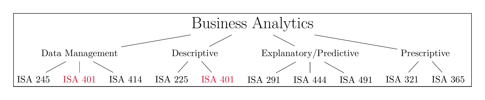
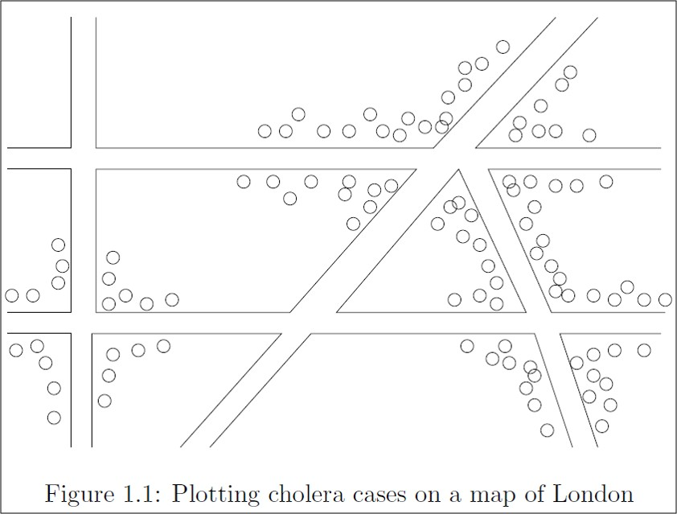

```{r setup, include=FALSE}
knitr::opts_chunk$set(cache = FALSE,
                      echo = TRUE,
                      warning = FALSE,
                      message = FALSE,
                      progress = FALSE, 
                      verbose = FALSE,
                      dev = 'png',
                      fig.height = 3,
                      dpi = 300,
                      fig.align = 'center')

options(htmltools.dir.version = FALSE)


miamired = '#C3142D'

if(require(pacman)==FALSE) install.packages("pacman")
if(require(devtools)==FALSE) install.packages("devtools")
if(require(countdown)==FALSE) devtools::install_github("gadenbuie/countdown")
if(require(xaringanExtra)==FALSE) devtools::install_github("gadenbuie/xaringanExtra")
if(require(urbnmapr)==FALSE) devtools::install_github('UrbanInstitute/urbnmapr')
if(require(emo)==FALSE) devtools::install_github("hadley/emo")

pacman::p_load(tidyverse, magrittr, lubridate, janitor, # data analysis pkgs
               DataExplorer, scales, plotly, calendR, pdftools, # plots
               tmap, sf, urbnmapr, tigris, # maps
               bibliometrix, # for bibliometric analysis of my papers
               gifski, av, gganimate, ggtext, glue, extrafont, # for animations
               emojifont, emo, RefManageR, xaringanExtra, countdown) # for slides
```

```{r xaringan-themer, include=FALSE, warning=FALSE}
if(require(xaringanthemer) == FALSE) install.packages("xaringanthemer")
library(xaringanthemer)

style_mono_accent(base_color = "#84d6d3",
                  base_font_size = "20px")

xaringanExtra::use_xaringan_extra(c("tile_view", "animate_css", "tachyons", "panelset", "broadcast", "share_again", "search", "fit_screen", "editable", "clipboard"))

```


# Learning Objectives for Today's Class

- Describe the **analytics journey** and where BI fits within it.

- Explore a **BI dashboard** and identify the questions it answers.

- Define **data visualization** and describe its **main goals**.

- Identify the **unit of analysis** in a dataset.


---
class: inverse, center, middle

# The Analytics Journey

---

# The Analytics Journey: Pre-Analytics [1]

- **Pre-Analytics/Data Management:** where one attempts to **extract** the needed
*data* for analysis.  Data can either be:  
.div[
.pull-left[
## .center[.large[.large[.large[`r emo::ji("canned_food")`]]]]
* Stale, uninteresting, convenient 
* Highly processed and archived
* Example: `iris`, `mtcars`, `titanic`
]
.pull-right[
## .center[.large[.large[.large[`r emo::ji("tomato")`]]]]
* Fresh, interesting, challenging 
* Impactful
* Examples: [Cincinnati Open Data Portal](https://data.cincinnati-oh.gov/), 
[Ohio Data Portal](https://data.ohio.gov/wps/portal/gov/data/), [US Government's Open Data](https://www.data.gov/).
]
]

.footnote[
<html>
<hr>
</html>

While the highly processed data can be useful in learning basic concepts, **real-world (often messy)** data real are much interesting to work with -- **e.g.,  we can make useful & meaningful decision from the data.** In this class, we will learn how to scrape, extract and clean messy data in addition to visualizing clean[ed] data.   

Source: Slide inspired by [Kia Ora's What I mean by "data"](https://stats220.earo.me/01-intro.html#6). 
]


---

# The Analytics Journey: Pre-Analytics [2]

### Non-Graded Class Activity #1

`r countdown(minutes = 4, seconds = 0, top = 0, font_size = "2em")`

> _Take 4 minutes to discuss with your partner_

.panelset[

.panel[.panel-name[Activity]

- Go to <https://data.cincinnati-oh.gov/Safety/Traffic-Crash-Reports-CPD-/rvmt-pkmq/data>

- Download the data utilizing the export column and answer the following questions:  

  * How many **observations/rows** and **columns** do we have in the dataset?   
  
  * How many **crashes** are reported in the dataset?
  
  * **Key Question:** Is each row a crash, or something else?
]

.panel[.panel-name[Your Solution] 

- .can-edit.key-activity1[Insert your solution here (Use Chrome as your browser to edit this part of the page)] 

]

.panel[.panel-name[Fadel's Approach (No Solution Shown)]

```{r activity1-solution, eval=FALSE}
if(require(tidyverse) == FALSE) install.packages("tidyverse")

# Link obtained from site -> Export -> "Right Click on" CSV
crashes = readr::read_csv("https://data.cincinnati-oh.gov/api/views/rvmt-pkmq/rows.csv?accessType=DOWNLOAD")

# Number of rows and columns
nrow(crashes)
ncol(crashes)
# Or alternatively
dim(crashes)

# Total number of crashes
# Will be discussed in class in greater detail
```

]


]

---


# The Analytics Journey: Descriptive [1]

**Descriptive Analytics:** where one attempts to **understand** the data through **descriptive statistics** and **visualizations**.

### Descriptive Statistics for 2 Categorical Variables
```{r extract_crashes, cache=TRUE, echo=FALSE}
crashes = readr::read_csv("https://data.cincinnati-oh.gov/api/views/rvmt-pkmq/rows.csv?accessType=DOWNLOAD") |> 
  janitor::clean_names() |> 
  dplyr::select(address_x, latitude_x, longitude_x, age, 
         cpd_neighborhood, crashseverity, 
         datecrashreported, dayofweek, gender, injuries, 
         instanceid,
         typeofperson, weather)
```

.small[

```{r desc_stats, echo=FALSE}
crashes %<>% 
  dplyr::mutate(
    datetime = lubridate::parse_date_time(
      datecrashreported, 
      orders = "'%m/%d/%Y %I:%M:%S %p",
      tz = 'America/New_York',
      locale = "English"
    ),
    hour = hour(datetime),
    date = as_date(datetime)
  )

unique_crashes = 
  crashes  |> 
  dplyr::filter(date >= "2025-01-01" & date <= "2025-12-31") |> 
  dplyr::group_by(instanceid) |> 
  dplyr::select(-datecrashreported) |> 
  dplyr::filter(typeofperson == 'D - DRIVER') |> 
  dplyr::select(instanceid, date, dayofweek, hour, weather, 
                address_x, latitude_x, longitude_x) |>
  unique() |> 
  dplyr::mutate(
    dayofweek = forcats::as_factor(dayofweek),
    hour = forcats::as_factor(hour),
    weather = forcats::as_factor(weather)
  ) |> 
  dplyr::ungroup()

unique_crashes |> dplyr::select(dayofweek, weather) |> 
  purrr::map(.f = table)
  
```

]


---

# The Analytics Journey: Descriptive [2]

**Descriptive Analytics:** where one attempts to **understand** the data through **descriptive statistics** and **visualizations**.

### A Simple Visualization - A Bar Chart of Crashes Per Day

```{r viz, echo=FALSE, fig.height=2.25}
unique_crashes |> 
  dplyr::select(dayofweek) |> 
  dplyr::group_by(dayofweek) |> 
  dplyr::count() -> day_of_week_tbl

day_of_week_tbl |> 
  dplyr::mutate(
    dayofweek = ordered(dayofweek, 
      levels=c("SUN", "SAT", "FRI", "THU", "WED", "TUES", "MON")
    )
  ) |> 
  ggplot2::ggplot(ggplot2::aes(x= n, y = dayofweek)) +
  ggplot2::geom_col(fill = miamired) +
  ggplot2::theme_bw(base_size = 12) + 
  ggplot2::labs(x = 'Count/Freq', y = 'Day of the Week',
       title = 'Crashes by Day in Cincinnati in 2025',
       caption = 'Created by: Fadel Megahed | Data source: City of Cincy Open Data Portal (rvmt-pkmq)') 
```

---

# The Analytics Journey: Descriptive [3]

**Descriptive Analytics:** where one attempts to **understand** the data through **descriptive statistics** and **visualizations**.

```{r viz2a, echo=FALSE, cache=TRUE, fig.height=2.85}
weather_levels = levels(unique_crashes$weather)

daily_crashes_2025= unique_crashes |> 
  dplyr::mutate(weather = factor(weather, levels = sort(weather_levels))) |> 
  dplyr::select(instanceid, date, weather) |> 
  dplyr::group_by(date) |> 
  dplyr::count()
  
cal = calendR::calendR(
  title = NULL,
  year = 2025,
  special.days = daily_crashes_2025$n,
  orientation = "landscape",
  day.size = 2,
  months.size = 8,
  weeknames.size = 3,
  margin = 0,
  text.size = 8,
  title.size = 14,
  gradient = TRUE,
  low.col = "#FFFFED",
  special.col = miamired,
  legend.pos = 'right',
  legend.title = '# Crashes') + 
  ggplot2::theme(
    plot.title = ggplot2::element_text(face = 'bold', color =  miamired),
    legend.title = ggplot2::element_text(face = 'bold', size = 9), 
    legend.text = ggplot2::element_text(size = 7),
    plot.caption = ggplot2::element_text(size = 7)
    ) +
  ggplot2::labs(caption = 'Created by: Fadel Megahed | Data source: City of Cincy Open Data Portal (rvmt-pkmq)')

cal

```

---

# The Analytics Journey: Continued

.pull-left[
### Predictive Analytics

Using **statistical** and **machine learning** models to predict outcomes.

**Success depends on:**
- **Correct** data: Do you capture important predictors?
- **Clean** data: Is it tidy, technically correct, consistent?

**Recommendation:** Start simple, add complexity only if needed.
]

--

.pull-right[
### Prescriptive Analytics

Using **mathematical models** to recommend business actions.

**Example:** A trucking company modeling:
- Events associated with crashes
- Predictions based on driver, conditions

**Question:** What would you optimize for?
- Minimize crashes?
- Minimize cost while maintaining safety?
]

---


# How does our Curriculum at Miami University Prepare you for this Journey?

```{r run_latex_file, echo=FALSE, cache=TRUE, results='hide'}
tinytex::xelatex('../../figures/ba_flow_chart.tex')
Sys.sleep(2)
pdftools::pdf_convert('../../figures/ba_flow_chart.pdf', dpi = 600,
                      filenames = '../../figures/ba_flow_chart.png')
Sys.sleep(2)
```


```{r read_ba_chart, echo=FALSE, out.width='100%', fig.alt="Fadel's take on our ISA curriculum", fig.align='center', fig.cap='My take on the courses within the business analytics major/minor at Miami University'}

```


---

class: inverse, center, middle

# Course Design, Expectations, and Overview

(Will not be covered in class; I presume you read the syllabus and the Week 0 module before our first class. )

---

# ISA 401 Course: An Overview

```{r run_latex_file_2, echo=FALSE, cache=TRUE, results='hide'}
tinytex::xelatex('../../figures/course_overview.tex')
Sys.sleep(2)
pdftools::pdf_convert('../../figures/course_overview.pdf', dpi = 600,
                      filenames = '../../figures/course_overview.png')
Sys.sleep(2)
```


```{r read_course__overview_chart, echo=FALSE, out.width='100%', fig.alt="How the ISA 401 course is organized.", fig.align='center', fig.cap='How the ISA 401 course is organized.'}
knitr::include_graphics("../../figures/course_overview.png") 
```

---

# ISA 401 Course Objectives

Even though software will be extensively used, this is not a software class. **Instead, the focus is on understanding the underlying methods and mindset of how data should be approached.**  

  - Be capable of extracting, transforming and loading (ETL) data using multiple platforms
(e.g. `r icons::icon_style(icons::fontawesome('r-project'), fill = miamired)`, Power BI and/or Tableau).  

- Write basic scripts to preprocess and clean the data.  

- Explore the data using visualization approaches that are based on sound human factors.  

- Understand how statistical/machine learning can capitalize on the insights generated from the data visualization process.  

- Create interactive dashboards that can be used for business decision making, reporting and/or performance management.

- Be able to apply the skills from this class in your future career.


---

# Instructional Approach

```{r run_latex_file_3, echo=FALSE, cache=TRUE, results='hide'}
tinytex::xelatex('../../figures/instructional_approach.tex')
Sys.sleep(20)
pdftools::pdf_convert('../../figures/instructional_approach.pdf', dpi = 600,
                      filenames = '../../figures/instructional_approach.png')
Sys.sleep(20)
```


```{r read_course_approach, echo=FALSE, out.width='100%', fig.alt="An overview of the instructional approach for ISA 401.", fig.align='center', fig.cap='An overview of the instructional approach for ISA 401.'}
knitr::include_graphics("../../figures/instructional_approach.png") 
```

---

# How will I Evaluate your Learning?

```{r run_latex_file_4, echo=FALSE, cache=TRUE, results='hide'}
tinytex::xelatex('../../figures/evaluation.tex')
Sys.sleep(2)
pdftools::pdf_convert('../../figures/evaluation.pdf', dpi = 600,
                      filenames = '../../figures/evaluation.png')
Sys.sleep(2)
```


```{r read_evaluation, echo=FALSE, out.width='100%', fig.alt="An overview of the evaluation components for ISA 401.", fig.align='center', fig.cap='An overview of the evaluation components for ISA 401.'}
knitr::include_graphics("../../figures/evaluation.png") 
```

---

class: inverse, center, middle

# Business Intelligence: From Data to Decisions

---

# What is Business Intelligence?

> "... to enable **interactive access (sometimes in real time)** to data, to enable manipulation of data, and to give business managers and analysts the ability to conduct appropriate analysis.
By analyzing ... data, situations, and performances, decision makers get valuable insights that enable them to **make more informed and better decisions** ... BI is based on the **transformation of data to information, then to decisions, and finally to actions.**"

```{r bin_paper, echo=FALSE, fig.alt="A schematic of an interactive BI tool for stock market prediction", out.width="55%"}
knitr::include_graphics("../../figures/stock_market.JPG")
```

.footnote[
<html>
<hr>
</html>

**Quote** from Sharda, R., Delen, D., & Turban, E. (2013). Business Intelligence: A managerial perspective on analytics. Prentice Hall Press.

**Image Credit:** Joint work with Bin Weng.
]

---

# The BI Process

```{r bi_process, echo=FALSE, fig.alt="A schematic of the different components of the business intelligence (BI) process", out.width="73%"}
knitr::include_graphics("../../figures/bi_process.jpg")
```


.footnote[
<html>
<hr>
</html>

**Image Credit:** Sharda, R., Delen, D., & Turban, E. (2013). Business Intelligence: A managerial perspective on analytics. Prentice Hall Press.
]

---

# Job Market Explorer: A BI Dashboard in Action

```{r job_dashboard, echo=FALSE}
knitr::include_url(
  url = "job_market_explorer_standalone.html",
  height = '480px'
)
```

.footnote[
**Data:** 1,276 federal job postings from USAJobs.gov, pulled on January 14, 2026.
]

---

# Regarding the Job-Market Dashboard

`r countdown(minutes = 5, seconds = 0, top = 0, font_size = "2em")`

.panelset[

.panel[.panel-name[Activity]

### Non-Graded Class Activity #2

.small[
You just explored a job-market dashboard. Read the dashboard carefully and then answer the questions below. Write **full, specific questions. Think like both a decision-maker and an analyst.**  

**Slide 1: Use it**  
  - What is *one question you would want this dashboard to answer* to help you make a career decision?  
  

**Slide 2: Challenge it**  
  - What is *one question you would ask about the data itself* before trusting the answer?

]


]

.panel[.panel-name[Your Solution]

<div style="height:400px; margin:0; padding:0; overflow:hidden;">
  <iframe
    src="https://www.mentimeter.com/app/presentation/albckjyfoamn1927ubw9urpzik287ya4/embed"
    frameborder="0"
    allowfullscreen
    sandbox="allow-scripts allow-same-origin allow-presentation"
    style="width:100%; height:100%; border:0;">
  </iframe>
</div>

]
]


---

# Data Source Mapping: BI Requires Merging Datasets

| Question Type | Data Needed | Possible Source | Data Type |
|:---|:---|:---|:---|
| Salary | Wages by occupation | BLS, Glassdoor | Structured (CSV) |
| Skills | Job requirements | Job postings | Unstructured (Text) |
| Location | Job counts by city | Indeed, LinkedIn, USAJobs | Semi-structured (HTML/API) |
| Trends | Historical postings | Archives, APIs | Time series |

.footnote[
<html>
<hr>
</html>

**Key insight:** No single source answers everything. Real analysis requires combining data from multiple places—and that's exactly what we'll learn to do.
]


---

# From Data to Decisions: The BI Value Chain

.pull-left[
### The Journey

| Stage | Question | Output |
|:---:|:---|:---|
| **Data** | What happened? | Raw facts |
| **Information** | What does it mean? | Context + structure |
| **Knowledge** | Why did it happen? | Patterns + insights |
| **Decision** | What should we do? | Action |
]

--

.pull-right[
### Example: Job Market

| Stage | Example |
|:---:|:---|
| **Data** | 1,276 job postings from USAJobs |
| **Information** | Data & Analytics roles have median salary of $139K |
| **Knowledge** | D&A roles pay $33K more than overall median |
| **Decision** | Pursue Data & Analytics career paths |
]

.footnote[
<html>
<hr>
</html>

This is the journey we'll take this semester: from raw data to actionable insights.

.small[
**Calculation:** Median salary for D&A roles 
($138,667; n=21) minus overall median 
($105,469; n=1,276).
]
]


---
class: inverse, center, middle

# So What is Data Visualization?

---

# What is Data Visualization?

Data visualization involves **presenting data in a graphical format**. It is really a process that starts by getting data, creating initial plot(s) and modifying them to answer questions of interest (and possibly making the plot aesthetically pleasing). For example, see [Cedric Scherer's visualization of the UNESCO data on global student to teacher ratios](https://www.cedricscherer.com/2019/05/17/the-evolution-of-a-ggplot-ep.-1/).

```{r data_viz_gif, echo=FALSE, out.width='58%', interval=100, aniopts="controls"}
knitr::include_graphics('https://d33wubrfki0l68.cloudfront.net/1e7033393a2c70dc1255c5d0f1c563e945519251/61035/img/evol-ggplot/evol-ggplot-1.gif')
```

---

# The Goals of Data Visualization

- **Record** information  

- **Analyze** data to support reasoning  

  * Develop and assess hypotheses (EDA)  
  
  * Reveal patterns  
  
  * Discover errors in data  
  
- **Communicate** ideas to others  

  * Infographics  
  
  * Statistic charts  
  
  * Interactive charts 
  
  * Dashboards 
  
- **Interact with the data (which supports all the above)**

---

# Record Information

```{r peloton_stats, echo=FALSE}
knitr::include_url(url = "https://flo.uri.sh/visualisation/17077589/embed?auto=1", height = '480px')
```

.footnote[
<html>
<hr>
</html>
  
Source: Flourish Studio (2024). [When tables are the most effective form of data visualization](https://flourish.studio/blog/how-make-interactive-table/).
]

---

# Analyze Data: The 1854 Cholera Outbreak

```{r cholera_outbreak, echo=FALSE, fig.cap='The physician John Snow, dealing with a Cholera outbreak plotted the cases on a map of the city (see schematic above).', out.width='50%'}

```


.footnote[
<html>
<hr>
</html>
  
Source: Leskovec, J., Rajaraman, A., & Ullman, J. D. (2020). Mining of Massive Data Sets (Third Edition). Cambridge University Press.  Image is from Chapter 1, which can be accessed [here](http://infolab.stanford.edu/~ullman/mmds/ch1n.pdf).
]

---

# Communicate Ideas

`r countdown(minutes = 5, seconds = 0, top = 0, font_size = "2em")`

.panelset[

.panel[.panel-name[Activity]

.pull-left[
### Non-Graded Class Activity #3

.small[
- What **data** is represented in this visualization? Be specific about the unit of analysis.

- How is the data **visually encoded**? (position, size, color, shape, etc.)

- Is this encoding **effective**? Why or why not?
]
]

.pull-right[
```{r wpost, echo=FALSE, out.width='77%'}
knitr::include_graphics("../../figures/wpost.jpg")
```
]
]

.panel[.panel-name[Your Solution]

- .can-edit.key-activity3[Insert your solution here (Use Chrome as your browser to edit this part of the page)] 

]
]


---

# Interact: GapMinder/ Hans Rosling Example
<html>
<center>
<div style="max-width:854px"><div style="position:relative;height:0;padding-bottom:56.25%"><iframe src="https://embed.ted.com/talks/lang/en/hans_rosling_the_best_stats_you_ve_ever_seen" width="854" height="480" style="position:absolute;left:0;top:0;width:100%;height:100%" frameborder="0" scrolling="no" allowfullscreen></iframe></div></div>
</center>
</html>


---
class: inverse, center, middle

# Recap

---

# Summary of Main Points

By now, you should be able to do the following:  

- Describe the **analytics journey** (pre-analytics, descriptive, predictive, prescriptive) and where **BI** fits within it.

- Explore a **BI dashboard** and identify the questions it can (and cannot) answer.

- Define **data visualization** and describe its main goals (record, analyze, communicate, interact).

- Identify the **unit of analysis** in a dataset (rows vs. observations).

- Recognize how data is **visually encoded** (position, size, color, shape).


---

# 📝 Review and Clarification 📝

.pull-left[

1. **Class Notes**: Take some time to revisit your class notes for key insights/concepts.

2. **Zoom Recording**: The recording of today's class will be made available on Canvas approximately 3-4 hours after the session ends.  

3. **Review AI Recaps:** The video and podcast are both generated from our slide deck and are meant to reinforce the same core ideas.

4. **Questions**: Do not let confusion pile up. 

]

.pull-right[

**📺 Slide Deck Video (click to play)**
<iframe width="100%" height="230"
src="https://www.youtube.com/embed/20cFIOJBc3g?autoplay=0"
title="NotebookLM Slide Deck Review"
frameborder="0"
allow="accelerometer; clipboard-write; encrypted-media; gyroscope; picture-in-picture"
allowfullscreen>
</iframe>

<br>

**🎧 Slide Deck Podcast (click to play)**
<iframe src="https://drive.google.com/file/d/1lt6hqrMuW8JOy9ilvkT5NVlPABowj7SE/preview"
width="100%" height="70"
allow="clipboard-write">
</iframe>

]


---

# 📖 Required Readings: R Prep 📖

.pull-left[
.font90[
#### 📈 R Prep
- [Workflow: Basics](https://r4ds.had.co.nz/workflow-basics.html)
- [Names and Values](https://adv-r.hadley.nz/names-values.html)
- [Vectors](https://adv-r.hadley.nz/vectors-chap.html)
- [Subsetting](https://adv-r.hadley.nz/subsetting.html)
]
]

.pull-right[
.font90[
**📺 Optional Video (R Prep)**  
<iframe width="100%" height="260"
src="https://www.youtube.com/embed/uFe-6KaceJk?autoplay=0"
title="R Prep Review Video"
frameborder="0"
allow="accelerometer; clipboard-write; encrypted-media; gyroscope; picture-in-picture"
allowfullscreen>
</iframe>
]
]

---

# 📖 Required Readings: LLM Prep 📖

.pull-left[
.font90[
#### 🤖 LLM Prep
- [A Very Gentle Introduction to Large Language Models without the Hype](https://mark-riedl.medium.com/a-very-gentle-introduction-to-large-language-models-without-the-hype-5f67941fa59e)
]
]

.pull-right[
.font90[
**📺 Optional Video (LLM Prep)**  
<iframe width="100%" height="260"
src="https://www.youtube.com/embed/F5Gs6-C0DiA?autoplay=0"
title="LLM Prep Review Video"
frameborder="0"
allow="accelerometer; clipboard-write; encrypted-media; gyroscope; picture-in-picture"
allowfullscreen>
</iframe>
]
]


---

# 🎯 Assignment 🎯

- Complete [Assignment 01](https://miamioh.instructure.com/courses/250351/quizzes/774525) on Canvas to reinforce your understanding and application of the topics covered today as well as the assigned readings.

<div style="background: #e0f2fe; border-left: 4px solid #0ea5e9; padding: 15px 20px; margin-bottom: 25px; border-radius: 0 8px 8px 0;"><strong style="color: #0369a1;">Before You Begin:</strong>
    <p style="margin: 10px 0 0 0; font-size: 14px;">This assignment has three parts. Make sure you have reviewed:</p>
    <ul style="margin: 10px 0 0 0; padding-left: 20px; font-size: 14px;">
        <li>Class 01 slide deck and/or Zoom recording</li>
        <li>NotebookLM summaries:
            <ul style="margin: 10px 0 0 0; padding-left: 20px; font-size: 14px;">
                <li><a style="color: #c41230;" href="https://youtu.be/20cFIOJBc3g" target="_blank" rel="noopener"><strong>01_BI__Data_to_Decisions.mp4</strong></a></li>
                <li><a style="color: #c41230;" href="https://drive.google.com/file/d/1lt6hqrMuW8JOy9ilvkT5NVlPABowj7SE/view?usp=sharing" target="_blank" rel="noopener"><strong>01_Turning_Messy_Data_Into_Business_Strategy.m4a</strong></a> (podcast, you may want to download first please)</li>
            </ul>
        </li>
        <li>Required readings for Class 02 (listed at the end of Class 01 slides)</li>
        <li>NotebookLM summary: <a style="color: #c41230;" href="https://youtu.be/F5Gs6-C0DiA" target="_blank" rel="noopener"><strong>02_A_Gentle_Intro_to_LLMs.mp4</strong></a></li>
    </ul>
</div>

