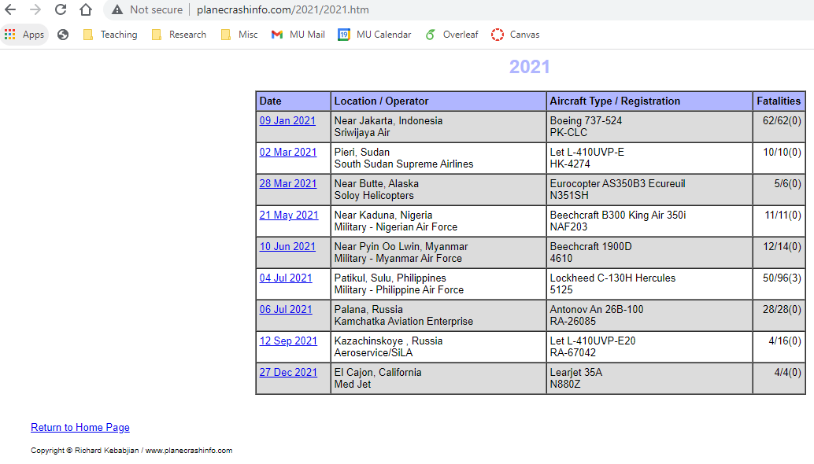
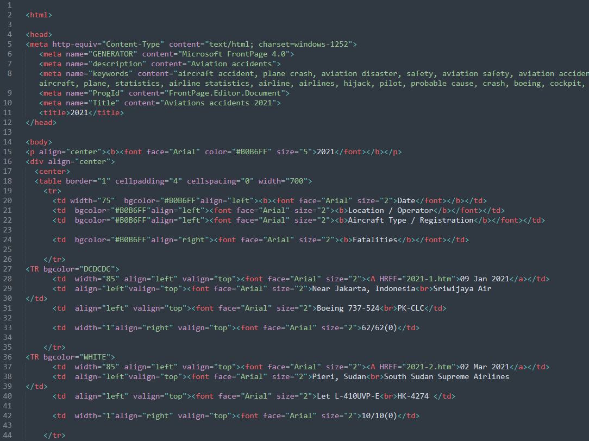
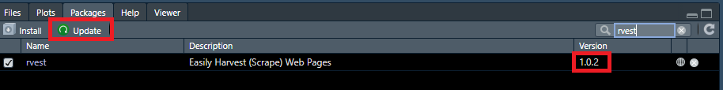
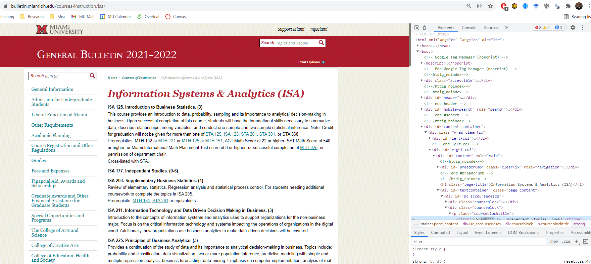
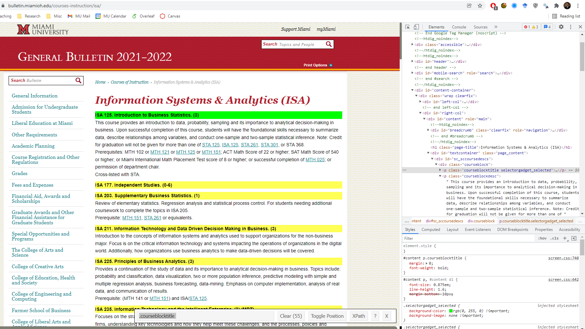
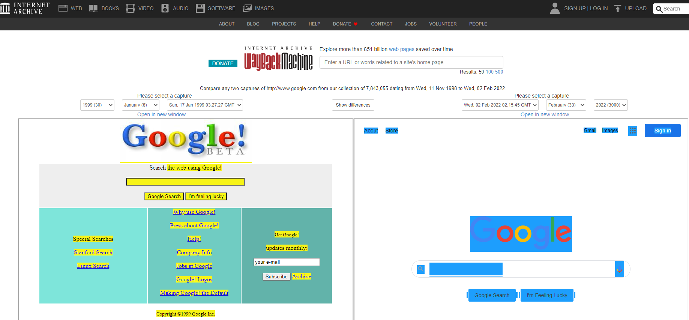

```{r setup, include=FALSE}
knitr::opts_chunk$set(cache = TRUE,
                      echo = TRUE,
                      warning = FALSE,
                      message = FALSE,
                      progress = FALSE, 
                      verbose = FALSE,
                      dev = 'png',
                      fig.height = 2.5,
                      dpi = 300,
                      fig.align = 'center')

options(htmltools.dir.version = FALSE)

miamired = '#C3142D'

if(require(pacman)==FALSE) install.packages("pacman")
if(require(devtools)==FALSE) install.packages("devtools")

if(require(countdown)==FALSE) devtools::install_github("gadenbuie/countdown")
if(require(xaringanExtra)==FALSE) devtools::install_github("gadenbuie/xaringanExtra")


pacman::p_load(tidyverse, magrittr, lubridate, janitor, # data analysis pkgs
               rvest, # for scraping
               scales, # for the comma function
               gifski, av, # for animations
               fontawesome, RefManageR, xaringanExtra, countdown) # for slides
```

```{r xaringan-themer, include=FALSE, warning=FALSE}
if(require(xaringanthemer) == FALSE) install.packages("xaringanthemer")
library(xaringanthemer)

style_mono_accent(base_color = "#84d6d3",
                  base_font_size = "20px")

xaringanExtra::use_xaringan_extra(c("tile_view", "animate_css", "tachyons", "panelset", "broadcast", "share_again", "search", "fit_screen", "editable", 
                                    "clipable"))

```


# Quick Refresher from Last Class

`r emo::ji("check")` Subset data in `r fontawesome::fa(name = 'r-project', fill = miamired)`.   

`r emo::ji("check")` Read text-files, binary files (e.g., Excel, SAS, SPSS, Stata, etc), json files, etc. 

`r emo::ji("check")` Export data from `r fontawesome::fa(name = 'r-project', fill = miamired)`. 

---

# Learning Objectives for Today's Class

- Understand when can we scrape data (i.e., `robots.txt`)  

- Scrape a webpage using `r fontawesome::fa("r-project", fill = miamired)`.

---

class: middle, inverse, center


# Web Technology `r fa("html5", fill ="orange")` `r fa("css3-alt", fill ="blue")` `r fa("js-square", fill ="gold")`


.footnote[
<html>
<hr>
<html>
.left[
.large[Source:
Slides 5-15 are from [Dr Earo Wang's STAT 220 Web Scraping Slides](https://stats220.earo.me/09-web-scrape.html#2), which were adapted from [Dr Emi Tanaka's](https://emitanaka.org/about.html) "Communicating with Data" course.
]
]
]

---

# World Wide Web (WWW) 

WWW (or the **Web**) is the information system where documents (web pages) are identified by Uniform Resource Locators (**URL**s)

A web page consists of:
* `r fa("html5", fill ="orange")` **HTML** provides the basic structure of the web page
* `r fa("css3-alt", fill ="blue")` **CSS** controls the look of the web page (optional)
* `r fa("js-square", fill ="gold")`</span> **JS** is a programming language that can modify the behavior of elements of the web page (optional) 

---

# `r fa("html5", fill ="orange")`</span> Hypertext Markup Language (HTML)

* with the extension `.html`.
* rendered using a web browser via an URL.
* text files that follows a special syntax that alerts web browsers how to render it.
.pull-left[
.center[**via a web browser**
```{r plane_crashes_1, echo=FALSE, out.width="100%", fig.height=5}

```
]
]
.pull-right[
.center[**via a text editor**
```{r plane_crashes_2, echo=FALSE}

```
]
]

---

# `r fa("html5", fill ="orange")` HTML Structure

```html
<!DOCTYPE html>

<html>
  <!--This is a comment and ignored by web client.-->
  <head>
    <!--This section contains web page metadata.-->
    <title>ISA 401: Business Intelligence and Data Viz</title>
    <meta name="author" content="Fadel Megahed">
    <link rel="stylesheet" href="css/styles.css">
  </head>

  <body>
    <!--This section contains what you want to display on your web page.-->
    <h1>I'm a first level header</h1>
    <p>This is a <b>paragraph</b>.</p>
  </body>
</html>
```

???

* servr::httd() to serve
* HTML: hier str: elements (`<tags>`) and optional attributes, and contents
* > 100 elements: each html page must have `<head>` and `<body>`. (rich format -> md)
* block tags: h1, p
* inline tags: bold a

---

# `r fa("html5", fill ="orange")` HTML Syntax

.center[`<span style="color:blue;">Author content</span>` <i class="fas fa-arrow-right"></i> <span style="color:blue;">Author content</span>]

<table style="width:100%">
<tr>
<td style="text-align:right;padding-right:30px;">start tag:</td><td><span class="remark-code" style="font-size:16pt"><span class="red">&lt;span style="color:blue;"&gt;</span><span class="grey">Author content&lt;/span&gt;</span></span> </td>
</tr>
<tr>
<td style="text-align:right;padding-right:30px;">end tag: </td><td> <span class="remark-code" style="font-size:16pt"><span class="grey">&lt;span style="color:blue;"&gt;Author content<span class="red">&lt;/span&gt;</span></span> </td>
</tr>
<tr>
<td style="text-align:right;padding-right:30px;">content: </td><td> <span class="remark-code" style="font-size:16pt"><span class="grey">&lt;span style="color:blue;"&gt;</span><span class="red">Author content</span><span class="grey">&lt;/span&gt;</span></span> </td>
</tr>
<tr>
<td style="text-align:right;padding-right:30px;">element name: </td><td> <span class="remark-code" style="font-size:16pt"><span class="grey">&lt;</span><span class="red">span</span><span class="grey"> style="color:blue;"&gt;Author content&lt;/span&gt;</span></span> </td>
</tr>
<tr>
<td style="text-align:right;padding-right:30px;">attribute: </td><td> <span class="remark-code" style="font-size:16pt"><span class="grey">&lt;span <span class="red">style="color:blue;"</span><span class="grey">&gt;Author content&lt;/span&gt;</span> </td>
</tr>
<tr>
<td style="text-align:right;padding-right:30px;">attribute name: </td><td> <span class="remark-code" style="font-size:16pt"><span class="grey">&lt;span <span class="red">style</span><span class="grey">="color:blue;"&gt;Author content&lt;/span&gt;</span> </td>
</tr>
<tr>
<td style="text-align:right;padding-right:30px;">attribute value: </td><td> <span class="remark-code" style="font-size:16pt"><span class="grey">&lt;span style=</span><span class="red">"color:blue;"</span><span class="grey">&gt;Author content&lt;/span&gt;</span> </td>
</tr>
</table>

<hr>

.center[**Not all HTML tags have an end tag**, for example:]

.center[
<span style="font-size:18pt;">``</span> `r fa('arrow-right')` 
]

---

# `r fa("html5", fill ="orange")` HTML Elements

<table style="width:100%">
<tr>
<td style="text-align:right;padding-right:30px;">block element:</td><td><span class="remark-code red" style="font-size:16pt">&lt;div><span class="grey">content</span>&lt;/div></span></td>
</tr>
<tr>
<td style="text-align:right;padding-right:30px;">inline element:</td><td><span class="remark-code red" style="font-size:16pt">&lt;span><span class="grey">content</span>&lt;/span></span></td>
</tr>
<tr>
<td style="text-align:right;padding-right:30px;">paragraph:</td><td><span class="remark-code red" style="font-size:16pt">&lt;p><span class="grey">content</span>&lt;/p></span></td>
</tr>
<tr>
<td style="text-align:right;padding-right:30px;">header level 1:</td><td><span class="remark-code red" style="font-size:16pt">&lt;h1><span class="grey">content</span>&lt;/h1></span></td>
</tr>
<tr>
<td style="text-align:right;padding-right:30px;">header level 2:</td><td><span class="remark-code red" style="font-size:16pt">&lt;h2><span class="grey">content</span>&lt;/h2></span></td></td>
</tr>
<tr>
<td style="text-align:right;padding-right:30px;">italic:</td><td><span class="remark-code red" style="font-size:16pt">&lt;i><span class="grey">content</span>&lt;/i></span></td>
</tr>
<tr>
<td style="text-align:right;padding-right:30px;">emphasised text:</td><td><span class="remark-code red" style="font-size:16pt">&lt;em><span class="grey">content</span>&lt;/em></span></td>
</tr>
<tr>
<td style="text-align:right;padding-right:30px;">strong importance:</td><td><span class="remark-code red" style="font-size:16pt">&lt;strong><span class="grey">content</span>&lt;/strong></span></td>
</tr>
<tr>
<td style="text-align:right;padding-right:30px;">link:</td><td><span class="remark-code red" style="font-size:16pt">&lt;a href="https://github.com/fmegahed/isa401"><span class="grey">content</span>&lt;/a></span></td>
</tr>
<tr>
<td valign="top" style="text-align:right;padding-right:30px;">unordered list:</td><td><span class="remark-code red" style="font-size:16pt">&lt;ul><br>&lt;li><span class="grey">item 1</span>&lt;/li><Br>&lt;li><span class="grey">item 2</span>&lt;/li><Br>&lt;/ul></span></td>
</tr>
</table>

???

How these are rendered to the browser depends on the browser default style values, style attribute or CSS...

---

# `r fa("css3-alt", fill ="blue")` Cascading Style Sheet (CSS)

* with the extension `.css`
* 3 ways to style elements in HTML:
  * **inline** by using the `style` attribute inside HTML start tag:
  <center>
  <span class="remark-code grey" style="font-size:14pt;">&lt;h1 <span class="red">style="color:blue;"</span>>Blue Header&lt;/h1></span>
  </center>
  + **externally** by using the `<link>` element:
  <center>
  <span class="remark-code red" style="font-size:14pt;">&lt;link rel="stylesheet" href="styles.css"></span>
  </center>
  + **internally** by defining within `<style>` element:

<div style="margin-left:35%; width:350px;">
```html
<style type="text/css">
h1 { color: blue; }
</style>
```
</div>
By convention, the `<style>` and `<link>` elements tend to go into the `<head>` section of the HTML document.

---

# `r fa("css3-alt", fill ="blue")` CSS Syntax

.pull-left[
```html
<style type="text/css">
h1 { color: blue; }
</style>
<h1>This is a header</h1>
```
]

<div style="margin-left:55%; width:350px;">
<br>
<h2 style="color:blue">This is a header</h2>
</div>

<table style="width:100%">
<tr>
<td style="text-align:right;padding-right:30px;">selector:</td><td><span class="remark-code" style="font-size:16pt"><span class="red">h1</span><span class="grey"> { color: blue; }</span></span> </td>
</tr>
<tr>
<td style="text-align:right;padding-right:30px;">property:</td><td><span class="remark-code" style="font-size:16pt; color:gray">h1 { <span class="red">color: blue;</span> }</span> </td>
</tr>
<tr>
<td style="text-align:right;padding-right:30px;">property name:</td><td><span class="remark-code" style="font-size:16pt; color:gray">h1 { <span class="red">color</span>: blue; } </span></td>
</tr>
<tr>
<td style="text-align:right;padding-right:30px;">property value:</td><td><span class="remark-code grey" style="font-size:16pt; color:gray">h1 { color: <span class="red">blue</span>; } </span></td>
</tr>
</table>

.pull-left[
You may have multiple properties for a single selector.`r emo::ji("arrow_right")`
]
.pull-right[
```css
h1 {
  color: blue;
  font-size: 16pt;
}
```
]

---

# `r fa("css3-alt", fill ="blue")` CSS Properties

.center[
```html
<div>Sample text</div>
```
]

<table style="width:100%">
<tr>
<td style="text-align:right;padding-right:30px;">background color:</td>
<td><span class="remark-code grey" style="font-size:16pt; color:gray">div { <span class="red">background-color: yellow;</span> }</span> </td>
<td>
<div style="background-color: yellow;">Sample text</div>
</td>
</tr>
<tr>
<td style="text-align:right;padding-right:30px;">text color:</td>
<td><span class="remark-code grey" style="font-size:16pt; color:gray">div { <span class="red">color: purple;</span> }</span> </td>
<td>
<div style="color: purple;">Sample text</div>
</td>
</tr>
<tr>
<td style="text-align:right;padding-right:30px;">border:</td>
<td><span class="remark-code grey" style="font-size:16pt; color:gray">div { <span class="red">border: 1px dashed brown;</span> }</span> </td>
<td>
<div style="border: 1px dashed brown;">Sample text</div>
</td>
</tr>
<tr>
<td style="text-align:right;padding-right:30px;">left border only:</td>
<td><span class="remark-code grey" style="font-size:16pt; color:gray">div { <span class="red">border-left: 10px solid pink;</span> }</span> </td>
<td>
<div style="border-left: 10px solid pink;">Sample text</div>
</td>
</tr>
<tr>
<td style="text-align:right;padding-right:30px;">text size:</td>
<td><span class="remark-code grey" style="font-size:16pt; color:gray">div { <span class="red">font-size: 10pt;</span> }</span> </td>
<td>
<div style="font-size:10pt;">Sample text</div>
</td>
</tr>
<tr>
<td valign="top" style="text-align:right;padding-right:30px;">padding:</td>
<td  valign="top"><span class="remark-code grey" style="font-size:16pt; color:gray">div { background-color: yellow; <br>
&emsp;&emsp;&emsp;&nbsp;<span class="red">padding: 10px;</span> }</span> </td>
<td>
<div style="background-color: yellow;padding:10px;">Sample text</div>
</td>
</tr>
<tr>
<td valign="top" style="text-align:right;padding-right:30px;">margin:</td>
<td  valign="top"><span class="remark-code grey" style="font-size:16pt; color:gray">div { background-color: yellow; <br>
&emsp;&emsp;&emsp;&nbsp;<span class="red">margin: 10px;</span> }</span> </td>
<td>
<div style="background-color: yellow;margin:10px;">Sample text</div>
</td>
</tr>
</table>

---

# `r fa("css3-alt", fill ="blue")` CSS Properties

.center[
```html
<div>Sample text</div>
```
]

<table style="width:100%">
<tr>
<td valign="top" style="text-align:right;padding-right:30px;">center align text:</td>
<td  valign="top"><span class="remark-code grey" style="font-size:16pt; color:gray">div { background-color: yellow; <br>
&emsp;&emsp;&emsp;&nbsp;padding-top: 20px;<br>
&emsp;&emsp;&emsp;&nbsp;<span class="red">text-align: center;</span> }</span> </td>
<td>
<div style="background-color: yellow;text-align: center;padding-top: 20px;">Sample text</div>
</td>
</tr>
<tr>
<td valign="top" style="text-align:right;padding-right:30px;">font family:</td>
<td  valign="top"><span class="remark-code grey" style="font-size:16pt; color:gray">div { <span class="red">font-family: Marker Felt, times;</span> }</span> </td>
<td>
<div style="font-family: Marker Felt, times;">Sample text</div>
</td>
</tr>
<tr>
<td valign="top" style="text-align:right;padding-right:30px;">strike:</td>
<td  valign="top"><span class="remark-code grey" style="font-size:16pt; color:gray">div { <span class="red">text-decoration: line-through;</span> }</span> </td>
<td>
<div style="text-decoration: line-through;">Sample text</div>
</td>
</tr>
<tr>
<td valign="top" style="text-align:right;padding-right:30px;">underline:</td>
<td  valign="top"><span class="remark-code grey" style="font-size:16pt; color:gray">div { <span class="red">text-decoration: underline;</span> }</span> </td>
<td>
<div style="text-decoration: underline;">Sample text</div>
</td>
</tr>
<tr>
<td valign="top" style="text-align:right;padding-right:30px;">opacity:</td>
<td  valign="top"><span class="remark-code grey" style="font-size:16pt; color:gray">div { <span class="red">opacity: 0.3</span> }</span> </td>
<td>
<div style="opacity: 0.3;">Sample text</div>
</td>
</tr>
</table>

---

count: false

.pull-left[
# `r fa("css3-alt", fill ="blue")` CSS Selector

<table class="grey" style="width:98%;margin-left:10px;margin-right:10px;">
<tr class="red">
<td class="remark-code">* </td><td>&nbsp;&nbsp;</td><td>selects all elements</td>
</tr>
<tr>
<td class="remark-code">div</td><td>&nbsp;&nbsp;</td><td>selects all <span class="remark-code" style="font-size:16pt">&lt;div></span> elements</td>
</tr>
<tr>
<td class="remark-code">div, p</td><td>&nbsp;&nbsp;</td><td>selects all <span class="remark-code" style="font-size:16pt">&lt;div></span> and <span class="remark-code" style="font-size:16pt">&lt;p></span> elements</td>
</tr>
<tr>
<td class="remark-code">div p</td><td>&nbsp;&nbsp;</td><td>selects all <span class="remark-code" style="font-size:16pt">&lt;p></span> within <span class="remark-code" style="font-size:16pt">&lt;div></span></td>
</tr>
<tr>
<td class="remark-code">div > p</td><td>&nbsp;&nbsp;</td><td>selects all <span class="remark-code" style="font-size:16pt">&lt;p></span> one level deep in <span class="remark-code" style="font-size:16pt">&lt;div></span></td>
</tr>
<tr valign="top">
<td class="remark-code">div + p</td><td>&nbsp;&nbsp;</td><td>selects all <span class="remark-code" style="font-size:16pt">&lt;p></span> immediately after a <span class="remark-code" style="font-size:16pt">&lt;div></span></td>
</tr>
<tr>
<td class="remark-code">div ~ p</td><td>&nbsp;&nbsp;</td><td>selects all <span class="remark-code" style="font-size:16pt">&lt;p></span> preceded by a <span class="remark-code" style="font-size:16pt">&lt;div></span></td>
</tr>
</table>
]
.pull-right[
<pre style="font-size: 13pt;" class="red">
&lt;h1>This is a sample html&lt;/h1>

&lt;blockquote>
&lt;p>Maybe stories are just data with a soul.&lt;/p>
&lt;footer>—Brene Brown&lt;/footer>
&lt;/blockquote>

&lt;div id="p1" class="parent">
Hmm
&lt;p>Hi!&lt;/p>
How are you? 
&lt;div class="child nice">
  &lt;p>Hello!&lt;/p>
&lt;/div>
&lt;/div>

&lt;p>Household 1&lt;/p>

&lt;div class="parent">
&lt;p>Hi!&lt;/p>
&lt;blockquote class="child rebel">
  &lt;p>Don't talk to me!&lt;/p>
&lt;/blockquote>
&lt;/div>

&lt;span class="child">
&lt;span class="parent child rebel">
  &lt;p>Clean your room!&lt;/p>
&lt;/span>
&lt;/span>

&lt;p>End of households&lt;/p>

</pre>
]

---

count: false

.pull-left[
# `r fa("css3-alt", fill ="blue")` CSS Selector

<table class="grey" style="width:98%;margin-left:10px;margin-right:10px;">
<tr >
<td class="remark-code">* </td><td>&nbsp;&nbsp;</td><td>selects all elements</td>
</tr>
<tr class="red">
<td class="remark-code">div</td><td>&nbsp;&nbsp;</td><td>selects all <span class="remark-code" style="font-size:16pt">&lt;div></span> elements</td>
</tr>
<tr>
<td class="remark-code">div, p</td><td>&nbsp;&nbsp;</td><td>selects all <span class="remark-code" style="font-size:16pt">&lt;div></span> and <span class="remark-code" style="font-size:16pt">&lt;p></span> elements</td>
</tr>
<tr>
<td class="remark-code">div p</td><td>&nbsp;&nbsp;</td><td>selects all <span class="remark-code" style="font-size:16pt">&lt;p></span> within <span class="remark-code" style="font-size:16pt">&lt;div></span></td>
</tr>
<tr>
<td class="remark-code">div > p</td><td>&nbsp;&nbsp;</td><td>selects all <span class="remark-code" style="font-size:16pt">&lt;p></span> one level deep in <span class="remark-code" style="font-size:16pt">&lt;div></span></td>
</tr>
<tr valign="top">
<td class="remark-code">div + p</td><td>&nbsp;&nbsp;</td><td>selects all <span class="remark-code" style="font-size:16pt">&lt;p></span> immediately after a <span class="remark-code" style="font-size:16pt">&lt;div></span></td>
</tr>
<tr>
<td class="remark-code">div ~ p</td><td>&nbsp;&nbsp;</td><td>selects all <span class="remark-code" style="font-size:16pt">&lt;p></span> preceded by a <span class="remark-code" style="font-size:16pt">&lt;div></span></td>
</tr>
</table>
]
.pull-right[
<pre style="font-size: 13pt">
&lt;h1>This is a sample html&lt;/h1>

&lt;blockquote>
&lt;p>Maybe stories are just data with a soul.&lt;/p>
&lt;footer>—Brene Brown&lt;/footer>
&lt;/blockquote>

<span class="red">&lt;div id="p1" class="parent">
Hmm
&lt;p>Hi!&lt;/p>
How are you? 
&lt;div class="child nice">
  &lt;p>Hello!&lt;/p>
&lt;/div>
&lt;/div></span>

&lt;p>Household 1&lt;/p>

<span class="red">&lt;div class="parent">
&lt;p>Hi!&lt;/p>
&lt;blockquote class="child rebel">
  &lt;p>Don't talk to me!&lt;/p>
&lt;/blockquote>
&lt;/div></span>

&lt;span class="child">
&lt;span class="parent child rebel">
  &lt;p>Clean your room!&lt;/p>
&lt;/span>
&lt;/span>

&lt;p>End of households&lt;/p>

</pre>
]

---

count: false

.pull-left[
# `r fa("css3-alt", fill ="blue")` CSS Selector

<table class="grey" style="width:98%;margin-left:10px;margin-right:10px;">
<tr >
<td class="remark-code">* </td><td>&nbsp;&nbsp;</td><td>selects all elements</td>
</tr>
<tr class="red">
<td class="remark-code">blockquote</td><td>&nbsp;&nbsp;</td><td>selects all <span class="remark-code" style="font-size:16pt">&lt;blockquote></span> elements</td>
</tr>
<tr>
<td class="remark-code">div, p</td><td>&nbsp;&nbsp;</td><td>selects all <span class="remark-code" style="font-size:16pt">&lt;div></span> and <span class="remark-code" style="font-size:16pt">&lt;p></span> elements</td>
</tr>
<tr>
<td class="remark-code">div p</td><td>&nbsp;&nbsp;</td><td>selects all <span class="remark-code" style="font-size:16pt">&lt;p></span> within <span class="remark-code" style="font-size:16pt">&lt;div></span></td>
</tr>
<tr>
<td class="remark-code">div > p</td><td>&nbsp;&nbsp;</td><td>selects all <span class="remark-code" style="font-size:16pt">&lt;p></span> one level deep in <span class="remark-code" style="font-size:16pt">&lt;div></span></td>
</tr>
<tr valign="top">
<td class="remark-code">div + p</td><td>&nbsp;&nbsp;</td><td>selects all <span class="remark-code" style="font-size:16pt">&lt;p></span> immediately after a <span class="remark-code" style="font-size:16pt">&lt;div></span></td>
</tr>
<tr>
<td class="remark-code">div ~ p</td><td>&nbsp;&nbsp;</td><td>selects all <span class="remark-code" style="font-size:16pt">&lt;p></span> preceded by a <span class="remark-code" style="font-size:16pt">&lt;div></span></td>
</tr>
</table>
]
.pull-right[
<pre style="font-size: 13pt">
&lt;h1>This is a sample html&lt;/h1>

<span class="red">&lt;blockquote>
&lt;p>Maybe stories are just data with a soul.&lt;/p>
&lt;footer>—Brene Brown&lt;/footer>
&lt;/blockquote></span>

&lt;div id="p1" class="parent">
Hmm
&lt;p>Hi!&lt;/p>
How are you? 
&lt;div class="child nice">
  &lt;p>Hello!&lt;/p>
&lt;/div>
&lt;/div>

&lt;p>Household 1&lt;/p>

&lt;div class="parent">
&lt;p>Hi!&lt;/p>
&lt;blockquote class="child rebel">
  &lt;p>Don't talk to me!&lt;/p>
&lt;/blockquote>
&lt;/div>

&lt;span class="child">
&lt;span class="parent child rebel">
  &lt;p>Clean your room!&lt;/p>
&lt;/span>
&lt;/span>

&lt;p>End of households&lt;/p>

</pre>
]

---

count: false

.pull-left[
# `r fa("css3-alt", fill ="blue")` CSS Selector

<table class="grey" style="width:98%;margin-left:10px;margin-right:10px;">
<tr >
<td class="remark-code">* </td><td>&nbsp;&nbsp;</td><td>selects all elements</td>
</tr>
<tr>
<td class="remark-code">div</td><td>&nbsp;&nbsp;</td><td>selects all <span class="remark-code" style="font-size:16pt">&lt;div></span> elements</td>
</tr>
<tr class="red">
<td class="remark-code">div, p</td><td>&nbsp;&nbsp;</td><td>selects all <span class="remark-code" style="font-size:16pt">&lt;div></span> and <span class="remark-code" style="font-size:16pt">&lt;p></span> elements</td>
</tr>
<tr>
<td class="remark-code">div p</td><td>&nbsp;&nbsp;</td><td>selects all <span class="remark-code" style="font-size:16pt">&lt;p></span> within <span class="remark-code" style="font-size:16pt">&lt;div></span></td>
</tr>
<tr>
<td class="remark-code">div > p</td><td>&nbsp;&nbsp;</td><td>selects all <span class="remark-code" style="font-size:16pt">&lt;p></span> one level deep in <span class="remark-code" style="font-size:16pt">&lt;div></span></td>
</tr>
<tr valign="top">
<td class="remark-code">div + p</td><td>&nbsp;&nbsp;</td><td>selects all <span class="remark-code" style="font-size:16pt">&lt;p></span> immediately after a <span class="remark-code" style="font-size:16pt">&lt;div></span></td>
</tr>
<tr>
<td class="remark-code">div ~ p</td><td>&nbsp;&nbsp;</td><td>selects all <span class="remark-code" style="font-size:16pt">&lt;p></span> preceded by a <span class="remark-code" style="font-size:16pt">&lt;div></span></td>
</tr>
<tr>
</table>
]
.pull-right[
<pre style="font-size: 13pt">
&lt;h1>This is a sample html&lt;/h1>

&lt;blockquote>
<span class="red">&lt;p>Maybe stories are just data with a soul.&lt;/p></span>
&lt;footer>—Brene Brown&lt;/footer>
&lt;/blockquote>

<span class="red">&lt;div id="p1" class="parent">
Hmm
&lt;p>Hi!&lt;/p>
How are you? 
&lt;div class="child nice">
  &lt;p>Hello!&lt;/p>
&lt;/div>
&lt;/div></span>

<span class="red">&lt;p>Household 1&lt;/p></span>

<span class="red">&lt;div class="parent">
&lt;p>Hi!&lt;/p>
&lt;blockquote class="child rebel">
  &lt;p>Don't talk to me!&lt;/p>
&lt;/span>
&lt;/div></span>

&lt;span class="child">
&lt;span class="parent child rebel">
  <span class="red">&lt;p>Clean your room!&lt;/p></span>
&lt;/span>
&lt;/span>

<span class="red">&lt;p>End of households&lt;/p></span>

</pre>
]

---

count: false

.pull-left[
# `r fa("css3-alt", fill ="blue")` CSS Selector

<table class="grey" style="width:98%;margin-left:10px;margin-right:10px;">
<tr >
<td class="remark-code">* </td><td>&nbsp;&nbsp;</td><td>selects all elements</td>
</tr>
<tr>
<td class="remark-code">div</td><td>&nbsp;&nbsp;</td><td>selects all <span class="remark-code" style="font-size:16pt">&lt;div></span> elements</td>
</tr>
<tr>
<td class="remark-code">div, p</td><td>&nbsp;&nbsp;</td><td>selects all <span class="remark-code" style="font-size:16pt">&lt;div></span> and <span class="remark-code" style="font-size:16pt">&lt;p></span> elements</td>
</tr>
<tr class="red">
<td class="remark-code">div p</td><td>&nbsp;&nbsp;</td><td>selects all <span class="remark-code" style="font-size:16pt">&lt;p></span> within <span class="remark-code" style="font-size:16pt">&lt;div></span></td>
</tr>
<tr>
<td class="remark-code">div > p</td><td>&nbsp;&nbsp;</td><td>selects all <span class="remark-code" style="font-size:16pt">&lt;p></span> one level deep in <span class="remark-code" style="font-size:16pt">&lt;div></span></td>
</tr>
<tr valign="top">
<td class="remark-code">div + p</td><td>&nbsp;&nbsp;</td><td>selects all <span class="remark-code" style="font-size:16pt">&lt;p></span> immediately after a <span class="remark-code" style="font-size:16pt">&lt;div></span></td>
</tr>
<tr>
<td class="remark-code">div ~ p</td><td>&nbsp;&nbsp;</td><td>selects all <span class="remark-code" style="font-size:16pt">&lt;p></span> preceded by a <span class="remark-code" style="font-size:16pt">&lt;div></span></td>
</tr>
<tr>
</table>
]
.pull-right[
<pre style="font-size: 13pt">
&lt;h1>This is a sample html&lt;/h1>

&lt;blockquote>
&lt;p>Maybe stories are just data with a soul.&lt;/p>
&lt;footer>—Brene Brown&lt;/footer>
&lt;/blockquote>

&lt;div id="p1" class="parent">
Hmm
<span class="red">&lt;p>Hi!&lt;/p></span>
How are you? 
&lt;div class="child nice">
  <span class="red">&lt;p>Hello!&lt;/p></span>
&lt;/div>
&lt;/div>

&lt;p>Household 1&lt;/p>

&lt;div class="parent">
<span class="red">&lt;p>Hi!&lt;/p></span>
&lt;blockquote class="child rebel">
  <span class="red">&lt;p>Don't talk to me!&lt;/p></span>
&lt;/blockquote>
&lt;/div>

&lt;span class="child">
&lt;span class="parent child rebel">
  &lt;p>Clean your room!&lt;/p>
&lt;/span>
&lt;/span>

&lt;p>End of households&lt;/p>

</pre>
]

---

count: false

.pull-left[
# `r fa("css3-alt", fill ="blue")` CSS Selector

<table class="grey" style="width:98%;margin-left:10px;margin-right:10px;">
<tr >
<td class="remark-code">* </td><td>&nbsp;&nbsp;</td><td>selects all elements</td>
</tr>
<tr>
<td class="remark-code">div</td><td>&nbsp;&nbsp;</td><td>selects all <span class="remark-code" style="font-size:16pt">&lt;div></span> elements</td>
</tr>
<tr>
<td class="remark-code">div, p</td><td>&nbsp;&nbsp;</td><td>selects all <span class="remark-code" style="font-size:16pt">&lt;div></span> and <span class="remark-code" style="font-size:16pt">&lt;p></span> elements</td>
</tr>
<tr class="red">
<td class="remark-code">p div</td><td>&nbsp;&nbsp;</td><td>selects all <span class="remark-code" style="font-size:16pt">&lt;div></span> within <span class="remark-code" style="font-size:16pt">&lt;p></span></td>
</tr>
<tr>
<td class="remark-code">div > p</td><td>&nbsp;&nbsp;</td><td>selects all <span class="remark-code" style="font-size:16pt">&lt;p></span> one level deep in <span class="remark-code" style="font-size:16pt">&lt;div></span></td>
</tr>
<tr valign="top">
<td class="remark-code">div + p</td><td>&nbsp;&nbsp;</td><td>selects all <span class="remark-code" style="font-size:16pt">&lt;p></span> immediately after a <span class="remark-code" style="font-size:16pt">&lt;div></span></td>
</tr>
<tr>
<td class="remark-code">div ~ p</td><td>&nbsp;&nbsp;</td><td>selects all <span class="remark-code" style="font-size:16pt">&lt;p></span> preceded by a <span class="remark-code" style="font-size:16pt">&lt;div></span></td>
</tr>
<tr>
</table>
]
.pull-right[
<pre style="font-size: 13pt">
&lt;h1>This is a sample html&lt;/h1>

&lt;blockquote>
&lt;p>Maybe stories are just data with a soul.&lt;/p>
&lt;footer>—Brene Brown&lt;/footer>
&lt;/blockquote>

&lt;div id="p1" class="parent">
Hmm
&lt;p>Hi!&lt;/p>
How are you? 
&lt;div class="child nice">
  &lt;p>Hello!&lt;/p>
&lt;/div>
&lt;/div>

&lt;p>Household 1&lt;/p>

&lt;div class="parent">
&lt;p>Hi!&lt;/p>
&lt;blockquote class="child rebel">
  &lt;p>Don't talk to me!&lt;/p>
&lt;/blockquote>
&lt;/div>

&lt;span class="child">
&lt;span class="parent child rebel">
  &lt;p>Clean your room!&lt;/p>
&lt;/span>
&lt;/span>

&lt;p>End of households&lt;/p>

</pre>
]

---

count: false

.pull-left[
# `r fa("css3-alt", fill ="blue")` CSS Selector

<table class="grey" style="width:98%;margin-left:10px;margin-right:10px;">
<tr >
<td class="remark-code">* </td><td>&nbsp;&nbsp;</td><td>selects all elements</td>
</tr>
<tr>
<td class="remark-code">div</td><td>&nbsp;&nbsp;</td><td>selects all <span class="remark-code" style="font-size:16pt">&lt;div></span> elements</td>
</tr>
<tr>
<td class="remark-code">div, p</td><td>&nbsp;&nbsp;</td><td>selects all <span class="remark-code" style="font-size:16pt">&lt;div></span> and <span class="remark-code" style="font-size:16pt">&lt;p></span> elements</td>
</tr>
<tr >
<td class="remark-code">div p</td><td>&nbsp;&nbsp;</td><td>selects all <span class="remark-code" style="font-size:16pt">&lt;p></span> within <span class="remark-code" style="font-size:16pt">&lt;div></span></td>
</tr>
<tr class="red">
<td class="remark-code">div > p</td><td>&nbsp;&nbsp;</td><td>selects all <span class="remark-code" style="font-size:16pt">&lt;p></span> one level deep in <span class="remark-code" style="font-size:16pt">&lt;div></span></td>
</tr>
<tr valign="top">
<td class="remark-code">div + p</td><td>&nbsp;&nbsp;</td><td>selects all <span class="remark-code" style="font-size:16pt">&lt;p></span> immediately after a <span class="remark-code" style="font-size:16pt">&lt;div></span></td>
</tr>
<tr>
<td class="remark-code">div ~ p</td><td>&nbsp;&nbsp;</td><td>selects all <span class="remark-code" style="font-size:16pt">&lt;p></span> preceded by a <span class="remark-code" style="font-size:16pt">&lt;div></span></td>
</tr>
<tr>
</table>
]
.pull-right[
<pre style="font-size: 13pt">
&lt;h1>This is a sample html&lt;/h1>

&lt;blockquote>
&lt;p>Maybe stories are just data with a soul.&lt;/p>
&lt;footer>—Brene Brown&lt;/footer>
&lt;/blockquote>

&lt;div id="p1" class="parent">
Hmm
<span class="red">&lt;p>Hi!&lt;/p></span>
How are you? 
&lt;div class="child nice">
  <span class="red">&lt;p>Hello!&lt;/p></span>
&lt;/div>
&lt;/div>

&lt;p>Household 1&lt;/p>

&lt;div class="parent">
<span class="red">&lt;p>Hi!&lt;/p></span>
&lt;blockquote class="child rebel">
  &lt;p>Don't talk to me!&lt;/p>
&lt;/blockquote>
&lt;/div>

&lt;span class="child">
&lt;span class="parent child rebel">
  &lt;p>Clean your room!&lt;/p>
&lt;/span>
&lt;/span>

&lt;p>End of households&lt;/p>

</pre>
]

<div style="position:absolute;top:10px;left:900px;width:300px;background-color:white;border:1px solid black;font-size:16pt;padding:2px;">
<i class="fas fa-exclamation-triangle"></i> Ignores inline elements like <code>span</code>, <code>i</code>, <code>b</code>,...
</div>


---

count: false

.pull-left[
# `r fa("css3-alt", fill ="blue")` CSS Selector

<table class="grey" style="width:98%;margin-left:10px;margin-right:10px;">
<tr >
<td class="remark-code">* </td><td>&nbsp;&nbsp;</td><td>selects all elements</td>
</tr>
<tr>
<td class="remark-code">div</td><td>&nbsp;&nbsp;</td><td>selects all <span class="remark-code" style="font-size:16pt">&lt;div></span> elements</td>
</tr>
<tr>
<td class="remark-code">div, p</td><td>&nbsp;&nbsp;</td><td>selects all <span class="remark-code" style="font-size:16pt">&lt;div></span> and <span class="remark-code" style="font-size:16pt">&lt;p></span> elements</td>
</tr>
<tr >
<td class="remark-code">div p</td><td>&nbsp;&nbsp;</td><td>selects all <span class="remark-code" style="font-size:16pt">&lt;p></span> within <span class="remark-code" style="font-size:16pt">&lt;div></span></td>
</tr>
<tr>
<td class="remark-code">div > p</td><td>&nbsp;&nbsp;</td><td>selects all <span class="remark-code" style="font-size:16pt">&lt;p></span> one level deep in <span class="remark-code" style="font-size:16pt">&lt;div></span></td>
</tr>
<tr  valign="top" class="red">
<td class="remark-code">div + p</td><td>&nbsp;&nbsp;</td><td>selects all <span class="remark-code" style="font-size:16pt">&lt;p></span> immediately after a <span class="remark-code" style="font-size:16pt">&lt;div></span></td>
</tr>
<tr>
<td class="remark-code">div ~ p</td><td>&nbsp;&nbsp;</td><td>selects all <span class="remark-code" style="font-size:16pt">&lt;p></span> preceded by a <span class="remark-code" style="font-size:16pt">&lt;div></span></td>
</tr>
<tr>
</table>
]
.pull-right[
<pre style="font-size: 13pt">
&lt;h1>This is a sample html&lt;/h1>

&lt;blockquote>
&lt;p>Maybe stories are just data with a soul.&lt;/p>
&lt;footer>—Brene Brown&lt;/footer>
&lt;/blockquote>

&lt;div id="p1" class="parent">
Hmm
&lt;p>Hi!&lt;/p>
How are you? 
&lt;div class="child nice">
  &lt;p>Hello!&lt;/p>
&lt;/div>
&lt;/div>

<span class="red">&lt;p>Household 1&lt;/p></span>

&lt;div class="parent">
&lt;p>Hi!&lt;/p>
&lt;blockquote class="child rebel">
  &lt;p>Don't talk to me!&lt;/p>
&lt;/blockquote>
&lt;/div>

&lt;span class="child">
&lt;span class="parent child rebel">
  <span class="red">&lt;p>Clean your room!&lt;/p></span>
&lt;/span>
&lt;/span>

&lt;p>End of households&lt;/p>

</pre>
]

<div style="position:absolute;top:10px;left:900px;width:300px;background-color:white;border:1px solid black;font-size:16pt;padding:2px;">
<i class="fas fa-exclamation-triangle"></i> Ignores inline elements like <code>span</code>, <code>i</code>, <code>b</code>,...
</div>

---

count: false

.pull-left[
# `r fa("css3-alt", fill ="blue")` CSS Selector

<table class="grey" style="width:98%;margin-left:10px;margin-right:10px;">
<tr >
<td class="remark-code">* </td><td>&nbsp;&nbsp;</td><td>selects all elements</td>
</tr>
<tr>
<td class="remark-code">div</td><td>&nbsp;&nbsp;</td><td>selects all <span class="remark-code" style="font-size:16pt">&lt;div></span> elements</td>
</tr>
<tr>
<td class="remark-code">div, p</td><td>&nbsp;&nbsp;</td><td>selects all <span class="remark-code" style="font-size:16pt">&lt;div></span> and <span class="remark-code" style="font-size:16pt">&lt;p></span> elements</td>
</tr>
<tr >
<td class="remark-code">div p</td><td>&nbsp;&nbsp;</td><td>selects all <span class="remark-code" style="font-size:16pt">&lt;p></span> within <span class="remark-code" style="font-size:16pt">&lt;div></span></td>
</tr>
<tr>
<td class="remark-code">div > p</td><td>&nbsp;&nbsp;</td><td>selects all <span class="remark-code" style="font-size:16pt">&lt;p></span> one level deep in <span class="remark-code" style="font-size:16pt">&lt;div></span></td>
</tr>
<tr>
<td class="remark-code">div + p</td><td>&nbsp;&nbsp;</td><td>selects all <span class="remark-code" style="font-size:16pt">&lt;p></span> immediately after a <span class="remark-code" style="font-size:16pt">&lt;div></span></td>
</tr>
<tr class="red">
<td class="remark-code">div ~ p</td><td>&nbsp;&nbsp;</td><td>selects all <span class="remark-code" style="font-size:16pt">&lt;p></span> preceded by a <span class="remark-code" style="font-size:16pt">&lt;div></span></td>
</tr>
</table>
]
.pull-right[
<pre style="font-size: 13pt">
&lt;h1>This is a sample html&lt;/h1>

&lt;blockquote>
&lt;p>Maybe stories are just data with a soul.&lt;/p>
&lt;footer>—Brene Brown&lt;/footer>
&lt;/blockquote>

&lt;div id="p1" class="parent">
Hmm
&lt;p>Hi!&lt;/p>
How are you? 
&lt;div class="child nice">
  &lt;p>Hello!&lt;/p>
&lt;/div>
&lt;/div>

<span class="red">&lt;p>Household 1&lt;/p></span>

&lt;div class="parent">
&lt;p>Hi!&lt;/p>
&lt;blockquote class="child rebel">
  &lt;p>Don't talk to me!&lt;/p>
&lt;/blockquote>
&lt;/div>

&lt;span class="child">
&lt;span class="parent child rebel">
  <span class="red">&lt;p>Clean your room!&lt;/p></span>
&lt;/span>
&lt;/span>

<span class="red">&lt;p>End of households&lt;/p></span>

</pre>
]

---

count: false

.pull-left[
# `r fa("css3-alt", fill ="blue")` CSS Selector

<table class="grey" style="width:98%;margin-left:10px;margin-right:10px;">
<tr>
<td class="remark-code" valign="top">.classname</td><td>&nbsp;&nbsp;</td><td>selects all elements with the attribute <span class="remark-code" style="font-size:16pt">class="classname"</span>. </td>
</tr>
<tr>
<td class="remark-code" valign="top">.c1.c2</td><td>&nbsp;&nbsp;</td><td>selects all elements with <em>both</em> <span class="remark-code" style="font-size:16pt">c1</span> and <span class="remark-code" style="font-size:16pt">c2</span> within its class attribute. </td>
</tr>
<tr>
<td class="remark-code" valign="top">.c1 .c2</td><td>&nbsp;&nbsp;</td><td>selects all elements with  class <span class="remark-code" style="font-size:16pt">c2</span> that is a descendant of an element with class <span class="remark-code" style="font-size:16pt">c1</span>. </td>
</tr>
<tr>
<td class="remark-code" valign="top">#idname</td><td>&nbsp;&nbsp;</td><td>selects all elements with the attribute <span class="remark-code" style="font-size:16pt">id="idname"</span>. </td>
</tr>
</table>
]
.pull-right[
<pre style="font-size: 13pt">
&lt;h1>This is a sample html&lt;/h1>

&lt;blockquote>
&lt;p>Maybe stories are just data with a soul.&lt;/p>
&lt;footer>—Brene Brown&lt;/footer>
&lt;/blockquote>

&lt;div id="p1" class="parent">
Hmm
&lt;p>Hi!&lt;/p>
How are you? 
&lt;div class="child nice">
  &lt;p>Hello!&lt;/p>
&lt;/div>
&lt;/div>

&lt;p>Household 1&lt;/p>

&lt;div class="parent">
&lt;p>Hi!&lt;/p>
&lt;blockquote class="child rebel">
  &lt;p>Don't talk to me!&lt;/p>
&lt;/blockquote>
&lt;/div>

&lt;span class="child">
&lt;span class="parent child rebel"></span>
  &lt;p>Clean your room!&lt;/p>
&lt;/span></span>
&lt;/span>

&lt;p>End of households&lt;/p>

</pre>
]

---

count: false

.pull-left[
# `r fa("css3-alt", fill ="blue")` CSS Selector

<table class="grey" style="width:98%;margin-left:10px;margin-right:10px;">
<tr class="red">
<td class="remark-code" valign="top">.parent</td><td>&nbsp;&nbsp;</td><td>selects all elements with the attribute <span class="remark-code" style="font-size:16pt">class="parent"</span>. </td>
</tr>
<tr>
<td class="remark-code" valign="top">.c1.c2</td><td>&nbsp;&nbsp;</td><td>selects all elements with <em>both</em> <span class="remark-code" style="font-size:16pt">c1</span> and <span class="remark-code" style="font-size:16pt">c2</span> within its class attribute. </td>
</tr>
<tr>
<td class="remark-code" valign="top">.c1 .c2</td><td>&nbsp;&nbsp;</td><td>selects all elements with  class <span class="remark-code" style="font-size:16pt">c2</span> that is a descendant of an element with class <span class="remark-code" style="font-size:16pt">c1</span>. </td>
</tr>
<tr>
<td class="remark-code" valign="top">#idname</td><td>&nbsp;&nbsp;</td><td>selects all elements with the attribute <span class="remark-code" style="font-size:16pt">id="idname"</span>. </td>
</tr>
</table>

<div style="position:absolute;top:10px;left:900px;width:300px;background-color:white;border:1px solid black;font-size:16pt;padding:2px;">
<i class="fas fa-exclamation-triangle"></i> Note some offspring do not inherit class from their parents.
</div>
]
.pull-right[
<pre style="font-size: 13pt">
&lt;h1>This is a sample html&lt;/h1>

&lt;blockquote>
&lt;p>Maybe stories are just data with a soul.&lt;/p>
&lt;footer>—Brene Brown&lt;/footer>
&lt;/blockquote>

<span class="red">&lt;div id="p1" class="parent">
Hmm
&lt;p>Hi!&lt;/p>
How are you? 
&lt;div class="child nice">
  &lt;p>Hello!&lt;/p>
&lt;/div>
&lt;/div></span>

&lt;p>Household 1&lt;/p>

<span class="red">&lt;div class="parent">
&lt;p>Hi!&lt;/p>
&lt;blockquote class="child rebel">
  &lt;p>Don't talk to me!&lt;/p>
&lt;/blockquote>
&lt;/div></span>

&lt;span class="child">
<span class="red">&lt;span class="parent child rebel"></span>
  &lt;p>Clean your room!&lt;/p>
<span class="red">&lt;/span></span>
&lt;/span>

&lt;p>End of households&lt;/p>

</pre>
]

---

count: false

.pull-left[
# `r fa("css3-alt", fill ="blue")` CSS Selector

<table class="grey" style="width:98%;margin-left:10px;margin-right:10px;">
<td class="remark-code" valign="top">.classname</td><td>&nbsp;&nbsp;</td><td>selects all elements with the attribute <span class="remark-code" style="font-size:16pt">class="classname"</span>. </td>
</tr>
<tr class="red">
<td class="remark-code" valign="top">.child.rebel</td><td>&nbsp;&nbsp;</td><td>selects all elements with <em>both</em> <span class="remark-code" style="font-size:16pt">child</span> and <span class="remark-code" style="font-size:16pt">rebel</span> within its class attribute. </td>
</tr>
<tr>
<td class="remark-code" valign="top">.c1 .c2</td><td>&nbsp;&nbsp;</td><td>selects all elements with  class <span class="remark-code" style="font-size:16pt">c2</span> that is a descendant of an element with class <span class="remark-code" style="font-size:16pt">c1</span>. </td>
</tr>
<tr>
<td class="remark-code" valign="top">#idname</td><td>&nbsp;&nbsp;</td><td>selects all elements with the attribute <span class="remark-code" style="font-size:16pt">id="idname"</span>. </td>
</tr>
</table>
]
.pull-right[
<pre style="font-size: 13pt">
&lt;h1>This is a sample html&lt;/h1>

&lt;blockquote>
&lt;p>Maybe stories are just data with a soul.&lt;/p>
&lt;footer>—Brene Brown&lt;/footer>
&lt;/blockquote>

&lt;div id="p1" class="parent">
Hmm
&lt;p>Hi!&lt;/p>
How are you?
&lt;div class="child nice">
  &lt;p>Hello!&lt;/p>
&lt;/div>
&lt;/div>

&lt;p>Household 1&lt;/p>

&lt;div class="parent">
&lt;p>Hi!&lt;/p>
<span class="red">&lt;blockquote class="child rebel">
  &lt;p>Don't talk to me!&lt;/p>
&lt;/blockquote></span>
&lt;/div>

&lt;span class="child">
<span class="red">&lt;span class="parent child rebel"></span>
  &lt;p>Clean your room!&lt;/p>
<span class="red">&lt;/span></span>
&lt;/span>

&lt;p>End of households&lt;/p>

</pre>
]

---

count: false

.pull-left[
# `r fa("css3-alt", fill ="blue")` CSS Selector

<table class="grey" style="width:98%;margin-left:10px;margin-right:10px;">
<tr>
<td class="remark-code" valign="top">.classname</td><td>&nbsp;&nbsp;</td><td>selects all elements with the attribute <span class="remark-code" style="font-size:16pt">class="classname"</span>. </td>
</tr>
<tr>
<td class="remark-code" valign="top">.c1.c2</td><td>&nbsp;&nbsp;</td><td>selects all elements with <em>both</em> <span class="remark-code" style="font-size:16pt">c1</span> and <span class="remark-code" style="font-size:16pt">c2</span> within its class attribute. </td>
</tr>
<tr class="red">
<td class="remark-code" valign="top">.parent .rebel</td><td>&nbsp;&nbsp;</td><td>selects all elements with  class <span class="remark-code" style="font-size:16pt">rebel</span> that is a descendant of an element with class <span class="remark-code" style="font-size:16pt">parent</span>. </td>
</tr>
<tr>
<td class="remark-code" valign="top">#idname</td><td>&nbsp;&nbsp;</td><td>selects all elements with the attribute <span class="remark-code" style="font-size:16pt">id="idname"</span>. </td>
</tr>
</table>
]
.pull-right[
<pre style="font-size: 13pt">
&lt;h1>This is a sample html&lt;/h1>

&lt;blockquote>
&lt;p>Maybe stories are just data with a soul.&lt;/p>
&lt;footer>—Brene Brown&lt;/footer>
&lt;/blockquote>

&lt;div id="p1" class="parent">
Hmm
&lt;p>Hi!&lt;/p>
How are you?
&lt;div class="child nice">
  &lt;p>Hello!&lt;/p>
&lt;/div>
&lt;/div>

&lt;p>Household 1&lt;/p>

&lt;div class="parent">
&lt;p>Hi!&lt;/p>
<span class="red">&lt;blockquote class="child rebel">
  &lt;p>Don't talk to me!&lt;/p>
&lt;/blockquote></span>
&lt;/div>

&lt;span class="child">
&lt;span class="parent child rebel">
  &lt;p>Clean your room!&lt;/p>
&lt;/span>
&lt;/span>

&lt;p>End of households&lt;/p>

</pre>
]

---

count: false

.pull-left[
# `r fa("css3-alt", fill ="blue")` CSS Selector

<table class="grey" style="width:98%;margin-left:10px;margin-right:10px;">
<td class="remark-code" valign="top">.classname</td><td>&nbsp;&nbsp;</td><td>selects all elements with the attribute <span class="remark-code" style="font-size:16pt">class="classname"</span>. </td>
</tr>
<tr>
<td class="remark-code" valign="top">.c1.c2</td><td>&nbsp;&nbsp;</td><td>selects all elements with <em>both</em> <span class="remark-code" style="font-size:16pt">c1</span> and <span class="remark-code" style="font-size:16pt">c2</span> within its class attribute. </td>
</tr>
<tr>
<td class="remark-code" valign="top">.c1 .c2</td><td>&nbsp;&nbsp;</td><td>selects all elements with  class <span class="remark-code" style="font-size:16pt">c2</span> that is a descendant of an element with class <span class="remark-code" style="font-size:16pt">c1</span>. </td>
</tr>
<tr class="red">
<td class="remark-code" valign="top">#p1</td><td>&nbsp;&nbsp;</td><td>selects all elements with the attribute <span class="remark-code" style="font-size:16pt">id="p1"</span>. </td>
</tr>
</table>
]
.pull-right[
<pre style="font-size: 13pt">
&lt;h1>This is a sample html&lt;/h1>

&lt;blockquote>
&lt;p>Maybe stories are just data with a soul.&lt;/p>
&lt;footer>—Brene Brown&lt;/footer>
&lt;/blockquote>

<span class="red">&lt;div id="p1" class="parent">
Hmm
&lt;p>Hi!&lt;/p>
How are you?
&lt;div class="child nice">
  &lt;p>Hello!&lt;/p>
&lt;/div>
&lt;/div></span>

&lt;p>Household 1&lt;/p>

&lt;div class="parent">
&lt;p>Hi!&lt;/p>
&lt;blockquote class="child rebel">
  &lt;p>Don't talk to me!&lt;/p>
&lt;/blockquote>
&lt;/div>

&lt;span class="child">
&lt;span class="parent child rebel">
  &lt;p>Clean your room!&lt;/p>
&lt;/span>
&lt;/span>

&lt;p>End of households&lt;/p>

</pre>
]

<div style="position:absolute;top:10px;left:900px;width:300px;background-color:white;border:1px solid black;font-size:16pt;padding:2px;">
<i class="fas fa-exclamation-triangle"></i> Unlike <code style="font-size:16pt">class</code>, you can only have one <code style="font-size:16pt">id</code> value and must be unique in the whole HTML document.
</div>

---

# `r fa("js-square", fill ="gold")` JavaScript (JS)*

* JS is a programming language and enable interactive components in HTML documents.
* 2 ways to insert JS into a HTML document:
  + **internally** by defining within `<script>` element:
```html
  <script>
  document.getElementById("p1").innerHTML = "content";
  </script>
```
  + **externally** by using the `src` attribute to refer to the external file:
```html
  <script src="js/myjs.js"></script>
```

---

class: inverse, center, middle

# Web Scraping `r emo::ji("spider_web")`

---


```{r opts0, echo = FALSE}
op <- options(width = 40)
```

# rvest: Step 1 - Reading Static HTML Pages

.pull-left[
.center[
```{r isa_1, echo=FALSE, out.width="100%"}

```
]
]
.pull-right[
Use {rvest} `>= v1.0.2` (if not, update)

```{r rvest, echo=FALSE, out.width="100%"}

```

<br> 

```{r read-html}
if(require(pacman)==FALSE) install.packages("pacman")
pacman::p_load(rvest)
isa_courses = read_html("http://bulletin.miamioh.edu/courses-instruction/isa/")
isa_courses
```
]


---

# rvest: Step 2 - Selecting HTML Elements

.pull-left[

## `r fa("magnifying-glass")` Inspector
<br>
.center[
```{r inspector_1, echo=FALSE}

```
]
]
.pull-right[
## `r fa("puzzle-piece")` [Selector Gadget](https://selectorgadget.com/)
<br>
.center[
```{r inspector_2, echo=FALSE}

```
]
]


---

class: middle

# rvest: Step 2 -  Selecting HTML Elements

.pull-left[
.center[
```{r inspector_3, echo=FALSE}

```
]
]

.pull-right[
```{r select_elements}
isa_course_titles = isa_courses |> 
  html_elements(css = "p.courseblocktitle")

isa_course_titles
```
]


---

# rvest: Step 3 -  Getting HTML Text

.pull-left[
.center[
```{r inspector_4, echo=FALSE}

```
]
]

.pull-right[
```{r select_text}
isa_course_titles_en =  isa_course_titles |> 
  html_text2()

isa_course_titles_en
```
]


---

# Demo:  Scraping the Course Descriptions

- We will build on the previous example and we will scrape the **course descriptions** associated with these courses. 

- Then, we will create a **data frame** containing **both** the **course titles** and **descriptions** 


```{python demo_py, include = FALSE, eval = FALSE}
from requests import get
from bs4 import BeautifulSoup
import pandas as pd

# Step 0: URL
file_path = 'https://bulletin.miamioh.edu/courses-instruction/isa/'

# Step 1: Read the file
html_content = get(file_path)
soup = BeautifulSoup(html_content.content, 'html.parser')

# Step 2: "p.courseblocktitle > strong" for course names
course_names = soup.select("p.courseblocktitle > strong")

# Step 3: Remove the HTML Tags (Extract the text content of each course name)
# talk first about course_names[0] and course_names[0].text
extracted_course_names = [course_name.text for course_name in course_names]

# Step 4: Cleaning Replace all occurrences of '\xa0' with a regular space ' '
cleaned_course_names = [course_name.replace('\xa0', ' ') for course_name in extracted_course_names]


# For course descriptions
# -----------------------

# Step 2:
course_desc = soup.select("p.courseblockdesc")

# Step 3:
course_descriptions = [course_d.text for course_d in course_desc]

# Step 4:
cleaned_course_descriptions = [course_d.replace('\xa0', ' ').replace('\n', ' ') for course_d in course_descriptions]

df = pd.DataFrame(
  {'title': cleaned_course_names, 'description': cleaned_course_descriptions}
)
```

- Then, we will **export the results to a CSV** so that we can analyze that in a separate program if we wanted to.


---

# Non-Graded Class Activity

`r countdown(minutes = 4, seconds = 0, top = 0, font_size = "2em")`

.panelset[

.panel[.panel-name[Activity]

.small[
- Go to [this database on plane crashes](https://www.planecrashinfo.com/2025/2025.htm)  

- Scrape the HTML table. **Note the difference from text elements:**  
  + The CSS selector for `html_elements()` will be different.  
  + You will extract a table (in its **entirety**) and hence:  
    * we will use `html_table()` instead of `html_text2()`

- Store the scraped data in an appropriate location on your computer (e.g., within the data folder for ISA 401)
]
]


.panel[.panel-name[Your Solution]

.small[

> _Over the next 4 minutes, use a `r fa('r-project')` script file to perform the tasks outlined in the activity panel._

]
]

.panel[.panel-name[My Solution]

**Please refer to our discussion in class**

]


]


---
class: inverse, center, middle

# Legal and Ethical Issues with Web Scraping

---

# `Robots.txt`

When scraping/crawling the web you need to be aware of `robots.txt`. 

> _The robots exclusion standard, also known as the robots exclusion protocol or simply robots.txt, is a standard used by websites to communicate with web crawlers and other web robots. The standard specifies how to inform the web robot about which areas of the website should not be processed or scanned_. --- [Wikipedia](https://en.wikipedia.org/wiki/Robots_exclusion_standard)


Using the excellent [robotstxt](https://cran.r-project.org/package=robotstxt/vignettes/using_robotstxt.html) `r fa("box", fill = "gold")` to check if scraping/crawling a specific directory is allowed.

```{r robots}
if(require(robotstxt)==FALSE) install.packages("robotstxt")

robotstxt::paths_allowed(paths  = "2025/", domain = "planecrashinfo.com", bot    = "*")
```


---

# Terms of Service

Most large companies have **terms of service** that supplement what is permitted and/or disallowed on their `robots.txt` file. Examples include:  

  - [Yelp's US Terms of Service](https://terms.yelp.com/tos/en_us/20200101_en_us/)
  
  - [LinkedIn Terms of Service](https://www.linkedin.com/legal/l/service-terms)
  
---

counter: false

# Ethical/Legal Considerations

- **Use of publicly available reviews as a part of your service:** Would you classify the [Yelp vs Google Feud as such an example](https://www.nytimes.com/2017/07/01/technology/yelp-google-european-union-antitrust.html)?

<center>
<blockquote class="twitter-tweet"><p lang="en" dir="ltr">Wow Google, congrats on a new low. Consumer searches for Yelp gets &quot;reviews&quot; which are Google Ads. <a href="https://t.co/gKSeOOhzWG">pic.twitter.com/gKSeOOhzWG</a></p>&mdash; Jeremy Stoppelman (@jeremys) <a href="https://twitter.com/jeremys/status/876978936177082368?ref_src=twsrc%5Etfw">June 20, 2017</a></blockquote> <script async src="https://platform.twitter.com/widgets.js" charset="utf-8"></script>
</center>


---

counter: false

# Ethical/Legal Considerations

- **Use of publicly available profiles as a part of your service:** 

  + [LinkedIn vs Hiq Labs: Ninth Circuit Decision in 2019](https://cdn.ca9.uscourts.gov/datastore/opinions/2019/09/09/17-16783.pdf)
  
  + [Revival of Case in 2021 by Supreme Court](https://techcrunch.com/2021/06/14/supreme-court-revives-linkedin-bid-to-protect-user-data-from-web-scrapers/)


---

counter: false

# Ethical/Legal Considerations

- **What about scraping entire websites/webpages for the purpose of archiving the internet?** 

```{r waybackmachine, echo=FALSE, fig.cap="The evolution of the home page for Google per the Wayback Machine", out.width="80%"}


```


---

class: inverse, center, middle

# Recap

---

# Summary of Main Points

By now, you should be able to do the following:

- Understand when can we scrape data (i.e., `robots.txt`) 

- Scrape a webpage using `r fontawesome::fa("r-project", fill = miamired)`.


---

# Things to Do to Prepare for Next Class

- Go over your notes, read through the supplementary material (below) and complete [Assignment 04](https://miamioh.instructure.com/courses/240893/assignments/3251702) on Canvas. 

.pull-left[
.center[
```{r paper_1, echo=FALSE, out.height="300px"}
knitr::include_graphics("../../figures/web_scrape_in_data_science.PNG", dpi = NA)
```
]
* [PDF of Published Paper](https://www.tandfonline.com/doi/pdf/10.1080/10691898.2020.1787116)
* [ePub of Published Paper](https://www.tandfonline.com/doi/epub/10.1080/10691898.2020.1787116?needAccess=true)
]
.pull-right[
.center[]
* [Selector Gadget](https://rvest.tidyverse.org/articles/articles/selectorgadget.html)  
* [Getting Started with rvest](https://rvest.tidyverse.org/articles/articles/selectorgadget.html)  

* [Practical Web Scraping in R](https://www.r-bloggers.com/2019/04/practical-introduction-to-web-scraping-in-r/)
]

