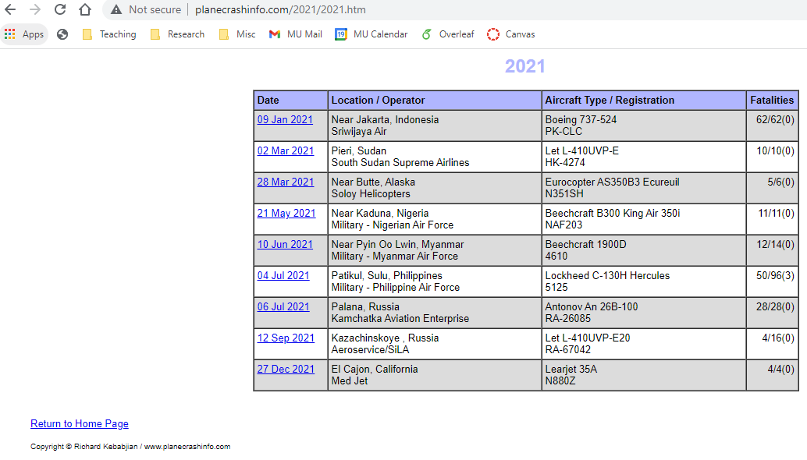
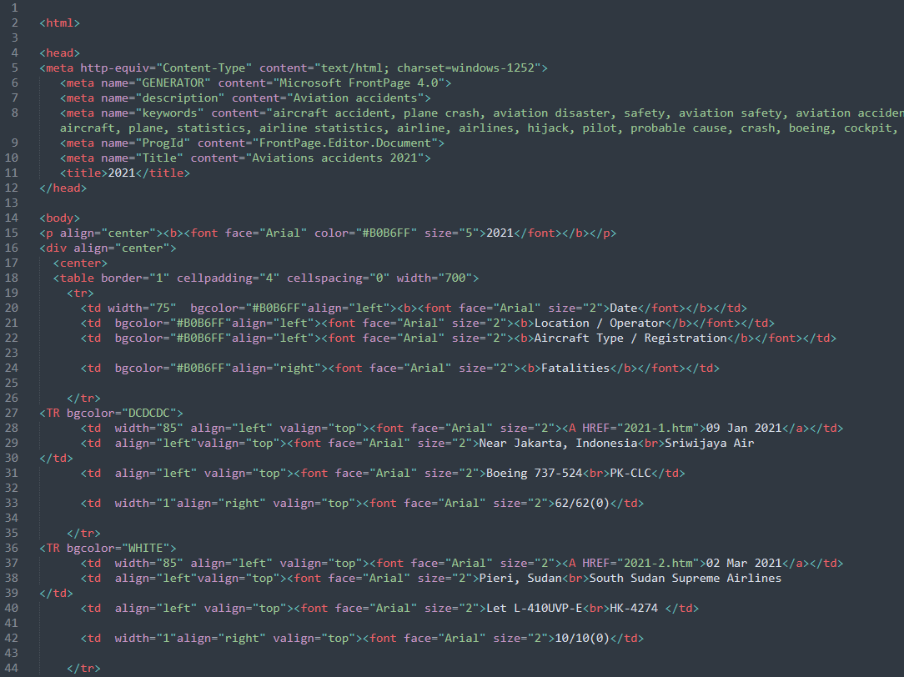
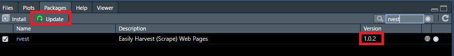
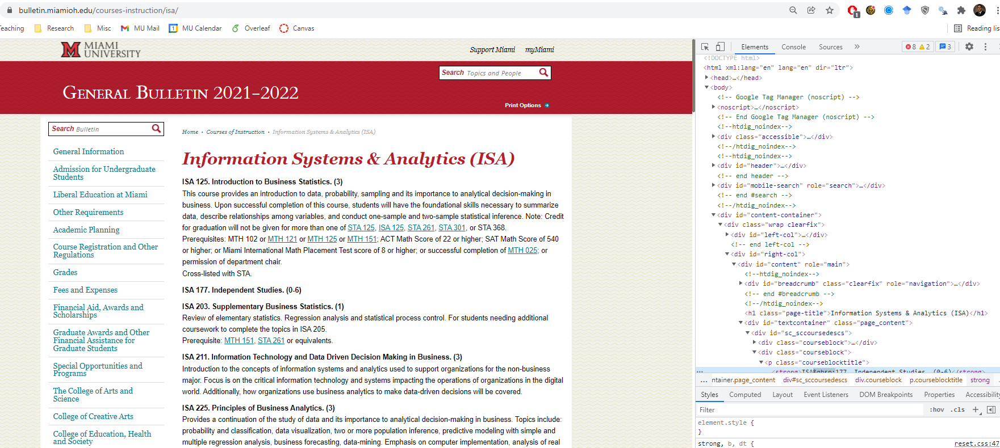
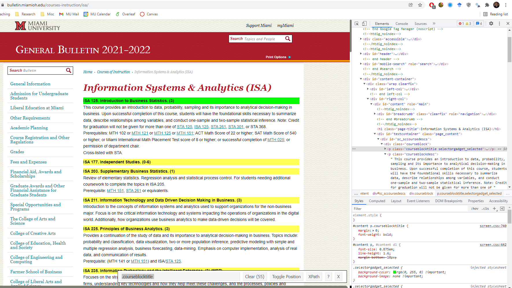

```{r setup, include=FALSE}
knitr::opts_chunk$set(cache = FALSE,
                      echo = TRUE,
                      warning = FALSE,
                      message = FALSE,
                      progress = FALSE,
                      verbose = FALSE,
                      dev = 'png',
                      fig.height = 2.5,
                      dpi = 300,
                      fig.align = 'center')

options(htmltools.dir.version = FALSE)

miamired = '#C3142D'

if(require(pacman)==FALSE) install.packages("pacman")
if(require(devtools)==FALSE) install.packages("devtools")

if(require(countdown)==FALSE) devtools::install_github("gadenbuie/countdown")
if(require(xaringanExtra)==FALSE) devtools::install_github("gadenbuie/xaringanExtra")


pacman::p_load(tidyverse, magrittr, lubridate, janitor, # data analysis pkgs
               rvest, robotstxt, httr2, # for web scraping
               scales, # for formatting
               fontawesome, RefManageR, xaringanExtra, countdown) # for slides
```

```{r xaringan-themer, include=FALSE, warning=FALSE}
if(require(xaringanthemer) == FALSE) install.packages("xaringanthemer")
library(xaringanthemer)

xaringanthemer::style_mono_accent(base_color = "#84d6d3",
                  base_font_size = "20px")

xaringanExtra::use_xaringan_extra(c("tile_view", "animate_css", "tachyons", "panelset", "search", "fit_screen", "editable",
                                    "clipable"))
```


## Quick Refresher from Last Week


`r emo::ji("check")` Define what an API is and why APIs matter.

`r emo::ji("check")` Construct API requests and handle authentication.

`r emo::ji("check")` Parse JSON responses into data frames.

---

## Learning Objectives for Today's Class

- **LO1:** Determine when scraping is permitted (robots.txt, Terms of Service)

- **LO2:** Parse HTML using `rvest`

- **LO3:** Extract text, attributes, and tables from HTML elements

- **LO4:** Handle missing data and dynamic content


---
class: inverse, center, middle

# Why Web Scraping?

---

## From APIs to Web Scraping

.pull-left[

- In the last lecture, we used APIs to extract structured data from web services.

- **However**, most data on the web is **not** available through APIs.

- Job postings, salary data, government labor statistics, and company information are often only available as **HTML pages**.

- Web scraping lets us **programmatically extract** data from these pages.

]

.pull-right[

```{r html5-logo, echo=FALSE, out.width='80%'}
knitr::include_graphics("https://upload.wikimedia.org/wikipedia/commons/thumb/6/61/HTML5_logo_and_wordmark.svg/512px-HTML5_logo_and_wordmark.svg.png")
```

]


---

## Web Scraping Powers Modern AI

.pull-left[

- Large Language Models (GPT, Claude, Gemini) are trained on **massive web-scraped datasets**.

- [Common Crawl](https://commoncrawl.org/) alone contains **billions of web pages** (~250 TB of text).

- Training datasets like **C4**, **The Pile**, and **RefinedWeb** are all derived from web scraping.

- This has sparked major legal battles:
  * *The New York Times v. OpenAI* (2023)
  * Reddit licensing its data to Google and OpenAI
  * Artists challenging AI image generators

]

.pull-right[

**The Scale of AI Training Data**

| Dataset | Source | Size |
|---------|--------|------|
| Common Crawl | Web scraping | ~250 TB |
| C4 | Filtered Common Crawl | ~750 GB |
| The Pile | Web + books + code | ~825 GB |
| RefinedWeb | Curated web data | ~5 TB |

<br>

.center[
*The techniques you learn today are the same ones used to build the AI tools you use every day.*
]

]


---

## AI Agents Use Web Scraping

Tools like **Claude Code**, **GitHub Copilot**, and **OpenAI Codex** use web scraping as part of how they help you:

<div style="max-width:750px; margin:0 auto; font-size:15px;">

<div style="text-align:center; margin-bottom:8px;">
  <div style="display:inline-block; background:#f5f5f5; border:2px solid #555; border-radius:10px; padding:10px 25px;">
    <strong>User Request:</strong> <em>"Help me build an authentication system"</em>
  </div>
</div>
<div style="text-align:center; font-size:20px; margin-bottom:8px;">&#9660;</div>

<div style="text-align:center; margin-bottom:8px;">
  <div style="display:inline-block; background:#C3142D; color:white; border-radius:10px; padding:10px 30px;">
    <strong>AI Agent</strong> (Claude Code / Codex / Copilot)
  </div>
</div>
<div style="text-align:center; font-size:20px; margin-bottom:8px;">&#9660;</div>

<div style="display:flex; gap:10px; margin-bottom:8px;">
  <div style="flex:1; background:#e8f8f5; border:2px solid #1abc9c; border-radius:10px; padding:10px; text-align:center;">
    <strong>Read & Search</strong><br>Local Codebase
  </div>
  <div style="flex:1; background:#e8f8f5; border:2px solid #1abc9c; border-radius:10px; padding:10px; text-align:center;">
    <strong>Execute</strong><br>Run & Test Code
  </div>
  <div style="flex:1; background:#fef9e7; border:3px solid #f39c12; border-radius:10px; padding:10px; text-align:center;">
    <strong>Web Fetch / Scrape</strong><br>
    Docs, API references,<br>tutorials, examples
  </div>
</div>

<div style="text-align:center; font-size:20px; margin-bottom:8px;">&#9660;</div>

<div style="text-align:center;">
  <div style="display:inline-block; background:#d5f5e3; border:2px solid #27ae60; border-radius:10px; padding:10px 25px;">
    <strong>Contextual Response</strong> &mdash; up-to-date code with correct API usage
  </div>
</div>
</div>

.footnote[
Web scraping is not just a data collection technique &mdash; it is a core capability of modern AI systems.
]


---
class: inverse, center, middle

# When Can We Scrape?

---

## Before You Scrape: Check `robots.txt`

- Every well-maintained website has a **`robots.txt`** file at its root (e.g., `https://example.com/robots.txt`).

- This file tells web crawlers which paths are **allowed** and which are **disallowed**.

- In `r fontawesome::fa("r-project", fill = miamired)`, the **`robotstxt`** package makes this easy:

```{r robots-example, eval=FALSE}
# Check if we can scrape a specific path
robotstxt::paths_allowed(
  paths  = "/ooh/",
  domain = "bls.gov",
  bot    = "*"
)
```

- A result of `TRUE` means scraping that path is generally permitted by the site's robots policy.

- **Important:** `robots.txt` is a guideline, not a legal contract -- but ignoring it can have consequences.


---

## Before You Scrape: Terms of Service

- Beyond `robots.txt`, always check the website's **Terms of Service (ToS)**.

- Some sites explicitly **prohibit** automated data collection, even if `robots.txt` allows it.

- Key things to look for in the ToS:
  * Restrictions on automated access or scraping
  * Rate limiting requirements
  * Restrictions on commercial use of scraped data

- **Rule of thumb:** If the data is publicly accessible and the site does not prohibit scraping, you are likely fine -- but always be respectful with request rates.

- When in doubt, **contact the website owner** or use an API if one is available.

.footnote[
<html><hr></html>
**Source:** [Krotov, V. & Silva, L. (2018). Legality and Ethics of Web Scraping. *AMCIS 2018*.](https://aisel.aisnet.org/amcis2018/DataScience/Presentations/17/)
]


---

count: false

## Ethical/Legal Considerations: Profile Scraping

- **Use of publicly available profiles as a part of your service:**

  + [LinkedIn vs HiQ Labs: Ninth Circuit Decision in 2019](https://cdn.ca9.uscourts.gov/datastore/opinions/2019/09/09/17-16783.pdf) -- HiQ scraped public LinkedIn profiles for workforce analytics.

  + [Revival of Case in 2021 by Supreme Court](https://techcrunch.com/2021/06/14/supreme-court-revives-linkedin-bid-to-protect-user-data-from-web-scrapers/) -- Supreme Court sent it back for further review.

  + The case established that scraping **publicly accessible** data is not necessarily a violation of the Computer Fraud and Abuse Act (CFAA), but the legal landscape remains complex.

- **Key takeaway:** Public data $\neq$ free-to-scrape. Always check ToS and robots.txt.


---

count: false

## Ethical/Legal Considerations: AI Training & Web Scraping

.pull-left[

- **Scraping entire websites for AI training** has become a legal battlefield:

  * *NYT v. OpenAI*: Can copyrighted articles be scraped for LLM training?
  * Reddit, Stack Overflow now **license** their data to AI companies
  * Many sites have updated `robots.txt` to block AI crawlers

- **What about archiving the internet?**
  * The [Wayback Machine](https://web.archive.org/) scrapes the entire web for preservation.

]

.pull-right[

- **The core tension:**

| Use Case | Generally OK? |
|----------|:---:|
| Academic research | `r emo::ji("check")` |
| Personal learning | `r emo::ji("check")` |
| Archival / preservation | `r emo::ji("check")` |
| Building a competing product | `r emo::ji("x")` |
| Training AI on copyrighted content | Contested |
| Violating ToS | `r emo::ji("x")` |

]


---

## Ethical Scraping Best Practices (1)

Even when scraping is technically **permitted**, follow these best practices:

1. **Rate limiting:** Add `Sys.sleep(1)` between requests to avoid overwhelming the server.

2. **Identify yourself:** Use a descriptive `User-Agent` header so the site owner knows who you are.

3. **Cache locally:** Save downloaded pages to disk so you do not re-download during development.

4. **Scrape only what you need:** Do not download entire websites if you only need a few pages.

5. **Respect `Crawl-delay`:** Some `robots.txt` files specify a minimum delay between requests.


---

## Ethical Scraping Best Practices (2)

```{r ethical-example, eval=FALSE}
# Example: polite scraping with a delay and User-Agent
urls <- c(
  "https://www.bls.gov/ooh/computer-and-information-technology/home.htm",
  "https://www.bls.gov/ooh/management/home.htm",
  "https://www.bls.gov/ooh/business-and-financial/home.htm"
          )

pages <- purrr::map(urls, function(url) {
  Sys.sleep(1)  # Be polite: wait 1 second between requests
  httr2::request(url) |>
    httr2::req_user_agent("ISA401 Course Scraper (Miami University)") |>
    httr2::req_perform() |>
    httr2::resp_body_raw() |>
    rvest::read_html()
})
```


---

## Activity: Check `robots.txt` on Three Sites

Using `robotstxt::paths_allowed()`, check whether the following paths are scrapable:

1. `bls.gov` -- path: `/ooh/`
2. `indeed.com` -- path: `/jobs/`
3. `linkedin.com` -- path: `/jobs/`

```{r robots-activity-setup, eval=FALSE}
# Example for site 1
robotstxt::paths_allowed(
  paths  = "/ooh/", domain = "www.bls.gov", bot    = "*"
)
```

**What do your results tell you about the scraping policies of each site?**

```{r robots-activity-solution, include=FALSE, eval=FALSE}
# Site 1: Bureau of Labor Statistics (government)
robotstxt::paths_allowed(paths = "/ooh/", domain = "www.bls.gov", bot = "*")

# Site 2: Indeed (commercial job board)
robotstxt::paths_allowed(paths = "/jobs/", domain = "indeed.com", bot = "*")

# Site 3: LinkedIn (social network)
robotstxt::paths_allowed(paths = "/jobs/", domain = "linkedin.com", bot = "*")
```

`r countdown::countdown(minutes = 3, warn_when = 60, color_background = miamired, color_text = "white", font_size = "1.5em", top = 0, right = 0)`


---

## LO1 Check-In

`r emo::ji("check")` You can now identify when scraping is permitted by:

- Checking `robots.txt` with `robotstxt::paths_allowed()`

- Reviewing a website's Terms of Service

- Understanding the legal landscape (LinkedIn v. HiQ, AI training debates)

- Using good judgment about request rates and data usage


---
class: inverse, center, middle


# Web Technology `r fa("html5", fill ="orange")` `r fa("css3-alt", fill ="blue")` `r fa("js-square", fill ="gold")`


.footnote[
<html>
<hr>
<html>
.left[
.large[Source:
Slides in this section are adapted from [Dr Earo Wang's STAT 220 Web Scraping Slides](https://stats220.earo.me/09-web-scrape.html#2), which were adapted from [Dr Emi Tanaka's](https://emitanaka.org/about.html) "Communicating with Data" course.
]
]
]

---

## World Wide Web (WWW)

WWW (or the **Web**) is the information system where documents (web pages) are identified by Uniform Resource Locators (**URL**s)

A web page consists of:
* `r fa("html5", fill ="orange")` **HTML** provides the basic structure of the web page
* `r fa("css3-alt", fill ="blue")` **CSS** controls the look of the web page (optional)
* `r fa("js-square", fill ="gold")`</span> **JS** is a programming language that can modify the behavior of elements of the web page (optional)

---

## `r fa("html5", fill ="orange")`</span> Hypertext Markup Language (HTML)

* with the extension `.html`.
* rendered using a web browser via an URL.
* text files that follows a special syntax that alerts web browsers how to render it.
.pull-left[
.center[**via a web browser**
```{r plane_crashes_1, echo=FALSE, out.width="100%", fig.height=5}

```
]
]
.pull-right[
.center[**via a text editor**
```{r plane_crashes_2, echo=FALSE}

```
]
]

---

## `r fa("html5", fill ="orange")` HTML Structure

```html
<!DOCTYPE html>

<html>
  <!--This is a comment and ignored by web client.-->
  <head>
    <!--This section contains web page metadata.-->
    <title>ISA 401: Business Intelligence and Data Viz</title>
    <meta name="author" content="Fadel Megahed">
    <link rel="stylesheet" href="css/styles.css">
  </head>

  <body>
    <!--This section contains what you want to display on your web page.-->
    <h1>I'm a first level header</h1>
    <p>This is a <b>paragraph</b>.</p>
  </body>
</html>
```

???

* servr::httd() to serve
* HTML: hier str: elements (`<tags>`) and optional attributes, and contents
* > 100 elements: each html page must have `<head>` and `<body>`. (rich format -> md)
* block tags: h1, p
* inline tags: bold a

---

## `r fa("html5", fill ="orange")` HTML Syntax

.center[`<span style="color:blue;">Author content</span>` <i class="fas fa-arrow-right"></i> <span style="color:blue;">Author content</span>]

<table style="width:100%">
<tr>
<td style="text-align:right;padding-right:30px;">start tag:</td><td><span class="remark-code" style="font-size:16pt"><span class="red">&lt;span style="color:blue;"&gt;</span><span class="grey">Author content&lt;/span&gt;</span></span> </td>
</tr>
<tr>
<td style="text-align:right;padding-right:30px;">end tag: </td><td> <span class="remark-code" style="font-size:16pt"><span class="grey">&lt;span style="color:blue;"&gt;Author content<span class="red">&lt;/span&gt;</span></span> </td>
</tr>
<tr>
<td style="text-align:right;padding-right:30px;">content: </td><td> <span class="remark-code" style="font-size:16pt"><span class="grey">&lt;span style="color:blue;"&gt;</span><span class="red">Author content</span><span class="grey">&lt;/span&gt;</span></span> </td>
</tr>
<tr>
<td style="text-align:right;padding-right:30px;">element name: </td><td> <span class="remark-code" style="font-size:16pt"><span class="grey">&lt;</span><span class="red">span</span><span class="grey"> style="color:blue;"&gt;Author content&lt;/span&gt;</span></span> </td>
</tr>
<tr>
<td style="text-align:right;padding-right:30px;">attribute: </td><td> <span class="remark-code" style="font-size:16pt"><span class="grey">&lt;span <span class="red">style="color:blue;"</span><span class="grey">&gt;Author content&lt;/span&gt;</span> </td>
</tr>
<tr>
<td style="text-align:right;padding-right:30px;">attribute name: </td><td> <span class="remark-code" style="font-size:16pt"><span class="grey">&lt;span <span class="red">style</span><span class="grey">="color:blue;"&gt;Author content&lt;/span&gt;</span> </td>
</tr>
<tr>
<td style="text-align:right;padding-right:30px;">attribute value: </td><td> <span class="remark-code" style="font-size:16pt"><span class="grey">&lt;span style=</span><span class="red">"color:blue;"</span><span class="grey">&gt;Author content&lt;/span&gt;</span> </td>
</tr>
</table>

<hr>

.center[**Not all HTML tags have an end tag**, for example:]

.center[
<span style="font-size:18pt;">``</span> `r fa('arrow-right')` 
]

---

## `r fa("html5", fill ="orange")` HTML Elements

<table style="width:100%">
<tr>
<td style="text-align:right;padding-right:30px;">block element:</td><td><span class="remark-code red" style="font-size:16pt">&lt;div><span class="grey">content</span>&lt;/div></span></td>
</tr>
<tr>
<td style="text-align:right;padding-right:30px;">inline element:</td><td><span class="remark-code red" style="font-size:16pt">&lt;span><span class="grey">content</span>&lt;/span></span></td>
</tr>
<tr>
<td style="text-align:right;padding-right:30px;">paragraph:</td><td><span class="remark-code red" style="font-size:16pt">&lt;p><span class="grey">content</span>&lt;/p></span></td>
</tr>
<tr>
<td style="text-align:right;padding-right:30px;">header level 1:</td><td><span class="remark-code red" style="font-size:16pt">&lt;h1><span class="grey">content</span>&lt;/h1></span></td>
</tr>
<tr>
<td style="text-align:right;padding-right:30px;">header level 2:</td><td><span class="remark-code red" style="font-size:16pt">&lt;h2><span class="grey">content</span>&lt;/h2></span></td>
</tr>
<tr>
<td style="text-align:right;padding-right:30px;">italic:</td><td><span class="remark-code red" style="font-size:16pt">&lt;i><span class="grey">content</span>&lt;/i></span></td>
</tr>
<tr>
<td style="text-align:right;padding-right:30px;">emphasised text:</td><td><span class="remark-code red" style="font-size:16pt">&lt;em><span class="grey">content</span>&lt;/em></span></td>
</tr>
<tr>
<td style="text-align:right;padding-right:30px;">strong importance:</td><td><span class="remark-code red" style="font-size:16pt">&lt;strong><span class="grey">content</span>&lt;/strong></span></td>
</tr>
<tr>
<td style="text-align:right;padding-right:30px;">link:</td><td><span class="remark-code red" style="font-size:16pt">&lt;a href="https://github.com/fmegahed/isa401"><span class="grey">content</span>&lt;/a></span></td>
</tr>
<tr>
<td valign="top" style="text-align:right;padding-right:30px;">unordered list:</td><td><span class="remark-code red" style="font-size:16pt">&lt;ul><br>&lt;li><span class="grey">item 1</span>&lt;/li><Br>&lt;li><span class="grey">item 2</span>&lt;/li><Br>&lt;/ul></span></td>
</tr>
</table>

???

How these are rendered to the browser depends on the browser default style values, style attribute or CSS...

---

## `r fa("css3-alt", fill ="blue")` Cascading Style Sheet (CSS)

* with the extension `.css`
* 3 ways to style elements in HTML:
  * **inline** by using the `style` attribute inside HTML start tag:
  <center>
  <span class="remark-code grey" style="font-size:14pt;">&lt;h1 <span class="red">style="color:blue;"</span>>Blue Header&lt;/h1></span>
  </center>
  + **externally** by using the `<link>` element:
  <center>
  <span class="remark-code red" style="font-size:14pt;">&lt;link rel="stylesheet" href="styles.css"></span>
  </center>
  + **internally** by defining within `<style>` element:

<div style="margin-left:35%; width:350px;">
```html
<style type="text/css">
h1 { color: blue; }
</style>
```
</div>
By convention, the `<style>` and `<link>` elements tend to go into the `<head>` section of the HTML document.

---

## `r fa("css3-alt", fill ="blue")` CSS Syntax

.pull-left[
```html
<style type="text/css">
h1 { color: blue; }
</style>
<h1>This is a header</h1>
```
]

<div style="margin-left:55%; width:350px;">
<br>
<h2 style="color:blue">This is a header</h2>
</div>

<table style="width:100%">
<tr>
<td style="text-align:right;padding-right:30px;">selector:</td><td><span class="remark-code" style="font-size:16pt"><span class="red">h1</span><span class="grey"> { color: blue; }</span></span> </td>
</tr>
<tr>
<td style="text-align:right;padding-right:30px;">property:</td><td><span class="remark-code" style="font-size:16pt; color:gray">h1 { <span class="red">color: blue;</span> }</span> </td>
</tr>
<tr>
<td style="text-align:right;padding-right:30px;">property name:</td><td><span class="remark-code" style="font-size:16pt; color:gray">h1 { <span class="red">color</span>: blue; } </span></td>
</tr>
<tr>
<td style="text-align:right;padding-right:30px;">property value:</td><td><span class="remark-code grey" style="font-size:16pt; color:gray">h1 { color: <span class="red">blue</span>; } </span></td>
</tr>
</table>

.pull-left[
You may have multiple properties for a single selector.`r emo::ji("arrow_right")`
]
.pull-right[
```css
h1 {
  color: blue;
  font-size: 16pt;
}
```
]

---

## `r fa("css3-alt", fill ="blue")` CSS Properties

.center[
```html
<div>Sample text</div>
```
]

<table style="width:100%">
<tr>
<td style="text-align:right;padding-right:30px;">background color:</td>
<td><span class="remark-code grey" style="font-size:16pt; color:gray">div { <span class="red">background-color: yellow;</span> }</span> </td>
<td>
<div style="background-color: yellow;">Sample text</div>
</td>
</tr>
<tr>
<td style="text-align:right;padding-right:30px;">text color:</td>
<td><span class="remark-code grey" style="font-size:16pt; color:gray">div { <span class="red">color: purple;</span> }</span> </td>
<td>
<div style="color: purple;">Sample text</div>
</td>
</tr>
<tr>
<td style="text-align:right;padding-right:30px;">border:</td>
<td><span class="remark-code grey" style="font-size:16pt; color:gray">div { <span class="red">border: 1px dashed brown;</span> }</span> </td>
<td>
<div style="border: 1px dashed brown;">Sample text</div>
</td>
</tr>
<tr>
<td style="text-align:right;padding-right:30px;">text size:</td>
<td><span class="remark-code grey" style="font-size:16pt; color:gray">div { <span class="red">font-size: 10pt;</span> }</span> </td>
<td>
<div style="font-size:10pt;">Sample text</div>
</td>
</tr>
<tr>
<td valign="top" style="text-align:right;padding-right:30px;">padding:</td>
<td  valign="top"><span class="remark-code grey" style="font-size:16pt; color:gray">div { background-color: yellow; <br>
&emsp;&emsp;&emsp;&nbsp;<span class="red">padding: 10px;</span> }</span> </td>
<td>
<div style="background-color: yellow;padding:10px;">Sample text</div>
</td>
</tr>
<tr>
<td valign="top" style="text-align:right;padding-right:30px;">margin:</td>
<td  valign="top"><span class="remark-code grey" style="font-size:16pt; color:gray">div { background-color: yellow; <br>
&emsp;&emsp;&emsp;&nbsp;<span class="red">margin: 10px;</span> }</span> </td>
<td>
<div style="background-color: yellow;margin:10px;">Sample text</div>
</td>
</tr>
</table>

---

.pull-left[
## `r fa("css3-alt", fill ="blue")` CSS Selector

<table class="grey" style="width:98%;margin-left:10px;margin-right:10px;">
<tr class="red">
<td class="remark-code">* </td><td>&nbsp;&nbsp;</td><td>selects all elements</td>
</tr>
<tr>
<td class="remark-code">div</td><td>&nbsp;&nbsp;</td><td>selects all <span class="remark-code" style="font-size:16pt">&lt;div></span> elements</td>
</tr>
<tr>
<td class="remark-code">div, p</td><td>&nbsp;&nbsp;</td><td>selects all <span class="remark-code" style="font-size:16pt">&lt;div></span> and <span class="remark-code" style="font-size:16pt">&lt;p></span> elements</td>
</tr>
<tr>
<td class="remark-code">div p</td><td>&nbsp;&nbsp;</td><td>selects all <span class="remark-code" style="font-size:16pt">&lt;p></span> within <span class="remark-code" style="font-size:16pt">&lt;div></span></td>
</tr>
<tr>
<td class="remark-code">div > p</td><td>&nbsp;&nbsp;</td><td>selects all <span class="remark-code" style="font-size:16pt">&lt;p></span> one level deep in <span class="remark-code" style="font-size:16pt">&lt;div></span></td>
</tr>
<tr valign="top">
<td class="remark-code">div + p</td><td>&nbsp;&nbsp;</td><td>selects all <span class="remark-code" style="font-size:16pt">&lt;p></span> immediately after a <span class="remark-code" style="font-size:16pt">&lt;div></span></td>
</tr>
<tr>
<td class="remark-code">div ~ p</td><td>&nbsp;&nbsp;</td><td>selects all <span class="remark-code" style="font-size:16pt">&lt;p></span> preceded by a <span class="remark-code" style="font-size:16pt">&lt;div></span></td>
</tr>
</table>
]
.pull-right[
<pre style="font-size: 13pt;" class="red">
&lt;h1>This is a sample html&lt;/h1>

&lt;blockquote>
&lt;p>Maybe stories are just data with a soul.&lt;/p>
&lt;footer>—Brene Brown&lt;/footer>
&lt;/blockquote>

&lt;div id="p1" class="parent">
Hmm
&lt;p>Hi!&lt;/p>
How are you?
&lt;div class="child nice">
  &lt;p>Hello!&lt;/p>
&lt;/div>
&lt;/div>

&lt;p>Household 1&lt;/p>

&lt;div class="parent">
&lt;p>Hi!&lt;/p>
&lt;blockquote class="child rebel">
  &lt;p>Don't talk to me!&lt;/p>
&lt;/blockquote>
&lt;/div>

&lt;span class="child">
&lt;span class="parent child rebel">
  &lt;p>Clean your room!&lt;/p>
&lt;/span>
&lt;/span>

&lt;p>End of households&lt;/p>

</pre>
]

---

count: false

.pull-left[
## `r fa("css3-alt", fill ="blue")` CSS Selector

<table class="grey" style="width:98%;margin-left:10px;margin-right:10px;">
<tr >
<td class="remark-code">* </td><td>&nbsp;&nbsp;</td><td>selects all elements</td>
</tr>
<tr class="red">
<td class="remark-code">div</td><td>&nbsp;&nbsp;</td><td>selects all <span class="remark-code" style="font-size:16pt">&lt;div></span> elements</td>
</tr>
<tr>
<td class="remark-code">div, p</td><td>&nbsp;&nbsp;</td><td>selects all <span class="remark-code" style="font-size:16pt">&lt;div></span> and <span class="remark-code" style="font-size:16pt">&lt;p></span> elements</td>
</tr>
<tr>
<td class="remark-code">div p</td><td>&nbsp;&nbsp;</td><td>selects all <span class="remark-code" style="font-size:16pt">&lt;p></span> within <span class="remark-code" style="font-size:16pt">&lt;div></span></td>
</tr>
<tr>
<td class="remark-code">div > p</td><td>&nbsp;&nbsp;</td><td>selects all <span class="remark-code" style="font-size:16pt">&lt;p></span> one level deep in <span class="remark-code" style="font-size:16pt">&lt;div></span></td>
</tr>
<tr valign="top">
<td class="remark-code">div + p</td><td>&nbsp;&nbsp;</td><td>selects all <span class="remark-code" style="font-size:16pt">&lt;p></span> immediately after a <span class="remark-code" style="font-size:16pt">&lt;div></span></td>
</tr>
<tr>
<td class="remark-code">div ~ p</td><td>&nbsp;&nbsp;</td><td>selects all <span class="remark-code" style="font-size:16pt">&lt;p></span> preceded by a <span class="remark-code" style="font-size:16pt">&lt;div></span></td>
</tr>
</table>
]
.pull-right[
<pre style="font-size: 13pt">
&lt;h1>This is a sample html&lt;/h1>

&lt;blockquote>
&lt;p>Maybe stories are just data with a soul.&lt;/p>
&lt;footer>—Brene Brown&lt;/footer>
&lt;/blockquote>

<span class="red">&lt;div id="p1" class="parent">
Hmm
&lt;p>Hi!&lt;/p>
How are you?
&lt;div class="child nice">
  &lt;p>Hello!&lt;/p>
&lt;/div>
&lt;/div></span>

&lt;p>Household 1&lt;/p>

<span class="red">&lt;div class="parent">
&lt;p>Hi!&lt;/p>
&lt;blockquote class="child rebel">
  &lt;p>Don't talk to me!&lt;/p>
&lt;/blockquote>
&lt;/div></span>

&lt;span class="child">
&lt;span class="parent child rebel">
  &lt;p>Clean your room!&lt;/p>
&lt;/span>
&lt;/span>

&lt;p>End of households&lt;/p>

</pre>
]

---

count: false

.pull-left[
## `r fa("css3-alt", fill ="blue")` CSS Selector

<table class="grey" style="width:98%;margin-left:10px;margin-right:10px;">
<tr >
<td class="remark-code">* </td><td>&nbsp;&nbsp;</td><td>selects all elements</td>
</tr>
<tr class="red">
<td class="remark-code">blockquote</td><td>&nbsp;&nbsp;</td><td>selects all <span class="remark-code" style="font-size:16pt">&lt;blockquote></span> elements</td>
</tr>
<tr>
<td class="remark-code">div, p</td><td>&nbsp;&nbsp;</td><td>selects all <span class="remark-code" style="font-size:16pt">&lt;div></span> and <span class="remark-code" style="font-size:16pt">&lt;p></span> elements</td>
</tr>
<tr>
<td class="remark-code">div p</td><td>&nbsp;&nbsp;</td><td>selects all <span class="remark-code" style="font-size:16pt">&lt;p></span> within <span class="remark-code" style="font-size:16pt">&lt;div></span></td>
</tr>
<tr>
<td class="remark-code">div > p</td><td>&nbsp;&nbsp;</td><td>selects all <span class="remark-code" style="font-size:16pt">&lt;p></span> one level deep in <span class="remark-code" style="font-size:16pt">&lt;div></span></td>
</tr>
<tr valign="top">
<td class="remark-code">div + p</td><td>&nbsp;&nbsp;</td><td>selects all <span class="remark-code" style="font-size:16pt">&lt;p></span> immediately after a <span class="remark-code" style="font-size:16pt">&lt;div></span></td>
</tr>
<tr>
<td class="remark-code">div ~ p</td><td>&nbsp;&nbsp;</td><td>selects all <span class="remark-code" style="font-size:16pt">&lt;p></span> preceded by a <span class="remark-code" style="font-size:16pt">&lt;div></span></td>
</tr>
</table>
]
.pull-right[
<pre style="font-size: 13pt">
&lt;h1>This is a sample html&lt;/h1>

<span class="red">&lt;blockquote>
&lt;p>Maybe stories are just data with a soul.&lt;/p>
&lt;footer>—Brene Brown&lt;/footer>
&lt;/blockquote></span>

&lt;div id="p1" class="parent">
Hmm
&lt;p>Hi!&lt;/p>
How are you?
&lt;div class="child nice">
  &lt;p>Hello!&lt;/p>
&lt;/div>
&lt;/div>

&lt;p>Household 1&lt;/p>

&lt;div class="parent">
&lt;p>Hi!&lt;/p>
&lt;blockquote class="child rebel">
  &lt;p>Don't talk to me!&lt;/p>
&lt;/blockquote>
&lt;/div>

&lt;span class="child">
&lt;span class="parent child rebel">
  &lt;p>Clean your room!&lt;/p>
&lt;/span>
&lt;/span>

&lt;p>End of households&lt;/p>

</pre>
]

---

count: false

.pull-left[
## `r fa("css3-alt", fill ="blue")` CSS Selector

<table class="grey" style="width:98%;margin-left:10px;margin-right:10px;">
<tr >
<td class="remark-code">* </td><td>&nbsp;&nbsp;</td><td>selects all elements</td>
</tr>
<tr>
<td class="remark-code">div</td><td>&nbsp;&nbsp;</td><td>selects all <span class="remark-code" style="font-size:16pt">&lt;div></span> elements</td>
</tr>
<tr class="red">
<td class="remark-code">div, p</td><td>&nbsp;&nbsp;</td><td>selects all <span class="remark-code" style="font-size:16pt">&lt;div></span> and <span class="remark-code" style="font-size:16pt">&lt;p></span> elements</td>
</tr>
<tr>
<td class="remark-code">div p</td><td>&nbsp;&nbsp;</td><td>selects all <span class="remark-code" style="font-size:16pt">&lt;p></span> within <span class="remark-code" style="font-size:16pt">&lt;div></span></td>
</tr>
<tr>
<td class="remark-code">div > p</td><td>&nbsp;&nbsp;</td><td>selects all <span class="remark-code" style="font-size:16pt">&lt;p></span> one level deep in <span class="remark-code" style="font-size:16pt">&lt;div></span></td>
</tr>
<tr valign="top">
<td class="remark-code">div + p</td><td>&nbsp;&nbsp;</td><td>selects all <span class="remark-code" style="font-size:16pt">&lt;p></span> immediately after a <span class="remark-code" style="font-size:16pt">&lt;div></span></td>
</tr>
<tr>
<td class="remark-code">div ~ p</td><td>&nbsp;&nbsp;</td><td>selects all <span class="remark-code" style="font-size:16pt">&lt;p></span> preceded by a <span class="remark-code" style="font-size:16pt">&lt;div></span></td>
</tr>
<tr>
</table>
]
.pull-right[
<pre style="font-size: 13pt">
&lt;h1>This is a sample html&lt;/h1>

&lt;blockquote>
<span class="red">&lt;p>Maybe stories are just data with a soul.&lt;/p></span>
&lt;footer>—Brene Brown&lt;/footer>
&lt;/blockquote>

<span class="red">&lt;div id="p1" class="parent">
Hmm
&lt;p>Hi!&lt;/p>
How are you?
&lt;div class="child nice">
  &lt;p>Hello!&lt;/p>
&lt;/div>
&lt;/div></span>

<span class="red">&lt;p>Household 1&lt;/p></span>

<span class="red">&lt;div class="parent">
&lt;p>Hi!&lt;/p>
&lt;blockquote class="child rebel">
  &lt;p>Don't talk to me!&lt;/p>
&lt;/span>
&lt;/div></span>

&lt;span class="child">
&lt;span class="parent child rebel">
  <span class="red">&lt;p>Clean your room!&lt;/p></span>
&lt;/span>
&lt;/span>

<span class="red">&lt;p>End of households&lt;/p></span>

</pre>
]

---

count: false

.pull-left[
## `r fa("css3-alt", fill ="blue")` CSS Selector

<table class="grey" style="width:98%;margin-left:10px;margin-right:10px;">
<tr >
<td class="remark-code">* </td><td>&nbsp;&nbsp;</td><td>selects all elements</td>
</tr>
<tr>
<td class="remark-code">div</td><td>&nbsp;&nbsp;</td><td>selects all <span class="remark-code" style="font-size:16pt">&lt;div></span> elements</td>
</tr>
<tr>
<td class="remark-code">div, p</td><td>&nbsp;&nbsp;</td><td>selects all <span class="remark-code" style="font-size:16pt">&lt;div></span> and <span class="remark-code" style="font-size:16pt">&lt;p></span> elements</td>
</tr>
<tr class="red">
<td class="remark-code">div p</td><td>&nbsp;&nbsp;</td><td>selects all <span class="remark-code" style="font-size:16pt">&lt;p></span> within <span class="remark-code" style="font-size:16pt">&lt;div></span></td>
</tr>
<tr>
<td class="remark-code">div > p</td><td>&nbsp;&nbsp;</td><td>selects all <span class="remark-code" style="font-size:16pt">&lt;p></span> one level deep in <span class="remark-code" style="font-size:16pt">&lt;div></span></td>
</tr>
<tr valign="top">
<td class="remark-code">div + p</td><td>&nbsp;&nbsp;</td><td>selects all <span class="remark-code" style="font-size:16pt">&lt;p></span> immediately after a <span class="remark-code" style="font-size:16pt">&lt;div></span></td>
</tr>
<tr>
<td class="remark-code">div ~ p</td><td>&nbsp;&nbsp;</td><td>selects all <span class="remark-code" style="font-size:16pt">&lt;p></span> preceded by a <span class="remark-code" style="font-size:16pt">&lt;div></span></td>
</tr>
<tr>
</table>
]
.pull-right[
<pre style="font-size: 13pt">
&lt;h1>This is a sample html&lt;/h1>

&lt;blockquote>
&lt;p>Maybe stories are just data with a soul.&lt;/p>
&lt;footer>—Brene Brown&lt;/footer>
&lt;/blockquote>

&lt;div id="p1" class="parent">
Hmm
<span class="red">&lt;p>Hi!&lt;/p></span>
How are you?
&lt;div class="child nice">
  <span class="red">&lt;p>Hello!&lt;/p></span>
&lt;/div>
&lt;/div>

&lt;p>Household 1&lt;/p>

&lt;div class="parent">
<span class="red">&lt;p>Hi!&lt;/p></span>
&lt;blockquote class="child rebel">
  <span class="red">&lt;p>Don't talk to me!&lt;/p></span>
&lt;/blockquote>
&lt;/div>

&lt;span class="child">
&lt;span class="parent child rebel">
  &lt;p>Clean your room!&lt;/p>
&lt;/span>
&lt;/span>

&lt;p>End of households&lt;/p>

</pre>
]

---

count: false

.pull-left[
## `r fa("css3-alt", fill ="blue")` CSS Selector

<table class="grey" style="width:98%;margin-left:10px;margin-right:10px;">
<tr >
<td class="remark-code">* </td><td>&nbsp;&nbsp;</td><td>selects all elements</td>
</tr>
<tr>
<td class="remark-code">div</td><td>&nbsp;&nbsp;</td><td>selects all <span class="remark-code" style="font-size:16pt">&lt;div></span> elements</td>
</tr>
<tr>
<td class="remark-code">div, p</td><td>&nbsp;&nbsp;</td><td>selects all <span class="remark-code" style="font-size:16pt">&lt;div></span> and <span class="remark-code" style="font-size:16pt">&lt;p></span> elements</td>
</tr>
<tr class="red">
<td class="remark-code">p div</td><td>&nbsp;&nbsp;</td><td>selects all <span class="remark-code" style="font-size:16pt">&lt;div></span> within <span class="remark-code" style="font-size:16pt">&lt;p></span></td>
</tr>
<tr>
<td class="remark-code">div > p</td><td>&nbsp;&nbsp;</td><td>selects all <span class="remark-code" style="font-size:16pt">&lt;p></span> one level deep in <span class="remark-code" style="font-size:16pt">&lt;div></span></td>
</tr>
<tr valign="top">
<td class="remark-code">div + p</td><td>&nbsp;&nbsp;</td><td>selects all <span class="remark-code" style="font-size:16pt">&lt;p></span> immediately after a <span class="remark-code" style="font-size:16pt">&lt;div></span></td>
</tr>
<tr>
<td class="remark-code">div ~ p</td><td>&nbsp;&nbsp;</td><td>selects all <span class="remark-code" style="font-size:16pt">&lt;p></span> preceded by a <span class="remark-code" style="font-size:16pt">&lt;div></span></td>
</tr>
<tr>
</table>
]
.pull-right[
<pre style="font-size: 13pt">
&lt;h1>This is a sample html&lt;/h1>

&lt;blockquote>
&lt;p>Maybe stories are just data with a soul.&lt;/p>
&lt;footer>—Brene Brown&lt;/footer>
&lt;/blockquote>

&lt;div id="p1" class="parent">
Hmm
&lt;p>Hi!&lt;/p>
How are you?
&lt;div class="child nice">
  &lt;p>Hello!&lt;/p>
&lt;/div>
&lt;/div>

&lt;p>Household 1&lt;/p>

&lt;div class="parent">
&lt;p>Hi!&lt;/p>
&lt;blockquote class="child rebel">
  &lt;p>Don't talk to me!&lt;/p>
&lt;/blockquote>
&lt;/div>

&lt;span class="child">
&lt;span class="parent child rebel">
  &lt;p>Clean your room!&lt;/p>
&lt;/span>
&lt;/span>

&lt;p>End of households&lt;/p>

</pre>
]

---

count: false

.pull-left[
## `r fa("css3-alt", fill ="blue")` CSS Selector

<table class="grey" style="width:98%;margin-left:10px;margin-right:10px;">
<tr >
<td class="remark-code">* </td><td>&nbsp;&nbsp;</td><td>selects all elements</td>
</tr>
<tr>
<td class="remark-code">div</td><td>&nbsp;&nbsp;</td><td>selects all <span class="remark-code" style="font-size:16pt">&lt;div></span> elements</td>
</tr>
<tr>
<td class="remark-code">div, p</td><td>&nbsp;&nbsp;</td><td>selects all <span class="remark-code" style="font-size:16pt">&lt;div></span> and <span class="remark-code" style="font-size:16pt">&lt;p></span> elements</td>
</tr>
<tr >
<td class="remark-code">div p</td><td>&nbsp;&nbsp;</td><td>selects all <span class="remark-code" style="font-size:16pt">&lt;p></span> within <span class="remark-code" style="font-size:16pt">&lt;div></span></td>
</tr>
<tr class="red">
<td class="remark-code">div > p</td><td>&nbsp;&nbsp;</td><td>selects all <span class="remark-code" style="font-size:16pt">&lt;p></span> one level deep in <span class="remark-code" style="font-size:16pt">&lt;div></span></td>
</tr>
<tr valign="top">
<td class="remark-code">div + p</td><td>&nbsp;&nbsp;</td><td>selects all <span class="remark-code" style="font-size:16pt">&lt;p></span> immediately after a <span class="remark-code" style="font-size:16pt">&lt;div></span></td>
</tr>
<tr>
<td class="remark-code">div ~ p</td><td>&nbsp;&nbsp;</td><td>selects all <span class="remark-code" style="font-size:16pt">&lt;p></span> preceded by a <span class="remark-code" style="font-size:16pt">&lt;div></span></td>
</tr>
<tr>
</table>
]
.pull-right[
<pre style="font-size: 13pt">
&lt;h1>This is a sample html&lt;/h1>

&lt;blockquote>
&lt;p>Maybe stories are just data with a soul.&lt;/p>
&lt;footer>—Brene Brown&lt;/footer>
&lt;/blockquote>

&lt;div id="p1" class="parent">
Hmm
<span class="red">&lt;p>Hi!&lt;/p></span>
How are you?
&lt;div class="child nice">
  <span class="red">&lt;p>Hello!&lt;/p></span>
&lt;/div>
&lt;/div>

&lt;p>Household 1&lt;/p>

&lt;div class="parent">
<span class="red">&lt;p>Hi!&lt;/p></span>
&lt;blockquote class="child rebel">
  &lt;p>Don't talk to me!&lt;/p>
&lt;/blockquote>
&lt;/div>

&lt;span class="child">
&lt;span class="parent child rebel">
  &lt;p>Clean your room!&lt;/p>
&lt;/span>
&lt;/span>

&lt;p>End of households&lt;/p>

</pre>
]

<div style="position:absolute;top:10px;left:900px;width:300px;background-color:white;border:1px solid black;font-size:16pt;padding:2px;">
<i class="fas fa-exclamation-triangle"></i> Ignores inline elements like <code>span</code>, <code>i</code>, <code>b</code>,...
</div>


---

count: false

.pull-left[
## `r fa("css3-alt", fill ="blue")` CSS Selector

<table class="grey" style="width:98%;margin-left:10px;margin-right:10px;">
<tr >
<td class="remark-code">* </td><td>&nbsp;&nbsp;</td><td>selects all elements</td>
</tr>
<tr>
<td class="remark-code">div</td><td>&nbsp;&nbsp;</td><td>selects all <span class="remark-code" style="font-size:16pt">&lt;div></span> elements</td>
</tr>
<tr>
<td class="remark-code">div, p</td><td>&nbsp;&nbsp;</td><td>selects all <span class="remark-code" style="font-size:16pt">&lt;div></span> and <span class="remark-code" style="font-size:16pt">&lt;p></span> elements</td>
</tr>
<tr >
<td class="remark-code">div p</td><td>&nbsp;&nbsp;</td><td>selects all <span class="remark-code" style="font-size:16pt">&lt;p></span> within <span class="remark-code" style="font-size:16pt">&lt;div></span></td>
</tr>
<tr>
<td class="remark-code">div > p</td><td>&nbsp;&nbsp;</td><td>selects all <span class="remark-code" style="font-size:16pt">&lt;p></span> one level deep in <span class="remark-code" style="font-size:16pt">&lt;div></span></td>
</tr>
<tr  valign="top" class="red">
<td class="remark-code">div + p</td><td>&nbsp;&nbsp;</td><td>selects all <span class="remark-code" style="font-size:16pt">&lt;p></span> immediately after a <span class="remark-code" style="font-size:16pt">&lt;div></span></td>
</tr>
<tr>
<td class="remark-code">div ~ p</td><td>&nbsp;&nbsp;</td><td>selects all <span class="remark-code" style="font-size:16pt">&lt;p></span> preceded by a <span class="remark-code" style="font-size:16pt">&lt;div></span></td>
</tr>
<tr>
</table>
]
.pull-right[
<pre style="font-size: 13pt">
&lt;h1>This is a sample html&lt;/h1>

&lt;blockquote>
&lt;p>Maybe stories are just data with a soul.&lt;/p>
&lt;footer>—Brene Brown&lt;/footer>
&lt;/blockquote>

&lt;div id="p1" class="parent">
Hmm
&lt;p>Hi!&lt;/p>
How are you?
&lt;div class="child nice">
  &lt;p>Hello!&lt;/p>
&lt;/div>
&lt;/div>

<span class="red">&lt;p>Household 1&lt;/p></span>

&lt;div class="parent">
&lt;p>Hi!&lt;/p>
&lt;blockquote class="child rebel">
  &lt;p>Don't talk to me!&lt;/p>
&lt;/blockquote>
&lt;/div>

&lt;span class="child">
&lt;span class="parent child rebel">
  <span class="red">&lt;p>Clean your room!&lt;/p></span>
&lt;/span>
&lt;/span>

&lt;p>End of households&lt;/p>

</pre>
]

<div style="position:absolute;top:10px;left:900px;width:300px;background-color:white;border:1px solid black;font-size:16pt;padding:2px;">
<i class="fas fa-exclamation-triangle"></i> Ignores inline elements like <code>span</code>, <code>i</code>, <code>b</code>,...
</div>

---

count: false

.pull-left[
## `r fa("css3-alt", fill ="blue")` CSS Selector

<table class="grey" style="width:98%;margin-left:10px;margin-right:10px;">
<tr >
<td class="remark-code">* </td><td>&nbsp;&nbsp;</td><td>selects all elements</td>
</tr>
<tr>
<td class="remark-code">div</td><td>&nbsp;&nbsp;</td><td>selects all <span class="remark-code" style="font-size:16pt">&lt;div></span> elements</td>
</tr>
<tr>
<td class="remark-code">div, p</td><td>&nbsp;&nbsp;</td><td>selects all <span class="remark-code" style="font-size:16pt">&lt;div></span> and <span class="remark-code" style="font-size:16pt">&lt;p></span> elements</td>
</tr>
<tr >
<td class="remark-code">div p</td><td>&nbsp;&nbsp;</td><td>selects all <span class="remark-code" style="font-size:16pt">&lt;p></span> within <span class="remark-code" style="font-size:16pt">&lt;div></span></td>
</tr>
<tr>
<td class="remark-code">div > p</td><td>&nbsp;&nbsp;</td><td>selects all <span class="remark-code" style="font-size:16pt">&lt;p></span> one level deep in <span class="remark-code" style="font-size:16pt">&lt;div></span></td>
</tr>
<tr>
<td class="remark-code">div + p</td><td>&nbsp;&nbsp;</td><td>selects all <span class="remark-code" style="font-size:16pt">&lt;p></span> immediately after a <span class="remark-code" style="font-size:16pt">&lt;div></span></td>
</tr>
<tr class="red">
<td class="remark-code">div ~ p</td><td>&nbsp;&nbsp;</td><td>selects all <span class="remark-code" style="font-size:16pt">&lt;p></span> preceded by a <span class="remark-code" style="font-size:16pt">&lt;div></span></td>
</tr>
</table>
]
.pull-right[
<pre style="font-size: 13pt">
&lt;h1>This is a sample html&lt;/h1>

&lt;blockquote>
&lt;p>Maybe stories are just data with a soul.&lt;/p>
&lt;footer>—Brene Brown&lt;/footer>
&lt;/blockquote>

&lt;div id="p1" class="parent">
Hmm
&lt;p>Hi!&lt;/p>
How are you?
&lt;div class="child nice">
  &lt;p>Hello!&lt;/p>
&lt;/div>
&lt;/div>

<span class="red">&lt;p>Household 1&lt;/p></span>

&lt;div class="parent">
&lt;p>Hi!&lt;/p>
&lt;blockquote class="child rebel">
  &lt;p>Don't talk to me!&lt;/p>
&lt;/blockquote>
&lt;/div>

&lt;span class="child">
&lt;span class="parent child rebel">
  <span class="red">&lt;p>Clean your room!&lt;/p></span>
&lt;/span>
&lt;/span>

<span class="red">&lt;p>End of households&lt;/p></span>

</pre>
]

---

count: false

.pull-left[
## `r fa("css3-alt", fill ="blue")` CSS Selector

<table class="grey" style="width:98%;margin-left:10px;margin-right:10px;">
<tr>
<td class="remark-code" valign="top">.classname</td><td>&nbsp;&nbsp;</td><td>selects all elements with the attribute <span class="remark-code" style="font-size:16pt">class="classname"</span>. </td>
</tr>
<tr>
<td class="remark-code" valign="top">.c1.c2</td><td>&nbsp;&nbsp;</td><td>selects all elements with <em>both</em> <span class="remark-code" style="font-size:16pt">c1</span> and <span class="remark-code" style="font-size:16pt">c2</span> within its class attribute. </td>
</tr>
<tr>
<td class="remark-code" valign="top">.c1 .c2</td><td>&nbsp;&nbsp;</td><td>selects all elements with  class <span class="remark-code" style="font-size:16pt">c2</span> that is a descendant of an element with class <span class="remark-code" style="font-size:16pt">c1</span>. </td>
</tr>
<tr>
<td class="remark-code" valign="top">#idname</td><td>&nbsp;&nbsp;</td><td>selects all elements with the attribute <span class="remark-code" style="font-size:16pt">id="idname"</span>. </td>
</tr>
</table>
]
.pull-right[
<pre style="font-size: 13pt">
&lt;h1>This is a sample html&lt;/h1>

&lt;blockquote>
&lt;p>Maybe stories are just data with a soul.&lt;/p>
&lt;footer>—Brene Brown&lt;/footer>
&lt;/blockquote>

&lt;div id="p1" class="parent">
Hmm
&lt;p>Hi!&lt;/p>
How are you?
&lt;div class="child nice">
  &lt;p>Hello!&lt;/p>
&lt;/div>
&lt;/div>

&lt;p>Household 1&lt;/p>

&lt;div class="parent">
&lt;p>Hi!&lt;/p>
&lt;blockquote class="child rebel">
  &lt;p>Don't talk to me!&lt;/p>
&lt;/blockquote>
&lt;/div>

&lt;span class="child">
&lt;span class="parent child rebel"></span>
  &lt;p>Clean your room!&lt;/p>
&lt;/span></span>
&lt;/span>

&lt;p>End of households&lt;/p>

</pre>
]

---

count: false

.pull-left[
## `r fa("css3-alt", fill ="blue")` CSS Selector

<table class="grey" style="width:98%;margin-left:10px;margin-right:10px;">
<tr class="red">
<td class="remark-code" valign="top">.parent</td><td>&nbsp;&nbsp;</td><td>selects all elements with the attribute <span class="remark-code" style="font-size:16pt">class="parent"</span>. </td>
</tr>
<tr>
<td class="remark-code" valign="top">.c1.c2</td><td>&nbsp;&nbsp;</td><td>selects all elements with <em>both</em> <span class="remark-code" style="font-size:16pt">c1</span> and <span class="remark-code" style="font-size:16pt">c2</span> within its class attribute. </td>
</tr>
<tr>
<td class="remark-code" valign="top">.c1 .c2</td><td>&nbsp;&nbsp;</td><td>selects all elements with  class <span class="remark-code" style="font-size:16pt">c2</span> that is a descendant of an element with class <span class="remark-code" style="font-size:16pt">c1</span>. </td>
</tr>
<tr>
<td class="remark-code" valign="top">#idname</td><td>&nbsp;&nbsp;</td><td>selects all elements with the attribute <span class="remark-code" style="font-size:16pt">id="idname"</span>. </td>
</tr>
</table>

<div style="position:absolute;top:10px;left:900px;width:300px;background-color:white;border:1px solid black;font-size:16pt;padding:2px;">
<i class="fas fa-exclamation-triangle"></i> Note some offspring do not inherit class from their parents.
</div>
]
.pull-right[
<pre style="font-size: 13pt">
&lt;h1>This is a sample html&lt;/h1>

&lt;blockquote>
&lt;p>Maybe stories are just data with a soul.&lt;/p>
&lt;footer>—Brene Brown&lt;/footer>
&lt;/blockquote>

<span class="red">&lt;div id="p1" class="parent">
Hmm
&lt;p>Hi!&lt;/p>
How are you?
&lt;div class="child nice">
  &lt;p>Hello!&lt;/p>
&lt;/div>
&lt;/div></span>

&lt;p>Household 1&lt;/p>

<span class="red">&lt;div class="parent">
&lt;p>Hi!&lt;/p>
&lt;blockquote class="child rebel">
  &lt;p>Don't talk to me!&lt;/p>
&lt;/blockquote>
&lt;/div></span>

&lt;span class="child">
<span class="red">&lt;span class="parent child rebel"></span>
  &lt;p>Clean your room!&lt;/p>
<span class="red">&lt;/span></span>
&lt;/span>

&lt;p>End of households&lt;/p>

</pre>
]

---

count: false

.pull-left[
## `r fa("css3-alt", fill ="blue")` CSS Selector

<table class="grey" style="width:98%;margin-left:10px;margin-right:10px;">
<td class="remark-code" valign="top">.classname</td><td>&nbsp;&nbsp;</td><td>selects all elements with the attribute <span class="remark-code" style="font-size:16pt">class="classname"</span>. </td>
</tr>
<tr class="red">
<td class="remark-code" valign="top">.child.rebel</td><td>&nbsp;&nbsp;</td><td>selects all elements with <em>both</em> <span class="remark-code" style="font-size:16pt">child</span> and <span class="remark-code" style="font-size:16pt">rebel</span> within its class attribute. </td>
</tr>
<tr>
<td class="remark-code" valign="top">.c1 .c2</td><td>&nbsp;&nbsp;</td><td>selects all elements with  class <span class="remark-code" style="font-size:16pt">c2</span> that is a descendant of an element with class <span class="remark-code" style="font-size:16pt">c1</span>. </td>
</tr>
<tr>
<td class="remark-code" valign="top">#idname</td><td>&nbsp;&nbsp;</td><td>selects all elements with the attribute <span class="remark-code" style="font-size:16pt">id="idname"</span>. </td>
</tr>
</table>
]
.pull-right[
<pre style="font-size: 13pt">
&lt;h1>This is a sample html&lt;/h1>

&lt;blockquote>
&lt;p>Maybe stories are just data with a soul.&lt;/p>
&lt;footer>—Brene Brown&lt;/footer>
&lt;/blockquote>

&lt;div id="p1" class="parent">
Hmm
&lt;p>Hi!&lt;/p>
How are you?
&lt;div class="child nice">
  &lt;p>Hello!&lt;/p>
&lt;/div>
&lt;/div>

&lt;p>Household 1&lt;/p>

&lt;div class="parent">
&lt;p>Hi!&lt;/p>
<span class="red">&lt;blockquote class="child rebel">
  &lt;p>Don't talk to me!&lt;/p>
&lt;/blockquote></span>
&lt;/div>

&lt;span class="child">
<span class="red">&lt;span class="parent child rebel"></span>
  &lt;p>Clean your room!&lt;/p>
<span class="red">&lt;/span></span>
&lt;/span>

&lt;p>End of households&lt;/p>

</pre>
]

---

count: false

.pull-left[
## `r fa("css3-alt", fill ="blue")` CSS Selector

<table class="grey" style="width:98%;margin-left:10px;margin-right:10px;">
<tr>
<td class="remark-code" valign="top">.classname</td><td>&nbsp;&nbsp;</td><td>selects all elements with the attribute <span class="remark-code" style="font-size:16pt">class="classname"</span>. </td>
</tr>
<tr>
<td class="remark-code" valign="top">.c1.c2</td><td>&nbsp;&nbsp;</td><td>selects all elements with <em>both</em> <span class="remark-code" style="font-size:16pt">c1</span> and <span class="remark-code" style="font-size:16pt">c2</span> within its class attribute. </td>
</tr>
<tr class="red">
<td class="remark-code" valign="top">.parent .rebel</td><td>&nbsp;&nbsp;</td><td>selects all elements with  class <span class="remark-code" style="font-size:16pt">rebel</span> that is a descendant of an element with class <span class="remark-code" style="font-size:16pt">parent</span>. </td>
</tr>
<tr>
<td class="remark-code" valign="top">#idname</td><td>&nbsp;&nbsp;</td><td>selects all elements with the attribute <span class="remark-code" style="font-size:16pt">id="idname"</span>. </td>
</tr>
</table>
]
.pull-right[
<pre style="font-size: 13pt">
&lt;h1>This is a sample html&lt;/h1>

&lt;blockquote>
&lt;p>Maybe stories are just data with a soul.&lt;/p>
&lt;footer>—Brene Brown&lt;/footer>
&lt;/blockquote>

&lt;div id="p1" class="parent">
Hmm
&lt;p>Hi!&lt;/p>
How are you?
&lt;div class="child nice">
  &lt;p>Hello!&lt;/p>
&lt;/div>
&lt;/div>

&lt;p>Household 1&lt;/p>

&lt;div class="parent">
&lt;p>Hi!&lt;/p>
<span class="red">&lt;blockquote class="child rebel">
  &lt;p>Don't talk to me!&lt;/p>
&lt;/blockquote></span>
&lt;/div>

&lt;span class="child">
&lt;span class="parent child rebel">
  &lt;p>Clean your room!&lt;/p>
&lt;/span>
&lt;/span>

&lt;p>End of households&lt;/p>

</pre>
]

---

count: false

.pull-left[
## `r fa("css3-alt", fill ="blue")` CSS Selector

<table class="grey" style="width:98%;margin-left:10px;margin-right:10px;">
<td class="remark-code" valign="top">.classname</td><td>&nbsp;&nbsp;</td><td>selects all elements with the attribute <span class="remark-code" style="font-size:16pt">class="classname"</span>. </td>
</tr>
<tr>
<td class="remark-code" valign="top">.c1.c2</td><td>&nbsp;&nbsp;</td><td>selects all elements with <em>both</em> <span class="remark-code" style="font-size:16pt">c1</span> and <span class="remark-code" style="font-size:16pt">c2</span> within its class attribute. </td>
</tr>
<tr>
<td class="remark-code" valign="top">.c1 .c2</td><td>&nbsp;&nbsp;</td><td>selects all elements with  class <span class="remark-code" style="font-size:16pt">c2</span> that is a descendant of an element with class <span class="remark-code" style="font-size:16pt">c1</span>. </td>
</tr>
<tr class="red">
<td class="remark-code" valign="top">#p1</td><td>&nbsp;&nbsp;</td><td>selects all elements with the attribute <span class="remark-code" style="font-size:16pt">id="p1"</span>. </td>
</tr>
</table>
]
.pull-right[
<pre style="font-size: 13pt">
&lt;h1>This is a sample html&lt;/h1>

&lt;blockquote>
&lt;p>Maybe stories are just data with a soul.&lt;/p>
&lt;footer>—Brene Brown&lt;/footer>
&lt;/blockquote>

<span class="red">&lt;div id="p1" class="parent">
Hmm
&lt;p>Hi!&lt;/p>
How are you?
&lt;div class="child nice">
  &lt;p>Hello!&lt;/p>
&lt;/div>
&lt;/div></span>

&lt;p>Household 1&lt;/p>

&lt;div class="parent">
&lt;p>Hi!&lt;/p>
&lt;blockquote class="child rebel">
  &lt;p>Don't talk to me!&lt;/p>
&lt;/blockquote>
&lt;/div>

&lt;span class="child">
&lt;span class="parent child rebel">
  &lt;p>Clean your room!&lt;/p>
&lt;/span>
&lt;/span>

&lt;p>End of households&lt;/p>

</pre>
]

<div style="position:absolute;top:10px;left:900px;width:300px;background-color:white;border:1px solid black;font-size:16pt;padding:2px;">
<i class="fas fa-exclamation-triangle"></i> Unlike <code style="font-size:16pt">class</code>, you can only have one <code style="font-size:16pt">id</code> value and must be unique in the whole HTML document.
</div>

---

## `r fa("js-square", fill ="gold")` JavaScript (JS)*

* JS is a programming language and enables interactive components in HTML documents.
* 2 ways to insert JS into a HTML document:
  + **internally** by defining within `<script>` element:
```html
  <script>
  document.getElementById("p1").innerHTML = "content";
  </script>
```
  + **externally** by using the `src` attribute to refer to the external file:
```html
  <script src="js/myjs.js"></script>
```

.footnote[
*JS-rendered content is **not visible** to `rvest::read_html()` -- we will address this with `read_html_live()` later.
]


---

class: inverse, center, middle

# Web Scraping with `r fa("r-project", fill = "white")` `r emo::ji("spider_web")`

---

## The `rvest` Workflow

.pull-left[

The core `rvest` workflow follows three steps:

.content-box-blue[
**Step 1: Read** -- `read_html(url)` downloads and parses the page.

**Step 2: Select** -- `html_elements(css)` selects matching nodes.

**Step 3: Extract** -- `html_text2()`, `html_attr()`, or `html_table()` pulls out data.
]

]

.pull-right[

```{r rvest-logo, echo=FALSE, out.width='60%'}

```

Use {rvest} `>= v1.0.4` (if not, update)

```{r rvest-workflow-code, eval=FALSE}
# Step 1: Read
page <- rvest::read_html("https://example.com")
# Step 2: Select
nodes <- page |> rvest::html_elements("css_selector")
# Step 3: Extract
data  <- nodes |> rvest::html_text2()
```

]


---

## Step 1: Reading a Page (+ Handling 403 Errors)

```{r read-html-basic, eval=FALSE}
# Attempt 1: Simple approach (works for most sites)
page <- rvest::read_html("https://www.bls.gov/ooh/")
```

Some sites (like BLS) block requests without a proper `User-Agent`. When `read_html()` fails with a **403 Forbidden** error, use `httr2`:

```{r read-html-httr2, eval=FALSE}
# Attempt 2: Robust approach with explicit User-Agent
url <- "https://www.bls.gov/emp/tables/fastest-growing-occupations.htm"

resp <- httr2::request(url) |>
  httr2::req_user_agent("ISA401 Course Scraper (Miami University)") |>
  httr2::req_retry(max_tries = 3) |>
  httr2::req_timeout(60) |>
  httr2::req_perform()

# Parse from raw bytes (avoids connection issues inside read_html)
page <- resp |>
  httr2::resp_body_raw() |>
  rvest::read_html()
```

.footnote[
**Tip:** Always start with `read_html()`. Only switch to `httr2` when you encounter errors.
]


---

## Steps 2 & 3: Selecting Elements and Extracting Data

.pull-left[

## `r fa("magnifying-glass")` Inspector
<br>
.center[
```{r inspector_1, echo=FALSE}

```
]
]
.pull-right[
## `r fa("puzzle-piece")` [Selector Gadget](https://selectorgadget.com/)
<br>
.center[
```{r inspector_2, echo=FALSE}

```
]
]

.footnote[
**How to use:** Right-click any element on a webpage > **Inspect** to see its HTML structure and identify CSS selectors. Or install the [SelectorGadget](https://selectorgadget.com/) Chrome extension to click-and-select.
]

---

## Demo: Scraping BLS Employment Data

.panelset[

.panel[.panel-name[Description]

.small[
- We will scrape the [BLS Fastest Growing Occupations](https://www.bls.gov/emp/tables/fastest-growing-occupations.htm) table.

- Our goal: extract the **employment projections table** as a data frame.

- We first check `robots.txt`, then use `httr2` to fetch the page, and `html_table()` to extract the data.
]

]

.panel[.panel-name[Code]

```{r bls-demo, eval=FALSE}
# Step 0: Check robots.txt
robotstxt::paths_allowed(
  paths = "/emp/tables/", domain = "bls.gov", bot = "*"
)

# Step 1: Read the page (using httr2 for robustness)
url <- "https://www.bls.gov/emp/tables/fastest-growing-occupations.htm"

resp <- httr2::request(url) |>
  httr2::req_user_agent("ISA401 Course Scraper (Miami University)") |>
  httr2::req_retry(max_tries = 3) |>
  httr2::req_timeout(60) |>
  httr2::req_perform()

page <- resp |> httr2::resp_body_raw() |> rvest::read_html()

# Step 2 & 3: Extract the employment projections table
tables <- page |> rvest::html_table()
fastest_growing <- tables[[1]]
head(fastest_growing)
```

]

.panel[.panel-name[Discussion]

Key observations from this demo:

- `html_table()` automatically converts HTML `<table>` elements into data frames.

- We used `httr2` because BLS blocks requests without a `User-Agent` header.

- The resulting data frame may need cleaning (column names, data types) with `dplyr` and `janitor`.

]

]


---

## LO2 Check-In

`r emo::ji("check")` You can now parse HTML using `rvest` by:

- Reading a web page with `read_html()` (or `httr2` when needed)

- Selecting elements with `html_elements()` using CSS selectors

- Using the browser Inspector or SelectorGadget to find selectors


---
class: inverse, center, middle

# Extracting Data from HTML

---

## `html_text2()`: Extracting Visible Text

- `html_text2()` extracts the **visible text** from HTML elements.

- It is preferred over `html_text()` because it handles whitespace more cleanly.

```{r text-extraction, eval=FALSE}
# Extract occupation titles from a BLS page
page |>
  rvest::html_elements("h3") |>
  rvest::html_text2()
```

- `html_text2()` strips HTML tags and returns a **character vector**.

- Each element in the vector corresponds to one matched HTML element.

- **Use when:** You want the text that a user would see on the page (headings, paragraphs, list items, labels).


---

## `html_attr()`: Extracting Attributes

- `html_attr()` extracts **attribute values** from HTML elements.

- This is essential for extracting **links** (`href`), **image URLs** (`src`), and **data attributes**.

```{r attr-extraction, eval=FALSE}
# Extract links to detailed occupation pages
page |>
  rvest::html_elements("a") |>
  rvest::html_attr("href")
```

- Use `html_attrs()` (plural) to get **all** attributes of an element as a named list.

- **Use when:** You need values that are **not visible** on the page but are embedded in the HTML (URLs, image sources, CSS classes, data attributes).


---

## `html_table()`: Extracting Tables

- Many web pages present data in HTML `<table>` elements.

- `html_table()` converts an HTML table directly into a **data frame** -- one of the most **powerful** features of `rvest`.

```{r table-extraction, eval=FALSE}
# Extract all tables from a BLS employment page
tables <- page |> rvest::html_table()

# Inspect how many tables were found
length(tables)

# The first table is usually the one we want
employment_df <- tables[[1]]
head(employment_df)
```

- Handles column headers, row spanning, and data types automatically.

- **Use when:** You see a **structured table** on the page with rows and columns of data.


---

## How Do I Choose? A Decision Tree

<div style="max-width:750px; margin:0 auto; font-size:15px;">

<div style="text-align:center; margin-bottom:12px;">
  <div style="display:inline-block; background:#C3142D; color:white; border-radius:10px; padding:12px 25px;">
    <div style="font-family:monospace; font-size:13px; margin-bottom:6px; opacity:0.9;">
      &lt;html&gt; &lt;head&gt;...&lt;/head&gt; &lt;body&gt; &lt;table&gt;... &lt;p&gt;... &lt;a href="..."&gt;... &lt;/body&gt; &lt;/html&gt;
    </div>
    <div style="font-size:18px;"><strong>What do you want to extract from the HTML?</strong></div>
  </div>
</div>

<div style="display:flex; gap:15px; text-align:center;">
  <div style="flex:1;">
    <div style="font-size:20px;">&#9660;</div>
    <div style="background:#e8f8f5; border:2px solid #1abc9c; border-radius:10px; padding:12px; margin-bottom:8px; min-height:80px;">
      "I see a <strong>structured table</strong><br>with rows and columns"
    </div>
    <div style="font-size:20px;">&#9660;</div>
    <div style="background:#1abc9c; color:white; border-radius:10px; padding:10px; font-family:monospace; font-size:16px;">
      html_table()
    </div>
    <div style="margin-top:5px; font-size:13px; color:#666;">
      Returns a <em>data frame</em>
    </div>
  </div>

  <div style="flex:1;">
    <div style="font-size:20px;">&#9660;</div>
    <div style="background:#fef9e7; border:2px solid #f39c12; border-radius:10px; padding:12px; margin-bottom:8px; min-height:80px;">
      "I need the <strong>visible text</strong><br>shown on the page"
    </div>
    <div style="font-size:20px;">&#9660;</div>
    <div style="background:#f39c12; color:white; border-radius:10px; padding:10px; font-family:monospace; font-size:16px;">
      html_text2()
    </div>
    <div style="margin-top:5px; font-size:13px; color:#666;">
      Returns a <em>character vector</em>
    </div>
  </div>

  <div style="flex:1;">
    <div style="font-size:20px;">&#9660;</div>
    <div style="background:#fdedec; border:2px solid #e74c3c; border-radius:10px; padding:12px; margin-bottom:8px; min-height:80px;">
      "I need a <strong>hidden value</strong><br>(URL, image src, ...)"
    </div>
    <div style="font-size:20px;">&#9660;</div>
    <div style="background:#e74c3c; color:white; border-radius:10px; padding:8px 10px; font-family:monospace; font-size:15px;">
      html_attr(<strong>"???"</strong>)
    </div>
    <div style="margin-top:8px; display:flex; gap:6px; text-align:center; font-size:12px;">
      <div style="flex:1; background:#fdf2f2; border:1px solid #e74c3c; border-radius:6px; padding:6px 2px;">
        <div style="font-family:monospace; font-weight:bold; color:#e74c3c;">"href"</div>
        <div style="color:#666; margin-top:2px;">links from<br>&lt;a&gt; tags</div>
      </div>
      <div style="flex:1; background:#fdf2f2; border:1px solid #e74c3c; border-radius:6px; padding:6px 2px;">
        <div style="font-family:monospace; font-weight:bold; color:#e74c3c;">"src"</div>
        <div style="color:#666; margin-top:2px;">image URLs<br>from &lt;img&gt;</div>
      </div>
      <div style="flex:1; background:#fdf2f2; border:1px solid #e74c3c; border-radius:6px; padding:6px 2px;">
        <div style="font-family:monospace; font-weight:bold; color:#e74c3c;">"alt"</div>
        <div style="color:#666; margin-top:2px;">alt text on<br>images</div>
      </div>
      <div style="flex:1; background:#fdf2f2; border:1px solid #e74c3c; border-radius:6px; padding:6px 2px;">
        <div style="font-family:monospace; font-weight:bold; color:#e74c3c;">"class"</div>
        <div style="color:#666; margin-top:2px;">CSS class<br>names</div>
      </div>
    </div>
    <div style="margin-top:5px; font-size:13px; color:#666;">
      Returns a <em>character vector</em>
    </div>
  </div>
</div>
</div>

.footnote[
**Tip:** You can combine these! First select a container with `html_elements()`, then extract text from some children and attributes from others.
]


---

## Activity: Scrape Employment Data from BLS

Using the BLS Employment Projections page, extract and clean the "Fastest Growing Occupations" table:

```{r activity-starter, eval=FALSE}
# Step 1: Fetch the page
url <- "https://www.bls.gov/emp/tables/fastest-growing-occupations.htm"

resp <- httr2::request(url) |>
  httr2::req_user_agent("ISA401 Student Scraper") |>
  httr2::req_perform()

page <- resp |> httr2::resp_body_raw() |> rvest::read_html()

# Step 2: Extract the table
# Your code here

# Step 3: What are the top 5 fastest growing occupations?
# Your code here
```

```{r activity-solution, include=FALSE, eval=FALSE}
url <- "https://www.bls.gov/emp/tables/fastest-growing-occupations.htm"
resp <- httr2::request(url) |>
  httr2::req_user_agent("ISA401 Student Scraper") |>
  httr2::req_retry(max_tries = 3) |>
  httr2::req_timeout(60) |>
  httr2::req_perform()
page <- resp |> httr2::resp_body_raw() |> rvest::read_html()

tables <- page |> rvest::html_table()
fastest_growing <- tables[[1]] |> janitor::clean_names()
head(fastest_growing, 5)
```

`r countdown::countdown(minutes = 5, warn_when = 60, color_background = miamired, color_text = "white", font_size = "1.5em", top = 0, right = 0)`


---

## LO3 Check-In

`r emo::ji("check")` You can now extract data from HTML using:

- `html_text2()` for visible text content

- `html_attr()` for element attributes (links, classes, IDs)

- `html_table()` for structured table data

- The decision tree to choose the right function for the job


---
class: inverse, center, middle

# Dynamic Content

---

## Dynamic Content & `read_html_live()`

- `read_html()` only sees the **raw HTML** -- it cannot execute JavaScript.

- Modern sites render content **dynamically** with JS (e.g., infinite scroll, single-page apps).

- `rvest::read_html_live()` solves this by launching a **headless Chrome browser**:

```{r read-html-live, eval=FALSE}
# Requires: install.packages("chromote") and Chrome/Chromium installed
session <- rvest::read_html_live("https://example.com/dynamic-page")

# Use the same extraction functions
titles <- session |> rvest::html_elements(".job-title") |> rvest::html_text2()

# Can also interact with the page
session$click(".load-more-button")
session$type("#search-box", "data analyst")
```

- **When to use:** When `read_html()` returns empty results but you can see data in the browser.


---

## LO4 Check-In

`r emo::ji("check")` You can now handle tricky scraping scenarios:

- Using `read_html_live()` for JavaScript-rendered dynamic content


---
class: inverse, center, middle

# Recap

---

## Summary of Main Points

By now, you should be able to do the following:

`r emo::ji("check")` **LO1:** Determine when scraping is permitted by checking `robots.txt` and Terms of Service

`r emo::ji("check")` **LO2:** Parse HTML pages using `rvest::read_html()` and `html_elements()` (with `httr2` as a fallback)

`r emo::ji("check")` **LO3:** Extract text with `html_text2()`, attributes with `html_attr()`, and tables with `html_table()`

`r emo::ji("check")` **LO4:** Handle dynamic content with `read_html_live()`


---

## Web Scraping Workflow Advisor

.font80[Click through the questions to get a step-by-step recommendation. Try all paths!]

<div id="scrape-advisor" style="background:#fafafa;border:2px solid #84d6d3;border-radius:8px;padding:20px;max-width:650px;margin:auto;text-align:center;font-size:0.95em;">
  <div id="sa-q" style="font-weight:bold;margin-bottom:12px;min-height:2.5em;">Have you verified that scraping is permitted using robotstxt::paths_allowed()?</div>
  <div id="sa-btns" style="margin-bottom:10px;">
    <button onclick="sa('yes_robot')" style="padding:8px 22px;margin:4px;border:2px solid #84d6d3;border-radius:6px;background:#fff;cursor:pointer;font-size:0.95em;">Yes, it&rsquo;s allowed</button>
    <button onclick="sa('no_robot')" style="padding:8px 22px;margin:4px;border:2px solid #C3142D;border-radius:6px;background:#fff;cursor:pointer;font-size:0.95em;">No / Not sure</button>
  </div>
  <div id="sa-res" style="display:none;padding:14px;border-radius:8px;background:#e8f5e9;margin-bottom:8px;">
    <div id="sa-name" style="font-size:1.1em;font-weight:bold;color:#2e7d32;"></div>
    <div id="sa-code" style="font-family:monospace;margin-top:6px;color:#333;text-align:left;white-space:pre-wrap;"></div>
  </div>
  <button id="sa-reset" onclick="saReset()" style="display:none;padding:6px 18px;border:1px solid #999;border-radius:4px;background:#fff;cursor:pointer;">Start Over</button>
</div>
<script>
(function(){
  var st='start',
      q=document.getElementById('sa-q'),
      b=document.getElementById('sa-btns'),
      r=document.getElementById('sa-res'),
      nm=document.getElementById('sa-name'),
      cd=document.getElementById('sa-code'),
      rb=document.getElementById('sa-reset');
  function btns(opts){
    b.innerHTML='';
    opts.forEach(function(o){
      var btn=document.createElement('button');
      btn.textContent=o[0];btn.onclick=function(){sa(o[1]);};
      btn.style.cssText='padding:8px 22px;margin:4px;border:2px solid '+(o[2]||'#84d6d3')+';border-radius:6px;background:#fff;cursor:pointer;font-size:0.95em;';
      b.appendChild(btn);
    });
  }
  function show(n,c,bg){
    b.style.display='none';q.style.display='none';
    r.style.display='block';r.style.background=bg||'#e8f5e9';
    nm.textContent=n;nm.style.color=(bg==='#fbe9e7')?'#C3142D':'#2e7d32';
    cd.textContent=c;rb.style.display='inline-block';
  }
  window.sa=function(c){
    if(st==='start'){
      if(c==='no_robot') show('\u26D4 STOP \u2014 Do not scrape!',
        'Always check first:\n  robotstxt::paths_allowed(\n    paths  = "/target-path",\n    domain = "https://example.com"\n  )\nIf FALSE, respect the site\'s wishes.','#fbe9e7');
      else{st='load';q.textContent='Does rvest::read_html(url) successfully load the page?';
        btns([['Yes, works fine','load_ok'],['403 / connection error','load_403','#C3142D'],['HTML loads but content is empty','load_empty','#C3142D']]);}
    }else if(st==='load'){
      if(c==='load_ok'){st='extract';q.textContent='What data do you want to extract?';
        btns([['A <table>','tbl'],['Text content','txt'],['An attribute (href, src, \u2026)','attr']]);}
      else if(c==='load_403'){st='extract';
        q.innerHTML='<span style="color:#C3142D;">\u26A0 Use httr2 with an explicit User-Agent:</span><br><code style="font-size:0.85em;">httr2::request(url) |&gt; req_user_agent() |&gt; req_perform()</code><br>Then pipe <code>resp_body_raw() |&gt; read_html()</code>.<br><br><b>Now, what data do you want to extract?</b>';
        btns([['A <table>','tbl'],['Text content','txt'],['An attribute (href, src, \u2026)','attr']]);}
      else{st='extract';
        q.innerHTML='<span style="color:#C3142D;">\u26A0 Content is rendered by JavaScript.</span> Use:<br><code style="font-size:0.85em;">rvest::read_html_live(url)</code><br>(Requires <code>chromote</code> + Chrome installed.)<br><br><b>Now, what data do you want to extract?</b>';
        btns([['A <table>','tbl'],['Text content','txt'],['An attribute (href, src, \u2026)','attr']]);}
    }else if(st==='extract'){
      if(c==='tbl') show('\u2192 Extract a table',
        'page |>\n  html_elements("table") |>\n  html_table()');
      else if(c==='txt') show('\u2192 Extract text',
        'page |>\n  html_elements("selector") |>\n  html_text2()');
      else show('\u2192 Extract an attribute',
        'page |>\n  html_elements("a") |>\n  html_attr("href")\n\n# Common attributes:\n#   "href" \u2014 link URLs\n#   "src"  \u2014 image URLs\n#   "alt"  \u2014 image alt text');
    }
  };
  window.saReset=function(){
    st='start';q.textContent='Have you verified that scraping is permitted using robotstxt::paths_allowed()?';
    q.style.display='block';b.style.display='block';r.style.display='none';rb.style.display='none';
    btns([['Yes, it\u2019s allowed','yes_robot'],['No / Not sure','no_robot','#C3142D']]);
  };
})();
</script>


---

## Key Functions Reference

| Function | Purpose |
|----------|---------|
| `robotstxt::paths_allowed()` | Check if a path can be scraped |
| `httr2` pipeline (`request()`, `req_user_agent()`, `req_perform()`) | Fetch pages with explicit User-Agent |
| `rvest::read_html()` | Read and parse an HTML page |
| `rvest::read_html_live()` | Read JS-rendered pages via headless Chrome |
| `rvest::html_elements()` | Select **all** matching elements |
| `rvest::html_element()` | Select first match |
| `rvest::html_text2()` | Extract visible text from elements |
| `rvest::html_attr()` | Extract an attribute value |
| `rvest::html_table()` | Convert an HTML table to a data frame |


---

## Readings and Resources

.pull-left[
.center[
```{r paper_1, echo=FALSE, out.height="300px"}
knitr::include_graphics("../../figures/web_scrape_in_data_science.PNG", dpi = NA)
```
]
* [PDF of Published Paper](https://www.tandfonline.com/doi/pdf/10.1080/10691898.2020.1787116)
* [ePub of Published Paper](https://www.tandfonline.com/doi/epub/10.1080/10691898.2020.1787116?needAccess=true)
]
.pull-right[
.center[]
* [Selector Gadget](https://rvest.tidyverse.org/articles/articles/selectorgadget.html)
* [Getting Started with rvest](https://rvest.tidyverse.org/articles/rvest.html)
* [Wickham, H. R for Data Science, Ch. 24: Web Scraping](https://r4ds.hadley.nz/webscraping)
]


---

## Things to Do to Prepare for Next Class

- **Read:** [rvest: Getting Started vignette](https://rvest.tidyverse.org/articles/rvest.html)

- **Install** the SelectorGadget extension in your browser.

- **Practice:** Try scraping a page of your choice (after checking `robots.txt`!).

- **Next class:** Web Scraping II -- handling pagination, scraping multiple pages, and building a complete scraping pipeline.
