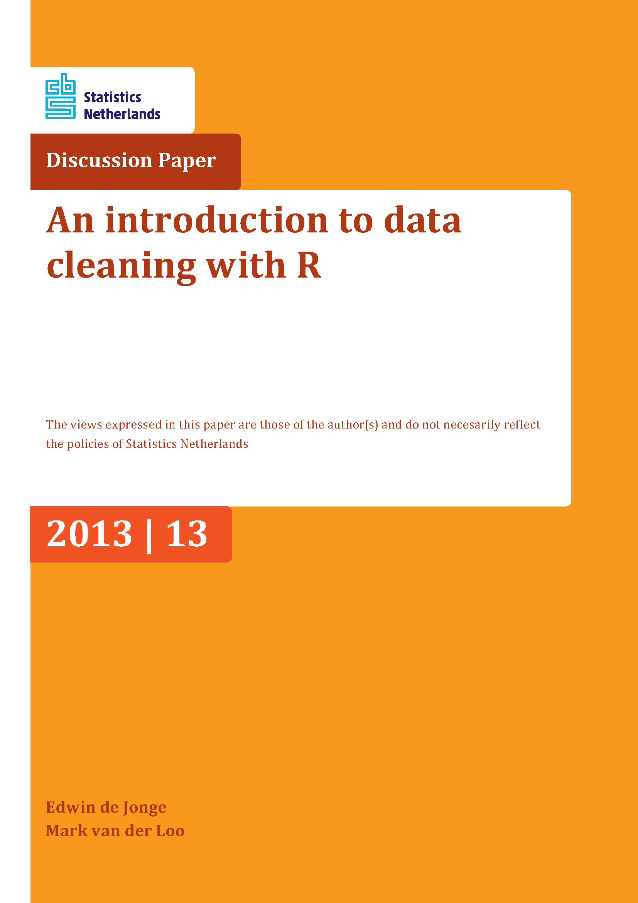

```{r setup, include=FALSE}
knitr::opts_chunk$set(cache = FALSE,
                      echo = TRUE,
                      warning = FALSE,
                      message = FALSE,
                      progress = FALSE, 
                      verbose = FALSE,
                      dev = 'png',
                      fig.height = 2.5,
                      dpi = 300,
                      fig.align = 'center')

options(htmltools.dir.version = FALSE)

miamired = '#C3142D'

if(require(pacman)==FALSE) install.packages("pacman")
if(require(devtools)==FALSE) install.packages("devtools")

if(require(countdown)==FALSE) devtools::install_github("gadenbuie/countdown")
if(require(xaringanExtra)==FALSE) devtools::install_github("gadenbuie/xaringanExtra")


pacman::p_load(tidyverse, magrittr, lubridate, janitor, # data analysis pkgs
               httr, jsonlite, tidycensus, # for APIs
               fontawesome, RefManageR, xaringanExtra, countdown) # for slides
```

```{r xaringan-themer, include=FALSE, warning=FALSE}
if(require(xaringanthemer) == FALSE) install.packages("xaringanthemer")
library(xaringanthemer)

style_mono_accent(base_color = "#84d6d3",
                  base_font_size = "20px")

xaringanExtra::use_xaringan_extra(c("tile_view", "animate_css", "tachyons", "panelset", "search", "fit_screen", "editable", "clipable"))
```


# Quick Refresher from Last Class


`r emo::ji("check")` Define tidy data  

`r emo::ji("check")` Perform pivot and rectangling operations in `r fontawesome::fa('r-project', fill = miamired)` 


---

# Learning Objectives for Today's Class

- Explain the concept of "technically correct" data  

- Examine the different column types and their summaries  

- Recode factors and convert dates  

- Manipulate characters   

- Explain the concept of "consistent" data


---
class: inverse, center, middle

# `r emo::ji('magnifying')` An Alternative Pipeline for Statistical Data Analysis

---

# Data Analysis: A Crowd-Sourced Definition

Wikipedia's [data analysis article](https://en.wikipedia.org/wiki/Data_analysis) defines it to be the **process** of:

> inspecting, cleansing, transforming and modeling data with the goal of discovering useful information, informing conclusion and supporting decision-making. Data analysis has multiple facets and approaches, encompassing diverse techniques under a variety of names, and is used in different business, science, and social science domains.


---

# Post Tidy Data: The Data Analysis Value Chain

```{r data_analysis_chart, echo=FALSE, out.width='40%'}
knitr::include_graphics('../../figures/statValueChain.PNG')
```

.footnote[
<html>
<hr>
</html>
**Source:** [De Jonge and Van Der Loo (2013), An introduction to data cleaning with R](https://cran.r-project.org/doc/contrib/de_Jonge+van_der_Loo-Introduction_to_data_cleaning_with_R.pdf). Please click on the link and read p. 7-8.
]


---

# Technically Correct Data

> Raw data files may lack headers, contain wrong data types (e.g. numbers stored as strings), wrong category labels, unknown or unexpected character encoding and so on.

> **Technically correct data** is the state in which data can be read into an R data.frame, with correct **name**, **types** and **labels**, without further trouble. However, that **does not mean that the values are error-free or complete**. --- [De Jonge and Van Der Loo (2013)](https://cran.r-project.org/doc/contrib/de_Jonge+van_der_Loo-Introduction_to_data_cleaning_with_R.pdf)

---
class: inverse, middle, center

# Technically Correct Data

---

# `r fontawesome::fa('r-project')` Functions for Cleaning/Renaming Variables

```{r functions_renaming, echo=FALSE}
library(gt)
tidyr <- tribble(
  ~ type, ~ `package_name`, ~ `fun()`, ~ `description`, 
  "**cleaning names**", "janitor", "clean_names()", "Resulting names are unique, consisting only <br> of the _ character, numbers, and letters",
  "**renaming**", "base R", "names()[colNum(s)]", "Will rename a column by its number, e.g., <br> names(df)[1] = 'new_name' will <br> rename the first column in df to 'new_name'",
  "**renaming**", "dplyr", "rename(df, new_name = old_name)", "Will rename a the column titled 'old_name' to 'new_name' <br> You can pass a vector of names to rename multiple cols, e.g., <br> rename(df, c(new_name1 = old_name1, new_name2 = old_name2))"
  
)

tidyr |> 
  gt() |> 
  fmt_markdown(everything()) |> 
  cols_label(
    `type` = md("`type`"),
    `package_name` = md("`package`"),
    `fun()` = md("`function()`"),
    `description` = md("`description`"),
  ) |> 
  as_raw_html()

```


---

# An Example for Renaming Columns: The Data


```{r iris_1}
iris_tbl = tibble::tibble(iris) # convert to tibble
print(iris_tbl, # printing it
      width= 80) # make it wider
```


---

# An Example for Renaming Columns: Code


```{r iris_2}
iris_tbl = janitor::clean_names(iris_tbl) #<< # overwrite w/ clean_names
names(iris_tbl) # seeing new names

names(iris_tbl)[names(iris_tbl)=='species'] = 'type' #<<
names(iris_tbl)

# renaming with rename
iris_tbl = dplyr::rename(
  iris_tbl, c(sepal_l = sepal_length, sepal_w = sepal_width) #<<
  ) 
names(iris_tbl)
```


---

# `r fontawesome::fa('r-project')` Functions for Examining Column Classes

```{r functions_datatypes, echo=FALSE}
library(gt)
tidyr <- tribble(
~ `package_name`, ~ `fun()`, ~ `description`, 
"base R", "class(iris_tbl$sepal_length)", "Will return the class of the column titled 'sepal_length'",
"base R", "sapply(iris_tbl, class)", "Will apply the class() function to all columns in the iris_tbl",
"base R", "str(iris_tbl)", "Will return the internal structure of the iris_tbl, which includes the dimensions of the df/tibble, column names, column types and first few observation values",
"purrr", "map_chr(iris_tbl, class)", "The tidyverse equivalent to sapply()",
"dplyr", "glimpse(iris_tbl)", "glimpse() is like a transposed version of print(): columns run down the page, and data runs across. It's a little like str() but shows you as much data as possible.",
"skimr", "skim(iris_tbl)", "returns variable types, names, statistical summaries & histograms of numeric variables.",
"DataExplorer", "plot_str(iris_tbl)", "while more useful for lists, returns a plot of the internal structure of your data."
)

tidyr |> 
  gt() |> 
  fmt_markdown(everything()) |> 
  cols_label(
    `package_name` = md("`package`"),
    `fun()` = md("`function()`"),
    `description` = md("`description`"),
  ) |> 
  as_raw_html()

```


---

# `r fontawesome::fa('r-project')` Functions for Changing Column Classes

- **Convert to Factor:** 
  * To convert a numeric vector to factors, we will typically use the chain of `as_factor( as_character() )`.  
  * To convert a character vector to factors, we will simply use the `as_factor()`.
  
- **Convert to Date:**
  * To convert a character vector to date, you should use an appropriate function or chain of functions from the `lubridate` `r fontawesome::fa("box", fill = 'gold')`.

- To change multiple columns at once, we will resort to the `mutate_at()` or `mutate_if` functions from the `dplyr` `r fontawesome::fa("box", fill = 'gold')`.

- **For any of the above operations, we will need to overwrite the original column's data.** 


---

# `r fontawesome::fa('r-project')` Functions for Labeling Factors

```{r functions_fct_recode, echo=FALSE}
library(gt)
tidyr <- tribble(
~ `package_name`, ~ `fun()`, ~ `description`, 
"base R", "levels(df$fct_column)= c()", "Passing a character vector to recode the levels of a factor column. **Order matters here so you need to check the order of both the levels and the inputs to c()**",
"forcats", "df$fct_column = fct_recode(df$fct_column, fruit = 'apple')", "If the factor colum contained a level called apple, it will be renamed to fruit. Multiple levels can be changed per `?fct_recode`"
)

tidyr |> 
  gt() |> 
  fmt_markdown(everything()) |> 
  cols_label(
    `package_name` = md("`package`"),
    `fun()` = md("`function()`"),
    `description` = md("`description`"),
  ) |> 
  as_raw_html()

```

---
class: inverse, middle, center

# Towards Consistent Data

---

# Consistent Data

> **Consistent data** is the stage where data is ready for statistical inference. It is the data that most statistical theories use as a starting point. Ideally, such theories can still be applied without taking previous data cleaning steps into account. In practice however, data cleaning methods like imputation of missing values will influence statistical results and so must be accounted for in the following analyses or interpretation thereof. --- [De Jonge and Van Der Loo (2013)](https://cran.r-project.org/doc/contrib/de_Jonge+van_der_Loo-Introduction_to_data_cleaning_with_R.pdf)

### Features of Consistent Data

- [Usually] no missing data

- Values within and across columns meet your expected "rules" for the data

- It is what we will colloquially refer to as "clean" data


---

# Considerations to Achieving Consistent Data

1. Do you have **missing values** in any of the variables?

2. Are the **values for each variable** reasonable? e.g., do you have a negative age?

3. Are the values **across the columns for a given observation reasonable**? e.g., does the count of registered and casual riders add up to the total number of riders?


### Some Useful Packages in `r fontawesome::fa('r-project')` 

- The [pointblank](https://rich-iannone.github.io/pointblank/) `r fontawesome::fa('box', fill = 'gold')` for data validation.  

- The [editrules](https://cran.r-project.org/web/packages/editrules/index.html) and [deducorrect](https://cran.r-project.org/web/packages/deducorrect/index.html) `r fontawesome::fa('box', fill = 'gold')` for localizing errors and performing some basic imputations of data.

- Note that any efforts to achieve consistent data **will have to be:**  
  * Dataset dependent; and
  * Research question dependent


---
class: inverse, middle, center

# A Demo Using a Popular Bikesharing Dataset

---

# Tasks

In this in-class, demo we will:

- Read the [bike_sharing_data.csv](https://raw.githubusercontent.com/fmegahed/isa401/main/data/bike_sharing_data.csv) data. The description of all fields (with the exception of the `sources` column) can be found at [Kaggle dataset description](https://www.kaggle.com/c/bike-sharing-demand/data).  

- Check whether the dataset is **technically correct**, **generate a report on how each variable meets/contradicts its expected data type/class**, and **fix any observed issue(s)**.

- We will create a set of **consistency rules** for variables and examine the instances (rows) when any of the rules are violated.

- We will generate an additional report on the status of our **data's consistency**.


---

# Data Validation Pipeline: `pointblank` `r fontawesome::fa('box', fill='gold')`

```{r pointblank_tc, echo=FALSE, results='hide'}
pacman::p_load(tidyverse, magrittr, lubridate, pointblank, hms, janitor)

bike_tbl = read_csv('../../data/bike_sharing_data.csv') |> janitor::clean_names()

act <- action_levels(warn_at = 0.01, notify_at = 0.01, stop_at = NULL)

agent <-
  create_agent(bike_tbl, actions = act) |>
  col_is_date(columns = vars(datetime)) |> 
  col_is_factor(columns = vars(season, holiday, workingday, weather)) |> 
  col_is_numeric(columns = vars(temp, atemp, humidity, windspeed)) |> 
  col_is_integer(columns = vars(casual, registered, count)) |> 
  col_is_character(columns = vars(sources))


res <- interrogate(agent, sample_limit = nrow(bike_tbl))
res |> export_report(filename = 'checking_tc.html')
```

```{r pointblank_report1, echo=FALSE}
knitr::include_url(url = 'checking_tc.html', height='475px')
```


---

# Changing the Column Types that Need "Fixing"

Please refer to our in-class code.

```{r bike_fixing_demo, include=FALSE}
bike_tbl = read_csv('../../data/bike_sharing_data.csv') |> 
  mutate(
    datetime = mdy_hm(datetime, tz = 'America/New_York'),
    date =  datetime |> as_date(),
    hour = datetime |> as_hms() |> hour() 
    ) |> 
  relocate(datetime, date, hour)

bike_tbl %<>% mutate_at(.vars = c('season', 'holiday', 'workingday', 'weather'),
                        as_factor) 
```


---

# Examining the Consistency of the Data

```{r pointblank_consistency, echo=TRUE, results='hide'}
library(pointblank)

act <- action_levels(warn_at = 0.01, notify_at = 0.01, stop_at = NULL)

agent <-
  create_agent(bike_tbl, actions = act) |>
  col_vals_between(columns = vars(temp, atemp, humidity, windspeed), 0, 100) |> 
  col_vals_gte(columns = vars(casual, registered), 0) |> 
  col_vals_gt(columns = vars(count), 0) |> 
  col_is_factor(columns = vars(season, holiday, workingday, weather)) |> 
  col_vals_in_set(columns = vars(hour), set = seq(0, 23, by = 1)) |> 
  col_vals_not_null(columns = names(bike_tbl)) |> 
  col_vals_expr(expr(count == casual + registered) ) |> 
  col_vals_expr(expr = expr(sources %in% c('AD campaign', 'ad campaign'))) |> 
  col_vals_expr(expr = ~ str_detect(sources, pattern = 'google'),
                label = 'non google sources')

res <- interrogate(agent, sample_limit = nrow(bike_tbl))
res |> export_report(filename = 'report_consistency.html')
```


---

# Examining the Consistency of the Data

```{r pointblank_report2, echo=FALSE}
knitr::include_url(url = 'report_consistency.html', height='475px')
```

---

# Changing the Column Values that Need "Fixing"

Please refer to our in-class code.


---

class: center, inverse, middle

# Recap

---

# Summary of Main Points

By now, you should be able to do the following:  

- Explain the concept of "technically correct" data  

- Examine the different column types and their summaries  

- Recode factors and convert dates  

- Manipulate characters   

- Explain the concept of "consistent" data

---


# Things to Do Prior to Next Class

Please go through the following two supplementary readings and complete [assignment 07](https://miamioh.instructure.com/courses/223961/quizzes/666240).

.pull-left[
.center[[](https://cran.r-project.org/doc/contrib/de_Jonge+van_der_Loo-Introduction_to_data_cleaning_with_R.pdf)]
* [From raw data to technically correct data](https://cran.r-project.org/doc/contrib/de_Jonge+van_der_Loo-Introduction_to_data_cleaning_with_R.pdf)
* [From technically correct to consistent data](https://cran.r-project.org/doc/contrib/de_Jonge+van_der_Loo-Introduction_to_data_cleaning_with_R.pdf)
]
.pull-right[
.center[[](https://cran.r-project.org/web/packages/funModeling/vignettes/funModeling_quickstart.html)]
* [An introduction to the funmodeling package](https://cran.r-project.org/web/packages/funModeling/vignettes/funModeling_quickstart.html)
* [Data preperation with funmodeling](https://livebook.datascienceheroes.com/data-preparation.html)
]
