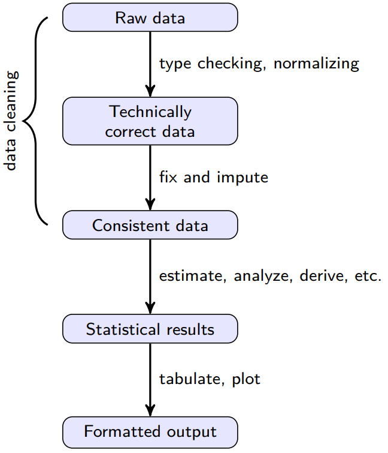
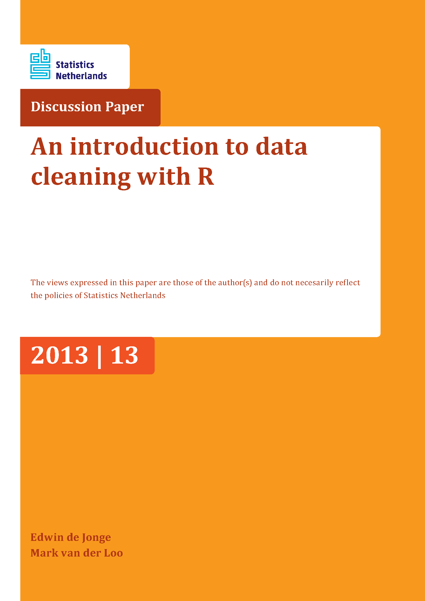

```{r setup, include=FALSE}
knitr::opts_chunk$set(cache = FALSE,
                      echo = TRUE,
                      warning = FALSE,
                      message = FALSE,
                      progress = FALSE,
                      verbose = FALSE,
                      dev = 'png',
                      fig.height = 2.5,
                      dpi = 300,
                      fig.align = 'center')

options(htmltools.dir.version = FALSE)

miamired = '#C3142D'

if(require(pacman)==FALSE) install.packages("pacman")
if(require(devtools)==FALSE) install.packages("devtools")

if(require(countdown)==FALSE) devtools::install_github("gadenbuie/countdown")
if(require(xaringanExtra)==FALSE) devtools::install_github("gadenbuie/xaringanExtra")


pacman::p_load(tidyverse, magrittr, lubridate, janitor, # data analysis pkgs
               visdat, VIM, naniar, stringr, # for data cleaning and imputation
               fontawesome, RefManageR, xaringanExtra, countdown) # for slides
```

```{r xaringan-themer, include=FALSE, warning=FALSE}
if(require(xaringanthemer) == FALSE) install.packages("xaringanthemer")
library(xaringanthemer)

xaringanthemer::style_mono_accent(base_color = "#84d6d3",
                  base_font_size = "20px")

xaringanExtra::use_xaringan_extra(c("tile_view", "animate_css", "tachyons", "panelset", "search", "fit_screen", "editable",
                                    "clipable"))
```


## Quick Refresher from Last Week


`r emo::ji("check")` Define the principles of tidy data.

`r emo::ji("check")` Reshape data using `pivot_longer()` and `pivot_wider()`.

`r emo::ji("check")` Perform rectangling and unnesting operations.

`r emo::ji("check")` Validate data types and value constraints with `pointblank`.

`r emo::ji("check")` Detect and handle duplicates.

---

## Kahoot/Quiz Review: Tidy Data & Validation

.pull-left[

**Q1.** Which function converts wide data to long format?
A. `pivot_wider()`
B. `pivot_longer()`
C. `unnest()`
D. `spread()`

**Q2.** In tidy data, each row represents:
A. A variable
B. A column header
C. An observation
D. A data type

**Q3.** Which `pointblank` function checks that values in a column are greater than a threshold?
A. `col_is_numeric()`
B. `col_vals_gt()`
C. `col_vals_expr()`
D. `col_vals_not_null()`

]

.pull-right[

**Q4.** What does `unnest_wider()` do?
A. Converts each element of a list-column into its own row
B. Converts each element of a list-column into its own column
C. Removes nested columns entirely
D. Joins two data frames side by side

**Q5.** To detect duplicate rows in a data frame, which function is most direct?
A. `dplyr::filter()`
B. `janitor::get_dupes()`
C. `tidyr::pivot_longer()`
D. `pointblank::interrogate()`

]

`r countdown(minutes = 3, warn_when = 60, color_background = miamired, color_text = "white", font_size = "1.5em", top = 0, right = 0)`


---

# Learning Objectives for Today's Class

- **LO1:** Identify different types of missing data (MCAR, MAR, MNAR)

- **LO2:** Apply appropriate imputation techniques (mean, median, K-NN)

- **LO3:** Clean and standardize text fields


---
class: inverse, center, middle

# LO1: Types of Missing Data

---

## The Data Cleaning Value Chain

.pull-left[

After tidying and validating data, we often discover two remaining problems:

1. **Missing values** -- cells with no data (`NA` in R)
2. **Inconsistent text** -- variations of the same value (e.g., "Sr.", "Senior", "SENIOR")

Today we learn how to diagnose, handle, and fix these issues.

]

.pull-right[

```{r value-chain, echo=FALSE, out.width='100%'}

```

.footnote[
<html><hr></html>
**Source:** [De Jonge and Van Der Loo (2013), An introduction to data cleaning with R](https://cran.r-project.org/doc/contrib/de_Jonge+van_der_Loo-Introduction_to_data_cleaning_with_R.pdf).
]

]


---

## Visualizing Missingness with `visdat`

.font80[
Before classifying *why* data is missing, we need to **see where** it is missing. The `visdat` package provides quick visual summaries.
]

```{r visdat-demo, fig.height=3}
# Create a sample job market dataset with missing values
set.seed(401)
job_market <- tibble::tibble(
  job_id = 1:200,
  title = sample(c("Data Analyst", "BI Developer", "Data Scientist", NA), 200, replace = TRUE, prob = c(0.35, 0.25, 0.3, 0.1)),
  salary = ifelse(runif(200) > 0.15, round(rnorm(200, 75000, 15000)), NA),
  experience = ifelse(runif(200) > 0.2, sample(1:15, 200, replace = TRUE), NA),
  company_size = sample(c("Small", "Medium", "Large", NA), 200, replace = TRUE, prob = c(0.3, 0.3, 0.3, 0.1))
)

visdat::vis_miss(job_market) #<< visualize missingness patterns
```


---

## Missingness Patterns with `naniar`

```{r naniar-upset, fig.height=3}
naniar::gg_miss_upset(job_market) #<< which columns co-occur as missing?
```

.font80[
The upset plot shows which **combinations of columns** are missing together. This helps diagnose whether missingness is random or systematic.
]


---

## Type 1: Missing Completely at Random (MCAR)

- **Definition:** The probability of a value being missing is **unrelated to any observed or unobserved data**.

- **Job market example:** A batch of salary records is lost due to a database migration error. The missing records are a random subset -- missingness has nothing to do with the salary amount, job title, or any other variable.

- **Consequence:** The remaining data is a simple random sample of the full dataset. Analysis is valid but has reduced statistical power.

- **Handling approach:** Safe to use **complete case analysis** (`na.omit()`) or **simple imputation** (mean/median).

.footnote[
<html><hr></html>
**Source:** Mack C, Su Z, Westreich D. (2018). [Types of Missing Data](https://www.ncbi.nlm.nih.gov/books/NBK493614/), AHRQ.
]


---

## Type 2: Missing at Random (MAR)

- **Definition:** The probability of a value being missing is related to **observed data but not the missing value itself**.

- **Job market example:** Salary is more likely to be missing for job postings from **small companies** than large companies. The missingness depends on company size (observed) but not on the actual salary amount (unobserved).

- **Consequence:** Complete case analysis may introduce **bias** because the remaining cases are not representative.

- **Handling approach:** **Imputation** that accounts for the observed predictors (e.g., K-NN imputation using company size).


---

## Type 3: Missing Not at Random (MNAR)

- **Definition:** The probability of a value being missing is related to **the missing value itself**.

- **Job market example:** Companies with **very high salaries** deliberately leave salary fields blank to avoid publicizing compensation. The missingness depends on the actual salary value.

- **Consequence:** Both complete case analysis and standard imputation can produce **biased results**.

- **Handling approach:** Requires **domain expertise** and potentially **sensitivity analysis**. Standard imputation may not be appropriate.


---

## Summary: Choosing an Approach Based on Missingness Type

| Type | Related to... | Complete Cases OK? | Imputation OK? |
|------|---------------|-------------------|----------------|
| **MCAR** | Nothing | Yes (reduced power) | Yes (any method) |
| **MAR** | Observed variables | Risky (potential bias) | Yes (use predictors) |
| **MNAR** | The missing value itself | No (bias likely) | Risky (needs expertise) |

--

.font80[
**Practical tip:** In the real world, you often cannot definitively prove the missingness type. The best strategy is to:
1. Visualize and explore the missingness pattern
2. Check if missingness correlates with observed variables
3. Use domain knowledge to make an informed judgment
4. Document your assumptions
]


---

## Activity: Classify the Missingness

`r countdown(minutes = 3, seconds = 0, top = 0, font_size = "2em")`

.panelset[

.panel[.panel-name[Scenarios]

.font80[
For each scenario below, identify the most likely missingness type (MCAR, MAR, or MNAR):

1. A survey of alumni salaries where high earners are less likely to respond.
2. A web scraping job where some pages fail to load due to network timeouts.
3. A job board where salary is only posted for entry-level positions but not for senior roles.
4. A dataset where some rows are missing because a lab technician accidentally deleted random records.
]

]

.panel[.panel-name[Your Answers]

.can-edit.key-activity07[
1. Scenario 1: ..............................
2. Scenario 2: ..............................
3. Scenario 3: ..............................
4. Scenario 4: ..............................
]

]

.panel[.panel-name[Reference Answers]

.font80[
1. **MNAR** -- Missingness is related to the value itself (high earners do not report).
2. **MCAR** -- Network timeouts are unrelated to the data content.
3. **MAR** -- Missingness depends on an observed variable (seniority level), not salary itself.
4. **MCAR** -- Random deletion is independent of any variable.
]

]

]


---

## LO1 Check-In

`r emo::ji("check")` You can now identify types of missing data:

- **MCAR:** Missingness is completely random -- safe for simple methods

- **MAR:** Missingness depends on observed variables -- use predictive imputation

- **MNAR:** Missingness depends on the missing value -- requires domain expertise


---
class: inverse, center, middle

# LO2: Imputation Techniques

---

## What Is Imputation?

- **Imputation** is the process of replacing missing values with **estimated** values.

- The goal is to produce a **complete dataset** that preserves the statistical properties of the original data as closely as possible.

- **Warning:** All imputation introduces some degree of error. The key is choosing a method that minimizes bias.

| Method | Complexity | When to Use |
|--------|-----------|-------------|
| Mean/Median | Low | MCAR, numeric columns, quick baseline |
| Mode | Low | MCAR, categorical columns |
| K-NN | Medium | MAR, when similar observations exist |
| Model-based (mice, etc.) | High | MAR, complex relationships |


---

## Mean/Median Imputation: Concept

.pull-left[

**Mean imputation:** Replace each `NA` with the column mean.

**Median imputation:** Replace each `NA` with the column median.

**Pros:**
- Simple, fast, easy to explain

**Cons:**
- Reduces variance (all imputed values are identical)
- Does not preserve relationships between variables
- Can distort the distribution shape

]

.pull-right[

```{r mean-impute-concept, echo=FALSE, fig.height=4}
set.seed(42)
original <- rnorm(100, mean = 70000, sd = 12000)
missing_idx <- sample(1:100, 20)
with_na <- original
with_na[missing_idx] <- NA
mean_imputed <- with_na
mean_imputed[is.na(mean_imputed)] <- mean(with_na, na.rm = TRUE)

df_plot <- tibble::tibble(
  value = c(original, mean_imputed),
  type = rep(c("Original (no missing)", "After Mean Imputation"), each = 100)
)

ggplot2::ggplot(df_plot, ggplot2::aes(x = value, fill = type)) +
  ggplot2::geom_histogram(bins = 20, alpha = 0.6, position = "identity") +
  ggplot2::scale_fill_manual(values = c(miamired, "#84d6d3")) +
  ggplot2::labs(x = "Salary", y = "Count", fill = "") +
  ggplot2::theme_minimal(base_size = 12) +
  ggplot2::theme(legend.position = "bottom")
```

.font70[Notice the spike at the mean in the imputed distribution -- this is the telltale sign of mean imputation.]

]


---

## Demo: Mean/Median Imputation in R

.panelset[

.panel[.panel-name[The Data]

```{r impute-mean-data}
jobs_missing <- tibble::tribble(
  ~title,             ~salary,  ~experience,
  "Data Analyst",      65000,    3,
  "BI Developer",      NA,       5,
  "Data Scientist",    95000,    NA,
  "ML Engineer",       NA,       7,
  "Data Analyst",      62000,    2,
  "BI Developer",      78000,    4
)
jobs_missing
```

]

.panel[.panel-name[Mean Imputation]

```{r impute-mean-code}
mean_salary <- mean(jobs_missing$salary, na.rm = TRUE)
median_exp  <- median(jobs_missing$experience, na.rm = TRUE)

jobs_mean_imputed <- jobs_missing |>
  tidyr::replace_na(list(             #<< replace NAs with specified values
    salary = mean_salary,
    experience = median_exp
  ))

jobs_mean_imputed
```

]

.panel[.panel-name[Limitations]

.font80[
- The imputed salaries for both the BI Developer and the ML Engineer are identical (the mean), even though their roles and experience differ substantially.

- Mean imputation **ignores relationships** between columns -- it does not account for the fact that ML Engineers typically earn more than BI Developers.

- This is why we need more sophisticated methods like K-NN.
]

]

]


---

## K-Nearest Neighbors (K-NN) Imputation

.pull-left[

**Concept:** For each missing value, find the K most similar complete observations (neighbors) and use their values to impute.

**How it works:**
1. Compute distances between the incomplete row and all complete rows
2. Select the K nearest neighbors
3. Use the neighbors' values (weighted average for numeric, mode for categorical) as the imputed value

**Advantages over mean/median:**
- Preserves relationships between variables
- Imputed values are context-sensitive
- Works for both numeric and categorical data

]

.pull-right[

```{r knn-concept, echo=FALSE, fig.height=4}
set.seed(42)
pts <- tibble::tibble(
  experience = c(3, 5, 7, 4, 2, 6, 8, 3.5),
  salary = c(65, NA, 95, 78, 62, 85, 100, 68)
)

pts_complete <- pts |> dplyr::filter(!is.na(salary))
pts_missing <- pts |> dplyr::filter(is.na(salary))

ggplot2::ggplot() +
  ggplot2::geom_point(data = pts_complete, ggplot2::aes(x = experience, y = salary),
             size = 4, color = "#84d6d3") +
  ggplot2::geom_point(data = pts_missing, ggplot2::aes(x = experience, y = 80),
             size = 5, shape = 4, color = miamired, stroke = 2) +
  ggplot2::annotate("text", x = 5.3, y = 80, label = "Missing\n(experience=5)", color = miamired, size = 3) +
  ggplot2::geom_segment(ggplot2::aes(x = 5, y = 80, xend = 4, yend = 78),
               linetype = "dashed", color = "grey50") +
  ggplot2::geom_segment(ggplot2::aes(x = 5, y = 80, xend = 6, yend = 85),
               linetype = "dashed", color = "grey50") +
  ggplot2::geom_segment(ggplot2::aes(x = 5, y = 80, xend = 3.5, yend = 68),
               linetype = "dashed", color = "grey50") +
  ggplot2::labs(x = "Experience (years)", y = "Salary (thousands)", title = "K-NN finds similar observations") +
  ggplot2::theme_minimal(base_size = 12)
```

]


---

## Demo: K-NN Imputation with `VIM::kNN()`

.panelset[

.panel[.panel-name[Code]

```{r knn-impute-code}
# Using our jobs_missing data from before
jobs_knn_imputed <- VIM::kNN(
  data = jobs_missing,
  k = 3                   #<< number of neighbors
)

# kNN adds indicator columns showing which values were imputed
jobs_knn_imputed
```

]

.panel[.panel-name[Comparison]

```{r knn-vs-mean}
comparison <- tibble::tibble(
  title = jobs_missing$title,
  original = jobs_missing$salary,
  mean_imputed = jobs_mean_imputed$salary,
  knn_imputed = jobs_knn_imputed$salary
)
comparison
```

.font80[
Notice how K-NN produces **different imputed values** for different rows based on their other attributes, whereas mean imputation gives the same value to every missing cell.
]

]

.panel[.panel-name[Before/After Visualization]

```{r knn-vis, eval=FALSE}
# Visualize which values were imputed
VIM::aggr(jobs_missing, col = c("#84d6d3", miamired), #<<
          numbers = TRUE, sortVars = TRUE)
```

.font80[
The `VIM::aggr()` function shows the pattern of missingness with a combination bar chart, helping you understand which variables and combinations are affected.
]

]

]


---

## Choosing an Imputation Method

| Criterion | Mean/Median | K-NN | Model-based (mice) |
|-----------|------------|------|---------------------|
| Speed | Fast | Moderate | Slow |
| Preserves relationships | No | Yes | Yes |
| Handles mixed types | No (numeric only) | Yes | Yes |
| Suitable for MCAR | Yes | Yes | Yes |
| Suitable for MAR | Risky | Yes | Yes |
| Interpretability | High | Medium | Low |

--

.font80[
**Recommendation for this course:** Start with visualizing missingness (`visdat`/`naniar`), then apply K-NN imputation (`VIM::kNN()`) as your default. Use mean/median only for quick baselines or when the missingness is clearly MCAR and the column is independent.
]


---

## Activity: Impute Missing Salary Data

`r countdown(minutes = 5, seconds = 0, top = 0, font_size = "2em")`

.panelset[

.panel[.panel-name[Instructions]

.font80[
1. Visualize the missingness in the `airquality` dataset using `visdat::vis_miss()`.
2. Apply mean imputation to the `Ozone` column.
3. Apply K-NN imputation (k=5) to the entire dataset using `VIM::kNN()`.
4. Compare the distributions of `Ozone` across original, mean-imputed, and K-NN-imputed versions.
]

```{r impute-activity-starter, eval=FALSE}
data(airquality) # built-in R dataset

# Step 1: Visualize
visdat::vis_miss(airquality)

# Step 2: Mean imputation
air_mean <- airquality |>
  dplyr::mutate(Ozone = tidyr::replace_na(Ozone, mean(Ozone, na.rm = TRUE)))

# Step 3: K-NN imputation
air_knn <- VIM::kNN(airquality, k = 5)

# Step 4: Compare (your code here)
```

]

.panel[.panel-name[Your Solution]

.can-edit.key-activity08[
```
# Write your comparison code here
```
]

]

.panel[.panel-name[Reference Solution]

```{r impute-activity-solution, eval=FALSE}
comparison_df <- tibble::tibble(
  original = airquality$Ozone,
  mean_imp = air_mean$Ozone,
  knn_imp  = air_knn$Ozone
) |> tidyr::pivot_longer(dplyr::everything(), names_to = "method", values_to = "ozone")

ggplot2::ggplot(comparison_df, ggplot2::aes(x = ozone, fill = method)) +
  ggplot2::geom_histogram(bins = 25, alpha = 0.5, position = "identity") +
  ggplot2::theme_minimal()
```

]

]


---

## LO2 Check-In

`r emo::ji("check")` You can now apply imputation techniques:

- **Mean/median** for quick, simple imputation (MCAR only)

- **K-NN** via `VIM::kNN()` for context-aware imputation (MAR and MCAR)

- **Comparison** of methods by examining distribution changes


---
class: inverse, center, middle

# LO3: Cleaning and Standardizing Text

---

## Why Text Cleaning Matters

- Real-world job data is full of **inconsistent text**:

| Raw Value | Should Be |
|-----------|-----------|
| "Sr. Data Analyst" | "Senior Data Analyst" |
| "Jr Developer" | "Junior Developer" |
| "data scientist" | "Data Scientist" |
| "New York,  NY" | "New York, NY" |
| "Salary: &lt;b&gt;$85,000&lt;/b&gt;" | "$85,000" |

- Without standardization, `group_by()` and `distinct()` treat these as **different values**.

- The `stringr` package (part of `tidyverse`) is our primary tool.


---

## Key `stringr` Functions for Text Cleaning

```{r stringr-functions, echo=FALSE}
stringr_fns <- tibble::tribble(
  ~`Function`, ~Purpose, ~Example,
  "`str_to_lower()` / `str_to_title()`", "Standardize case", '`str_to_title("data scientist")` -> "Data Scientist"',
  "`str_replace()` / `str_replace_all()`", "Find and replace patterns", '`str_replace("Sr.", "Senior")` -> "Senior"',
  "`str_squish()`", "Collapse multiple spaces to one", '`str_squish("New York,  NY")` -> "New York, NY"',
  "`str_trim()`", "Remove leading/trailing whitespace", '`str_trim("  Data Analyst  ")` -> "Data Analyst"',
  "`str_remove()` / `str_remove_all()`", "Remove matching patterns", '`str_remove_all("<b>", "<.*?>")` -> ""',
  "`str_detect()`", "Test if pattern matches", '`str_detect("Senior Analyst", "Senior")` -> TRUE'
)

stringr_fns |>
  gt::gt() |>
  gt::fmt_markdown(dplyr::everything()) |>
  gt::as_raw_html()
```


---

## Demo: Standardizing Job Titles

.panelset[

.panel[.panel-name[The Messy Data]

```{r text-messy-data}
messy_jobs <- tibble::tribble(
  ~raw_title,                      ~company,       ~location,
  "Sr. Data Analyst",              "Acme Corp",    "New York,  NY",
  "data analyst",                  "acme corp",    "new york, ny",
  "Jr Developer",                  "Beta Inc.",    "San Francisco, CA",
  "JUNIOR DEVELOPER",             "BETA INC",     "san francisco,  ca",
  "Sr Data Scientist",            "Gamma LLC",    "  Chicago, IL  ",
  "senior data scientist  ",      "Gamma, LLC",   "Chicago,IL"
)
messy_jobs
```

]

.panel[.panel-name[Cleaning Code]

```{r text-cleaning-code}
clean_jobs <- messy_jobs |>
  dplyr::mutate(
    # Step 1: Standardize abbreviations
    clean_title = stringr::str_replace_all(raw_title,
                    c("Sr\\.?" = "Senior", "Jr\\.?" = "Junior")), #<<
    # Step 2: Standardize case
    clean_title = stringr::str_to_title(clean_title), #<<
    # Step 3: Remove extra whitespace
    clean_title = stringr::str_squish(clean_title), #<<
    # Step 4: Clean company names
    clean_company = stringr::str_to_title(stringr::str_squish(company)),
    clean_company = stringr::str_remove_all(clean_company, "[.,]"), #<<
    # Step 5: Standardize locations
    clean_location = stringr::str_to_title(stringr::str_squish(location)),
    clean_location = stringr::str_replace(clean_location, ",(\\S)", ", \\1") #<< add space after comma
  )
```

]

.panel[.panel-name[Result]

```{r text-cleaning-result}
clean_jobs |> dplyr::select(clean_title, clean_company, clean_location)
```

.font80[
After cleaning, "Sr. Data Analyst" and "data analyst" collapse into comparable forms, and locations are consistently formatted.
]

]

]


---

## Removing HTML Tags from Scraped Data

- Job descriptions scraped from websites often contain **HTML artifacts**:

```{r html-removal}
raw_descriptions <- c(
  "<p>We are looking for a <b>Data Analyst</b> with 3+ years experience.</p>",
  "<div class='desc'>Must know <em>SQL</em> and <strong>R</strong>.</div>",
  "No HTML here -- just plain text."
)

# Remove all HTML tags using a regex pattern
clean_descriptions <- stringr::str_remove_all(raw_descriptions, "<[^>]+>") #<<
clean_descriptions
```

.font80[
The regex `<[^>]+>` matches any HTML tag (anything between `<` and `>`) and removes it.
]


---

## Demo: A Complete Text Cleaning Pipeline

.panelset[

.panel[.panel-name[Full Pipeline]

```{r full-text-pipeline}
raw_data <- tibble::tribble(
  ~title,                    ~description,                                         ~salary_text,
  "sr. data analyst",        "<p>Analyze data using <b>R</b> and SQL.</p>",        "$65,000 - $80,000",
  "JUNIOR BI DEVELOPER",     "<div>Build dashboards in <em>Tableau</em>.</div>",   "$55000-$70000",
  "  Data Scientist  ",      "Use ML models for prediction.  ",                     "85000"
)

cleaned <- raw_data |>
  dplyr::mutate(
    title = title |> stringr::str_replace_all(c("sr\\." = "Senior", "sr " = "Senior ")) |>
      stringr::str_to_title() |> stringr::str_squish() |> stringr::str_trim(),
    description = description |> stringr::str_remove_all("<[^>]+>") |> stringr::str_squish(),
    salary_min = salary_text |> stringr::str_extract("\\d[\\d,]+") |>
      stringr::str_remove_all(",") |> as.numeric(),
    salary_max = salary_text |>
      stringr::str_extract_all("\\d[\\d,]+") |> purrr::map_chr(~ tail(.x, 1)) |>
      stringr::str_remove_all(",") |> as.numeric()
  )
cleaned |> dplyr::select(title, description, salary_min, salary_max)
```

]

.panel[.panel-name[Key Techniques]

.font80[
1. **`str_replace_all()` with a named vector** -- apply multiple replacements in one call
2. **`str_to_title()` + `str_squish()`** -- normalize case and whitespace
3. **`str_remove_all("<[^>]+>")`** -- strip HTML tags
4. **`str_extract()` with regex** -- pull numeric salary values from free-text fields
5. **`as.numeric()`** -- convert extracted strings to numbers for analysis
]

]

]


---

## Common Text Cleaning Patterns for Job Data

| Problem | Solution | Code |
|---------|----------|------|
| Mixed case | Standardize to title case | `str_to_title(x)` |
| Extra spaces | Collapse whitespace | `str_squish(x)` |
| Abbreviations | Replace with full forms | `str_replace_all(x, c("Sr." = "Senior"))` |
| HTML tags | Strip tags | `str_remove_all(x, "<[^>]+>")` |
| Leading/trailing spaces | Trim | `str_trim(x)` |
| Salary as text | Extract numbers | `str_extract(x, "\\d+") |> as.numeric()` |
| Inconsistent separators | Normalize | `str_replace(x, ",(?=\\S)", ", ")` |


---

## Activity: Clean a Messy Job Posting Dataset

`r countdown(minutes = 7, seconds = 0, top = 0, font_size = "2em")`

.panelset[

.panel[.panel-name[Instructions]

.font80[
Starting from the dataset below, perform the following:

1. **Standardize** job titles (fix abbreviations, case, whitespace)
2. **Remove HTML** from descriptions
3. **Extract** numeric salary values from the text
4. **Impute** missing experience values using K-NN (k=3)
5. Compute the **number of unique clean job titles**
]

```{r text-activity-data, eval=FALSE}
messy <- tibble::tribble(
  ~title,                    ~description,                               ~salary,            ~experience,
  "sr. analyst",             "<p>Advanced analytics role</p>",            "$70,000-$90,000",  5,
  "SR. ANALYST",             "<b>Analytics</b> and reporting",            "75000 - 95000",    NA,
  "Jr. developer",           "Build web apps with <em>React</em>",       "$55,000",          2,
  "junior developer",        "Frontend development role",                 "58000",            NA,
  "  Data Scientist  ",      "<div>ML and AI research</div>",            "$95,000-$120,000", 7
)
```

]

.panel[.panel-name[Your Solution]

.can-edit.key-activity09[
```
# Write your complete cleaning pipeline here
```
]

]

.panel[.panel-name[Reference Solution]

```{r text-activity-solution, eval=FALSE}
cleaned <- messy |>
  dplyr::mutate(
    clean_title = title |>
      stringr::str_replace_all(c("sr\\." = "Senior", "Sr\\." = "Senior",
                        "Jr\\." = "Junior", "jr\\." = "Junior")) |>
      stringr::str_to_title() |> stringr::str_squish() |> stringr::str_trim(),
    clean_desc = stringr::str_remove_all(description, "<[^>]+>") |> stringr::str_squish(),
    salary_min = salary |> stringr::str_extract("\\d[\\d,]+") |>
      stringr::str_remove_all(",") |> as.numeric()
  )

# Impute missing experience
cleaned_imputed <- VIM::kNN(cleaned, variable = "experience", k = 3)

# Count unique titles
dplyr::n_distinct(cleaned_imputed$clean_title)
```

]

]


---

## LO3 Check-In

`r emo::ji("check")` You can now clean and standardize text using:

- `str_replace_all()` for abbreviation standardization

- `str_to_title()` and `str_squish()` for case and whitespace normalization

- `str_remove_all("<[^>]+>")` for HTML tag removal

- `str_extract()` for pulling structured values from free text


---
class: inverse, center, middle

# Putting It All Together

---

## The 80% Rule

.pull-left[

> "80% of a data analyst's time is spent cleaning data -- this IS the job."

The techniques from today's lecture form the **core workflow** of every data professional:

1. **Diagnose** -- visualize missingness, identify text inconsistencies
2. **Classify** -- determine the missingness type (MCAR, MAR, MNAR)
3. **Impute** -- apply the appropriate method (mean, K-NN, etc.)
4. **Standardize** -- clean text fields for consistent grouping and analysis

]

.pull-right[

```{r eighty-percent, echo=FALSE, fig.height=4}
time_data <- tibble::tibble(
  task = c("Data Cleaning", "Analysis & Modeling", "Visualization", "Communication"),
  pct = c(80, 10, 5, 5)
) |> dplyr::mutate(task = forcats::fct_reorder(task, pct))

ggplot2::ggplot(time_data, ggplot2::aes(x = task, y = pct, fill = task)) +
  ggplot2::geom_col() +
  ggplot2::coord_flip() +
  ggplot2::scale_fill_manual(values = c("#84d6d3", "grey70", "grey70", miamired)) +
  ggplot2::labs(x = "", y = "% of Time", title = "How Analysts Spend Their Time") +
  ggplot2::theme_minimal(base_size = 14) +
  ggplot2::theme(legend.position = "none")
```

]


---
class: inverse, center, middle

# Recap

---

## Summary of Main Points

By now, you should be able to do the following:

`r emo::ji("check")` **LO1:** Identify types of missing data -- MCAR (random), MAR (depends on observed), MNAR (depends on missing)

`r emo::ji("check")` **LO2:** Apply imputation techniques -- mean/median for simple cases, K-NN (`VIM::kNN()`) for context-aware imputation

`r emo::ji("check")` **LO3:** Clean and standardize text -- fix abbreviations, normalize case, remove HTML, extract structured values


---

## Key Functions Reference

| Function | Package | Purpose |
|----------|---------|---------|
| `vis_miss()` | visdat | Visualize missingness |
| `gg_miss_upset()` | naniar | Show co-occurrence of missing values |
| `replace_na()` | tidyr | Mean/median imputation |
| `kNN()` | VIM | K-Nearest Neighbors imputation |
| `str_replace_all()` | stringr | Pattern replacement |
| `str_to_title()` / `str_squish()` / `str_trim()` | stringr | Text normalization |
| `str_remove_all()` | stringr | Remove patterns (e.g., HTML tags) |
| `str_extract()` | stringr | Extract patterns from text |


---

## Readings and Resources

.pull-left[
.center[[](https://cran.r-project.org/doc/contrib/de_Jonge+van_der_Loo-Introduction_to_data_cleaning_with_R.pdf)]

* [From technically correct to consistent data](https://cran.r-project.org/doc/contrib/de_Jonge+van_der_Loo-Introduction_to_data_cleaning_with_R.pdf)
]

.pull-right[
* [VIM package vignette](https://cran.r-project.org/web/packages/VIM/vignettes/VIM.html)
* [naniar documentation](https://naniar.njtierney.com/)
* [stringr cheatsheet](https://github.com/rstudio/cheatsheets/blob/main/strings.pdf)
* [Types of Missing Data (AHRQ)](https://www.ncbi.nlm.nih.gov/books/NBK493614/)
]


---

## Things to Do to Prepare for Next Class

- **Read:** [De Jonge and Van Der Loo (2013)](https://cran.r-project.org/doc/contrib/de_Jonge+van_der_Loo-Introduction_to_data_cleaning_with_R.pdf), Sections 4--5 on data correction and imputation.

- **Practice:** Apply the cleaning pipeline to a dataset of your choice -- try `janitor::clean_names()` + `stringr` standardization + `VIM::kNN()` imputation.

- **Next class:** Fundamentals of Data Visualization -- we move from data preparation to telling stories with data.
