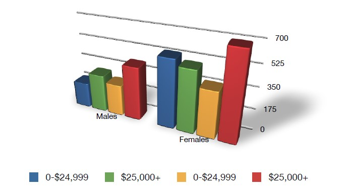

```{r setup, include=FALSE}
knitr::opts_chunk$set(cache = FALSE,
                      echo = TRUE,
                      warning = FALSE,
                      message = FALSE,
                      progress = FALSE, 
                      verbose = FALSE,
                      dev = 'png',
                      fig.height = 2.5,
                      dpi = 300,
                      fig.align = 'center')

options(htmltools.dir.version = FALSE)

miamired = '#C3142D'

if(require(pacman)==FALSE) install.packages("pacman")
if(require(devtools)==FALSE) install.packages("devtools")

if(require(countdown)==FALSE) devtools::install_github("gadenbuie/countdown")
if(require(xaringanExtra)==FALSE) devtools::install_github("gadenbuie/xaringanExtra")


pacman::p_load(tidyverse, magrittr, lubridate, janitor, # data analysis pkgs
               DT, # for nicely printed output
               httr, jsonlite, tidycensus, # for APIs
               fontawesome, RefManageR, xaringanExtra, countdown) # for slides
```

```{r xaringan-themer, include=FALSE, warning=FALSE}
if(require(xaringanthemer) == FALSE) install.packages("xaringanthemer")
library(xaringanthemer)

style_mono_accent(base_color = "#84d6d3",
                  base_font_size = "20px")

xaringanExtra::use_xaringan_extra(c("tile_view", "animate_css", "tachyons", "panelset", "broadcast", "share_again", "search", "fit_screen", "editable", 
                                    "clipable"))
```


# Refresher: Organization of this Course


```{r read_course__overview_chart, echo=FALSE, out.width='100%', fig.alt="How the ISA 401/501 course is organized.", fig.align='center', fig.cap='How the ISA 401/501 course is organized.'}
knitr::include_graphics("../../figures/course_overview.png") 
```


---

# Learning Objectives for Today's Class

- Explain the concept of "graphical excellence"  

- Explain the theory of data graphics  

- Optimize visual encoding based on data types  

- Understand why color should be used sparingly and how to select appropriate colors (when color is a must)


---
class: center, inverse, middle

# Graphical Excellence


---

# Non-graded activity: Terrible Charts

`r countdown(minutes = 5, seconds = 0, top = 0, font_size = "2em")`


.panelset[

.panel[.panel-name[Activity]

> Over the next 5 minutes, please identify the **1-2 main problems** in the charts in the following tabs.

  - Write down your answers in the editable area of each chart.  
  
  - Discuss your answers with your neighboring classmates.  
  
  - Be prepared to share these answers with class.

]

.panel[.panel-name[Russia's Defense Budget]

.tiny[**Source:** The chart was embedded in [this tweet](https://twitter.com/CedScherer/status/1498593405408059394?s=20&t=b0aOBtP77mq0WZinrfaH5g) by Cedric Scherer; however, it is unclear which news outlet have created the original chart.]

.pull-left-2[
```{r defence_budget, fig.align='center', fig.alt='Defence budgets for Russia vs Ukraine (2020)', echo=FALSE, out.height='350px'}
knitr::include_graphics('https://pbs.twimg.com/media/FMwSwFOWQAM9eek?format=jpg&name=large')
```
]


.pull-right-2[
.can-edit.key-activity1_russia[

**Main Issue(s):** .font70[(Insert below)]

]
]
]


.panel[.panel-name[White House Economy Growth]

.tiny[**Source:** The chart was created by the White House and shared via [this tweet from the verified White House account](https://twitter.com/WhiteHouse/status/1486709480351952901?s=20&t=b0aOBtP77mq0WZinrfaH5g). Note that the chart was latter corrected.]

.pull-left-2[
```{r whitehouse_terrible_chart, fig.align='center', fig.alt="A bar chart, created by The White House, capturing America's Growth Economy in the 21st century", echo=FALSE, out.height='350px'}
knitr::include_graphics('https://pbs.twimg.com/media/FKHaZFyWYAAP962?format=jpg&name=large')
```
]


.pull-right-2[
.can-edit.key-activity1_whitehouse[

**Main Issue(s):** .font70[(Insert below)]

]
]
]


.panel[.panel-name[Tucker Carlson]

.tiny[**Source:** The chart was created by Fox and was highlighted in [this Fox News Clip](https://video.foxnews.com/v/6274513508001#sp=show-clips).]

.pull-left-2[
```{r tucker_ch_chart, fig.align='center', fig.alt="A bar chart, created by Fox News, capturing the decline in the number of Americans who self-identify as Christians.", echo=FALSE, out.height='350px'}
knitr::include_graphics('https://www.ft.com/__origami/service/image/v2/images/raw/https%3A%2F%2Fd1e00ek4ebabms.cloudfront.net%2Fproduction%2F8597019d-978b-40cf-a2a8-fa47610e62cc.png?fit=scale-down&source=next&width=700')
```
]


.pull-right-2[
.can-edit.key-activity1_tucker[

**Main Issue(s):** .font70[(Insert below)]

]
]
]


]


---

# Graphical Excellence: What should Graphs Do?

 - **Show the data**  
 
 - Lead to thinking about the **substance**  rather than something else  
 
 - Avoid **distorting** what the data have to say  
 
 - Present **many numbers in a small space**  
 
 - Make **large datasets coherent**  
 
 - Encourage the eye to **compare different pieces of the data**  
 
 - **Reveal the data at several levels of detail**, from a broad overview to the
fine structure  

 - Serve **a purpose:** description, exploration, tabulation, decoration  
 
 - Be **closely integrated with the statistical & verbal descriptions of the data** 
 
.footnote[
<html>
<hr>
</html>

**Source:** Tufte, E. R. (2001). The visual display of quantitative information. Cheshire, Conn: Graphics Press, P. 13.
]


---

# Show/Reveal the Data: Anscombe's Dataset

**In a seminal paper, Anscombe stated:** 

> **Few of us escape being indoctrinated with these notions:** 
>  - numerical **calculations are exact, but graphs are rough**; 
>  - for any particular kind of **statistical data there is just one set of calculations constituting a correct statistical analysis**;  
>  - performing **intricate calculations is virtuous**, whereas **actually looking at the data is cheating**.

He proceeded by stating that 
> a computer should **make both calculations and graphs**. Both sorts of output should be studied; each will contribute to understanding.

Now, let us consider his four datasets, each consisting of eleven (x,y) pairs.

.footnote[
<html>
<hr>
</html>
**Source:** Anscombe, Francis J. 1973. "Graphs in Statistical Analysis." *The American Statistician* 27 (1): 17–21. ([PDF Link](https://www.sjsu.edu/faculty/gerstman/StatPrimer/anscombe1973.pdf)). 

---
count: false
# Show/Reveal the Data: Anscombe's Dataset

.font80[
```{r anscombe2, echo=FALSE, out.height='500px'}
DT::datatable(anscombe, rownames = FALSE, options = list(pageLength = 11, dom = 'tip'))
```
]


---
count: false
# Show/Reveal the Data: Anscombe's Dataset

.font80[
```{r anscombe3, echo = FALSE, out.height='500px'}
pacman::p_load(Tmisc) # same data but in 3 columns
df = quartet |> group_by(set) |> 
  summarise(x.mean = mean(x) |> round(digits = 2), 
            x.sd = sd(x) |> round(digits = 2),
            y.mean = mean(y) |> round(digits = 2), 
            y.sd = sd(y) |> round(digits = 2),
            corr = cor(x, y) |> round(digits = 2))
DT::datatable(df, rownames = FALSE, options = list(pageLength = 5, dom = 'tip'))
```
]


---
count: false
# Show/Reveal the Data: Anscombe's Dataset

```{r anscombe4, echo=FALSE, fig.height=3.5}
ggplot(quartet, aes(x, y)) + geom_point() + 
  geom_smooth(method = lm, se = FALSE) + facet_wrap(~set) + theme_bw() +
  scale_x_continuous(breaks = scales::pretty_breaks(10), limits = c(0, 20)) +
  scale_y_continuous(breaks = scales::pretty_breaks(10), limits = c(0,15))
```


---

# A Modern Version of Anscombe's Dataset

```{r modern, echo=FALSE}
knitr::include_graphics('../../figures/DinoSequential-1.gif')
```

.footnote[
<html>
<hr>
</html>
**Source:** Matejka, J. and Fitzmauricem G. 2023. "Same Stats, Different Graphs" *Proceedings of the 2017 CHI conference on human factors in computing systems*. ([Blog Post Link](https://www.research.autodesk.com/publications/same-stats-different-graphs/)). 

---

# Substance

`r countdown(minutes = 5, seconds = 0, top = 0, font_size = "2em")`

.panelset[

.panel[.panel-name[Activity]

> In 5 minutes, please **sketch** a better (non-bubble) chart than the one use by William Playfair for plotting the populations of 22 European cities at the end of the 1700s.


```{r playfair_data, fig.height=2.25, echo=FALSE}
playfair = read.table("http://www.stat.uiowa.edu/~luke/data/Playfair") |> 
  rownames_to_column(var = 'city') |> as_tibble() |> arrange(desc(population)) |> 
  mutate(position = c(rep('top', 11), rep('bottom', 11)),
         rank = c(1:11, 1:11))

playfair |> ggplot(aes(x = rank, y = position, size = population)) +
  geom_point(shape = 21, fill = 'white') +
  scale_size_area(max_size = 18) +
  geom_text(aes(label= paste0(city, '\n', scales::comma(population, accuracy = 1),
                              ' K'), size= 10), nudge_y = 0.4 ) +
  labs(caption = 'Source: Chart made by Fadel M. Megahed based on data from http://www.stat.uiowa.edu/~luke/data/Playfair  ') +
  theme_void(base_size = 8) + theme(legend.position = 'none')

```
]

.panel[.panel-name[Your Solution]

**Ideally, on a piece of paper sketch out your solution.** Otherwise, please feel free to download the plot's data (using the code below) and use a software of your choice for plotting a better chart for the data.

```{r download_playfair, eval=FALSE}
pacman::p_load(tidyverse)

playfair = read.table("http://www.stat.uiowa.edu/~luke/data/Playfair") |> 
  rownames_to_column(var = 'city') |> # converting row names to city var
  as_tibble() |>  # converting it to a tibble
  arrange( desc(population) ) # arranging the rows in a descending order by population

write_csv(x = playfair, file = 'playfair_data.csv')

```

**Be prepared to share your solution with the entire class.**

]

.panel[.panel-name[My Solution]

<details>
<summary>In my opinion, a <strong>dot chart is more effective</strong> than the bubble chart. The <strong>population would be mainly encoded using the position</strong>; you can still use area as a secondary encoding mechanism.</summary>
```{r playfair_dot, echo=FALSE, out.height='375px', out.width='800px'}
playfair |> mutate(city = as_factor(city),
                    area = pi * (diameter / 2) ^ 2) |> 
  ggplot(aes(x = population, y = reorder(city, population), size = area)) +
  geom_point() + geom_line() + scale_size_area() +
  labs(x = 'Population', y = 'City', caption = 'Source: Chart made by Fadel M. Megahed based on data from http://www.stat.uiowa.edu/~luke/data/Playfair ') +
  theme_bw(base_size = 9) -> p1

plotly::ggplotly(p1)

```
</details>

]

]


---

# Avoid Distortion of Data

```{r mining_plot, fig.align='center', fig.alt='A distorted bar chart (with non-zero starting values for the y-axis and images that reduces our focus on the data values)', echo=FALSE, out.width='80%'}

```

.footnote[
<html>
<hr>
</html>
**Source:** Graph from Tufte, E. R. (2001). The visual display of quantitative information. Cheshire, Conn: Graphics Press, P. 54.
]

---
count: false
# Avoid Distortion of Data

```{r fox_bush, fig.align='center', fig.alt='A distorted bar chart (with non-zero starting values for the y-axis)', echo=FALSE, out.width='90%'}

```

.footnote[
<html>
<hr>
</html>
**Source:** Nathan Yau (2012). [Fox News continues charting excellence](https://flowingdata.com/2012/08/06/fox-news-continues-charting-excellence/).
]

---

# Avoid Distortion of Data: The Lie Factor

```{r lie_factor, fig.align='center', fig.alt='The Lie Factor', echo=FALSE, out.width='75%'}

```

.footnote[
<html>
<hr>
</html>
**Source:** Graph from Tufte, E. R. (2001). The visual display of quantitative information. Cheshire, Conn: Graphics Press, P. 57.
]


---

# Graphical Integrity Principles: A Summary

 - Clear, detailed, and thorough labeling and appropriate scales

 - Size of the graphic effect should be directly proportional to the numerical quantities (“lie factor”)  
 
 - Show data variation, not design variation
 
---
class: center, inverse, middle

# Theory of Data Graphics

---

# Definition of Data Ink

- **Data-ink refers to the non-erasable ink used for presenting the data**.  
  
  * If data-ink would be removed from the image, the graphic would lose the content.
  

$$
\begin{split}
\text{Data-ink ratio} &= \frac{\text{Data-ink}}{\text{Total ink used to print the graphic}} \\
\\
&= \text{proportion of a graphic's ink devoted to the} \\
& \quad \text{ non-redudant display of data-information} \\
\\
&= 1.0 - \text{proportion of a graphic that can be erased}
\end{split}
$$

---
count: false
# Definition of Data Ink

- **Data-ink refers to the non-erasable ink used for presenting the data**.  
  
  * If data-ink would be removed from the image, the graphic would lose the content.
  
```{r data_ink1, fig.align='center', fig.alt='Data ink', echo=FALSE, out.width='65%'}

```

.footnote[
<html>
<hr>
</html>
**Source:** Slide Adapted from Hanspeter Pfister. Lecture Notes for CS 171. Harvard University. <http://cs171.org/>
]

---
count: false
# Definition of Data Ink

- **Data-ink refers to the non-erasable ink used for presenting the data**.  
  
  * If data-ink would be removed from the image, the graphic would lose the content.
  
```{r data_ink2, fig.align='center', fig.alt='Data ink', echo=FALSE, out.width='65%'}

```

.footnote[
<html>
<hr>
</html>
**Source:** Slide Adapted from Hanspeter Pfister. Lecture Notes for CS 171. Harvard University. <http://cs171.org/>
]


---

# Focus on Data: Avoid Chartjunk

**Chartjunk is the extraneous visual elements that distract from the message!!**

```{r di1, fig.align='center', fig.alt='Data ink', echo=FALSE, out.width='58%'}
knitr::include_graphics('http://www.tbray.org/ongoing/data-ink/di1.png')
```

.footnote[
<html>
<hr>
</html>
**Source:** The image is from [The Data-Ink Ratio Example](http://www.tbray.org/ongoing/data-ink/di1)
]

---
count: false

# Focus on Data: Avoid Chartjunk

**Chartjunk is the extraneous visual elements that distract from the message!!**

```{r di2, fig.align='center', fig.alt='Data ink', echo=FALSE, out.width='58%'}
knitr::include_graphics('http://www.tbray.org/ongoing/data-ink/di2.png')
```

.footnote[
<html>
<hr>
</html>
**Source:** The image is from [The Data-Ink Ratio Example](http://www.tbray.org/ongoing/data-ink/di2)
]

---
count: false

# Focus on Data: Avoid Chartjunk

**Chartjunk is the extraneous visual elements that distract from the message!!**

```{r di3, fig.align='center', fig.alt='Data ink', echo=FALSE, out.width='58%'}
knitr::include_graphics('http://www.tbray.org/ongoing/data-ink/di3.png')
```

.footnote[
<html>
<hr>
</html>
**Source:** The image is from [The Data-Ink Ratio Example](http://www.tbray.org/ongoing/data-ink/di3)
]

---
count: false

# Focus on Data: Avoid Chartjunk

**Chartjunk is the extraneous visual elements that distract from the message!!**

```{r di4, fig.align='center', fig.alt='Data ink', echo=FALSE, out.width='58%'}
knitr::include_graphics('http://www.tbray.org/ongoing/data-ink/di4.png')
```

.footnote[
<html>
<hr>
</html>
**Source:** The image is from [The Data-Ink Ratio Example](http://www.tbray.org/ongoing/data-ink/di4)
]

---
count: false

# Focus on Data: Avoid Chartjunk

**Chartjunk is the extraneous visual elements that distract from the message!!**

```{r di5, fig.align='center', fig.alt='Data ink', echo=FALSE, out.width='58%'}
knitr::include_graphics('http://www.tbray.org/ongoing/data-ink/di5.png')
```

.footnote[
<html>
<hr>
</html>
**Source:** The image is from [The Data-Ink Ratio Example](http://www.tbray.org/ongoing/data-ink/di5)
]

---
count: false

# Focus on Data: Avoid Chartjunk

**Chartjunk is the extraneous visual elements that distract from the message!!**

```{r di6, fig.align='center', fig.alt='Data ink', echo=FALSE, out.width='58%'}
knitr::include_graphics('http://www.tbray.org/ongoing/data-ink/di6.png')
```

.footnote[
<html>
<hr>
</html>
**Source:** The image is from [The Data-Ink Ratio Example](http://www.tbray.org/ongoing/data-ink/di6)
]

---

# Other Subjective Design Principles

- **Aesthetics:** Attractive things are perceived as more useful than unattractive ones  

- **Style:** Communicates brand, process, who the designer is  

- **Playfulness:** Encourages experimentation and exploration  

- **Vividness:** Can make a visualization more memorable

.footnote[
<html>
<hr>
</html>
**Source:** Slide Adapted from Hanspeter Pfister. Lecture Notes for CS 171. Harvard University. <http://cs171.org/>. Information is based on comments by Pat Hanrahan in November 2007. Those can be found at <http://www.perceptualedge.com/blog/?p=199>
]


---
class: center, inverse, middle

# Data Models

---

```{r stevens1, echo = FALSE, out.width= '55%'}

```

---

# Data Types (from S. Stevens, Theory of Scales)

```{r stevens2, echo = FALSE, out.width= '85%'}

```

---

# Data Types: Explained

.pull-left-2[

.font130[**Nominal:**]  
  - Are $=$ or $\neq$ to other values  
  - Apples, bananas, oranges, etc.
  
.font130[**Ordinal:**]
  - Obey a $<$ relationship  
  - Small, medium and large
  
.font130[**Quantitative:**]

  - Can do math on them  
  - 50 inches, 53 inches, etc.  
]

.pull-right-2[
```{r datatypes, echo = FALSE, out.width= '85%'}

```
]


---

# Quantitative Data Types (from S. Stevens)

**Quantitative data can be further divided into:**

.font130[**Intervals (Location of Zero Arbitrary):**]
  - Dates: Jan 19; Location: (Lat, Long)  
  - Only differences (i.e., intervals) can be compared.
  
.font130[**Ratio (Zero Fixed):**]

  - Measurements: Length, Weight, ...  
  - Origin is meaningful, we can compute ratios, proportions, differences, etc. 
  
---

# Non-Graded Activity: Data Terminology

`r countdown(minutes = 2, seconds = 0, top = 0, font_size = "2em")`

.panelset[

.panel[.panel-name[Activity]

> In 2 minutes, please identify an appropriate data type for each column below.

.font70[
```{r shipping_data, echo=FALSE, out.height='500px'}
shipping_data = read_csv("../../data/shipping_data.csv")
DT::datatable(shipping_data, rownames = FALSE, options = list(pageLength = 7, dom = 'tip'))
```
]

]

.panel[.panel-name[Your Solution]

.can-edit.key-activity3[

**Data Types:** .font70[(Edit below)]

- Order ID: ________________

- Order/Ship Date: ________________

- Order Priority: ________________

- Product Container: ________________

- Product Cost: ________________

]
]
]

---

# Data vs. Conceptual Models

.font130[**From data model**]   
  - 32.5, 54.0, -17.3, ...  

.font130[**Using a conceptual model:**]   
  - Temperature
  
.font130[**To data type:**]  
  - Continuous to x significant digits i.e. quantitative
  - Hot, warm, cold i.e. ordinal   
  - Burned vs. not burned i.e. nominal  


---

# Image Model: Visual (Encoding) Variables

```{r bertin, echo=FALSE, out.width='70%'}

```

.footnote[
<html>
<hr>
</html>
**Source:** Bertin (1967), Seminology of Graphics.
]

---

# Mapping to Data Types

```{r mapping_data_types, echo=FALSE, out.width='65%'}

```

.footnote[
<html>
<hr>
</html>
**Source:** Slide Adapted from Hanspeter Pfister. Lecture Notes for CS 171. Harvard University. <http://cs171.org/>
]

---

# Visual Channels and their Precision
```{r mapping_data_types3, echo=FALSE, out.width='70%'}

```

.footnote[
<html>
<hr>
</html>
**Source:** Franconeri, et al. (2021). [The Science of Visual Data Communication: What Works](https://doi.org/10.1177/15291006211051956). To view the full size image, click [here](https://t.co/Rfr8qSj5HB).
]


---
class: center, inverse, middle

# Color Should Be Used Sparingly

---

# Color

`r countdown(minutes = 1, seconds = 0, top = 0, font_size = "2em")`

.panelset[

.panel[.panel-name[Activity]

.pull-left[
- The following map of Nevada has been colored to indicate various geological features in each county. 

- Estimate the larger land area-more red, more green, or the same-and mark your answer on the mentimeter poll in the next panel. 

- **Please work fairly quickly, as if you were trying to gain an overall impression from a map**.
]

.pull-right[
```{r cleveland_exp, echo=FALSE, out.width='100%'}

```
]

]

.panel[.panel-name[Your Solution]
<html>
<div style='position: relative; padding-bottom: 56.25%; padding-top: 0px; height: 0; overflow: hidden;'><iframe sandbox='allow-scripts allow-same-origin allow-presentation' allowfullscreen='true' allowtransparency='true' frameborder='0' height='300' src='https://www.mentimeter.com/embed/fc5ffe4fa8894c11b2b73a67b70478b3/96b5a0976aac' style='position: absolute; top: 0; left: 0; width: 100%; height: 100%;' width='420'></iframe></div>
</html>
]

.panel[.panel-name[Results from 1983 Experiment]
<details>
<summary>The results from the original experiment were as follows</summary>
<br>
On the average, <span style="color:red">49 percent of the judgments were that red was bigger</span>, <span style="color:green">22 percent of the judgments were that green was bigger</span>, and 31 percent of the judgments were that they looked the same size.
</details>
]

]

---

# Simultaneous Contrast Affects Perception

```{r sc, echo=FALSE, out.width='85%'}

```

.footnote[
<html>
<hr>
</html>
**Source:** Slide Adapted from Hanspeter Pfister. Lecture Notes for CS 171. Harvard University. <http://cs171.org/>
]

---

# Color Blindness

> "About 1 in 12 men are color blind" -- [NIH's At a glance: Color Blindness](At a glance: Color Blindness)

### Color Blindness Can Distort a Person's Reading/Interpretation of a Chart

- **Personal Check:** [To have a feel for color blindness (if you are not color blind), you can take this color blind test](https://enchroma.com/pages/test)  

- Given the high prevalence of color blind individuals, your charts **should** accommodate for color-blindness. **How?**  

  * Use color sparingly
  * Use color friendly palettes, e.g., see <https://colorbrewer2.org/>
  
---

# Color Brewer: Color Scales and their Selection

```{r brewer, echo=FALSE, out.width='100%'}

```

.footnote[
<html>
<hr>
</html>
**Source:** Brewer, Cynthia A. “Color use guidelines for data representation.”Proceedings of the Section on Statistical Graphics, American Statistical Association. 1999.
]

---
class: inverse, center, middle

# Recap

---

# Summary of Main Points

By now, you should be able to do the following:  

- Explain the concept of "graphical excellence"  

- Explain the theory of data graphics  

- Optimize visual encoding based on data types  

- Understand why color should be used sparingly and how to select appropriate colors (when color is a must)


---

# Things to Do Prior to Next Class

Please go through the following two supplementary readings and complete [assignment 08](https://miamioh.instructure.com/courses/223961/quizzes/667848).  

1. [The Lie Factor and the Baseline Paradox](https://nightingaledvs.com/the-lie-factor-and-the-baseline-paradox/); especially noting what the authors mean by "baseline", how the lie factor may be ignored in time-series applications, and/or in applications involving a "ratio" scale.  

2. [Useful junk? The effects of visual embellishment on comprehension and memorability of charts](https://dl.acm.org/doi/pdf/10.1145/1753326.1753716?casa_token=GiPCX3MfWRAAAAAA:bj4hH3e73nNkD5ldnL_ohbDqkA_dBhAdTR9HE3A215Mks4E6Lja3lJL90rIqlLXWu1puahbk5XZq), which presents an experimental counter against Tufte's argument for simplicity (by quantifying vividness and recall of data from the more artistic charts). Note they define **"ratio"** different from how we have defined in class.
