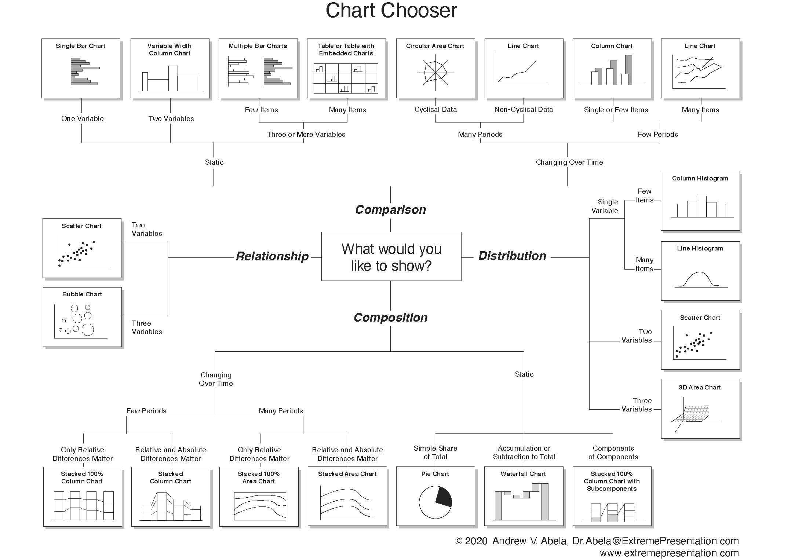
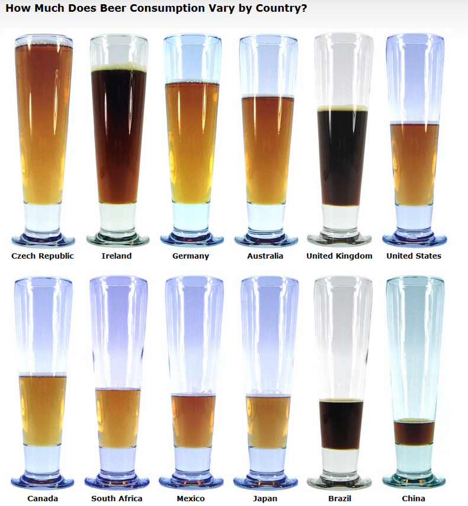
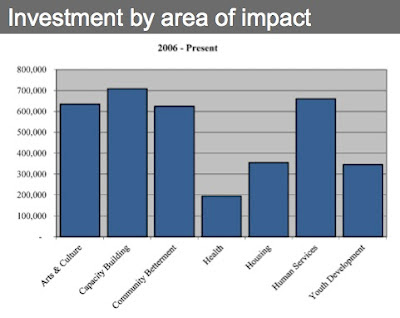
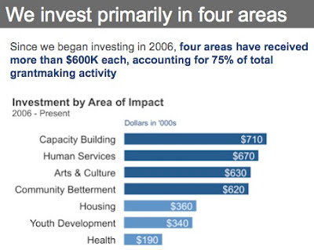
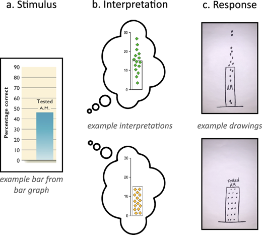
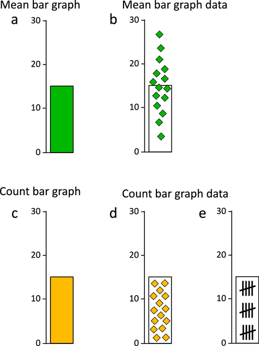
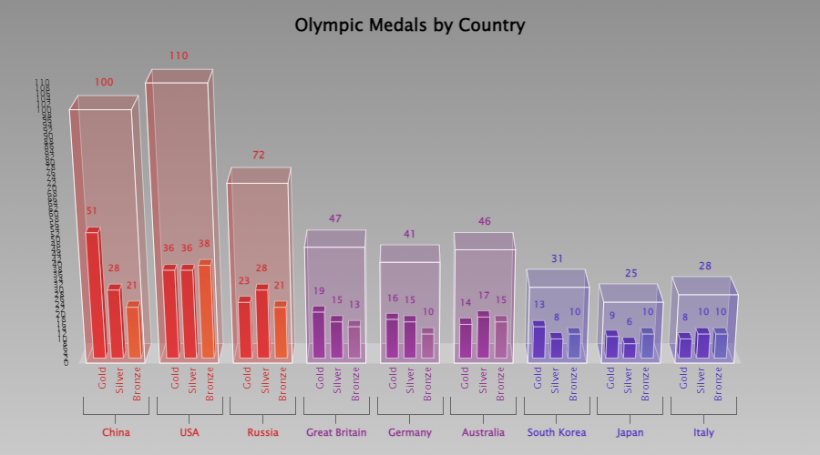
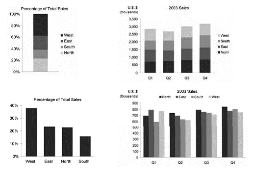

```{r setup, include=FALSE}
knitr::opts_chunk$set(cache = TRUE,
                      echo = TRUE,
                      warning = FALSE,
                      message = FALSE,
                      progress = FALSE, 
                      verbose = FALSE,
                      dev = 'png',
                      fig.height = 2.5,
                      dpi = 300,
                      fig.align = 'center')

options(htmltools.dir.version = FALSE)

miamired = '#C3142D'

if(require(pacman)==FALSE) install.packages("pacman")
if(require(devtools)==FALSE) install.packages("devtools")

if(require(countdown)==FALSE) devtools::install_github("gadenbuie/countdown")
if(require(xaringanExtra)==FALSE) devtools::install_github("gadenbuie/xaringanExtra")


pacman::p_load(tidyverse, magrittr, lubridate, janitor, # data analysis pkgs
               DT, # for nicely printed output
               httr, jsonlite, tidycensus, # for APIs
               fontawesome, RefManageR, xaringanExtra, countdown) # for slides

BibOptions(check.entries = FALSE, bib.style = "authoryear", 
           style = "markdown", dashed = TRUE)

bib = ReadBib("refs.bib") 
```

```{r xaringan-themer, include=FALSE, warning=FALSE}
if(require(xaringanthemer) == FALSE) install.packages("xaringanthemer")
library(xaringanthemer)

style_mono_accent(base_color = "#84d6d3",
                  base_font_size = "20px")

xaringanExtra::use_xaringan_extra(c("tile_view", "animate_css", "tachyons", "panelset", "broadcast", "share_again", "search", "fit_screen", "editable", 
                                    "clipable"))
```


# Learning Objectives for Today's Class

- Identify strengths & weaknesses of basic charts  

- Use appropriate charts based on objective  

- Avoid using pie charts (never use pie charts)  

- Avoid 3D graphs (unless VR changes their utility)


---

# A Catalog of Commonly Used Graph Types

<iframe width="1200" height="500" src="https://datastudio.google.com/embed/reporting/eb2fea55-8eeb-440f-9c56-e8278266a368/page/vZWQB" frameborder="0" style="border:0" allowfullscreen></iframe>


---

# Chart Suggestions 

```{r chart_chooser, echo=FALSE}

```

.footnote[
<html>
<hr>
<html>

**Source:** [Chart Chooser](https://extremepresentation.typepad.com/blog/2006/09/choosing_a_good.html), created by Andrew Abela in 2006 and last updated on Sept 06, 2020. 
]

---
class: center, inverse, middle

# Charts Used for Comparing Data  

# (Unit of Analysis is Based on a Nominal Categorical Variable)


---

# A Literal Bar Chart

`r countdown(minutes = 4, seconds = 0, top = 0, font_size = "2em")`

.panelset[

.panel[.panel-name[Activity]

.pull-left[

```{r literal_bar_chart, echo=FALSE, out.width= '75%'}

```

]

.pull-right[

> _Answer the following questions:_

(1) How many variables do we have in this graph?  

(2) How many observations?  

(3) Please discuss the type of variables in the graph? (i.e. nominal, ordinal,
etc.) 

(4) How is the data encoded in the graph?

(5) Any other comments/observations? 

]
]

.panel[.panel-name[Your Solution]

.can-edit.key-activity2[

- Q1: ________________

- Q2: ________________

- Q3: ________________

- Q4: ________________

- Q5: ________________


]

]

]

.footnote[
<html>
<hr>
</html>

**Source:** The image is from [How Much Does Beer Consumption Vary by Country?](https://snippets.com/how-much-does-beer-consumption-vary-by-country.htm), and the data seems to be based on a 2004 report from the Kirin Holdings Company.
]

---

# Using a Bar Chart to Visualize R Code

```{r watcher, echo=FALSE, fig.align='center'}
knitr::include_graphics('https://github.com/brodieG/watcher/raw/master/extra/sort-2.gif')

```


.footnote[
<html>
<hr>
</html>

**Source:** See the amazing [watcher](https://github.com/brodieG/watcher) package, which allows you to record the state of R function during evaluation. For more details, please click on the link.
]


---

# Non-graded activity: Two Bar Charts

`r countdown(minutes = 4, seconds = 0, top = 0, font_size = "2em")`

.panelset[

.panel[.panel-name[Activity]

> _Over the next five minutes, identify **3-4 differences that make the graph on the right better**, and suggest **how you can further improve the graph on the right**_


.pull-left[

```{r investment_bar1, echo=FALSE, out.width='85%'}

```

]

.pull-right[

```{r investment_bar2, echo=FALSE, out.width='85%'}

```


]
]

.panel[.panel-name[Your Solution]

.can-edit.key-activity3[

Insert your differences and suggestions for improvement below.


]

]

]


---

# Issues with the Interpretation of Bar Charts

```{r interpret1, echo=FALSE, out.width='50%', fig.align='center'}

```
.center[.font70[The Draw Datapoints on Graph (DDoG) measure maintains the graph as a consistent reference frame across its three stages.]]

.footnote[
<html>
<hr>
</html>

**Source:** Kerns and Wilmer (2021). *Journal of Vision*. DOI: [https://doi.org/10.1167/jov.21.12.17](https://doi.org/10.1167/jov.21.12.17)
]


---
count:false

# Issues with the Interpretation of Bar Charts

```{r interpret2, echo=FALSE, out.width='30%', fig.align='center'}

```
.center[.font70[Data distribution differs categorically between mean and count graphs. (a) Mean bar graphs and (c) count bar graphs do not differ in basic appearance, but they do depict categorically different data distributions. ]]


.footnote[
<html>
<hr>
</html>

**Source:** Kerns and Wilmer (2021). *Journal of Vision*. DOI: [https://doi.org/10.1167/jov.21.12.17](https://doi.org/10.1167/jov.21.12.17)
]


---

# Key Takeaway 1

> .font125[The typically used **bar** chart should not be to depict means of categorical variables.]

---

# Waterfall Charts

`r countdown(minutes = 4, seconds = 0, top = 0, font_size = "2em")`

.panelset[

.panel[.panel-name[Activity]

> _What are the advantages and disadvantages of these two charts? They are
using the same exact data. Please try to list 2-4 in each category for each chart._


.pull-left[

```{r bar_income, echo=FALSE, out.width='85%'}
knitr::include_graphics('https://2.bp.blogspot.com/-B9n30Ev5kvg/TrLKEc6Nr-I/AAAAAAAADHc/KPhx6mnvsu8/s400/Income+%2526+Expenses+-+AFTER.jpg')
```

]

.pull-right[

```{r waterfall, echo=FALSE, out.width='85%'}
knitr::include_graphics('https://lh5.ggpht.com/-D9ui-i_gH4A/Trf9zScsXiI/AAAAAAAAWrQ/6kKFFMHH4XE/Storytelling%252520with%252520Data%252520Waterfall_thumb%25255B7%25255D.png?imgmax=800')
```


]
]

.panel[.panel-name[Your Solution]

.can-edit.key-activity4[

Insert your advantages and disadvantages below


]

]

]


---

# 3D Bar Charts are Awful

<center>
<blockquote class="twitter-tweet" data-height='400' ><p lang="en" dir="ltr">When our status is secure, we don&#39;t emphasize it. When it&#39;s ambiguous, we do.<br><br>Penn students are more likely than Harvard students to mention that they go to an Ivy League school...<a href="https://t.co/0ipuArIRUn">https://t.co/0ipuArIRUn</a> <a href="https://t.co/BDusRYJm34">pic.twitter.com/BDusRYJm34</a></p>&mdash; Adam Grant (@AdamMGrant) <a href="https://twitter.com/AdamMGrant/status/1339925914327638017?ref_src=twsrc%5Etfw">December 18, 2020</a></blockquote> <script async src="https://platform.twitter.com/widgets.js" charset="utf-8"></script>
</center>


---
count: false

# 3D Charts are Awful

```{r harvard_penn1, echo=FALSE, fig.cap = "Adam Grant's Plot of the Penn and Harvard Bar Chart"}
knitr::include_graphics('https://pbs.twimg.com/media/Ephdbz5WwAINqIY?format=jpg&name=small')
```


---
count: false

# 3D Bar Charts are Awful

```{r harvard_penn2, echo=FALSE, fig.cap = 'A remake of the plot with colorblind-friendly colors and a 2D bar representation to avoid distorting the data', fig.height=3}

df = tibble::tibble(School = c('Penn', 'Harvard'), 
                    Percentage = c(0.3019, 0.0741) )

df %>% ggplot( aes(x = reorder(School, -Percentage), y = Percentage, fill = School) ) +
  geom_bar(stat = 'identity') + 
  geom_text( aes( label = scales::percent(Percentage) ), vjust = -0.5 ) + 
  scale_y_continuous(labels = scales::percent, limits = c(0, 1),
                     breaks = scales::pretty_breaks(6)) +
  scale_fill_brewer(palette = 'Dark2') +
  theme_bw() +
  theme(legend.position = 'none') +
  labs(x = 'School', y = 'Percentage of Respondents', 
       title = 'Say They Attend an Ivy League School')


```


---
count: false

# 3D Bar Charts are Awful: Including This

```{r visually, echo=FALSE, fig.alt='Did you know Some Countries Require Vacation? The Use of 3D Bars is useless'}
knitr::include_graphics('https://visual.ly/node/image/51878?_w=500')
```

.footnote[
<html>
<hr>
<html>

**Source:** See the [visualy](https://visual.ly/community/Infographics/business/did-you-know-some-countries-require-you-take-vacation) post.
]


---
count: false

# 3D Charts are Awful: Even This 

<center>
<iframe id="reddit-embed" src="https://www.redditmedia.com/r/dataisbeautiful/comments/e4oz1o/oc_united_states_cities_by_population_3d_bar_chart/?ref_source=embed&amp;ref=share&amp;embed=true" sandbox="allow-scripts allow-same-origin allow-popups" style="border: none;" height="502" width="640" scrolling="no"></iframe>
</center>


---
count: false

# 3D Charts are Awful: Even This?

```{r chart_exception_1, echo = FALSE, out.width='80%', out.height='80%'}

```

.footnote[
<html>
<hr>
<html>

**Source:** See the [interactive version of the chart by clicking here](https://codepen.io/zingchart/full/ePxQmd/)
]


---

# Dot Charts: Recall the Playfair Example


```{r playfair_ex, echo=FALSE, fig.align='center'}
playfair = read.table("http://www.stat.uiowa.edu/~luke/data/Playfair") %>% 
  rownames_to_column(var = 'city') %>% # converting row names to city var
  as_tibble() %>%  # converting it to a tibble
  arrange( desc(population) ) # arranging the rows in a descending order by population


playfair %>% mutate(city = as_factor(city),
                    area = pi * (diameter / 2) ^ 2) %>% 
  ggplot(aes(x = population, y = reorder(city, population), size = area)) +
  geom_point() + geom_line() + scale_size_area() +
  labs(x = 'Population', y = 'City', caption = 'Source: Chart made by Fadel M. Megahed based on data from http://www.stat.uiowa.edu/~luke/data/Playfair ') +
  theme_bw(base_size = 9) -> p1

plotly::ggplotly(p1, height = 400, width = 1000)

```


---
class: inverse, center, middle

# Proportions


---

# Pie Charts are Awful By Design

```{r pie_charts1, echo=FALSE}
pacman::p_load(tidyverse, hrbrthemes, viridis, patchwork)


# create 3 data frame:
data1 <- data.frame( name=letters[1:5], value=c(17,18,20,22,24) )
data2 <- data.frame( name=letters[1:5], value=c(20,18,21,20,20) )
data3 <- data.frame( name=letters[1:5], value=c(24,23,21,19,18) )

# Plot
plot_pie <- function(data, vec){

ggplot(data, aes(x="name", y=value, fill=name)) +
  geom_bar(width = 1, stat = "identity") +
  coord_polar("y", start=0, direction = -1) +
  scale_fill_viridis(discrete = TRUE,  direction=-1) + 
  geom_text(aes(y = vec, label = rev(name), size=4, color=c( "white", rep("black", 4)))) +
  scale_color_manual(values=c("black", "white")) +
  theme_bw() +
  theme(
    legend.position="none",
    plot.title = element_text(size=14),
    panel.grid = element_blank(),
    axis.text = element_blank(),
    legend.margin=unit(0, "null")
  ) +
  xlab("") +
  ylab("")
  
}

a <- plot_pie(data1, c(10,35,55,75,93))
b <- plot_pie(data2, c(10,35,53,75,93))
c <- plot_pie(data3, c(10,29,50,75,93))

a + b + c
```

.footnote[
<html>
<hr>
</html>

**Source:** The pie charts generated in this slide are based on the R code provided in [From-Data-to-Viz: The Issue with Pie Chart](https://www.data-to-viz.com/caveat/pie.html).
]


---
count:false
# Pie Charts are Awful By Design

```{r pie_charts2, echo=FALSE}
pacman::p_load(tidyverse, hrbrthemes, viridis, patchwork)


plot_bar <- function(data){
  ggplot(data, aes(x=name, y=value, fill=name)) +
    geom_bar( stat = "identity") +
    scale_fill_viridis(discrete = TRUE, direction=-1) + 
    scale_color_manual(values=c("black", "white")) +
    geom_text( aes( label = paste0(value, '%') ), vjust = -0.5, size = 3 ) + 
    theme_bw() +
    theme(
      legend.position="none",
      plot.title = element_text(size=14),
      panel.grid = element_blank(),
    ) +
    ylim(0,25) +
    xlab("") +
    ylab("")
}

# Make 3 barplots
a <- plot_bar(data1)
b <- plot_bar(data2)
c <- plot_bar(data3)

# Put them together with patchwork
a + b + c
```

.footnote[
<html>
<hr>
</html>


]

---

# And often made even worse: 3D

```{r 3dpie, echo=FALSE}
library(plotrix)

data <- c(24,22,20,18,17)

pie3D(data,
      col = viridis(length(data)),
      labels = data)

```


---

# And often made even worse: Side Legend

```{r pie_side_legend, echo=FALSE}
# Create Data
data <- data.frame(
  name= letters[1:5],
  value= c(24,22,20,18,17)
)

# Basic piechart
ggplot(data, aes(x="", y=value, fill=name)) +
  geom_bar(stat="identity", width=1, color="white") +
  coord_polar("y", start=0) +
  scale_fill_viridis(discrete = TRUE, direction=-1) +
  theme_void() # remove background, grid, numeric labels
```

---

# And often made even worse: Exploded Pie

```{r pie_explode, echo=FALSE}
data <- c(24,22,20,18,17)

pie3D(data,
      col = viridis(length(data)),
      labels = data,
      explode = 0.2)

```


---
# And often made even worse: SUM(%) != 100% 

```{r pie_fail1, echo=FALSE}
knitr::include_graphics('https://flowingdata.com/wp-content/uploads/2009/11/Fox-News-pie-chart-620x465.png')
```

---

# And often made even worse: Many Levels

```{r pie_fail2, echo=FALSE, out.height='500px'}
knitr::include_graphics('https://online.hbs.edu/online/PublishingImages/blog/posts/HBS_Too_Many_Variables_Pie_Chart.jpg')
```


---

# Key Takeaway 2

> .font125[Please do **NOT** use pie charts.]

<details>
<summary>If you need any further evidence, please check <i>?pie()</i> in R. Even statistical software are recommending against using pie charts!!</summary>

<b>Note</b>

<br><br>

Pie charts are <b>a very bad way of displaying information</b>. The eye is good at judging linear measures and bad at judging relative areas. A bar chart or dot chart is a preferable way of displaying this type of data.

<br><br>

Cleveland (1985), page 264: <br>“Data that can be shown by pie charts always can be shown by a dot chart. <b>This means that judgements of position along a common scale can be made instead of the less accurate angle judgements</b>.” 

<br>

This statement is based on the empirical investigations of Cleveland and McGill as well as investigations by perceptual psychologists.

</details>


---

# Stacked Bar Charts

`r countdown(minutes = 4, seconds = 0, top = 0, font_size = "2em")`

.panelset[

.panel[.panel-name[Activity]

> _When it is best to use the four charts below? They are using the same exact data._

```{r stacked_four, echo=FALSE, out.width='50%', fig.align='center'}

```

]

.panel[.panel-name[Your Solution]

.can-edit.key-activity5[

Insert best usage scenario for each chart below


]
]
]


---

# A Note on Stacked Bar Charts

```{r stacked_comp, echo=FALSE}
knitr::include_graphics('https://images.squarespace-cdn.com/content/v1/55b6a6dce4b089e11621d3ed/1438044543242-WFT20H8JQ33L392ATHAP/image-asset.jpeg?format=750w')
```

.footnote[
<html>
<hr>
</html>

**Source:** [Storytelling with Data: To Stack or Not to Stack](https://www.storytellingwithdata.com/blog/2012/11/to-stack-or-not-to-stack)
]

---
count:false
# A Note on Stacked Bar Charts

```{r stacked_comp1, echo=FALSE}
knitr::include_graphics('https://images.squarespace-cdn.com/content/v1/55b6a6dce4b089e11621d3ed/1438044493349-X77ZPDNES1BOOWZW9OR2/image-asset.jpeg?format=750w')
```

.footnote[
<html>
<hr>
</html>

**Source:** [Storytelling with Data: To Stack or Not to Stack](https://www.storytellingwithdata.com/blog/2012/11/to-stack-or-not-to-stack)
]


---
count:false
# A Note on Stacked Bar Charts

```{r stacked_comp2, echo=FALSE}
knitr::include_graphics('https://images.squarespace-cdn.com/content/v1/55b6a6dce4b089e11621d3ed/1438044496347-Q55Q8K06I2GCWFY1DRHV/image-asset.jpeg?format=750w')
```

.footnote[
<html>
<hr>
</html>

**Source:** [Storytelling with Data: To Stack or Not to Stack](https://www.storytellingwithdata.com/blog/2012/11/to-stack-or-not-to-stack)
]


---
class: inverse, center, middle

# Distributions and Correlations


---

# Issues with Histograms

<video width="993.6" height="406.4">
<source src="../../figures/animated_histogram.mp4" type="video/mp4">
</video>

.footnote[
<html>
<hr>
</html>

**Source:** In a quality improvement project with a major manufacturer of electronic devices, we discovered an issue in the customer's seemingly 'normal' data.

]

---

# Issues with Box Plots

```{r nick_1, echo=FALSE, fig.align='center', out.width='80%'}
knitr::include_graphics('https://i0.wp.com/nightingaledvs.com/wp-content/uploads/2021/11/box-plot-vs-histogram-w-callouts.png?resize=1920%2C1010&ssl=1')
```

.footnote[
<html>
<hr>
</html>

**Source:** [Nick Desbarats (2021) I've Stopped Using Box Plots. Should You?](https://nightingaledvs.com/ive-stopped-using-box-plots-should-you/)
]


---
count: false

# Issues with Box Plots

```{r nick_2, echo=FALSE, fig.align='center'}
knitr::include_graphics('https://i0.wp.com/nightingaledvs.com/wp-content/uploads/2021/11/box-plot-vs-strip-plots.png?resize=550%2C381&ssl=1')
```

.footnote[
<html>
<hr>
</html>

**Source:** [Nick Desbarats (2021) I've Stopped Using Box Plots. Should You?](https://nightingaledvs.com/ive-stopped-using-box-plots-should-you/)
]


---

# Key Takeaway 3

> .font125[To capture the variability in a dataset, the use of box plots **may not be** appropriate!!!!]


---

# Scatter Plots

```{r scatter_fantasy, echo=FALSE, out.width='45%'}
knitr::include_graphics('https://pbs.twimg.com/media/FOsiu3-VQAUihO1?format=jpg&name=large')
```

.footnote[
<html>
<hr>
<html>

**Source:** Chart created by [@EnthusiastFpl](https://twitter.com/EnthusiastFpl/status/1507336696999817216?s=20&t=jmvxlOhpwFWSOCcVMVpZiA) and shared on `r fontawesome::fa('twitter')` on March 25, 2022.
]

---
class: inverse, center, middle

# Recap

---

# Summary of Main Points

- Identify strengths & weaknesses of basic charts  

- Use appropriate charts based on objective  

- Avoid using pie charts (never use pie charts)

- Avoid 3D graphs (unless VR changes their utility)

