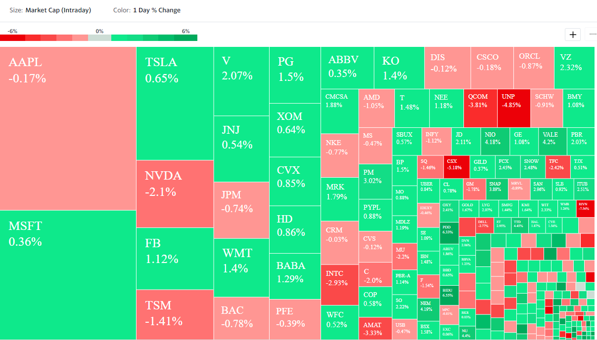
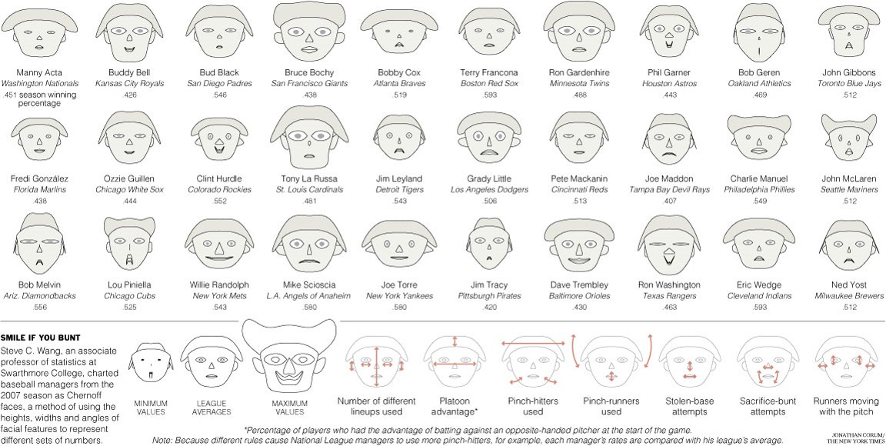

```{r setup, include=FALSE}
knitr::opts_chunk$set(cache = TRUE,
                      echo = TRUE,
                      warning = FALSE,
                      message = FALSE,
                      progress = FALSE, 
                      verbose = FALSE,
                      dev = 'png',
                      fig.height = 3,
                      dpi = 300,
                      fig.align = 'center')

options(htmltools.dir.version = FALSE)

miamired = '#C3142D'

if(require(pacman)==FALSE) install.packages("pacman")
if(require(devtools)==FALSE) install.packages("devtools")

if(require(countdown)==FALSE) devtools::install_github("gadenbuie/countdown")
if(require(xaringanExtra)==FALSE) devtools::install_github("gadenbuie/xaringanExtra")


pacman::p_load(tidyverse, magrittr, lubridate, janitor, # data analysis pkgs
               DT, # for nicely printed output
               GGally, calendR, DataExplorer, ggradar, # for charts
               pheatmap, gplots,
               fontawesome, RefManageR, xaringanExtra, countdown) # for slides

BibOptions(check.entries = FALSE, bib.style = "authoryear", 
           style = "markdown", dashed = TRUE)

bib = ReadBib("refs.bib") 
```

```{r xaringan-themer, include=FALSE, warning=FALSE}
if(require(xaringanthemer) == FALSE) install.packages("xaringanthemer")
library(xaringanthemer)

style_mono_accent(base_color = "#84d6d3",
                  base_font_size = "20px")

xaringanExtra::use_xaringan_extra(c("tile_view", "animate_css", "tachyons", "panelset", "broadcast", "share_again", "search", "fit_screen", "editable", 
                                    "clipable"))
```

# Warm-up/Non-graded Activity: A Calendar Plot

Let us use `r fontawesome::fa('r-project')` inside Power BI to create this based on [cincy_daily_crashes.csv](https://raw.githubusercontent.com/fmegahed/isa401/main/data/cincy_daily_crashes_2021.csv).

```{r calendR, echo=F, fig.height=3}
daily_crashes_2021 = read_csv('../../data/cincy_daily_crashes_2021.csv')

cal = calendR(title = NULL,
              year = 2021,
              special.days = daily_crashes_2021$n,
              orientation = "landscape",
              day.size = 2,
              months.size = 6,
              weeknames.size = 3,
              margin = 0,
              text.size = 6,
              title.size = 10,
              gradient = TRUE,
              low.col = "#FFFFED",
              special.col = miamired,
              legend.pos = 'right',
              legend.title = '# Crashes') + 
  theme(plot.title = element_text(face = 'bold', color =  miamired),
        legend.title = element_text(face = 'bold', size = 9), 
        legend.text = element_text(size = 7),
        plot.caption = element_text(size = 7)) +
  labs(caption = 'Created by: Fadel Megahed | Data source: City of Cincy Open Data Portal (rvmt-pkmq)')

cal
```


---


# Warm-up/Non-graded Activity: Kahoot

Let us go to Kahoot and compete for a $10 Starbucks gift card. To evaluate your understanding of the material, please answer the questions correctly and as quickly as possible to get the most points.


---

# Learning Objectives for Today's Class

- Describe what is high dimensional data.  

- Provide some examples for graphs used for high dimensional datasets.  

- Construct these graphs using software

---
class: inverse, center, middle

# High Dimensional Data

---

# What Do we Mean by High Dimensional Data?

`r countdown(minutes = 3, seconds = 0, top = 0, font_size = "2em")`

.panelset[

.panel[.panel-name[Activity]

> In 3 minutes, define the terms in next tab in the context of this table.

.font70[
```{r shipping_data, echo=FALSE, out.height='500px'}
shipping_data = read_csv("../../data/shipping_data.csv")
DT::datatable(shipping_data, rownames = FALSE, options = list(pageLength = 7, dom = 'tip'))
```
]


.panel[.panel-name[Your Solution]

.can-edit.key-activity3[

**Data Types:** .font70[(Edit below)]

- Multivariate data: ________________

- Big Data: ________________

- Tall Data: ________________

- Wide Data:  ________________

- High Dimensional Data: ________________

]
]
]
]


---
# Taxonomy

**Based on the number of attributes:**

- 1: Univariate  
- 2: Bivariate  
- 3: Trivariate  
- 4+: Multivariate 


**Things to Think about:**

- .can-edit.key-activity4a[What is the problem with visualizing multivariate (especially when $p > 6 − 7$
dimensions) data? ______________] 


- .can-edit.key-activity4b[Any ideas about what to do? ______________]

---
class: inverse, center, middle

# Examples of High Dimensional Charts

---

# Hans Rosling: The Best Stats You Have Seen

.panelset[

.panel[.panel-name[Activity]

> While watching this video, please answer the questions in the next tab!!

<center>
<div style="max-width:600px"><div style="position:relative;height:0;padding-bottom:56.25%"><iframe src="https://embed.ted.com/talks/lang/en/hans_rosling_the_best_stats_you_ve_ever_seen" width="600" height="350" style="position:absolute;left:0;top:0;width:100%;height:100%" frameborder="0" scrolling="no" allowfullscreen></iframe></div></div>
</center>
]

.panel[.panel-name[Your Solution]


- .can-edit.key-activity5a[What data is represented in this visualization? Be specific. ____]

- .can-edit.key-activity5b[How is each data type visually encoded? ___________]

- .can-edit.key-activity5c[Do you think the encodings are appropriate? _________]


]
]

---

# So What is the Motion Bubble Chart?

> Motion charts are essentially **animated bubble charts**. A bubble chart shows data using the .bold[x-axis], .bold[y-axis], and the .bold[size] and .bold[color] of the bubble. A motion chart displays .red[.bold[changes over time by showing movement within the two-dimensional space and changes in the size and color of the bubbles]]. -- [Juice Analytics](https://www.juiceanalytics.com/writing/better-know-visualization-motion-charts)

**Encoding mechanisms:** 

- .bold[x-axis] is typically used to encode a **numeric variable**  
- .bold[y-axis] is also used to encode a **numeric variable** 
- .bold[area] is used to encode a **numeric/ordinal variable** 
- .bold[color] is typically used to encode a **nominal variable**
- .bold[motion/animation] is typically used to encode **time**


---

# Live Demo: Creating Bubble Charts in Power BI

Let us use Power BI to create a similar chart to the one created by Hans Rosling. We will be using the [gapminder.csv](https://raw.githubusercontent.com/fmegahed/isa401/main/data/gapminder.csv).

<iframe src="https://www.gapminder.org/tools/?embedded=true#$chart-type=bubbles&url=v1" style="width: 100%; height: 400px; margin: 0 0 0 0; border: 1px solid grey;" allowfullscreen></iframe>


---

# Small Multiples

> Illustrations of postage-stamp size are indexed by category or a label, sequenced over time like the frames of a movie, or ordered by a quantitative variable not used in the single image itself -- [Tufte, E.R.: Envisioning Information, Graphics Press, 1990](https://www.amazon.com/exec/obidos/tg/detail/-/0961392118/)

.center[]


---

# Small Multiples in Power BI

Let us use Power BI to create a similar chart to the one below. We will be using the [mpg_2022_large_sample.csv](https://raw.githubusercontent.com/fmegahed/isa401/main/data/mpg_2022_large_sample.csv).

```{r small_multiples, echo=FALSE}
mpg_2022_sample = read_csv(file = '../../data/mpg_2022_large_sample.csv')

plot_boxplot(data = mpg_2022_sample, by = 'Manufacturer', 
             theme_config = theme_bw())
```

**Note this is easier to make in Tableau and/or `r fa('r-project')`. Let us give it a shot in Tableau as well.**


---

# Parallel Coordinates

> Parallel coordinates is a visualization technique used to plot individual data elements across many performance measures. Each of the measures corresponds to a vertical axis and each data element is displayed as a series of connected points along the measure/axes -- [Juice Analytics' Defintion](https://www.juiceanalytics.com/writing/writing/parallel-coordinates)

```{r parcorr, echo=FALSE, out.height=300}
knitr::include_graphics('https://images.squarespace-cdn.com/content/v1/52f42657e4b0b3416ff6b831/1614951876498-9TIQE0EHNCGUFQSNEP6J/Parallel_Coordinates_Plot_-_Learn_about_this_chart_and_tools.jpg?format=1000w')
```


---

# Parallel Coordinates in Power BI

Let us add the [Custom Parallel Coordinates Charting App](https://appsource.microsoft.com/en-us/product/power-bi-visuals/wa200000850?tab=overview&signInModalType=2&ctaType=1) to our Power BI and use it to visualize the [mpg_2022_sample.csv](https://raw.githubusercontent.com/fmegahed/isa401/main/data/mpg_2022_sample.csv).

```{r ggparcoord, echo = F}
mpg_2022_sample = read_csv('../../data/mpg_2022_sample.csv')

ggparcoord(data = mpg_2022_sample, columns = 2:ncol(mpg_2022_sample),
           showPoints = T, groupColumn = 1) + 
  scale_color_brewer(palette = 'Paired') +
  geom_line(size = 1.5) +
  geom_point(size = 4) +
  theme_bw(base_size = 8) +
  theme(legend.position = 'top') +
  labs(x = 'Factor', y = 'Scaled Value', 
       title = 'Some Factors Impacting the Combined MPG for 2022 Vehicles',
       caption = 'Data source: https://www.fueleconomy.gov/feg/download.shtml')
```


---

# Radar Charts

> Charts show how individual things perform across multiple measures

```{r radar_chart, echo=FALSE, out.height=420}
knitr::include_graphics('https://images.squarespace-cdn.com/content/v1/52f42657e4b0b3416ff6b831/1633047594333-7OEOYF4YZU4TMI2VMJSR/A_Night_Under_The_Stars___Jordan_Vincent.png?format=1000w')
```


---

# Radar Charts in Power BI

Let us add the [Radar Chart App](hhttps://appsource.microsoft.com/en-us/marketplace/apps?product=power-bi-visuals&page=1&src=office&search=radar) to our Power BI and use it to visualize the [mpg_2022_sample.csv](https://raw.githubusercontent.com/fmegahed/isa401/main/data/mpg_2022_sample.csv).

```{r ggradar, echo = F}
mpg_2022_sample = read_csv('../../data/mpg_2022_sample.csv')

mpg_2022_sample %>%
  mutate_at(vars(-Model), scales::rescale) %>% tail(4) -> mpg_radar

ggradar::ggradar(mpg_radar)
```


---

# Other Charts: HeatMap

.left-column[
- each column is a variable

- each obs is a row

- each square is a value; closer to yellow the higher
]

.right-column[
```{r heatmap, echo = F}
mpg_2022_sample = read_csv('../../data/mpg_2022_sample.csv')

mpg_2022_matrix = mpg_2022_sample %>% select(-Model) %>% as.matrix()
row.names(mpg_2022_matrix) = mpg_2022_sample$Model

heatmap(mpg_2022_matrix, Colv = NA, Rowv = NA, scale="column", cexRow=0.5, cexCol=0.5)
```
]

---

# Other Charts: TreeMaps

> Treemaps simultaneously show the big picture, comparisons of related items, and allow easy navigation to the details. [Juice Analytics](https://www.juiceanalytics.com/writing/10-lessons-treemap-design)

**Encoding mechanisms:** 

Each box in a treemap can show two measures:  
- .bold[area of the boxes] should be a **quantity measure**. The measures should sum up along the hierarchical structure of the data. The sum of all the elements in one branch need to sum to the value of the branch as a whole.  
- .bold[Color of the boxes] is best suited to a **measure of performance or change** such as growth over time, average conversion rate, or customer satisfaction.

---
count: false

# Other Charts: TreeMaps

> Treemaps simultaneously show the big picture, comparisons of related items, and allow easy navigation to the details. [Juice Analytics](https://www.juiceanalytics.com/writing/10-lessons-treemap-design)

.center[]


---

# Other Charts: Chernoff Faces

.center[]


---
class: inverse, center, middle

# Recap

---

# Summary of Main Points

- Describe what is high dimensional data.  

- Provide some examples for graphs used for high dimensional datasets.  

- Construct these graphs using software

