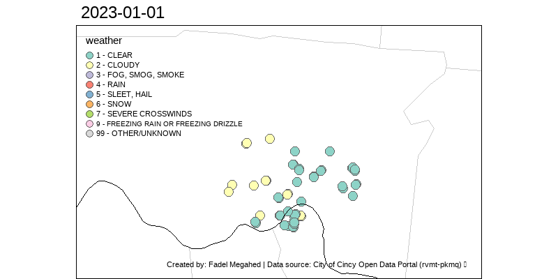

```{r setup, include=FALSE}
knitr::opts_chunk$set(cache = FALSE,
                      echo = TRUE,
                      warning = FALSE,
                      message = FALSE,
                      progress = FALSE, 
                      verbose = FALSE,
                      dev = 'png',
                      fig.height = 2.5,
                      dpi = 300,
                      fig.align = 'center')

options(htmltools.dir.version = FALSE)

miamired = '#C3142D'

if(require(pacman)==FALSE) install.packages("pacman")
if(require(devtools)==FALSE) install.packages("devtools")

if(require(countdown)==FALSE) devtools::install_github("gadenbuie/countdown")
if(require(xaringanExtra)==FALSE) devtools::install_github("gadenbuie/xaringanExtra")


pacman::p_load(tidyverse, magrittr, lubridate, janitor, # data analysis pkgs
               DT, # for nicely printed output
               tidyquant, rvest, GGally,
               geojsonio, leaflet,
               fontawesome, RefManageR, xaringanExtra, countdown) # for slides
```

```{r xaringan-themer, include=FALSE, warning=FALSE}
if(require(xaringanthemer) == FALSE) install.packages("xaringanthemer")
library(xaringanthemer)

style_mono_accent(base_color = "#84d6d3",
                  base_font_size = "20px")

xaringanExtra::use_xaringan_extra(c("tile_view", "animate_css", "tachyons", "panelset", "broadcast", "share_again", "search", "fit_screen", "editable", 
                                    "clipable"))
```

# Learning Objectives for Today's Class

- Explain the different types of spatial plots  

- Select suitable spatial graphs for different scenarios  

- Understand how spatiotemporal plots can help in storytelling (what makes BI special)


---
class: inverse, center, middle

# Spatial Plots


---

# Choropleth Maps

Maps where areas are **shaded, colored, or patterned** relative to a data attribute value. 

```{r dupin, echo=FALSE, fig.cap="Charles Dupin's Illiteracy in France Choropleth, created in 1826", out.height='40%', out.width='40%'}

```

---
count: false

# Choropleth Maps

Maps where areas are **shaded, colored, or patterned** relative to a data attribute value. 


```{r leaflet, echo=FALSE, cache=TRUE, fig.align='center', fig.cap='Population Density in U.S.'}
states <- geojsonio::geojson_read("https://rstudio.github.io/leaflet/json/us-states.geojson", what = "sp")

bins <- c(0, 10, 20, 50, 100, 200, 500, 1000, Inf)
pal <- colorBin("YlOrRd", domain = states$density, bins = bins)

labels <- sprintf(
  "<strong>%s</strong><br/>%g people / mi<sup>2</sup>",
  states$name, states$density
) |> lapply(htmltools::HTML)

leaflet(states, width = '100%', height = 400) %>%
  setView(-96, 37.8, 4) %>%
  addProviderTiles("MapBox", options = providerTileOptions(
    id = "mapbox.light",
    accessToken = Sys.getenv('MAPBOX_ACCESS_TOKEN'))) %>%
  addPolygons(
    fillColor = ~pal(density),
    weight = 2,
    opacity = 1,
    color = "white",
    dashArray = "3",
    fillOpacity = 0.7,
    highlightOptions = highlightOptions(
      weight = 5,
      color = "#666",
      dashArray = "",
      fillOpacity = 0.7,
      bringToFront = TRUE),
    label = labels,
    labelOptions = labelOptions(
      style = list("font-weight" = "normal", padding = "3px 8px"),
      textsize = "15px",
      direction = "auto")) %>%
  addLegend(pal = pal, values = ~density, opacity = 0.7, title = NULL,
    position = "bottomright")

```


---

# Cartograms

A cartogram is a map in which **areas are scaled and distorted relative to a data
attribute value**

```{r cart1, echo=FALSE, fig.cap='The First Cartogram – Emile Levasseur, 1868', out.height='40%', out.width='40%'}

```

---
count: false

# Cartograms


A cartogram is a map in which **areas are scaled and distorted relative to a data
attribute value**

```{r cart2, echo=FALSE, fig.cap="The NYT's U.S. House Election Results 2024", out.height='50%', out.width='50%'}

```


---

# Proportional Symbols Map

```{r prop1, echo=FALSE, fig.cap="The NYT's U.S. Coverage of the Bush Vs Kerry Presidential Elections", out.height='70%', out.width='70%'}

```

---
count: false

# Proportional Symbols Map

```{r prop2, echo=FALSE, fig.cap="The NYT's U.S. Coverage of 2009 Super Bowl", out.height='63%', out.width='63%'}

```

---
class: inverse, center, middle

# Spatiotemporal Maps

---

# Spatiotemporal Maps

```{r spatiotemporal1, fig.cap='A visualization of car crashes in the Cincinnati metro area', echo=FALSE}

```

---
count: false
# Spatiotemporal Maps

```{r spatiotemporal2, out.height='70%', out.width='70%', echo=FALSE, fig.cap='COVID vaccination rates per county as reported by the CDC'}

```

---
class: inverse, center, middle

# Software Demo

---

# Exploring the Cincy Crashes Dataset

Let us use Tableau to explore the [cincy_2024_crashes.csv](https://miamioh.instructure.com/courses/240893/files/37271183?module_item_id=6252167), where we will create the following:   

- A calculated field titled `unique_count`

- A plot of the total number of unique crashes per day  

- A table of number of unique crashes by week day

- An animated symbols map


---

# Bonus: A Calendar Plot in PowerBI

Let us use `r fontawesome::fa('r-project')` inside Power BI to create this based on [cincy_daily_crashes_2024.csv](https://miamioh.instructure.com/courses/240893/files/37271277?module_item_id=6252170).

```{r calendR, echo=F, fig.height=3}
daily_crashes_2024 = read_csv('../../data/cincy_daily_crashes_2024.csv')

cal = calendR::calendR(title = NULL,
              year = 2024,
              special.days = daily_crashes_2024$n,
              orientation = "landscape",
              day.size = 2,
              months.size = 6,
              weeknames.size = 3,
              margin = 0,
              text.size = 6,
              title.size = 10,
              gradient = TRUE,
              low.col = "#FFFFED",
              special.col = miamired,
              legend.pos = 'right',
              legend.title = '# Crashes') + 
  theme(plot.title = element_text(face = 'bold', color =  miamired),
        legend.title = element_text(face = 'bold', size = 9), 
        legend.text = element_text(size = 7),
        plot.caption = element_text(size = 7)) +
  labs(caption = 'Created by: Fadel Megahed | Data source: City of Cincy Open Data Portal (rvmt-pkmq)')

cal
```


---
class: inverse, center, middle

# Recap

---

# Summary of Main Points

- Explain the different types of spatial plots  

- Select suitable spatial graphs for different scenarios  

- Understand how spatiotemporal plots can help in storytelling (what makes BI special)

