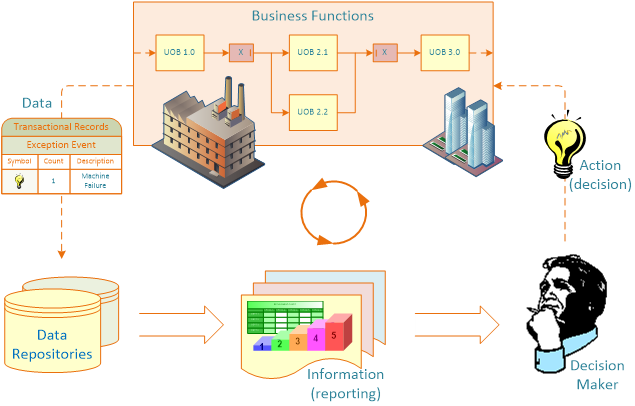

```{r setup, include=FALSE}
knitr::opts_chunk$set(cache = FALSE,
                      echo = TRUE,
                      warning = FALSE,
                      message = FALSE,
                      progress = FALSE, 
                      verbose = FALSE,
                      dev = 'png',
                      fig.height = 3,
                      dpi = 300,
                      fig.align = 'center')

options(htmltools.dir.version = FALSE)

miamired = '#C3142D'

if(require(pacman)==FALSE) install.packages("pacman")
if(require(devtools)==FALSE) install.packages("devtools")

if(require(countdown)==FALSE) devtools::install_github("gadenbuie/countdown")
if(require(xaringanExtra)==FALSE) devtools::install_github("gadenbuie/xaringanExtra")


pacman::p_load(tidyverse, magrittr, lubridate, janitor, # data analysis pkgs
               DT, # for nicely printed output
               fontawesome, RefManageR, xaringanExtra, countdown) # for slides
```

```{r xaringan-themer, include=FALSE, warning=FALSE}
if(require(xaringanthemer) == FALSE) install.packages("xaringanthemer")
library(xaringanthemer)

style_mono_accent(base_color = "#84d6d3",
                  base_font_size = "20px")

xaringanExtra::use_xaringan_extra(c("tile_view", "animate_css", "tachyons", "panelset", "broadcast", "share_again", "search", "fit_screen", "editable", 
                                    "clipable"))
```

# Learning Objectives for Today's Class

- Define a “business report” & its main functions  

- Understand the importance of the right KPIs  

- Automate traditional business reports  

- Dashboards as real-time business reporting tools


---
class: inverse, center, middle

# What is a Business Report and its Main Functions

---

# Definition and Concepts

.content-box-grey[
.font120[**What is a report?**]

  - **.black[A .red[report] is any communication artifact prepared to convey specific .blue[information]]**   
  - **.black[A .red[report] = information &#8594; data-driven decisions]**   
  - **.black[A .red[report] can fulfill many functions:]**    
    + To ensure proper departmental functioning  
    + To provide information  
    + To provide the results of an analysis   
    + To persuade others to act  
    + To create an organizational memory
]

.footnote[
<html>
<hr>
</html>

**Source:** Sharda, R., Delen, D., & Turban, E. (2013). Business Intelligence: A managerial perspective on analytics (Chapter 3). Prentice Hall Press.
]

---

# What is a Business Report?

- **.black[A written document that contains information regarding business matters.]**   

- **.black[.red[Purpose:] to improve managerial decisions.]**   

- **.black[.red[Source:] data from inside and outside the organization (via the use of ETL)]**   

- **.black[.red[Format:] text + tables + graphs/charts]**   

- **.black[.red[Distribution:] in-print, email, portal/intranet]**   

<br>

**.black[The process of business reporting:]**

.center[
**.black[Data acquisition &#8594; Information generation &#8594; Decision making &#8594; Process
management]**
]

.footnote[
<html>
<hr>
</html>

**Source:** Sharda, R., Delen, D., & Turban, E. (2013). Business Intelligence: A managerial perspective on analytics (Chapter 3). Prentice Hall Press.
]

---

# The Business Reporting Process

```{r bi_process_fig, echo=FALSE, out.width = '75%'}

```

.footnote[
<html>
<hr>
</html>

**Source:** Sharda, R., Delen, D., & Turban, E. (2013). Business Intelligence: A managerial perspective on analytics (Chapter 3). Prentice Hall Press.
]


---

# Keys to Successful Reports

- Clarity  

- Brevity  

- Completeness  

- Correctness  

- Report types (in terms of content and format)  
  + Informal a single letter or a memo   
  + Formal 10-100 pages; cover + summary + text 
  + Short report periodic, informative, investigative


.footnote[
<html>
<hr>
</html>

**Source:** Sharda, R., Delen, D., & Turban, E. (2013). Business Intelligence: A managerial perspective on analytics (Chapter 3). Prentice Hall Press.
]


---

# Dashboards vs Scorecards

.pull-left[
.content-box-grey[
.center[.font120[**Dashboards**]]

- Dashboards provide **monitoring tools for operational performance (often in real-time)**.  
- Dashboards monitor performance by **tracking metrics (typically over-time and often without comparing them to target values).**

]
]

.pull-right[
.content-box-grey[
.center[.font120[**Scorecards**]]

- Scorecards provide a **snapshot of current performance (as measured using KPIs) vs. their targets**.  
- Current performance is **an aggregated measure** (e.g., day/month), i.e., ~ static
- **Goal:** make better strategic decisions based on the $distance = target - performance$

]
]

.footnote[
<html>
<hr>
</html>

**Source:** Scorecard vs Dashboard – What Each Adds to Business Intelligence <https://www.sisense.com/blog/scorecard-vs-dashboard-adds-business-intelligence/> 
]


---

# Out-of-Class: Make this Power BI Scoreboard

<iframe title="airline_delay_example" width="1140" height="541.25" src="https://app.powerbi.com/reportEmbed?reportId=d0cb38f7-baaf-41d9-becf-0dfc22d7aee8&autoAuth=true&ctid=4605e262-b447-4aaa-aea7-f70112a6dda8&config=eyJjbHVzdGVyVXJsIjoiaHR0cHM6Ly93YWJpLXVzLW5vcnRoLWNlbnRyYWwtaC1wcmltYXJ5LXJlZGlyZWN0LmFuYWx5c2lzLndpbmRvd3MubmV0LyJ9" frameborder="0" allowFullScreen="true"></iframe>


---
class: inverse, center, middle

# The Importance of the Right KPIs

---

# 0.15pt Bonus Activity: Paper Airplanes

`r countdown(minutes = 15, seconds = 0, top = 0, font_size = "2em")`


.panelset[

.panel[.panel-name[Activity Description]

> Over the next 15 minutes, please design the **best paper plane that
can consistently hit the target on the whiteboard (from a distance of 6ft)**.

**Games Rules:**

- You are allowed to use any of the material that was brought to class.  
- Work with your group to have the best design.  
- You can look up designs online or design your own -- no design restrictions.  
- When testing, make sure that there no people between your launching point and your target.   
- A demo will proceed for the teams that want to “show-off” their talents.
- **Winning team gets 0.15 point (out of 25) added to their Exam II Grade.**

]

.panel[.panel-name[Identify KPIs for this Activity]

.pull-left[
.center[.font120[**Operational Performance Indicators**] .font80[(List 5-7)]]  

- .can-edit.key-activity1a[Cycle time]  

]


.pull-right[
.center[.font120[**Client/Product Performance Indicators**] .font80[(List 5-7)]]  

- .can-edit.key-activity2a[Accuracy]   
]


]
]

---
class: inverse, center, middle

# Automating Business Reports

---

# Automating Visual Business Reports

In many data visualization software, this can be accomplished easily by: 

- Live connections to data files and databases; or  

- Auto-refreshing or some similar concept.

Hence, we often think of **BI dashboards as tools for real-time performance monitoring**.


---

# Automating Traditional Business Reports: RPA

```{r rpa, echo=FALSE, fig.cap='Robotic process automation for business reporting', out.width='80%'}
knitr::include_graphics('https://p1.pxfuel.com/preview/197/191/654/robot-3d-print-wallpaper.jpg')
```


---

# Automating Traditional Business Reports: `r fontawesome::fa('r-project')`

<center>
<p><a href="https://www.rstudio.com/resources/webinars/rethink-reporting-with-automation/?wvideo=e1sg52li8m"></a></p><p><a href="https://www.rstudio.com/resources/webinars/rethink-reporting-with-automation/?wvideo=e1sg52li8m">Rethink Reporting with Automation - RStudio</a></p>
</center>


.footnote[
<html>
<hr>
</html>

**Additional Example:** See how I automate my academic CV published [on my FSB Website](http://www.fsb.miamioh.edu/fsb/directory/vita/megahefm.pdf) based on the code available at [fmegahed/vitae](https://github.com/fmegahed/vitae). 
]

---
class: inverse, center, middle

# Recap

---

# Summary of Main Points

- Define a “business report” & its main functions  

- Understand the importance of the right KPIs  

- Automate traditional business reports  

- Dashboards as real-time business reporting tools

