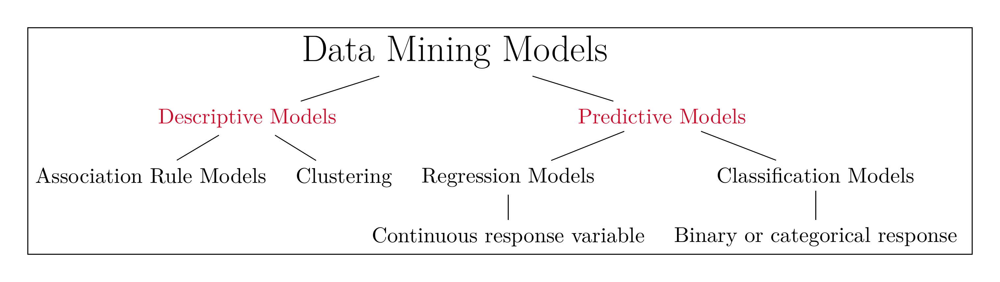
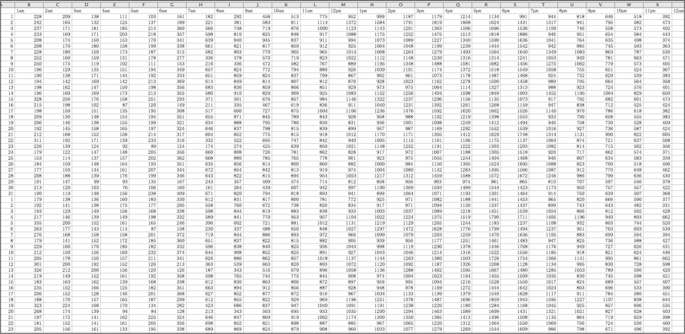
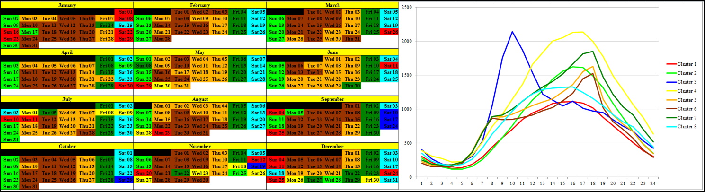
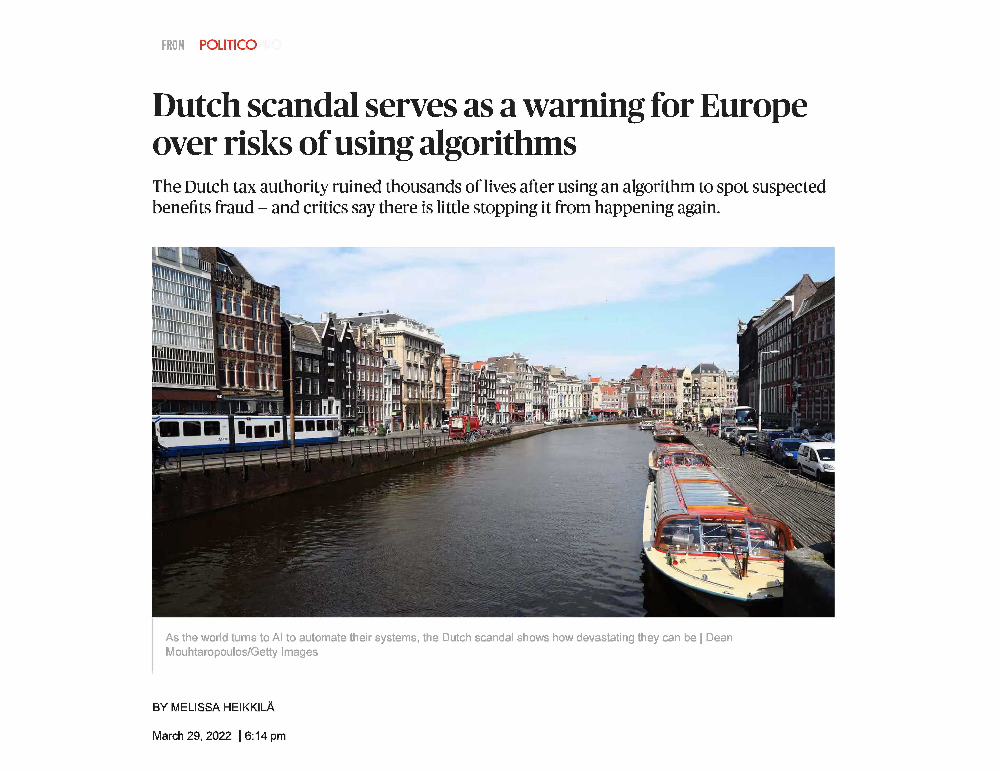

```{r setup, include=FALSE}
knitr::opts_chunk$set(cache = FALSE,
                      echo = TRUE,
                      warning = FALSE,
                      message = FALSE,
                      progress = FALSE, 
                      verbose = FALSE,
                      dev = 'png',
                      fig.height = 3,
                      dpi = 300,
                      fig.align = 'center')

options(htmltools.dir.version = FALSE)

miamired = '#C3142D'

if(require(pacman)==FALSE) install.packages("pacman")
if(require(devtools)==FALSE) install.packages("devtools")

if(require(countdown)==FALSE) devtools::install_github("gadenbuie/countdown")
if(require(xaringanExtra)==FALSE) devtools::install_github("gadenbuie/xaringanExtra")


pacman::p_load(tidyverse, magrittr, lubridate, janitor, # data analysis pkgs
               DT, # for nicely printed output
               tinytex, # to run latex files
               arules, arulesViz,
               fontawesome, RefManageR, xaringanExtra, countdown) # for slides

BibOptions(check.entries = FALSE, bib.style = "authoryear", 
           style = "markdown", dashed = TRUE)
```

```{r xaringan-themer, include=FALSE, warning=FALSE}
if(require(xaringanthemer) == FALSE) install.packages("xaringanthemer")
library(xaringanthemer)

style_mono_accent(base_color = "#84d6d3",
                  base_font_size = "20px")

xaringanExtra::use_xaringan_extra(c("tile_view", "animate_css", "tachyons", "panelset", "broadcast", "share_again", "search", "fit_screen", "editable", 
                                    "clipable"))
```

# A Recap of What we Learned Last Week

- Define a “business report” & its main functions  

- Understand the importance of the right KPIs  

- Automate traditional business reports  

- Dashboards as real-time business reporting tools


---

# Course Objectives Covered so Far

[Y]ou will be re-introduced to **how data should be explored** ... Instead, the focus is on understanding the underlying methodology and mindset of **how data should be approached, handled, explored, and incorporated back into the domain of interest.** ... You are expected to:  

`r fontawesome::fa('check')` .green[.bold[Be capable of extracting, transforming and loading (ETL) data using multiple platforms (e.g. `r fontawesome::fa('r-project', 'green')` & Tableau).]]   

`r fontawesome::fa('check')` .green[.bold[Write basic `r fontawesome::fa('r-project', 'green')` scripts to preprocess and clean the data.]]  

`r fontawesome::fa('check')` .green[.bold[Explore the data using visualization approaches that are based on sound human factors (i.e. account for human cognition and perception of data).]]

`r fontawesome::fa('times-circle')` **Understand how data mining and other analytical tools can capitalize on the insights generated from the data viz process.**  

`r fontawesome::fa('check')` .green[.bold[Create interactive dashboards that can be used for business decision making, reporting and/or performance management.]]

`r fontawesome::fa('times-circle')` **Be able to apply the skills from this class in your future career.**


---


# Learning Objectives for Today's Class

- Describe the goals & functions of data mining  

- Understand the statistical limits on data mining  

- Describe the data mining process  


---
class: inverse, center, middle

# An Overview of Data Mining

---

# What is Data Mining?

- The most common definition of data mining is the discovery of models from data.  

- Discovery of **patterns and models that are:**  
  + **Valid:** hold on new data with some certainty  
  + **Useful:** should be possible to act on the item  
  + **Unexpected:** non-obvious to the system 
  + **Understandable:** humans should be able to interpret the pattern

- Subsidiary Issues:  
  + **Data cleansing:** detection of bogus data  
  + **Data visualization:** something better than MBs of output 
  + **Warehousing** of data (for retrieval)

.footnote[
<html>
<hr>
</html>

**Source:** The slide is adapted from Jure Leskovic, Stanford CS246, Lecture Notes, see <http://cs246.stanford.edu>
]


---

# A Simplistic View of Data Mining Models

```{r run_latex_file, echo=FALSE, cache=TRUE, results='hide'}
tinytex::xelatex('../../figures/data_mining_models.tex')
Sys.sleep(5)
pdftools::pdf_convert('../../figures/data_mining_models.pdf', dpi = 600,
                      filenames = '../../figures/data_mining_models.png')
Sys.sleep(5)
```

```{r read_dm_chart, echo=FALSE, out.width='100%', fig.alt="An Overview of Data Mining Models", fig.align='center', fig.cap='A simplistic summary of data mining models. Note that, in ISA 401, we will only briefly cover descriptive/exploratory data mining models'}

```

---

# Data Mining is Hard

Data mining is hard since it has the following issues:

- Scalability

- Dimensionality

- Complex and Heterogeneous Data

- Data Quality

- Data Ownership and Distribution

- Privacy Preservation

**Note that I have intentionally not included fitting/training a model since this is relatively easy if you understand the data, engineered/captured the important predictors, and have the data in the "correct" shape/quality.**


---

# Association Rules

.panelset[
.panel[.panel-name[Data]

```{r groceries1, echo=FALSE, results='hide'}
data("Groceries")
```

```{r groceries2, echo=FALSE}
summary(Groceries)
```

]

.panel[.panel-name[Top 5 Rules]

```{r arulesViz1, echo=FALSE, results='hide'}
rules <- apriori(Groceries, parameter=list(support=0.001, confidence=0.5))
```

```{r arulesViz2, echo=FALSE}
inspect( head(rules, n = 5, by ="lift") )
```
]

.panel[
.panel-name[Scatter Plot of all Rules]

```{r rules_scatter, echo=FALSE}
plot(rules, measure = c("support", "lift"), shading = "confidence")
```

]


.panel[
.panel-name[Graph-based Plot of Top 5 Rules]

```{r rules_graph, echo=FALSE, fig.cap='Graph-based visualization with items and rules as vertices.'}
subrules2 <- head(rules, n = 5, by = "lift")
plot(subrules2, method = "graph")
```
]

]

---

# Clustering of Traffic Volume on I-85

`r countdown(minutes = 4, seconds = 0, top = 0, font_size = "2em")`

.panelset[
.panel[.panel-name[Data]
```{r cluster_data, echo=FALSE, out.width='100%'}

```

]


.panel[.panel-name[Calendar Plot of Clustered Data]
```{r calendar_cluster_data, echo=FALSE, out.width='100%'}

```
]

.panel[.panel-name[Insights from Chart?]

**Based on the previous tab, what are 2-3 main insights you have learned about the traffic volume in Montgomery, AL?** Write them down below

.can-edit.key-activity[Edit me and insert your solution here]

]

]


---

# Regression vs Classification

.center[
```{r regvsclass, echo=FALSE, out.width='60%'}
knitr::include_graphics('https://miro.medium.com/max/1400/1*Qn4eJPhkvrEQ62CtmydLZw.png')
```
]

---

# An Overview of Common Data Mining Models

.center[
```{r summary, echo=FALSE, out.width='90%'}
knitr::include_graphics('https://scikit-learn.org/stable/_static/ml_map.png')
```
]


---
class: inverse, center, middle

# Limits on Data Mining


---

# Meaningfulness of Answers from DM Models

- .black[.bold[A big risk when data mining is that you will discover patterns that are meaningless.]]  

- **Bonferroni’s Principle:** (roughly) if you look in more places for interesting patterns than your amount of data will support, you are bound to find.

.center[

]


---

# Rhines Paradox: An Example of Overzealous DM?

- Joseph Rhine was a parapsychologist in the 1950s who hypothesized that some people had **Extra-Sensory Perception**.  

- He devised an experiment where subjects were asked to guess 10 hidden cards .red[red] or .blue[blue].  

- He discovered that almost 1 in 1000 had ESP they were able to get all 10 right!  

- He told these people they had ESP and called them in for another test of the same type.

- Alas, he discovered that almost all of them had lost their ESP. 

- **What did he conclude?**  
  + He concluded that you should not tell people they have ESP; it causes them to lose it.  
  + **Why is this an incorrect conclusion?**
  
  
---

# Ethical Issues with Data Mining

.pull-left[
.center[

]
]

.pull-right[
.center[

]
]


---

# In the News: AI Implementation Scandals

```{r politico, echo=FALSE, out.width='65%'}

```


---
class: inverse, center, middle

# The Data Mining Process

---

# Frameworks for Data Mining Projects

.center[
[](https://www.datascience-pm.com/crisp-dm-still-most-popular/)
]


---

# The CRISP-DM Process

.pull-left[

- **You are expected to read the [original CRISP-DM paper](http://www.cs.unibo.it/~danilo.montesi/CBD/Beatriz/10.1.1.198.5133.pdf)**

- Each step has several substeps

- **Most of the project time is typically spent in steps 1-3**
]

.pull-right[
.center[
<a title="Alexander Schröder, CC BY-SA 4.0 &lt;https://creativecommons.org/licenses/by-sa/4.0&gt;, via Wikimedia Commons" href="https://commons.wikimedia.org/wiki/File:CRISP_DM_Data_mining_management_process.jpg"></a>
]
]


---
class: inverse, center, middle

# In-Class Time to Initiate Your Project

---

## Some Questions to Consider

- What is the problem you are trying to solve? 

- What data do you have (e.g., APIs, web scraping, databases, etc.)? **Note that you are also allowed to do experiments on large language models (e.g., GPT-4 Turbo and Claude 3).** I can provide some assistance with this as you will likely leverage Python (and the LangChain library) for this task.

- What has been done before? 

- Why is your proposed research questions important? What are you hoping to achieve?

- What are the main challenges you anticipate? How will you address them?


---
class: inverse, center, middle

# Recap

---

# Summary of Main Points

- Describe the goals & functions of data mining  

- Understand the statistical limits on data mining  

- Describe the data mining process  

